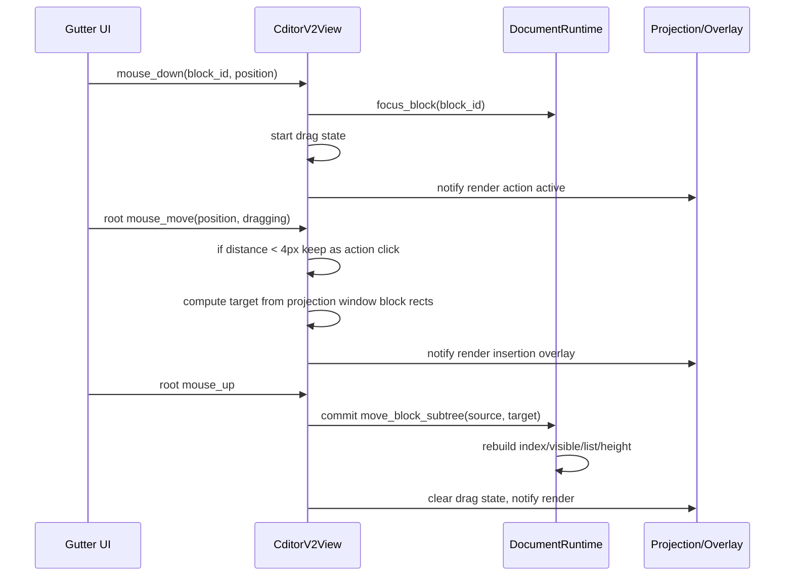

# V1 Block 样式与 Gutter 拖拽迁移分析

> 目标：深入分析 `/Users/jychen/Desktop/Cditor` V1/editor2 中“每个 block 的样式”和“gutter 可拖动 block”的实现方式，并给出 CDitor-V2 的完整迁移方案。本文只写方案，不做临时 patch。V2 必须继续遵守大文档架构：runtime 是文档真相，UI 只消费 projection window；不能把 GPUI entity / ListState 变成滚动或结构真相。

---

## 1. V1 相关源码入口

### 1.1 Block 样式 / shell / prefix / gutter

- `/Users/jychen/Desktop/Cditor/src/editor2/block/render.rs`
  - `impl Render for CditorBlock`
  - 负责 block 外壳、indent wrapper、gutter slot、content surface、prefix、正文内容组合。
- `/Users/jychen/Desktop/Cditor/src/editor2/component/plain_text/mod.rs`
  - `BlockVisualStyle`
  - `BlockKindStyle::block_style`
  - 定义 paragraph / heading / quote / callout 的背景、边框、文字色、padding、min-height、quote bar。
- `/Users/jychen/Desktop/Cditor/src/editor2/component/gutter/mod.rs`
  - `render_block_gutter`
  - gutter 样式与 mouse down 事件源。
- `/Users/jychen/Desktop/Cditor/src/editor2/component/list_prefix/mod.rs`
  - bullet / numbered / task checkbox / callout icon prefix。
- `/Users/jychen/Desktop/Cditor/src/theme.rs`
  - `Editor2Theme`
  - V1 editor2 全套 token。

### 1.2 Gutter 拖拽 / 结构事务

- `/Users/jychen/Desktop/Cditor/src/editor2/block/event.rs`
  - `CditorBlockEvent::GutterAction`
  - `CditorBlockEvent::GutterDragStart`
  - `CditorBlockEvent::GutterDragMove`
  - `CditorBlockEvent::GutterDragEnd`
- `/Users/jychen/Desktop/Cditor/src/editor2/runtime/indexed_document.rs`
  - 大文档 / indexed runtime 的 gutter drag 状态与 commit。
  - 关键函数：
    - `gutter_drag_exceeded_threshold`
    - `update_gutter_drag_target`
    - `drag_target_index`
    - `commit_gutter_drag`
- `/Users/jychen/Desktop/Cditor/src/editor2/runtime/tree.rs`
  - 非 indexed tree runtime 的完整 subtree move 语义。
  - 关键函数：
    - `move_block`
    - `indent`
    - `outdent`
- `/Users/jychen/Desktop/Cditor/src/editor/tests.rs`
  - `move_block_after_reparents_subtree_for_drag_runtime`
  - 验证拖拽/移动时 subtree reparent。

---

## 2. V1 每个 block 的样式如何实现

### 2.1 V1 block shell 结构

V1 `CditorBlock::render` 的核心结构是：

```txt
CditorBlock root
  w_full
  rounded(8)
  border_1 / border_color(theme.surface)
  bg(theme.surface)
  px_2
  py(4)
  text_color(visual.text)
  mouse/key/focus handlers
  └─ indent wrapper
      padding-left = list_info.depth * 24px
      └─ row
          id = cditor2-block-row
          flex row
          items_center
          gap_2
          hover handler
          ├─ gutter slot
          │   width = 24px
          │   height = 22px
          │   flex_shrink_0
          │   render gutter only when visible
          └─ content surface
              relative
              min_w(0)
              w_full
              min_h(visual.min_height)
              rounded(kind-dependent)
              bg(action_active ? action_background : visual.background)
              border / quote bar
              padding left/right/y(kind-dependent)
              flex row
              items_center or items_start for quote
              ├─ prefix
              └─ actual content
```

V1 的关键点：

1. **root 始终 full width**：用于 hover、focus、selection、block-level action。
2. **indent 不加在 root 上**：indent 在内部 wrapper 上，即 `pl(depth * 24)`。
3. **gutter slot 永远占位**：`24x22`，未显示时 slot 仍在，避免内容横向跳动。
4. **prefix 在 content surface 内部**：list marker / checkbox / callout icon 不属于正文 content。
5. **不同 block 背景不是正文 renderer 决定**：由 `BlockVisualStyle` + shell 的 content surface 统一决定。
6. **action active 会影响 content surface 背景**：拖拽/点击 gutter 后，action subtree 区域可以显示 action background。

### 2.2 V1 `BlockVisualStyle`

源码：`editor2/component/plain_text/mod.rs`

```rust
pub(crate) struct BlockVisualStyle {
    pub(crate) background: u32,
    pub(crate) border: u32,
    pub(crate) text: u32,
    pub(crate) padding_y: f32,
    pub(crate) min_height: f32,
    pub(crate) quote_bar: Option<u32>,
}
```

`BlockKindStyle::block_style`：

```rust
match self {
    BlockKind::Heading { level } => BlockVisualStyle::heading(*level, theme),
    BlockKind::Quote => BlockVisualStyle::quote(theme),
    BlockKind::Callout { .. } => BlockVisualStyle::callout(theme),
    _ => BlockVisualStyle::paragraph(theme),
}
```

### 2.3 V1 style 表

| Block 类型 | background | border | text | padding_y | min_height | quote_bar | rounded | padding-left | padding-right |
|---|---:|---:|---:|---:|---:|---:|---:|---:|---:|
| Paragraph / List / Todo / Toggle / 默认 | `theme.surface` | `theme.surface` | `theme.text` | 4 | 28 | None | 6 | 0 | 0 |
| Heading 1 | `theme.surface` | `theme.surface` | `theme.text` | 10 | 48 | None | 6 | 0 | 0 |
| Heading 2 | `theme.surface` | `theme.surface` | `theme.text` | 8 | 42 | None | 6 | 0 | 0 |
| Heading 3 | `theme.surface` | `theme.surface` | `theme.text` | 6 | 36 | None | 6 | 0 | 0 |
| Heading 4+ | `theme.surface` | `theme.surface` | `theme.text` | 4 | 32 | None | 6 | 0 | 0 |
| Quote | `theme.surface` | `theme.surface` 或 quote bar | `theme.quote_text` | 4 | 28 | `theme.quote_bar` | 0 | 8 | 0 |
| Callout | `theme.callout_background` | `theme.callout_border` | `theme.text` | 10 | 44 | None | 8 | 10 | 10 |
| Code | 外层承载层 `theme.surface`；内层 code component 自绘 `theme.code_background` | 外层 `theme.surface`；内层 toolbar border | 外层 `theme.text`；正文 text element 用 `theme.code_text` | 外层 0；内层 `pt34 px14 pb14` | 外层 92；内层 min_h 92 | None | 外层/内层 8 | 0 | 0 |

注意：V1 `BlockVisualStyle` 本身只显式区分 Heading / Quote / Callout / Paragraph，CodeBlock 的可见背景、圆角、toolbar、content padding 由 `editor2/component/code_block/mod.rs` 内部绘制。V2 迁移时不能在 shell 和 code component 双重叠加 code background/padding；否则真实 GUI 高度会背离 `PageLayoutIndex / BlockHeightIndex` 的估算，滚动条拖动时容易出现反复 placeholder/loading。当前 V2 contract 是：外层 shell 只承载 gutter/prefix 行与 `min_h(92)`，内层 code component 1:1 绘制 V1 code block。

### 2.4 V1 action active 背景逻辑

V1 row render 时：

```rust
let action_active = self.action_active;
let action_root = self.action_root;
let gutter_visible = (action_active && action_root) || (!action_active && self.hovered);
```

content surface 背景：

```rust
.bg(if action_active {
    rgb(theme.action_background)
} else {
    rgb(visual.background)
})
```

含义：

- hover 只控制 gutter 是否显示。
- gutter action active 控制 block / subtree 的 action background。
- action root 的 gutter 保持显示。
- action subtree range 内的 block 可以统一显示 action background。

V2 当前已有 `selected/focused/pinned/hovered`，但还缺完整的 `action_block_id/action_subtree_range/action_root` 模型；后续如果做 drag/action menu，应从 runtime projection 输出 action chrome，不能只在 GUI 局部状态里猜。

---

## 3. V1 gutter 样式如何实现

源码：`editor2/component/gutter/mod.rs`

```txt
gutter element
  width = 24
  height = 22
  rounded = 7
  flex center
  bg = action_active ? action_background : gutter_background
  text_color = action_active ? action_accent : gutter_foreground
  cursor_pointer
  hover bg = action_hover_background
  hover text = action_accent
  child svg gutter.svg 16x16
```

mouse down：

```rust
.on_mouse_down(MouseButton::Left, |this, event, window, cx| {
    window.focus(&this.focus, cx);
    cx.emit(CditorBlockEvent::GutterAction { block_id: this.id() });
    cx.emit(CditorBlockEvent::GutterDragStart {
        block_id: this.id(),
        position: event.position,
    });
    cx.stop_propagation();
    cx.notify();
})
```

重要点：

1. `GutterAction` 和 `GutterDragStart` 同时发出。
2. 鼠标按下先 focus block。
3. 立即 stop propagation，避免正文 text selection handler 被触发。
4. 点击不移动时只是 action active；拖过阈值后才进入拖拽目标更新。

---

## 4. V1 gutter 拖动 block 的完整事件流

### 4.1 事件定义

源码：`editor2/block/event.rs`

```rust
GutterAction { block_id }
GutterDragStart { block_id, position }
GutterDragMove { block_id, position }
GutterDragEnd { block_id }
```

V1 的 block entity 发起事件，document runtime 消费事件。

### 4.2 Start

`render_block_gutter` mouse down：

```txt
mouse down gutter
  -> focus block
  -> emit GutterAction
  -> emit GutterDragStart(block_id, start_position)
  -> stop propagation
```

`indexed_document.rs` 消费：

```rust
GutterDragStart => {
    gutter_drag_block_id = Some(block_id);
    gutter_drag_start_position = Some(position);
    gutter_drag_target_index = None;
    focused_block_id = Some(block_id);
    action_block_id = Some(block_id);
    notify();
}
```

状态字段：

```rust
gutter_drag_block_id: Option<Uuid>
gutter_drag_start_position: Option<Point<Pixels>>
gutter_drag_target_index: Option<usize>
action_block_id: Option<Uuid>
```

### 4.3 Move 阈值

V1 阈值：

```rust
const GUTTER_DRAG_THRESHOLD_PX: f32 = 4.0;
```

```rust
fn gutter_drag_exceeded_threshold(&self, position) -> bool {
    let dx = position.x - start.x;
    let dy = position.y - start.y;
    dx.hypot(dy) >= 4.0
}
```

含义：

- 鼠标按下后 4px 内视为 click/action，不更新拖拽目标。
- 超过 4px 才计算 insertion target。

### 4.4 Move target 计算

`drag_target_index(block_id, position, cx)`：

```rust
for (index, id, entity) in hydrated_entities_in_index_order() {
    if id == block_id { continue; }
    let bounds = entity.read(cx).layout_cache.bounds?;
    let midpoint = bounds.top() + bounds.size.height / 2.0;
    if position.y < midpoint {
        return Some(index);
    }
    last_index = Some(index + 1);
}
last_index.or(Some(from_index))
```

V1 特点：

1. 只看当前 hydrated/visible entities。
2. 用每个 block 的真实 bounds midpoint 判断“插入到它之前”。
3. 跳过被拖动的 block 本身。
4. 如果鼠标在所有 hydrated blocks 之后，则 target 是最后一个 visible block 后面。
5. 如果没有可用 target，则 fallback 到原 index。

### 4.5 Drag target overlay

V1 在 row render 中：

```rust
let drag_insert_before = gutter_drag_target_index == Some(block_index);
```

每个 block row 前绘制 2px 插入线：

```txt
row
  ├─ insertion indicator
  │   h = 2px
  │   mx = 18px
  │   rounded = 1px
  │   bg = drag_insert_before ? action_accent : surface
  └─ block entity
```

这意味着 V1 不用浮层 absolute overlay，而是把插入线作为 row 的一部分。对 V2 来说，不能随便改变 block outer height，因此更适合用 absolute overlay 或在 window layer 里画线，不能把 2px 插入线计入每个 block 高度。

### 4.6 End / Commit

`GutterDragEnd`：

```rust
if gutter_drag_block_id == Some(block_id) {
    if let Some(save_event) = commit_gutter_drag(block_id, cx) {
        emit(save_event);
    }
    notify();
}
```

`commit_gutter_drag`：

```rust
let from_index = index.index_of(block_id)?;
let parent = parent_for_block(block_id, cx);
clear drag state;
let to_index = gutter_drag_target_index.take()?;
if from_index == to_index { return None; }

let from_list_index = list_index_for_block_index(from_index);
let new_index = index.move_root_record(from_index, to_index)?;
let new_list_index = list_index_for_block_index(new_index);

let moved_height = height_index.remove(from_list_index).unwrap_or(ESTIMATED_BLOCK_HEIGHT);
height_index.insert(new_list_index, moved_height);

refresh_focusables_from_index(min(from_index, new_index));
focus_without_reveal(block_id);

let new_position = sibling_position_before_index(new_index, parent, block_id, cx);
emit RuntimeSaveEvent::StructuralTransaction(EditOperation::MoveBlock { ... });
```

V1 indexed runtime 这里主要支持 **root-level indexed order move**，并维护 height index / focusables / persistence transaction。

### 4.7 Tree runtime 的完整 subtree move 语义

`editor2/runtime/tree.rs::move_block` 是更完整的树结构移动参考：

```rust
move_block(block_id, new_parent, new_index)
  old_location = location(block_id)
  old_visible_range = subtree_visible_range(block_id)
  moved_visible = visible.drain(old_visible_range)
  block = siblings_mut(old_parent).remove(old_index)
  refresh_visible_indexes_from(old_visible_start)

  target = siblings_mut(new_parent)
  adjusted_index = new_index.min(target.len())
  target.insert(adjusted_index, block)
  insert_visible_start = insertion_visible_start(new_parent, adjusted_index)
  visible.splice(insert_visible_start, moved_visible)

  refresh indexes / sibling metadata / descendant metadata
```

关键点：

1. 拖动的是 block subtree，不只是单个 row。
2. visible snapshot 同步移动 subtree range。
3. parent / sibling index / depth / list_info 全部刷新。
4. indent/outdent 也是 `move_block` 的特例：
   - indent：移动到 previous sibling 的 children 末尾。
   - outdent：移动到 parent 后面。

V2 做 gutter drag 时应采用 tree runtime 的 subtree 语义，而不是 indexed V1 里较弱的 root-only `move_root_record` 语义。

---

## 5. V2 当前状态与差距

### 5.1 已完成

V2 当前已有：

- `src/core/block/list_info.rs`
  - `BlockListInfo`
  - list kind classification。
- `src/core/block/chrome.rs`
  - `BlockChromeSnapshot`
  - `BlockPrefixSnapshot`
- `src/runtime/list_projection.rs`
  - list depth / numbered ordinal projection cache。
- `src/gui/block/chrome.rs`
  - `BlockChromeStyle`
  - V1 style 的主要视觉迁移。
- `src/gui/block/gutter.rs`
  - gutter style / icon / click入口。
- `src/gui/block/block_shell.rs`
  - V1 shell 结构：root / indent wrapper / row / gutter slot / content surface / prefix / content。
- `src/gui/input/mouse.rs`
  - 已有 block drag selection controller，但这是 block selection，不是 block reorder。
- `src/runtime/document_runtime.rs`
  - focused block indent/outdent。
  - 空 list Enter。
  - 统一高度 estimator。

### 5.2 主要差距

还缺：

1. **完整 block action 状态**
   - V2 已新增 GUI transient `action_block_id` + `DocumentBlockActionProjection` + `BlockActionState`。
   - 已支持 action subtree active background、action root gutter persistent visible。
   - 后续还需接 action menu / persistence command 语义。
2. **gutter drag reorder 状态**
   - drag source block id
   - start position
   - current pointer position
   - target insertion position
   - threshold 判断
3. **drag target projection**
   - V2 不能扫描 UI entity 当真相。
   - 但 hit testing 需要当前 window 的 block bounds；V2 应用 projection window + layout meta / measured bounds 做 target。
4. **subtree move 结构事务**
   - V2 已有 `move_block_subtree_before` 和 `move_block_subtree_to_parent`，能移动 subtree、刷新 index/list/height/page。
   - 后续可把当前 `DocumentRuntime` 内部实现拆到 `runtime/block_reorder.rs`。
5. **drag insertion overlay**
   - V2 已用 absolute overlay 绘制 2px line，不改变 block height。
6. **跨 viewport 拖拽**
   - V1 只看 hydrated entities。
   - V2 大文档需要支持 visible window target，未来再支持边缘 auto-scroll。

---

## 6. V2 迁移设计

### 6.1 目录设计

建议新增 / 扩展：

```txt
src/core/block/
  drag.rs                  # 纯数据：BlockDragState / BlockDropTarget / threshold helper

src/runtime/
  block_reorder.rs          # 纯 runtime 结构事务：move subtree、target validation、height/index/cache update

src/gui/block/
  drag_overlay.rs           # insertion line overlay，不改变 block height
  gutter.rs                 # 保持 gutter UI，扩展 drag start handler

src/gui/input/
  mouse.rs                  # gutter drag mouse down/move/up helper

src/gui/app/
  cditor_v2_view.rs         # GUI transient drag state，调用 runtime transaction
```

职责边界：

| 文件 | 可以做 | 禁止做 |
|---|---|---|
| `core/block/drag.rs` | drag threshold、target 数据结构、纯算法 | 访问 runtime、GPUI、payload |
| `runtime/block_reorder.rs` | 改 `DocumentIndex`、`VisibleDocumentIndex`、`HeightIndex`、`ListProjectionCache` | 读取 UI entity bounds |
| `gui/block/drag_overlay.rs` | 根据 projection + target 画线 | 改 runtime、高度、scroll truth |
| `gui/input/mouse.rs` | 转发鼠标事件到 `CditorV2View` | 自己修改 document 结构 |
| `CditorV2View` | 保存 transient drag state、调用 runtime commit | 把 UI entity 当文档真相 |

### 6.2 数据结构设计

```rust
pub struct GutterBlockDragState {
    pub block_id: BlockId,
    pub start_position: Point<Pixels>,
    pub current_position: Point<Pixels>,
    pub exceeded_threshold: bool,
    pub target: Option<BlockDropTarget>,
}

pub struct BlockDropTarget {
    pub insert_before_block_id: Option<BlockId>,
    pub target_visible_index: usize,
}
```

说明：

- `insert_before_block_id = Some(id)`：插入到该 block/subtree 前。
- `insert_before_block_id = None`：插入到当前 window / document 末尾，后续需转为 document index。
- 初期 target 限制为当前 projection window 内。

### 6.3 Gutter drag 事件流（V2）



### 6.4 Target 计算设计

V1 依赖 hydrated entity bounds：

```rust
for hydrated entity:
    midpoint = bounds.top + height / 2
    if pointer.y < midpoint:
        target = index
```

V2 不能以 UI entity 为 truth，但可以使用 projection window 的 layout meta：

```txt
window_layer_top = before_window_height - global_scroll_top
block_top_in_viewport = window_layer_top + block.layout_offset_in_window
block_midpoint = block_top + block.effective_height / 2
```

V2 已有绝对定位虚拟化：

```txt
surface viewport
  window layer top = before_window_height - scroll_top
  block absolute top = block_offset_in_window
```

所以 target 计算可以基于：

- `EditorViewProjection.before_window_height`
- `EditorViewProjection.scroll.global_scroll_top`
- `projection.blocks[i].layout.effective_height()`
- 累加 block heights 得到 local top。

注意：

- 拖动 source block 时要跳过 source subtree。
- target 不能落入 source subtree 内部。
- 初期只支持同层 root/window reorder，也可以先支持 subtree reorder 但 target parent 不变。
- 完整版最终要支持 parent 改变：拖到 list/callout/toggle 下方并横向缩进判断。

### 6.5 Commit 结构事务设计

V2 需要新增 runtime API：

```rust
pub fn move_block_subtree_before(
    &mut self,
    block_id: BlockId,
    before_block_id: Option<BlockId>,
) -> Result<bool, String>
```

初期同 parent reorder：

1. 找 source index。
2. 找 source subtree range：`source_start..source_end`。
3. 找 target index。
4. 禁止 target 落在 source subtree 内。
5. 从 records 中 drain source subtree。
6. 调整 target index。
7. 插回 records。
8. 保持 source subtree 内相对 depth/parent 不变。
9. 如果移动到同 parent，只更新 sibling order，不改 depth。
10. 重建：
    - `DocumentIndex`
    - `VisibleDocumentIndex`
    - `ListProjectionCache`
    - `HeightIndex`：推荐移动 height slice，而不是全量重估。
    - `PageLayoutIndex`
    - scroll total height。

完整 parent-changing reorder：

```rust
pub fn move_block_subtree(
    &mut self,
    block_id: BlockId,
    new_parent_id: Option<BlockId>,
    sibling_index: usize,
) -> Result<bool, String>
```

需要：

- source subtree depth delta = new_parent_depth + 1 - old_depth。
- root record parent_id = new_parent_id。
- subtree descendants depth 全部加 delta。
- source subtree 不能移动到自己的 descendant 下面。
- new_parent 必须 `supports_children`。

### 6.6 HeightIndex 性能要求

V1 indexed runtime 移动时：

```rust
let moved_height = height_index.remove(from_list_index)
height_index.insert(new_list_index, moved_height)
```

V2 不能在每次 drag move 重建 height index。规则：

- drag move：只更新 transient target，不改 runtime document。
- mouse up commit：只做一次结构事务。
- commit 时：
  - 小文档可以 rebuild height index。
  - 大文档必须实现 move range：`height_index.move_range(source_range, target_index)` 或 rebuild from existing heights 但只在 mouse up 做一次。
- 不能在 GUI render 中 O(total_blocks) 扫描。

### 6.7 Overlay 设计

V1 把 2px insertion line 放到每个 row 前，这会改变 list row 高度。

V2 绝对定位虚拟化不能这么做。建议：

```txt
DocumentSurface relative
  ├─ virtualized block absolute layers
  └─ drag overlay absolute
       top = target_y
       left = content_left or page left + gutter offset
       right = page right
       height = 2px
       bg = action_accent
```

Overlay 输入：

```rust
pub struct BlockDragOverlaySnapshot {
    pub visible: bool,
    pub y: f32,
    pub indent_px: f32,
    pub color: u32,
}
```

Overlay 不参与：

- block height
- height estimator
- scroll total height
- text hit-test

---

## 7. V2 任务拆解

### Phase K：Block action chrome

- [x] K-001 新增 action 状态结构。
  - [x] `action_active: bool`
  - [x] `action_root: bool`
  - [x] `dragging: bool`
  - 落点：`BlockActionState` + `DocumentBlockActionProjection`，保持 GUI transient，不写入 runtime 文档真相。
- [x] K-002 projection render 增加 action/chrome 状态，但只来自 runtime/gui transient projection。
- [x] K-003 action background 接入 shell content surface，不改变 block height estimator。
- [x] K-004 `block_shell` 使用 action state 控制 content surface 背景。
- [x] K-005 gutter visible 规则改为 V1 等价：
  - [x] hover -> visible
  - [x] action root -> visible
  - [x] focused/selected/pinned -> visible（V2 保留增强）
- [x] K-006 测试 action background 不改变 height。

### Phase L：Gutter drag state / mouse event

- [x] L-001 新增 `src/core/block/drag.rs`。
- [x] L-002 定义 `GUTTER_DRAG_THRESHOLD_PX = 4.0`。
- [x] L-003 定义 `GutterBlockDragState`。
- [x] L-004 `gutter_mouse_down_from_mouse` 开始 drag state，不再只做 block selection。
- [x] L-005 root `on_mouse_move` 检测 gutter drag move。
- [x] L-006 root `on_mouse_up` commit 或 cancel。
- [x] L-007 click without threshold 只保留 action active，不 move block。
- [x] L-008 stop propagation，不能触发 text selection。

### Phase M：Drag target projection

- [x] M-001 在 `CditorV2View` 保存最近一次 `EditorViewProjection` 的轻量 block rect snapshot。
- [x] M-002 用 `before_window_height + accumulated_block_top` 保存 document y，并在事件中转换 pointer document y。
- [x] M-003 target midpoint 算法迁移 V1。
- [x] M-004 跳过 source block subtree。
- [x] M-005 禁止 target 落入 source subtree（runtime commit 也二次拒绝）。
- [x] M-006 target 只在 projection window 内 O(visible_blocks) 计算。
- [x] M-007 添加测试：pointer y midpoint target 与跳过 source subtree。

### Phase N：Drag overlay

- [x] N-001 新增 `src/gui/block/drag_overlay.rs`。
- [x] N-002 `DocumentEditorView` 接收 drag overlay snapshot。
- [x] N-003 绝对定位绘制 2px insertion line。
- [x] N-004 overlay 不改变 block height。
- [x] N-005 overlay 颜色使用 `theme.action_accent`。
- [x] N-006 测试 overlay snapshot 不编码高度。

### Phase O：Runtime subtree move transaction

- [ ] O-001 新增 `src/runtime/block_reorder.rs`。（当前先落在 `DocumentRuntime` 内部；后续可拆文件。）
- [x] O-002 实现 `subtree_range(block_id)`（复用 `subtree_end`）。
- [x] O-003 实现 `move_block_subtree_before(block_id, before_block_id)`。
- [x] O-004 同 parent reorder 保持 depth/parent 不变。
- [x] O-005 不允许移动到自己 subtree 内。
- [x] O-006 commit 后重建 `DocumentIndex` / `VisibleDocumentIndex` / `ListProjectionCache`。
- [x] O-007 mouse-up 单次从 existing layout meta rebuild height/page index；后续优化为 height slice move。
- [x] O-008 focus 保持在 moved block。
- [x] O-009 save status Dirty。
- [x] O-010 测试：移动带 children 的 block，subtree 一起移动。
- [x] O-011 测试：移动后 numbered ordinal 正确刷新。
- [x] O-012 测试：移动后 total height 不变。

### Phase P：Parent-changing drag

- [x] P-001 设计并实现横向拖动 indent target：水平移动超过 `BLOCK_INDENT_STEP_PX` 后启用 parent-changing target。
- [x] P-002 new_parent 必须 supports_children（runtime 二次校验）。
- [x] P-003 移动到 new_parent children 指定位置。
  - 当前支持 projection window 内直接 child 的 sibling index；否则 append 到 parent 末尾。
- [x] P-004 subtree depth delta 更新。
- [x] P-005 undo / persistence 结构事务。
  - undo：runtime 记录轻量 inverse move step（`old_parent/old_sibling` 与 `new_parent/new_sibling`），不对 10w records 做全量 snapshot。
  - persistence：runtime 维护 `pending_structure_transactions`，move / undo / redo 都会产出 `EditTransactionKind::BlockStructureChange`。
  - 新增 `EditOperation::MoveBlockToParent { block_id, parent_id, sibling_index }`，并完成 Postgres JSON 类型转换。
  - GUI 当前仍用 Dirty 状态提示；真实 DB writer 后续可 `drain_pending_structure_transactions()` 后写入 transaction log / index snapshot。
- [x] P-006 测试：拖到支持 children 的 block 下成为 child / 指定 child 位置。
- [x] P-007 测试：不能拖进自己 descendant。

### Phase Q：性能验收

- [x] Q-001 drag move 只 O(visible_blocks)，不 O(total_blocks)（target 使用 projection rect snapshot）。
- [x] Q-002 render 不创建 per-total-block entity（沿用 projection window absolute layer）。
- [x] Q-003 `large_mixed_demo_keeps_payloads_windowed` 继续通过。
- [x] Q-004 `projection_for_window_limits_blocks_for_100k_document` 继续通过。
- [x] Q-005 拖拽 mouse move 不触发 payload window 全量加载（mouse move 只更新 transient drag target）。
- [x] Q-006 commit 后 scroll_top 不跳（已补 `move_block_subtree_commit_preserves_scroll_top_and_total_height`）。
- [x] Q-007 commit 后 total height 一致。

### Phase R：跨 viewport 拖拽体验

- [x] R-001 gutter drag 超过 4px 阈值后启用边缘 auto-scroll。
  - 鼠标进入 viewport 顶/底 40px 区域时，每次 mouse move 最多滚动 24px。
  - auto-scroll 只改 runtime scroll truth，并用最新 `global_scroll_top` 重新计算 projection target。
- [x] R-002 auto-scroll 不在 mouse move 阶段修改 document 结构。
- [x] R-003 测试 auto-scroll delta 只在边缘区域触发。
- [x] R-004 连续定时滚动 ticker：鼠标停在边缘不动时，每 16ms 按当前 pointer y 继续滚动并重算 drop target；mouseup / load reset 后停止。

### Phase S：V1 CodeBlock 1:1 样式与高度 contract

- [x] S-001 对照 V1 `editor2/component/code_block/mod.rs` 提取 code block 几何常量。
  - [x] block `min_h=92`、`radius=8`、`overflow_hidden`。
  - [x] toolbar `top=6`、`right=6`、`h=30`、`radius=7`、`border=1`、`p=2`、`shadow_sm`。
  - [x] toolbar button `26x26`、`radius=5`。
  - [x] content `pt=34`、`px=14`、`pb=14`。
- [x] S-002 V2 `GuiTheme` 增加并使用 V1 code toolbar token。
  - [x] `code_toolbar_background = 0xffffff`
  - [x] `code_toolbar_border = 0xe8e5e1`
  - [x] `code_toolbar_text = 0x6b625a`
  - [x] `code_toolbar_icon = 0x6b7280`
  - [x] `code_toolbar_hover = 0xf4f4f5`
- [x] S-003 `render_code_block` 改为 V1 结构：outer code container + absolute toolbar + padded content。
- [x] S-004 action active 背景传入 code component，避免只改 shell 导致 code 内部背景不变。
- [x] S-005 shell/chrome 不再双重叠加 code 背景和 padding；外层只保留 gutter/prefix 行容器职责。
- [x] S-006 `RichBlockKind::Code` 正文 text run 使用 `theme.code_text`。
- [x] S-007 code text line height 对齐 V1 `TEXT_LINE_HEIGHT = 24`。
- [x] S-008 core height model 改为 `outer = shell_y(8) + max(92, 48 + wrapped_line_count * 24)`。
- [x] S-009 measured height normalization 对 code 使用同一 V1 chrome_y，避免 viewport 测量回写和 estimate 不一致。
- [x] S-010 添加/更新测试，锁定 code geometry、chrome 与 core metrics 一致性。
- [x] S-011 保持大文档架构不变量：不引入 UI 文档真相、不使用 GPUI ListState、不在输入 hot path 做同步 syntax highlight 或 DB 操作。

---

## 8. 与 V2 当前代码的落点映射

| V1 概念 | V1 文件 | V2 当前落点 | V2 待补 |
|---|---|---|---|
| `BlockVisualStyle` | `component/plain_text/mod.rs` | `gui/block/chrome.rs`, `core/layout/block_metrics.rs` | action active background |
| block shell | `block/render.rs` | `gui/block/block_shell.rs` | action subtree 状态 |
| gutter UI | `component/gutter/mod.rs` | `gui/block/gutter.rs` | action subtree 背景继续补齐 |
| block events | `block/event.rs` | `gui/input/mouse.rs` + `CditorV2View` methods | action menu / persistence 事件后续补齐 |
| drag threshold | `runtime/indexed_document.rs` | `core/block/drag.rs` | 已迁移 4px threshold |
| target midpoint | `drag_target_index` | `CditorV2View` projection rect helpers | 已跳过 source subtree |
| insertion line | row 前 2px child | `gui/block/drag_overlay.rs` | 已 absolute overlay，不改变 height |
| root move | `index.move_root_record` | `DocumentRuntime::move_block_subtree_before` | 已支持 subtree move |
| subtree move | `runtime/tree.rs::move_block` | `move_block_subtree_before` / `move_block_subtree_to_parent` | 精确 child insertion UX 后续增强 |
| persistence | `RuntimeSaveEvent::StructuralTransaction` | `EditOperation::MoveBlockToParent` + pending structure transactions + Postgres saver | 已支持结构事务/undo/redo/pending persist；action menu command 仍后续 |

---

## 9. 实现顺序建议

1. **先做文档真相层：runtime subtree move**
   - 没有这个，gutter drag 只能是 UI 动画。
   - 先支持 same-parent / same-depth reorder。
2. **再做 target 计算 + overlay**
   - 使用 projection window，不扫描全量 document。
3. **最后接 mouse event**
   - mouse down / move / up 只更新 transient state，mouse up 才 commit。
4. **再扩展 parent-changing drag**
   - 支持横向拖动改变父子关系。

---

## 10. 不应照搬 V1 的地方

1. **不要用 GPUI entity bounds 作为文档结构真相**
   - V1 indexed runtime 用 hydrated entity bounds 算 target。
   - V2 可以用 projection + layout meta 算 target，UI bounds 只作为辅助 cache。
2. **不要把 insertion line 作为 block row child 改变高度**
   - V1 ListState row 可以这么做。
   - V2 absolute virtualization 不能让 overlay 改 total height。
3. **不要 drag move 时修改 runtime index**
   - 只在 mouse up commit。
4. **不要每次 mouse move 重建 list projection/cache**
   - 只更新 transient target。
5. **不要只移动单个 block**
   - 正确语义是移动 subtree。
6. **不要用 `visible_index + 1` 重算 numbered list**
   - 继续使用 runtime list projection cache。

---

## 11. 本文结论

V1 的 block 样式已经基本迁移到 V2，但还缺 `action_active/action_root/action_subtree` 这一层。V1 的 gutter 拖拽由 gutter mouse down 同时触发 action 和 drag start，document runtime 用 4px 阈值、visible block midpoint、2px insertion line 和 mouse-up commit 完成结构移动。

V2 迁移时必须换成大文档友好的设计：

- target 用 projection window 算，不依赖 UI entity 真相；
- overlay absolute 绘制，不改变 block height；
- drag move 只更新 transient state；
- mouse up 才做 runtime subtree move transaction；
- commit 后重建/更新 index、height、list projection，保持 `global_scroll_top` 稳定。

当前已完成 V1 gutter drag 的核心链路：4px 阈值、projection window midpoint target、absolute overlay、mouse-up subtree commit、同 parent reorder、跨 parent runtime move、结构 undo/persistence、边缘 auto-scroll 与连续 ticker。下一步主要是补齐 action menu 本体，以及更细的跨 window / 精确 parent-changing drop UX。
