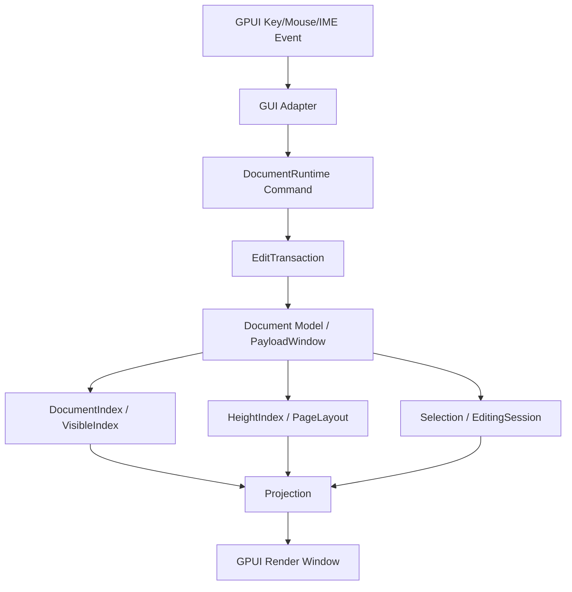

## User

当前富文本编辑器编辑功能残缺，看看这个项目怎么做的/Users/jychen/Desktop/ding-note2/crates/gpui-markdown-editor
编辑功能现在太差了，深入读，然后拿过来，不要拿简化版，注意接入方案要符合 [large-document-rich-text-architecture.md](../../large-document-rich-text-architecture.md)

## Assistant

<thinking>
**Inspecting project paths**

I need to take action and inspect the current project as well as the external path. It feels like I should consider using the ding-note skill, but the user mentioned ding-note2, and the current CDitor might not support ding-note for ding-note development. I should definitely use the necessary tools for this. First, I’ll start by listing the directories to get a better idea of what I’m working with.
</thinking>

我会先对比当前 `CDitor-V2` 的富文本编辑实现与 `ding-note2/crates/gpui-markdown-editor` 的结构，确认可迁移模块和接入点，再按大文档架构里的“文档级模型 / 当前编辑 block pin / 事务系统”方式接入，避免做成简化版。

**Tool Call: List the `CDitor-V2` directory's contents**
Status: Completed

# Folders:
CDitor-V2/doc
CDitor-V2/src
CDitor-V2/target

# Files:
CDitor-V2/.gitignore
CDitor-V2/Cargo.lock
CDitor-V2/Cargo.toml


**Tool Call: List the `/Users/jychen/Desktop/ding-note2/crates/gpui-markdown-editor` directory's contents**
Status: Failed

Path /Users/jychen/Desktop/ding-note2/crates/gpui-markdown-editor is not in the project

## Assistant

当前文件工具只能访问工作区根目录，外部 `ding-note2` 不能直接用 `read_file`，我会用终端只读查看外部 crate，并用工作区文件工具编辑当前项目。

**Tool Call: 50 matches**
Status: Completed

file:///Users/jychen/Desktop/CDitor-V2/src

file:///Users/jychen/Desktop/CDitor-V2/src/core

file:///Users/jychen/Desktop/CDitor-V2/src/core/document

file:///Users/jychen/Desktop/CDitor-V2/src/core/document/index.rs

file:///Users/jychen/Desktop/CDitor-V2/src/core/document/mod.rs

file:///Users/jychen/Desktop/CDitor-V2/src/core/document/visible_index.rs

file:///Users/jychen/Desktop/CDitor-V2/src/core/edit

file:///Users/jychen/Desktop/CDitor-V2/src/core/edit/mod.rs

file:///Users/jychen/Desktop/CDitor-V2/src/core/ids.rs

file:///Users/jychen/Desktop/CDitor-V2/src/core/layout

file:///Users/jychen/Desktop/CDitor-V2/src/core/layout/block_editor_model.rs

file:///Users/jychen/Desktop/CDitor-V2/src/core/layout/block_layout.rs

file:///Users/jychen/Desktop/CDitor-V2/src/core/layout/block_provider.rs

file:///Users/jychen/Desktop/CDitor-V2/src/core/layout/height_index.rs

file:///Users/jychen/Desktop/CDitor-V2/src/core/layout/mod.rs

file:///Users/jychen/Desktop/CDitor-V2/src/core/layout/page_layout.rs

file:///Users/jychen/Desktop/CDitor-V2/src/core/mod.rs

file:///Users/jychen/Desktop/CDitor-V2/src/core/rich_text

file:///Users/jychen/Desktop/CDitor-V2/src/core/rich_text/attrs.rs

file:///Users/jychen/Desktop/CDitor-V2/src/core/rich_text/block_kind.rs

file:///Users/jychen/Desktop/CDitor-V2/src/core/rich_text/document.rs

file:///Users/jychen/Desktop/CDitor-V2/src/core/rich_text/inline.rs

file:///Users/jychen/Desktop/CDitor-V2/src/core/rich_text/markdown.rs

file:///Users/jychen/Desktop/CDitor-V2/src/core/rich_text/mod.rs

file:///Users/jychen/Desktop/CDitor-V2/src/core/rich_text/payload.rs

file:///Users/jychen/Desktop/CDitor-V2/src/core/rich_text/table.rs

file:///Users/jychen/Desktop/CDitor-V2/src/core/version.rs

file:///Users/jychen/Desktop/CDitor-V2/src/editor

file:///Users/jychen/Desktop/CDitor-V2/src/editor/debug_overlay.rs

file:///Users/jychen/Desktop/CDitor-V2/src/editor/hit_test.rs

file:///Users/jychen/Desktop/CDitor-V2/src/editor/mod.rs

file:///Users/jychen/Desktop/CDitor-V2/src/editor/scroll

file:///Users/jychen/Desktop/CDitor-V2/src/editor/scroll/anchor.rs

file:///Users/jychen/Desktop/CDitor-V2/src/editor/scroll/global_offset.rs

file:///Users/jychen/Desktop/CDitor-V2/src/editor/scroll/height_correction.rs

file:///Users/jychen/Desktop/CDitor-V2/src/editor/scroll/mod.rs

file:///Users/jychen/Desktop/CDitor-V2/src/editor/scroll/scrollbar.rs

file:///Users/jychen/Desktop/CDitor-V2/src/editor/scroll/virtual_scroll.rs

file:///Users/jychen/Desktop/CDitor-V2/src/editor/scroll/wheel.rs

file:///Users/jychen/Desktop/CDitor-V2/src/editor/scroll_trace_replay.rs

file:///Users/jychen/Desktop/CDitor-V2/src/editor/trace_event_log.rs

file:///Users/jychen/Desktop/CDitor-V2/src/editor/window

file:///Users/jychen/Desktop/CDitor-V2/src/editor/window/mod.rs

file:///Users/jychen/Desktop/CDitor-V2/src/editor/window/render_window.rs

file:///Users/jychen/Desktop/CDitor-V2/src/editor/window/window_commit.rs

file:///Users/jychen/Desktop/CDitor-V2/src/editor/window/window_planner.rs

file:///Users/jychen/Desktop/CDitor-V2/src/gui

file:///Users/jychen/Desktop/CDitor-V2/src/gui/cditor_v2.rs

file:///Users/jychen/Desktop/CDitor-V2/src/gui/mod.rs

file:///Users/jychen/Desktop/CDitor-V2/src/gui/rich_text.rs

**Tool Call: find /Users/jychen/Desktop/ding-note2/crates/gpui-markdown-editor -maxdepth 3 -type f | sort**
Status: Completed

Terminal:
```
/Users/jychen/Desktop/ding-note2/crates/gpui-markdown-editor/.gitignore
/Users/jychen/Desktop/ding-note2/crates/gpui-markdown-editor/Cargo.lock
/Users/jychen/Desktop/ding-note2/crates/gpui-markdown-editor/Cargo.toml
/Users/jychen/Desktop/ding-note2/crates/gpui-markdown-editor/README.md
/Users/jychen/Desktop/ding-note2/crates/gpui-markdown-editor/assets/icon/drag-h.svg
/Users/jychen/Desktop/ding-note2/crates/gpui-markdown-editor/assets/icon/drag-v.svg
/Users/jychen/Desktop/ding-note2/crates/gpui-markdown-editor/assets/icon/drag.svg
/Users/jychen/Desktop/ding-note2/crates/gpui-markdown-editor/assets/icon/image.svg
/Users/jychen/Desktop/ding-note2/crates/gpui-markdown-editor/catppuccin-frappe.json
/Users/jychen/Desktop/ding-note2/crates/gpui-markdown-editor/src/aura_theme_bridge.rs
/Users/jychen/Desktop/ding-note2/crates/gpui-markdown-editor/src/components/actions.rs
/Users/jychen/Desktop/ding-note2/crates/gpui-markdown-editor/src/components/mermaid.rs
/Users/jychen/Desktop/ding-note2/crates/gpui-markdown-editor/src/components/mod.rs
/Users/jychen/Desktop/ding-note2/crates/gpui-markdown-editor/src/components/scrollbar.rs
/Users/jychen/Desktop/ding-note2/crates/gpui-markdown-editor/src/config.rs
/Users/jychen/Desktop/ding-note2/crates/gpui-markdown-editor/src/editor/context_menu.rs
/Users/jychen/Desktop/ding-note2/crates/gpui-markdown-editor/src/editor/document.rs
/Users/jychen/Desktop/ding-note2/crates/gpui-markdown-editor/src/editor/events.rs
/Users/jychen/Desktop/ding-note2/crates/gpui-markdown-editor/src/editor/height_cache.rs
/Users/jychen/Desktop/ding-note2/crates/gpui-markdown-editor/src/editor/history.rs
/Users/jychen/Desktop/ding-note2/crates/gpui-markdown-editor/src/editor/mod.rs
/Users/jychen/Desktop/ding-note2/crates/gpui-markdown-editor/src/editor/paste_restructure.rs
/Users/jychen/Desktop/ding-note2/crates/gpui-markdown-editor/src/editor/render.rs
/Users/jychen/Desktop/ding-note2/crates/gpui-markdown-editor/src/editor/render_height_collection.rs
/Users/jychen/Desktop/ding-note2/crates/gpui-markdown-editor/src/editor/runtime_context.rs
/Users/jychen/Desktop/ding-note2/crates/gpui-markdown-editor/src/editor/selection.rs
/Users/jychen/Desktop/ding-note2/crates/gpui-markdown-editor/src/editor/slash_menu.rs
/Users/jychen/Desktop/ding-note2/crates/gpui-markdown-editor/src/editor/source_mapping.rs
/Users/jychen/Desktop/ding-note2/crates/gpui-markdown-editor/src/editor/table_edit.rs
/Users/jychen/Desktop/ding-note2/crates/gpui-markdown-editor/src/editor/tree.rs
/Users/jychen/Desktop/ding-note2/crates/gpui-markdown-editor/src/editor/whiteboard.rs
/Users/jychen/Desktop/ding-note2/crates/gpui-markdown-editor/src/file_url.rs
/Users/jychen/Desktop/ding-note2/crates/gpui-markdown-editor/src/i18n.rs
/Users/jychen/Desktop/ding-note2/crates/gpui-markdown-editor/src/lib.rs
/Users/jychen/Desktop/ding-note2/crates/gpui-markdown-editor/src/theme.rs
/Users/jychen/Desktop/ding-note2/crates/gpui-markdown-editor/test_autocomplete_logic.exe
/Users/jychen/Desktop/ding-note2/crates/gpui-markdown-editor/test_autocomplete_logic.pdb
/Users/jychen/Desktop/ding-note2/crates/gpui-markdown-editor/test_autocomplete_logic.rs
/Users/jychen/Desktop/ding-note2/crates/gpui-markdown-editor/test_autocomplete_v2.exe
/Users/jychen/Desktop/ding-note2/crates/gpui-markdown-editor/test_autocomplete_v2.pdb
/Users/jychen/Desktop/ding-note2/crates/gpui-markdown-editor/test_autocomplete_v2.rs
/Users/jychen/Desktop/ding-note2/crates/gpui-markdown-editor/test_bug_repro.exe
/Users/jychen/Desktop/ding-note2/crates/gpui-markdown-editor/test_bug_repro.pdb
/Users/jychen/Desktop/ding-note2/crates/gpui-markdown-editor/test_bug_repro.rs
/Users/jychen/Desktop/ding-note2/crates/gpui-markdown-editor/test_diagnostic.exe
/Users/jychen/Desktop/ding-note2/crates/gpui-markdown-editor/test_diagnostic.pdb
/Users/jychen/Desktop/ding-note2/crates/gpui-markdown-editor/test_diagnostic.rs

```


## Assistant

<thinking>
**Inspecting key files**

I need to check the current key files, and I’m wondering if I should copy the entire thing—maybe using the terminal with the `cp` command? But I want to make sure I integrate everything properly. It seems like using multiple `cat` commands for the key files might be a good approach to get all the information together. I just need to ensure I'm approaching this correctly!
</thinking>

下一步我会读取当前富文本核心模型、GUI 编辑器，以及参考 crate 的编辑/选择/历史/粘贴/表格模块，找出可直接迁移的完整编辑能力边界。

**Tool Call: Read file `Cargo.toml`**
Status: Completed

```CDitor-V2/Cargo.toml
     1	[package]
     2	name = "CDitor-V2"
     3	version = "0.1.0"
     4	edition = "2024"
     5	
     6	[dependencies]
     7	gpui = { git = "https://github.com/zed-industries/zed", rev = "1d217ee39d381ac101b7cf49d3d22451ac1093fe", default-features = false, features = ["font-kit"] }
     8	gpui_platform = { git = "https://github.com/zed-industries/zed", rev = "1d217ee39d381ac101b7cf49d3d22451ac1093fe", default-features = false, features = ["font-kit"] }
     9	unicode-segmentation = "1.12"

```


**Tool Call: Read file `src/gui/rich_text.rs`**
Status: Completed

```CDitor-V2/src/gui/rich_text.rs
     1	use gpui::prelude::FluentBuilder;
     2	use gpui::{
     3	    AnyElement, FontWeight, IntoElement, ParentElement, SharedString, Styled, div, px, rgb,
     4	};
     5	
     6	use crate::core::rich_text::{BlockPayload, BlockPayloadRecord, InlineMark, InlineSpan};
     7	
     8	use super::GuiTheme;
     9	
    10	pub fn render_payload_text(payload: &BlockPayloadRecord, theme: GuiTheme) -> AnyElement {
    11	    match &payload.payload {
    12	        BlockPayload::RichText { spans } => render_inline_spans(spans, theme),
    13	        BlockPayload::Code { text, language } => {
    14	            render_code_payload(text, language.as_deref(), theme)
    15	        }
    16	        BlockPayload::Table(table) => div()
    17	            .flex()
    18	            .flex_col()
    19	            .gap_1()
    20	            .children(table.rows.iter().map(|row| {
    21	                div().flex().children(row.cells.iter().map(|cell| {
    22	                    div()
    23	                        .min_w(px(96.0))
    24	                        .px_2()
    25	                        .py_1()
    26	                        .border_1()
    27	                        .border_color(rgb(theme.border))
    28	                        .child(render_inline_spans(&cell.spans, theme))
    29	                }))
    30	            }))
    31	            .into_any_element(),
    32	        BlockPayload::Image(image) => div()
    33	            .flex()
    34	            .flex_col()
    35	            .gap_1()
    36	            .p_3()
    37	            .border_1()
    38	            .border_color(rgb(theme.border))
    39	            .rounded(px(8.0))
    40	            .bg(rgb(0xf6f8fa))
    41	            .child(format!("Image: {}", image.source))
    42	            .child(
    43	                div()
    44	                    .text_size(px(12.0))
    45	                    .text_color(rgb(theme.muted))
    46	                    .child(format!("{} {}", image.alt, image.caption)),
    47	            )
    48	            .into_any_element(),
    49	        BlockPayload::File(file) => div()
    50	            .text_color(rgb(theme.muted))
    51	            .child(format!("📎 {}", file.name))
    52	            .into_any_element(),
    53	        BlockPayload::Whiteboard(_) => div()
    54	            .text_color(rgb(theme.muted))
    55	            .child("Whiteboard")
    56	            .into_any_element(),
    57	        BlockPayload::Embed(embed) => div()
    58	            .flex()
    59	            .flex_col()
    60	            .child(embed.title.clone())
    61	            .child(
    62	                div()
    63	                    .text_size(px(12.0))
    64	                    .text_color(rgb(theme.muted))
    65	                    .child(embed.url.clone()),
    66	            )
    67	            .into_any_element(),
    68	        BlockPayload::Html { html, sanitized } => div()
    69	            .font_family("Menlo")
    70	            .text_size(px(13.0))
    71	            .text_color(rgb(theme.muted))
    72	            .child(format!("HTML sanitized={sanitized}: {html}"))
    73	            .into_any_element(),
    74	        BlockPayload::Empty => div()
    75	            .text_color(rgb(theme.muted))
    76	            .child("—")
    77	            .into_any_element(),
    78	    }
    79	}
    80	
    81	pub fn render_inline_spans(spans: &[InlineSpan], theme: GuiTheme) -> AnyElement {
    82	    if spans.is_empty() || spans.iter().all(|span| span.text.is_empty()) {
    83	        return div()
    84	            .text_color(rgb(theme.muted))
    85	            .child("请输入...")
    86	            .into_any_element();
    87	    }
    88	
    89	    div()
    90	        .flex()
    91	        .flex_wrap()
    92	        .items_baseline()
    93	        .children(spans.iter().map(|span| render_span(span, theme)))
    94	        .into_any_element()
    95	}
    96	
    97	fn render_span(span: &InlineSpan, theme: GuiTheme) -> AnyElement {
    98	    let mut text_color = theme.text;
    99	    let mut background_color = None;
   100	    let mut link_href = None;
   101	    let mut is_bold = false;
   102	    let mut is_italic = false;
   103	    let mut is_code = false;
   104	    let mut is_strike = false;
   105	    let mut is_underline = false;
   106	
   107	    for mark in &span.marks {
   108	        match mark {
   109	            InlineMark::Bold => is_bold = true,
   110	            InlineMark::Italic => is_italic = true,
   111	            InlineMark::Underline => is_underline = true,
   112	            InlineMark::Strike => is_strike = true,
   113	            InlineMark::Code => is_code = true,
   114	            InlineMark::Link { href } => {
   115	                link_href = Some(href.as_str());
   116	                text_color = theme.focused;
   117	                is_underline = true;
   118	            }
   119	            InlineMark::Color(color) => text_color = parse_hex_color(color).unwrap_or(text_color),
   120	            InlineMark::Background(color) => background_color = parse_hex_color(color),
   121	        }
   122	    }
   123	
   124	    let label = if link_href.is_some() {
   125	        span.text.replace('\n', "\n")
   126	    } else {
   127	        span.text.clone()
   128	    };
   129	
   130	    div()
   131	        .when(is_code, |this| {
   132	            this.px_1()
   133	                .rounded(px(4.0))
   134	                .bg(rgb(theme.code_background))
   135	                .font_family("Menlo")
   136	                .text_size(px(13.0))
   137	        })
   138	        .when_some(background_color, |this, color| this.bg(rgb(color)))
   139	        .when(is_bold, |this| this.font_weight(FontWeight::BOLD))
   140	        .when(is_italic, |this| this.italic())
   141	        .when(is_underline, |this| this.text_decoration_1())
   142	        .when(is_strike, |this| this.line_through())
   143	        .text_color(rgb(text_color))
   144	        .child(SharedString::from(label))
   145	        .into_any_element()
   146	}
   147	
   148	fn render_code_payload(text: &str, language: Option<&str>, theme: GuiTheme) -> AnyElement {
   149	    div()
   150	        .flex()
   151	        .flex_col()
   152	        .gap_1()
   153	        .child(
   154	            div()
   155	                .text_size(px(11.0))
   156	                .text_color(rgb(theme.muted))
   157	                .child(language.unwrap_or("plain text").to_owned()),
   158	        )
   159	        .child(
   160	            div()
   161	                .font_family("Menlo")
   162	                .text_size(px(13.0))
   163	                .child(if text.is_empty() {
   164	                    "请输入代码...".to_owned()
   165	                } else {
   166	                    text.to_owned()
   167	                }),
   168	        )
   169	        .into_any_element()
   170	}
   171	
   172	fn parse_hex_color(color: &str) -> Option<u32> {
   173	    let value = color.strip_prefix('#').unwrap_or(color);
   174	    u32::from_str_radix(value, 16).ok()
   175	}

```


**Tool Call: Read file `src/core/edit/mod.rs`**
Status: Completed

```
SUCCESS: File outline retrieved. This file is too large to read all at once, so the outline below shows the file's structure with line numbers.

IMPORTANT: Do NOT retry this call without line numbers - you will get the same outline.
Instead, use the line numbers below to read specific sections by calling this tool again with start_line and end_line parameters.

# File outline for /Users/jychen/Desktop/CDitor-V2/src/core/edit/mod.rs

pub type TransactionId [L10]
pub type SnapshotId [L11]
pub type TextOffset [L12]
pub struct InternalTextOffset [L15]
pub struct PlatformUtf16Offset [L18]
pub struct GraphemeIndex [L21]
pub enum BidiDirection [L24-28]
 Ltr [L25]
 Rtl [L26]
 Neutral [L27]
pub struct BidiRun [L31-34]
 pub range [L32]
 pub direction [L33]
pub struct TextOffsetMap [L37-43]
 text_len [L38]
 internal_to_utf16 [L39]
 utf16_to_internal [L40]
 grapheme_boundaries [L41]
 bidi_runs [L42]
impl TextOffsetMap [L45-192]
 pub fn build [L46-79]
 pub fn text_len [L81-83]
 pub fn grapheme_boundaries [L85-87]
 pub fn bidi_runs [L89-91]
 pub fn internal_to_utf16 [L93-101]
 pub fn utf16_to_internal [L103-111]
 pub fn utf16_range_to_internal_range [L113-121]
 pub fn is_grapheme_boundary [L123-125]
 pub fn grapheme_index_of [L127-135]
 pub fn validate_grapheme_range [L137-151]
 pub fn previous_grapheme_boundary [L153-162]
 pub fn next_grapheme_boundary [L164-169]
 pub fn backspace_range [L171-181]
 pub fn delete_range [L183-191]
pub enum TextOffsetError [L195-200]
 InvalidInternalOffset [L196]
 InvalidUtf16Offset [L197]
 InvalidInternalRange [L198]
 NotGraphemeBoundary [L199]
fn build_bidi_runs [L202-240]
fn bidi_direction [L242-250]
pub enum TextAffinity [L253-256]
 Upstream [L254]
 Downstream [L255]
pub struct TextPosition [L259-263]
 pub block_id [L260]
 pub offset [L261]
 pub affinity [L262]
impl TextPosition [L265-273]
 pub const fn downstream [L266-272]
pub struct DocumentSelection [L276-279]
 pub anchor [L277]
 pub focus [L278]
impl DocumentSelection [L281-329]
 pub const fn caret [L282-287]
 pub const fn is_caret [L289-291]
 pub fn normalize [L293-317]
 pub fn degrade_hidden_endpoints [L319-328]
pub struct NormalizedSelection [L332-336]
 pub start [L333]
 pub end [L334]
 pub is_reversed [L335]
pub struct BlockSelectionFragment [L339-342]
 pub block_id [L340]
 pub range [L341]
pub enum SelectionRange [L345-348]
 Full [L346]
 Partial [L347]
pub struct AccessibilitySelectionProjection [L351-356]
 pub selection [L352]
 pub focused_block_id [L353]
 pub semantic_block_range [L354]
 pub hydrated_ui_entities_required [L355]
impl NormalizedSelection [L358-429]
 pub fn visible_selection_fragments [L359-398]
 pub fn accessibility_projection [L400-428]
pub enum SelectionResolveError [L432-434]
 UnknownBlock [L433]
fn degrade_hidden_position [L436-453]
pub enum EditOperation [L456-501]
 InsertText [L457-461]
  block_id [L458]
  offset [L459]
  text [L460]
 DeleteText [L462-465]
  block_id [L463]
  range [L464]
 SplitBlock [L466-470]
  block_id [L467]
  offset [L468]
  new_block_id [L469]
 MergeBlocks [L471-474]
  previous [L472]
  current [L473]
 InsertBlock [L475-478]
  index [L476]
  block [L477]
 DeleteBlock [L479-481]
  block_id [L480]
 MoveBlock [L482-485]
  block_id [L483]
  target_index [L484]
 SetBlockKind [L486-489]
  block_id [L487]
  kind [L488]
 InsertBlocks [L490-493]
  index [L491]
  blocks [L492]
 DeleteBlockRange [L494-496]
  range [L495]
 MoveBlockRange [L497-500]
  range [L498]
  target_index [L499]
impl EditOperation [L503-539]
 pub fn affected_blocks [L504-517]
 pub fn is_text_input [L519-521]
 pub fn is_structure_operation [L523-525]
 pub fn validate_text_range [L527-538]
pub enum EditTransactionKind [L542-550]
 Typing [L543]
 CompositionCommit [L544]
 Paste [L545]
 DragDrop [L546]
 Format [L547]
 ExplicitCommand [L548]
 BlockStructureChange [L549]
pub struct EditTransaction [L553-564]
 pub id [L554]
 pub ops [L555]
 pub inverse_ops [L556]
 pub affected_blocks [L557]
 pub before_selection [L558]
 pub after_selection [L559]
 pub before_anchor [L560]
 pub after_anchor [L561]
 pub timestamp [L562]
 pub kind [L563]
impl EditTransaction [L566-724]
 pub fn new [L567-598]
 pub fn with_selection [L600-608]
 pub fn with_anchor [L610-618]
 pub fn insert_text [L620-643]
 pub fn paste_blocks [L645-659]
 pub fn inverse_transaction [L661-674]
 pub fn requires_single_restore [L676-681]
 fn can_merge_typing_with [L683-710]
 fn merge_typing [L712-723]
pub enum UndoGroupBoundary [L727-736]
 TimeGap [L728]
 SelectionChange [L729]
 CompositionCommit [L730]
 ExplicitCommand [L731]
 BlockStructureChange [L732]
 Paste [L733]
 DragDrop [L734]
 Format [L735]
pub enum NonUndoableEditEvent [L739-745]
 HeightCorrection [L740]
 SyntaxHighlight [L741]
 FtsUpdate [L742]
 CacheWrite [L743]
 AsyncPersistenceCallback [L744]
pub enum UndoPayload [L748-758]
 InlineSmall [L749]
 BlockRangeSnapshot [L750-753]
  snapshot_id [L751]
  block_count [L752]
 ExternalTempBlob [L754-757]
  path [L755]
  checksum [L756]
impl UndoPayload [L760-777]
 pub fn block_count [L761-776]
pub struct UndoGroupingPolicy [L780-783]
 pub typing_merge_window_ms [L781]
 pub inline_block_snapshot_limit [L782]
impl Default for UndoGroupingPolicy [L785-792]
 fn default [L786-791]
pub struct UndoStep [L795-800]
 pub payload [L796]
 pub boundary [L797]
 pub selection_restore_count [L798]
 pub anchor_restore_count [L799]
impl UndoStep [L802-818]
 pub fn inline_transaction [L803-808]
 pub fn restore_user_position_once [L810-817]
pub struct UndoStack [L821-826]
 undo [L822]
 redo [L823]
 policy [L824]
 next_snapshot_id [L825]
impl UndoStack [L828-946]
 pub fn new [L829-836]
 pub fn record_transaction [L838-868]
 pub fn record_non_undoable_event [L870-872]
 pub fn undo_len [L874-876]
 pub fn redo_len [L878-880]
 pub fn last_undo_step [L882-884]
 pub fn pop_undo [L886-890]
 fn boundary_for [L892-920]
 fn payload_for [L922-945]
impl Default for UndoStack [L948-952]
 fn default [L949-951]
mod tests [L955-1354]
 fn consecutive_typing_merges_by_time_and_selection_continuity [L959-974]
 fn selection_change_and_time_gap_create_boundaries [L977-994]
 fn composition_commit_is_independent_undo_step [L997-1008]
 fn paste_10k_blocks_uses_snapshot_payload_instead_of_inline_blocks [L1011-1028]
 fn delete_50k_blocks_undo_does_not_hold_inline_payload [L1031-1057]
 fn inverse_transaction_restores_selection_and_anchor_once [L1060-1092]
 fn background_events_never_enter_undo_stack [L1095-1104]
 fn text_offset_map_handles_emoji_zwj_as_single_grapheme [L1107-1131]
 fn text_offset_map_rejects_combining_mark_middle_boundary [L1134-1153]
 fn cjk_internal_and_utf16_offsets_match_at_char_boundaries [L1156-1174]
 fn rtl_ltr_mixed_text_builds_bidi_runs [L1177-1191]
 fn ime_marked_range_converts_from_utf16_to_internal_grapheme_range [L1194-1210]
 fn reversed_anchor_focus_normalizes_by_document_order_and_offset [L1213-1225]
 fn cross_page_selection_fragments_only_current_visible_window [L1228-1250]
 fn start_and_end_blocks_get_partial_fragments [L1253-1288]
 fn hidden_subtree_selection_degrades_endpoint_to_visible_ancestor [L1291-1312]
 fn accessibility_projection_does_not_require_ui_entity_hydration [L1315-1329]
 fn typing_tx [L1331-1342]
 fn selection [L1344-1346]
 fn document_index [L1348-1353]

Showing symbols 1-223 (total symbols: 223)


NEXT STEPS: To read a specific symbol's implementation, call read_file with the same path plus start_line and end_line from the outline above.
For example, to read a function shown as [L100-150], use start_line: 100 and end_line: 150.
```


**Tool Call: Read file `src/core/rich_text/document.rs`**
Status: Completed

```CDitor-V2/src/core/rich_text/document.rs
     1	use crate::core::document::BlockIndexRecord;
     2	use crate::core::ids::{BlockId, DocumentId};
     3	use crate::core::layout::BlockLayoutMeta;
     4	use crate::core::version::StructureVersion;
     5	
     6	use super::{
     7	    BlockAttrs, BlockPayload, BlockPayloadRecord, CalloutVariant, FilePayload, ImagePayload,
     8	    InlineSpan, RichBlockKind, TablePayload, WhiteboardPayload, kind_tag_for_rich_block_kind,
     9	};
    10	
    11	pub const CURRENT_RICH_TEXT_FORMAT_VERSION: RichTextFormatVersion = 1;
    12	
    13	pub type RichTextFormatVersion = u32;
    14	pub type SortKey = String;
    15	
    16	#[derive(Debug, Clone, PartialEq)]
    17	pub struct RichTextDocument {
    18	    pub id: DocumentId,
    19	    pub version: RichTextFormatVersion,
    20	    pub metadata: DocumentMetadata,
    21	    pub root_blocks: Vec<BlockId>,
    22	    pub blocks: Vec<RichBlockRecord>,
    23	    pub structure_version: StructureVersion,
    24	}
    25	
    26	impl RichTextDocument {
    27	    pub fn empty(id: DocumentId) -> Self {
    28	        Self {
    29	            id,
    30	            version: CURRENT_RICH_TEXT_FORMAT_VERSION,
    31	            metadata: DocumentMetadata::default(),
    32	            root_blocks: Vec::new(),
    33	            blocks: Vec::new(),
    34	            structure_version: 1,
    35	        }
    36	    }
    37	
    38	    pub fn push_root_block(&mut self, mut block: RichBlockRecord) -> BlockId {
    39	        block.document_id = self.id;
    40	        block.parent_id = None;
    41	        block.depth = 0;
    42	        block.structure_version = self.structure_version;
    43	        let id = block.id;
    44	        if let Some(previous) = self.root_blocks.last().copied() {
    45	            block.prev_id = Some(previous);
    46	            if let Some(previous_block) =
    47	                self.blocks.iter_mut().find(|record| record.id == previous)
    48	            {
    49	                previous_block.next_id = Some(id);
    50	            }
    51	        }
    52	        self.root_blocks.push(id);
    53	        self.blocks.push(block);
    54	        id
    55	    }
    56	
    57	    pub fn index_records(&self) -> Vec<BlockIndexRecord> {
    58	        self.blocks
    59	            .iter()
    60	            .map(RichBlockRecord::to_index_record)
    61	            .collect()
    62	    }
    63	
    64	    pub fn payload_records(&self) -> Vec<BlockPayloadRecord> {
    65	        self.blocks
    66	            .iter()
    67	            .map(RichBlockRecord::to_payload_record)
    68	            .collect()
    69	    }
    70	}
    71	
    72	#[derive(Debug, Clone, Default, PartialEq, Eq)]
    73	pub struct DocumentMetadata {
    74	    pub title: Option<String>,
    75	    pub created_at: Option<String>,
    76	    pub updated_at: Option<String>,
    77	    pub tags: Vec<String>,
    78	    pub cover: Option<PageCover>,
    79	    pub icon: Option<PageIcon>,
    80	}
    81	
    82	#[derive(Debug, Clone, PartialEq, Eq)]
    83	pub enum PageCover {
    84	    External {
    85	        url: String,
    86	        position_y: CoverPositionY,
    87	    },
    88	    Asset {
    89	        asset: AssetRef,
    90	        position_y: CoverPositionY,
    91	    },
    92	}
    93	
    94	#[derive(Debug, Clone, Copy, PartialEq, Eq)]
    95	pub struct CoverPositionY(u16);
    96	
    97	impl CoverPositionY {
    98	    pub const CENTER: Self = Self(500);
    99	
   100	    pub fn from_ratio(value: f32) -> Self {
   101	        Self((value.clamp(0.0, 1.0) * 1000.0).round() as u16)
   102	    }
   103	
   104	    pub fn ratio(self) -> f32 {
   105	        self.0 as f32 / 1000.0
   106	    }
   107	}
   108	
   109	#[derive(Debug, Clone, PartialEq, Eq)]
   110	pub enum PageIcon {
   111	    Emoji { emoji: String },
   112	    Asset { asset: AssetRef },
   113	}
   114	
   115	#[derive(Debug, Clone, PartialEq, Eq)]
   116	pub struct AssetRef {
   117	    pub source: String,
   118	    pub media_type: Option<String>,
   119	    pub name: Option<String>,
   120	    pub size_bytes: Option<u64>,
   121	}
   122	
   123	impl AssetRef {
   124	    pub fn local(path: impl Into<String>) -> Self {
   125	        Self {
   126	            source: path.into(),
   127	            media_type: None,
   128	            name: None,
   129	            size_bytes: None,
   130	        }
   131	    }
   132	}
   133	
   134	#[derive(Debug, Clone, PartialEq)]
   135	pub struct RichBlockRecord {
   136	    pub id: BlockId,
   137	    pub document_id: DocumentId,
   138	    pub parent_id: Option<BlockId>,
   139	    pub prev_id: Option<BlockId>,
   140	    pub next_id: Option<BlockId>,
   141	    pub sort_key: SortKey,
   142	    pub depth: u16,
   143	    pub kind: RichBlockKind,
   144	    pub attrs: BlockAttrs,
   145	    pub payload: BlockPayload,
   146	    pub children: Vec<BlockId>,
   147	    pub content_version: u64,
   148	    pub structure_version: StructureVersion,
   149	    pub measured_height: Option<f64>,
   150	    pub estimated_height: f64,
   151	    pub raw_fallback: Option<String>,
   152	}
   153	
   154	impl RichBlockRecord {
   155	    pub const DEFAULT_TEXT_HEIGHT: f64 = 32.0;
   156	    pub const DEFAULT_IMAGE_HEIGHT: f64 = 220.0;
   157	    pub const DEFAULT_CODE_HEIGHT: f64 = 96.0;
   158	    pub const DEFAULT_TABLE_HEIGHT: f64 = 120.0;
   159	
   160	    pub fn new(id: BlockId, kind: RichBlockKind, payload: BlockPayload) -> Self {
   161	        let estimated_height = default_estimated_height(&kind, &payload);
   162	        Self {
   163	            id,
   164	            document_id: 0,
   165	            parent_id: None,
   166	            prev_id: None,
   167	            next_id: None,
   168	            sort_key: id.to_string(),
   169	            depth: 0,
   170	            kind,
   171	            attrs: BlockAttrs::default(),
   172	            payload,
   173	            children: Vec::new(),
   174	            content_version: 1,
   175	            structure_version: 1,
   176	            measured_height: None,
   177	            estimated_height,
   178	            raw_fallback: None,
   179	        }
   180	    }
   181	
   182	    pub fn paragraph(id: BlockId, text: impl Into<String>) -> Self {
   183	        Self::rich_text(id, RichBlockKind::Paragraph, text)
   184	    }
   185	
   186	    pub fn heading(id: BlockId, level: u8, text: impl Into<String>) -> Self {
   187	        Self::rich_text(
   188	            id,
   189	            RichBlockKind::Heading {
   190	                level: level.clamp(1, 6),
   191	            },
   192	            text,
   193	        )
   194	    }
   195	
   196	    pub fn quote(id: BlockId, text: impl Into<String>) -> Self {
   197	        Self::rich_text(id, RichBlockKind::Quote, text)
   198	    }
   199	
   200	    pub fn callout(id: BlockId, variant: CalloutVariant, text: impl Into<String>) -> Self {
   201	        Self::rich_text(id, RichBlockKind::Callout { variant }, text)
   202	    }
   203	
   204	    pub fn todo(id: BlockId, checked: bool, text: impl Into<String>) -> Self {
   205	        Self::rich_text(id, RichBlockKind::Todo { checked }, text)
   206	    }
   207	
   208	    pub fn bulleted_list(id: BlockId, text: impl Into<String>) -> Self {
   209	        Self::rich_text(id, RichBlockKind::BulletedList, text)
   210	    }
   211	
   212	    pub fn numbered_list(id: BlockId, text: impl Into<String>) -> Self {
   213	        Self::rich_text(id, RichBlockKind::NumberedList, text)
   214	    }
   215	
   216	    pub fn code_block(id: BlockId, language: Option<String>, text: impl Into<String>) -> Self {
   217	        Self::new(
   218	            id,
   219	            RichBlockKind::Code {
   220	                language: language.clone(),
   221	            },
   222	            BlockPayload::Code {
   223	                language,
   224	                text: text.into(),
   225	            },
   226	        )
   227	    }
   228	
   229	    pub fn table(id: BlockId, table: TablePayload) -> Self {
   230	        Self::new(id, RichBlockKind::Table, BlockPayload::Table(table))
   231	    }
   232	
   233	    pub fn image(
   234	        id: BlockId,
   235	        source: impl Into<String>,
   236	        alt: impl Into<String>,
   237	        caption: impl Into<String>,
   238	    ) -> Self {
   239	        Self::new(
   240	            id,
   241	            RichBlockKind::Image,
   242	            BlockPayload::Image(ImagePayload {
   243	                source: source.into(),
   244	                alt: alt.into(),
   245	                caption: caption.into(),
   246	            }),
   247	        )
   248	    }
   249	
   250	    pub fn file(
   251	        id: BlockId,
   252	        source: impl Into<String>,
   253	        name: impl Into<String>,
   254	        size_bytes: Option<u64>,
   255	    ) -> Self {
   256	        Self::asset_file(id, RichBlockKind::File, source, name, size_bytes)
   257	    }
   258	
   259	    pub fn attachment(
   260	        id: BlockId,
   261	        source: impl Into<String>,
   262	        name: impl Into<String>,
   263	        size_bytes: Option<u64>,
   264	    ) -> Self {
   265	        Self::asset_file(id, RichBlockKind::Attachment, source, name, size_bytes)
   266	    }
   267	
   268	    fn asset_file(
   269	        id: BlockId,
   270	        kind: RichBlockKind,
   271	        source: impl Into<String>,
   272	        name: impl Into<String>,
   273	        size_bytes: Option<u64>,
   274	    ) -> Self {
   275	        Self::new(
   276	            id,
   277	            kind,
   278	            BlockPayload::File(FilePayload {
   279	                source: source.into(),
   280	                name: name.into(),
   281	                size_bytes,
   282	            }),
   283	        )
   284	    }
   285	
   286	    pub fn whiteboard(id: BlockId, scene_json: impl Into<String>) -> Self {
   287	        Self::new(
   288	            id,
   289	            RichBlockKind::Whiteboard,
   290	            BlockPayload::Whiteboard(WhiteboardPayload {
   291	                scene_json: scene_json.into(),
   292	            }),
   293	        )
   294	    }
   295	
   296	    pub fn divider(id: BlockId) -> Self {
   297	        Self::new(id, RichBlockKind::Divider, BlockPayload::Empty)
   298	    }
   299	
   300	    pub fn separator(id: BlockId) -> Self {
   301	        Self::new(id, RichBlockKind::Separator, BlockPayload::Empty)
   302	    }
   303	
   304	    pub fn footnote_definition(id: BlockId, text: impl Into<String>) -> Self {
   305	        Self::rich_text(id, RichBlockKind::FootnoteDefinition, text)
   306	    }
   307	
   308	    pub fn comment(id: BlockId, text: impl Into<String>) -> Self {
   309	        Self::rich_text(id, RichBlockKind::Comment, text)
   310	    }
   311	
   312	    pub fn raw_markdown(id: BlockId, raw: impl Into<String>) -> Self {
   313	        let raw = raw.into();
   314	        let mut block = Self::rich_text(id, RichBlockKind::RawMarkdown, raw.clone());
   315	        block.raw_fallback = Some(raw);
   316	        block
   317	    }
   318	
   319	    pub fn rich_text(id: BlockId, kind: RichBlockKind, text: impl Into<String>) -> Self {
   320	        Self::new(
   321	            id,
   322	            kind,
   323	            BlockPayload::RichText {
   324	                spans: vec![InlineSpan::plain(text)],
   325	            },
   326	        )
   327	    }
   328	
   329	    pub fn with_parent(mut self, parent_id: BlockId, depth: u16) -> Self {
   330	        self.parent_id = Some(parent_id);
   331	        self.depth = depth;
   332	        self
   333	    }
   334	
   335	    pub fn with_attrs(mut self, attrs: BlockAttrs) -> Self {
   336	        self.attrs = attrs;
   337	        self
   338	    }
   339	
   340	    pub fn with_measured_height(mut self, height: f64) -> Self {
   341	        self.measured_height = Some(height);
   342	        self
   343	    }
   344	
   345	    pub fn to_index_record(&self) -> BlockIndexRecord {
   346	        BlockIndexRecord::new(
   347	            self.id,
   348	            self.parent_id,
   349	            self.depth,
   350	            kind_tag_for_rich_block_kind(&self.kind),
   351	            flags_for_block(self),
   352	        )
   353	        .with_layout_meta(BlockLayoutMeta {
   354	            block_id: self.id,
   355	            estimated_height: self.estimated_height,
   356	            measured_height: self.measured_height,
   357	            width_bucket: 0,
   358	            layout_version: 0,
   359	            dirty: self.measured_height.is_none(),
   360	        })
   361	    }
   362	
   363	    pub fn to_payload_record(&self) -> BlockPayloadRecord {
   364	        BlockPayloadRecord {
   365	            block_id: self.id,
   366	            content_version: self.content_version,
   367	            kind: self.kind.clone(),
   368	            payload: self.payload.clone(),
   369	        }
   370	    }
   371	}
   372	
   373	fn default_estimated_height(kind: &RichBlockKind, payload: &BlockPayload) -> f64 {
   374	    match kind {
   375	        RichBlockKind::Heading { level: 1 } => 52.0,
   376	        RichBlockKind::Heading { .. } => 40.0,
   377	        RichBlockKind::Code { .. } => match payload {
   378	            BlockPayload::Code { text, .. } => {
   379	                let lines = text.lines().count().max(1) as f64;
   380	                (24.0 + lines * 20.0).clamp(RichBlockRecord::DEFAULT_CODE_HEIGHT, 640.0)
   381	            }
   382	            _ => RichBlockRecord::DEFAULT_CODE_HEIGHT,
   383	        },
   384	        RichBlockKind::Table => match payload {
   385	            BlockPayload::Table(table) => {
   386	                let rows = table.rows.len().max(1) as f64;
   387	                (40.0 + rows * 36.0).clamp(RichBlockRecord::DEFAULT_TABLE_HEIGHT, 720.0)
   388	            }
   389	            _ => RichBlockRecord::DEFAULT_TABLE_HEIGHT,
   390	        },
   391	        RichBlockKind::Image => RichBlockRecord::DEFAULT_IMAGE_HEIGHT,
   392	        RichBlockKind::Divider | RichBlockKind::Separator => 16.0,
   393	        _ => RichBlockRecord::DEFAULT_TEXT_HEIGHT,
   394	    }
   395	}
   396	
   397	fn flags_for_block(block: &RichBlockRecord) -> u32 {
   398	    let mut flags = 0;
   399	    if block.attrs.folded {
   400	        flags |= 1 << 0;
   401	    }
   402	    if block.attrs.locked {
   403	        flags |= 1 << 1;
   404	    }
   405	    if !block.children.is_empty() {
   406	        flags |= 1 << 2;
   407	    }
   408	    flags
   409	}
   410	
   411	#[cfg(test)]
   412	mod tests {
   413	    use super::*;
   414	    use crate::core::rich_text::{TableCellPayload, TableRowPayload};
   415	
   416	    #[test]
   417	    fn rich_text_document_splits_structure_index_from_payloads() {
   418	        let mut document = RichTextDocument::empty(7);
   419	        document.metadata.title = Some("V2".to_owned());
   420	        document.push_root_block(RichBlockRecord::heading(1, 1, "Title"));
   421	        document.push_root_block(RichBlockRecord::code_block(
   422	            2,
   423	            Some("rust".to_owned()),
   424	            "fn main() {}",
   425	        ));
   426	
   427	        let index_records = document.index_records();
   428	        let payloads = document.payload_records();
   429	
   430	        assert_eq!(index_records.len(), 2);
   431	        assert_eq!(
   432	            index_records[0].kind_tag,
   433	            kind_tag_for_rich_block_kind(&RichBlockKind::Heading { level: 1 })
   434	        );
   435	        assert_eq!(payloads[1].plain_text(), "fn main() {}");
   436	        assert!(matches!(payloads[1].kind, RichBlockKind::Code { .. }));
   437	    }
   438	
   439	    #[test]
   440	    fn typed_block_constructors_cover_first_version_block_shapes() {
   441	        let table = TablePayload {
   442	            rows: vec![TableRowPayload {
   443	                cells: vec![TableCellPayload {
   444	                    spans: vec![InlineSpan::plain("cell")],
   445	                }],
   446	            }],
   447	            header_rows: 1,
   448	            header_cols: 0,
   449	        };
   450	        let blocks = vec![
   451	            RichBlockRecord::paragraph(1, "p"),
   452	            RichBlockRecord::heading(2, 2, "h2"),
   453	            RichBlockRecord::quote(3, "q"),
   454	            RichBlockRecord::todo(4, true, "todo"),
   455	            RichBlockRecord::code_block(5, None, "code"),
   456	            RichBlockRecord::table(6, table),
   457	            RichBlockRecord::image(7, "a.png", "alt", "caption"),
   458	            RichBlockRecord::file(8, "a.zip", "a.zip", Some(12)),
   459	            RichBlockRecord::attachment(9, "a.pdf", "a.pdf", Some(34)),
   460	            RichBlockRecord::whiteboard(10, "{}"),
   461	            RichBlockRecord::divider(11),
   462	            RichBlockRecord::separator(12),
   463	            RichBlockRecord::footnote_definition(13, "footnote"),
   464	            RichBlockRecord::comment(14, "comment"),
   465	            RichBlockRecord::raw_markdown(15, "**raw**"),
   466	        ];
   467	
   468	        assert_eq!(blocks.len(), 15);
   469	        assert!(matches!(
   470	            blocks[1].kind,
   471	            RichBlockKind::Heading { level: 2 }
   472	        ));
   473	        assert!(matches!(blocks[4].payload, BlockPayload::Code { .. }));
   474	        assert!(matches!(blocks[6].payload, BlockPayload::Image(_)));
   475	    }
   476	}

```


**Tool Call: sed -n '1,240p' /Users/jychen/Desktop/ding-note2/crates/gpui-markdown-editor/src/editor/document.rs && printf '\n---selection---\n' && sed -n '1,260p' /Users/jychen/Desktop/ding-note2/crates/gpui-markdown-editor/src/editor/selection.rs && printf '\n---history---\n' && sed -n '1,260p' /Users/jychen/Desktop/ding-note2/crates/gpui-markdown-editor/src/editor/history.rs**
Status: Completed

Terminal:
```
//! Markdown-to-editor-tree deserialization.
//!
//! This is a simplified parser that handles the block kinds requested for the
//! basic example: paragraphs, ATX headings, separators, bulleted/numbered/task
//! list items (with nesting via leading indentation), blockquotes, fenced code
//! blocks, and GitHub-style callouts. Anything more exotic falls back to a
//! [`BlockKind::RawMarkdown`] block so it round-trips on save.

#![allow(dead_code, unused_variables)]

use gpui::*;

use super::Editor;
use crate::components::{
    Block, BlockKind, BlockRecord, CalloutVariant, CodeFenceOpening, InlineTextTree,
    collect_root_table_candidate_region, is_root_table_candidate_line, parse_root_table_region,
};

impl Editor {
    pub(super) fn build_root_blocks_from_markdown(
        cx: &mut Context<Self>,
        markdown: &str,
    ) -> Vec<Entity<Block>> {
        let lines: Vec<String> = markdown.split('\n').map(ToOwned::to_owned).collect();
        parse_blocks(cx, &lines, 0)
    }
}

fn parse_blocks(
    cx: &mut Context<Editor>,
    lines: &[String],
    base_indent: usize,
) -> Vec<Entity<Block>> {
    let mut roots: Vec<Entity<Block>> = Vec::new();
    let mut i = 0usize;
    let mut prev_was_list_item = false;

    while i < lines.len() {
        let raw = &lines[i];
        let line = strip_indent(raw, base_indent);

        if line.trim().is_empty() {
            let blank_start = i;
            while i < lines.len() && strip_indent(&lines[i], base_indent).trim().is_empty() {
                i += 1;
            }
            let blank_run = i - blank_start;
            let next_is_list = lines
                .get(i)
                .map(|l| parse_list_marker(&strip_indent(l, base_indent)).is_some())
                .unwrap_or(false);
            let preserved = if roots.is_empty() {
                blank_run
            } else if prev_was_list_item && next_is_list {
                blank_run
            } else {
                blank_run.saturating_sub(1)
            };
            for _ in 0..preserved {
                roots.push(make_block(cx, BlockKind::Paragraph, String::new()));
            }
            continue;
        }

        // Fenced code block
        if let Some(fence) = BlockKind::parse_code_fence_opening(&line) {
            let (block, next_i) = collect_fenced(cx, lines, i, base_indent, fence);
            roots.push(block);
            prev_was_list_item = false;
            i = next_i;
            continue;
        }

        // ATX heading
        if let Some((level, text)) = BlockKind::parse_atx_heading_line(&line) {
            roots.push(make_block_with_inline(
                cx,
                BlockKind::Heading { level },
                InlineTextTree::from_markdown(&text),
            ));
            prev_was_list_item = false;
            i += 1;
            continue;
        }

        // Separator
        if BlockKind::parse_separator_line(&line) {
            roots.push(make_block_with_inline(
                cx,
                BlockKind::Separator,
                InlineTextTree::plain(String::new()),
            ));
            prev_was_list_item = false;
            i += 1;
            continue;
        }

        // Quote / callout
        if let Some(quote_text) = strip_quote_marker(&line) {
            let (mut quote_lines, end_i) = collect_quote_region(lines, i, base_indent);
            let (kind, body_lines) = detect_callout(&quote_lines);
            let title = body_lines.first().cloned().unwrap_or_default();
            let _ = quote_text;
            let block = cx.new(|cx| {
                let record = BlockRecord::new(kind, InlineTextTree::from_markdown(&title));
                Block::with_record(cx, record)
            });
            // Attach remaining body lines as nested paragraphs.
            if body_lines.len() > 1 {
                let nested_lines = body_lines[1..].to_vec();
                let children = parse_blocks(cx, &nested_lines, 0);
                block.update(cx, |b, _cx| {
                    b.children = children;
                });
            }
            roots.push(block);
            prev_was_list_item = false;
            i = end_i;
            // Suppress unused mut
            let _ = &mut quote_lines;
            continue;
        }

        // Table (native pipe table)
        if is_root_table_candidate_line(&line) {
            let end = collect_root_table_candidate_region(lines, i);
            let region = &lines[i..end];
            if let Some(table) = parse_root_table_region(region) {
                // 不能用 cx.entity().update() — from_markdown 在 cx.new() 内，
                // Editor 已被租赁。直接创建 block，table runtime 稍后由
                // rebuild_table_runtimes 安装。
                let block = cx.new(|cx| Block::with_record(cx, BlockRecord::table(table.clone())));
                roots.push(block);
            } else {
                // Failed to parse as table, treat as raw markdown
                roots.push(make_block(cx, BlockKind::RawMarkdown, region.join("\n")));
            }
            prev_was_list_item = false;
            i = end;
            continue;
        }

        // List item
        if let Some(marker) = parse_list_marker(&line) {
            let (block, next_i) = collect_list_item(cx, lines, i, base_indent, marker);
            roots.push(block);
            prev_was_list_item = true;
            i = next_i;
            continue;
        }

        // Default: paragraph (single line for simplicity)
        roots.push(make_block_with_inline(
            cx,
            BlockKind::Paragraph,
            InlineTextTree::from_markdown(&line),
        ));
        prev_was_list_item = false;
        i += 1;
    }

    roots
}

fn make_block(cx: &mut Context<Editor>, kind: BlockKind, text: String) -> Entity<Block> {
    cx.new(|cx| Block::with_record(cx, BlockRecord::with_plain_text(kind, text)))
}

fn make_block_with_inline(
    cx: &mut Context<Editor>,
    kind: BlockKind,
    title: InlineTextTree,
) -> Entity<Block> {
    cx.new(|cx| Block::with_record(cx, BlockRecord::new(kind, title)))
}

fn strip_indent(line: &str, indent: usize) -> String {
    if indent == 0 {
        return line.to_string();
    }
    let mut chars = line.chars();
    let mut consumed = 0;
    while consumed < indent {
        match chars.next() {
            Some(' ') => consumed += 1,
            Some('\t') => consumed += 4,
            _ => break,
        }
    }
    chars.collect()
}

fn collect_fenced(
    cx: &mut Context<Editor>,
    lines: &[String],
    start: usize,
    base_indent: usize,
    fence: CodeFenceOpening,
) -> (Entity<Block>, usize) {
    let mut content_lines = Vec::new();
    let mut end = start + 1;
    while end < lines.len() {
        let line = strip_indent(&lines[end], base_indent);
        if let Some(closing) = BlockKind::parse_code_fence_opening(&line) {
            if closing.ch == fence.ch && closing.len >= fence.len && closing.language.is_none() {
                end += 1;
                break;
            }
        }
        content_lines.push(line);
        end += 1;
    }
    let body = content_lines.join("\n");
    if fence
        .language
        .as_ref()
        .is_some_and(|language| language.as_ref().eq_ignore_ascii_case("whiteboard"))
    {
        let path = body
            .lines()
            .find(|line| !line.trim().is_empty())
            .unwrap_or("")
            .trim();
        let block = cx.new(|cx| Block::with_record(cx, BlockRecord::whiteboard(path.to_string())));
        return (block, end);
    }

    let block = cx.new(|cx| {
        Block::with_record(
            cx,
            BlockRecord::new(
                BlockKind::CodeBlock {
                    language: fence.language.clone(),
                },
                InlineTextTree::plain(body),
            ),
        )
    });
    (block, end)
}

---selection---
//! Editor selection — select all support.

#![allow(dead_code, unused_variables)]

use std::time::{Duration, Instant};

use gpui::*;

use super::{Editor, ViewMode};
use crate::components::Block;

impl Editor {
    /// Handle cross-block copy triggered by block event
    pub(crate) fn handle_cross_block_copy(&mut self, cx: &mut Context<Self>) {
        if let Some(selection) = &self.cross_block_selection {
            let text = self.get_cross_block_selection_text(cx);

            if !text.is_empty() {
                cx.write_to_clipboard(ClipboardItem::new_string(text.clone()));
            } else {
            }
        } else {
        }
    }

    /// Handle Copy action - copy selected text to clipboard
    pub(crate) fn on_copy(
        &mut self,
        _: &crate::components::Copy,
        _window: &mut Window,
        cx: &mut Context<Self>,
    ) {
        // 1. If there's a cross-block selection, copy all selected text
        if let Some(selection) = &self.cross_block_selection {
            let text = self.get_cross_block_selection_text(cx);
            if !text.is_empty() {
                cx.write_to_clipboard(ClipboardItem::new_string(text.clone()));
            }
            return;
        }

        // 2. Get the currently focused block
        let active_id = match self.active_entity_id {
            Some(id) => id,
            None => {
                return;
            }
        };

        let block = match self
            .document
            .visible_blocks()
            .iter()
            .find(|v| v.entity.entity_id() == active_id)
        {
            Some(v) => v.entity.clone(),
            None => {
                return;
            }
        };

        // 3. Copy the selection (if any) or entire block
        let block_read = block.read(cx);
        let selected_range = block_read.selected_range.clone();
        let text = if !selected_range.is_empty() {
            // Has selection - copy it
            block_read.display_text()[selected_range.clone()].to_string()
        } else {
            // No selection - copy entire block as Markdown
            block_read.record.markdown_line(0, None)
        };

        cx.write_to_clipboard(ClipboardItem::new_string(text.clone()));
    }

    /// Full Markdown for a block when the whole block is selected. Tables
    /// serialize from their `TableData` (their `markdown_line` is empty).
    fn block_full_markdown(block: &Block, depth: usize) -> String {
        use crate::components::BlockKind;
        if block.kind() == BlockKind::Table {
            if let Some(table) = block.record.table.as_ref() {
                let indentation = "  ".repeat(depth);
                return crate::components::serialize_table_markdown_lines(table)
                    .into_iter()
                    .map(|line| {
                        if line.is_empty() {
                            line
                        } else {
                            format!("{indentation}{line}")
                        }
                    })
                    .collect::<Vec<_>>()
                    .join("\n");
            }
        }
        block.record.markdown_line(depth, block.list_ordinal)
    }

    /// Get the text from cross-block selection as Markdown (with block markers and indentation)
    pub(super) fn get_cross_block_selection_text(&self, cx: &App) -> String {
        let Some(selection) = &self.cross_block_selection else {
            return String::new();
        };

        let visible = self.document.visible_blocks();

        let Some(anchor_idx) = visible
            .iter()
            .position(|v| v.entity.entity_id() == selection.anchor.entity_id)
        else {
            return String::new();
        };
        let Some(focus_idx) = visible
            .iter()
            .position(|v| v.entity.entity_id() == selection.focus.entity_id)
        else {
            return String::new();
        };

        let (start_idx, end_idx) = if anchor_idx <= focus_idx {
            (anchor_idx, focus_idx)
        } else {
            (focus_idx, anchor_idx)
        };

        let mut result = String::new();

        // For full block selection, use markdown_line to get complete format
        if start_idx == end_idx {
            // Single block - might be partial selection
            let v = &visible[start_idx];
            let block = v.entity.read(cx);
            let start = selection.anchor.offset.min(selection.focus.offset);
            let end = selection.anchor.offset.max(selection.focus.offset);
            let text = block.display_text();

            // Calculate depth for this block
            let depth = self.calculate_block_depth(v.entity.entity_id(), cx);

            // If selecting entire block, use markdown_line for complete format
            if start == 0 && end == text.len() {
                result.push_str(&Self::block_full_markdown(block, depth));
            } else {
                // Partial selection - extract from markdown
                let markdown_text = block.record.title_markdown();
                let markdown_range = block.current_range_to_markdown_range(start..end);
                result.push_str(&markdown_text[markdown_range.start..markdown_range.end]);
            }
        } else {
            // Multiple blocks
            for (i, v) in visible.iter().enumerate() {
                if i < start_idx || i > end_idx {
                    continue;
                }

                let block = v.entity.read(cx);
                let text = block.display_text();
                let depth = self.calculate_block_depth(v.entity.entity_id(), cx);

                if i == start_idx {
                    // First block - check if selecting from beginning
                    let start = if anchor_idx < focus_idx {
                        selection.anchor.offset
                    } else {
                        selection.focus.offset
                    };

                    if start == 0 {
                        result.push_str(&Self::block_full_markdown(block, depth));
                    } else {
                        let markdown_text = block.record.title_markdown();
                        let markdown_range =
                            block.current_range_to_markdown_range(start..text.len());
                        result.push_str(&markdown_text[markdown_range.start..]);
                    }
                    result.push('\n');
                } else if i == end_idx {
                    // Last block - check if selecting to end
                    let end = if anchor_idx < focus_idx {
                        selection.focus.offset
                    } else {
                        selection.anchor.offset
                    };

                    if end == text.len() {
                        result.push_str(&Self::block_full_markdown(block, depth));
                    } else {
                        let markdown_text = block.record.title_markdown();
                        let markdown_range = block.current_range_to_markdown_range(0..end);
                        result.push_str(&markdown_text[..markdown_range.end]);
                    }
                } else {
                    // Middle blocks - always full
                    result.push_str(&Self::block_full_markdown(block, depth));
                    result.push('\n');
                }
            }
        }

        result
    }

    /// Calculate the depth (nesting level) of a block by counting ancestors
    fn calculate_block_depth(&self, entity_id: EntityId, cx: &App) -> usize {
        let Some(mut location) = self.document.find_block_location(entity_id) else {
            return 0;
        };

        let mut depth = 0;
        while let Some(parent) = location.parent {
            depth += 1;
            let parent_id = parent.entity_id();
            location = match self.document.find_block_location(parent_id) {
                Some(loc) => loc,
                None => break,
            };
        }

        depth
    }

    /// Clear cross-block selection and return to normal editing.
    pub(super) fn clear_cross_block_selection(&mut self, cx: &mut Context<Self>) {
        if self.cross_block_selection.is_none() {
            return;
        }

        self.cross_block_selection = None;
        self.last_selection_clear_time = Some(Instant::now());

        // Clear editor_selection_range from all blocks
        let visible = self.document.visible_blocks().to_vec();
        for v in visible {
            v.entity.update(cx, |block, cx| {
                if block.editor_selection_range.is_some() {
                    block.editor_selection_range = None;
                    cx.notify();
                }
            });
        }

        cx.notify();
    }

    /// Replace cross-block selection with text.
    /// Deletes selected content and optionally inserts new text.
    pub(super) fn replace_cross_block_selection_with_text(
        &mut self,
        new_text: &str,
        cx: &mut Context<Self>,
    ) -> bool {
        if self.cross_block_selection.is_none() {
            return false;
        }

        // For now, simplified implementation:
        // 1. Get current document source
        // 2. Replace entire source with modified version
        // 3. Rebuild document


---history---
//! Undo history and selection snapshot restoration.
//!
//! Simplified version of velotype's history.rs. Supports basic undo for
//! rendered mode only (source mode not yet implemented).

#![allow(dead_code, unused_variables)]

use std::time::Instant;

use gpui::*;

use super::*;
use crate::components::BlockRecord;

impl Editor {
    pub(super) fn empty_selection_snapshot() -> UndoSelectionSnapshot {
        UndoSelectionSnapshot {
            range: 0..0,
            reversed: false,
        }
    }

    /// Capture the current document state as Markdown source.
    pub(super) fn current_document_source(&self, cx: &App) -> String {
        self.document.markdown_text(cx)
    }

    /// Capture current selection state (stub - only tracks active block).
    pub(super) fn capture_source_selection_snapshot(&self, cx: &App) -> UndoSelectionSnapshot {
        // Simple implementation: just track which block is focused
        // In a full implementation, this would capture cursor position within the block
        if let Some(active_id) = self.active_entity_id {
            if let Some(idx) = self
                .document
                .visible_blocks()
                .iter()
                .position(|v| v.entity.entity_id() == active_id)
            {
                return UndoSelectionSnapshot {
                    range: idx..idx,
                    reversed: false,
                };
            }
        }
        Self::empty_selection_snapshot()
    }

    /// Create a history entry from current document state.
    pub(super) fn capture_history_entry(&self, kind: UndoCaptureKind, cx: &App) -> HistoryEntry {
        HistoryEntry {
            source_text: self.current_document_source(cx),
            selection: self.capture_source_selection_snapshot(cx),
            timestamp: Instant::now(),
            kind,
        }
    }

    /// Create a history entry from the last stable snapshot.
    pub(super) fn capture_stable_history_entry(&self, kind: UndoCaptureKind) -> HistoryEntry {
        HistoryEntry {
            source_text: self.last_stable_source_text.clone(),
            selection: self.last_selection_snapshot.clone(),
            timestamp: Instant::now(),
            kind,
        }
    }

    /// Prepare to capture undo state before an edit.
    pub(super) fn prepare_undo_capture(&mut self, kind: UndoCaptureKind, cx: &mut Context<Self>) {
        if self.history_restore_in_progress || self.pending_undo_capture.is_some() {
            return;
        }
        self.pending_undo_capture = Some(PendingUndoCapture {
            snapshot: self.capture_history_entry(kind, cx),
        });
    }

    /// Prepare undo capture from the last stable snapshot.
    pub(super) fn prepare_undo_capture_from_stable_snapshot(&mut self, kind: UndoCaptureKind) {
        if self.history_restore_in_progress || self.pending_undo_capture.is_some() {
            return;
        }
        self.pending_undo_capture = Some(PendingUndoCapture {
            snapshot: self.capture_stable_history_entry(kind),
        });
    }

    /// Update the stable document snapshot after edits complete.
    pub(super) fn refresh_stable_document_snapshot(&mut self, cx: &App) {
        self.last_selection_snapshot = self.capture_source_selection_snapshot(cx);
        self.last_stable_source_text = self.current_document_source(cx);
    }

    /// Schedule a debounced refresh of the stable document snapshot.
    /// Cancels any pending refresh and schedules a new one after SNAPSHOT_REFRESH_DEBOUNCE.
    pub(super) fn schedule_snapshot_refresh(&mut self, cx: &mut Context<Self>) {
        // Cancel any pending refresh task
        self.snapshot_refresh_task = None;

        // Schedule a new refresh after the debounce delay
        self.snapshot_refresh_task = Some(cx.spawn(
            async |editor: WeakEntity<Editor>, cx: &mut AsyncApp| {
                cx.background_executor()
                    .timer(Self::SNAPSHOT_REFRESH_DEBOUNCE)
                    .await;

                // Perform the actual refresh
                let _ = editor.update(cx, |editor, cx| {
                    editor.refresh_stable_document_snapshot(cx);
                });
            },
        ));
    }

    /// Finalize pending undo capture after an edit completes.
    /// Uses debounced snapshot refresh to avoid serializing on every keystroke.
    pub(super) fn finalize_pending_undo_capture(&mut self, cx: &mut Context<Self>) {
        if self.history_restore_in_progress {
            self.pending_undo_capture = None;
            return;
        }

        let Some(pending) = self.pending_undo_capture.take() else {
            // No pending capture, but schedule a debounced snapshot refresh
            self.schedule_snapshot_refresh(cx);
            return;
        };

        // Any new user edit invalidates the redo branch, even when it merges into
        // the previous undo entry.
        self.redo_history.clear();

        // Coalesce consecutive typing edits within the time window
        let should_merge = matches!(pending.snapshot.kind, UndoCaptureKind::CoalescibleText)
            && self.undo_history.last().is_some_and(|entry| {
                matches!(entry.kind, UndoCaptureKind::CoalescibleText)
                    && pending
                        .snapshot
                        .timestamp
                        .saturating_duration_since(entry.timestamp)
                        <= Self::HISTORY_COALESCE_WINDOW
            });

        if !should_merge {
            self.undo_history.push(pending.snapshot);
            if self.undo_history.len() > self.history_limit {
                let overflow = self.undo_history.len() - self.history_limit;
                self.undo_history.drain(0..overflow);
            }
        }

        // Schedule debounced snapshot refresh instead of immediate serialization
        self.schedule_snapshot_refresh(cx);
    }

    /// Restore a history entry, rebuilding the document from source.
    pub(super) fn restore_history_entry(&mut self, entry: &HistoryEntry, cx: &mut Context<Self>) {
        // Rebuild document from the stored Markdown source
        let mut roots = Self::build_root_blocks_from_markdown(cx, &entry.source_text);
        if roots.is_empty() {
            roots.push(Self::new_block(cx, BlockRecord::paragraph(String::new())));
        }

        self.document.replace_roots(roots, cx);

        // Rebuild native table runtimes/cell bindings first (this creates the
        // cell blocks), then subscribe to all blocks including those cells.
        // Otherwise restored table blocks lose their runtime and fail to
        // render as tables.
        self.rebuild_table_runtimes(cx);
        self.rebuild_image_runtimes(cx);
        self.subscribe_all_blocks(cx);

        // Restore focus to the saved block index (simple version)
        let block_idx = entry.selection.range.start;
        if let Some(visible) = self.document.visible_blocks().get(block_idx) {
            self.pending_focus = Some(visible.entity.entity_id());
            self.active_entity_id = Some(visible.entity.entity_id());
        } else if let Some(first) = self.document.first_root() {
            self.pending_focus = Some(first.entity_id());
            self.active_entity_id = Some(first.entity_id());
        }

        self.pending_scroll_active_block_into_view = true;
        self.pending_scroll_recheck_after_layout = true;
        self.last_scroll_viewport_size = None;
        self.refresh_stable_document_snapshot(cx);
    }

    /// Perform undo: pop the last history entry and restore it.
    pub(super) fn undo_document(&mut self, cx: &mut Context<Self>) {
        let Some(entry) = self.undo_history.pop() else {
            return;
        };

        self.pending_undo_capture = None;
        self.redo_history
            .push(self.capture_history_entry(UndoCaptureKind::NonCoalescible, cx));
        self.history_restore_in_progress = true;
        self.restore_history_entry(&entry, cx);
        self.history_restore_in_progress = false;
        self.mark_dirty_silent();
        cx.notify();
    }

    /// Perform redo: restore the most recently undone document state.
    pub(super) fn redo_document(&mut self, cx: &mut Context<Self>) {
        let Some(entry) = self.redo_history.pop() else {
            return;
        };

        self.pending_undo_capture = None;
        self.undo_history
            .push(self.capture_history_entry(UndoCaptureKind::NonCoalescible, cx));
        if self.undo_history.len() > self.history_limit {
            let overflow = self.undo_history.len() - self.history_limit;
            self.undo_history.drain(0..overflow);
        }

        self.history_restore_in_progress = true;
        self.restore_history_entry(&entry, cx);
        self.history_restore_in_progress = false;
        self.mark_dirty_silent();
        cx.notify();
    }
}

```


## Assistant

<thinking>
**Considering user requests**

The user wants the terminal output to remain detailed and doesn’t want it simplified, which makes sense—especially if the current core is already robust. I'm thinking I might need to implement an editor runtime to help with this. I also need to inspect the GUI main to see how best to proceed. It’s important to balance clarity with the complexity that the user is looking for. Let's see how I can make this work!
</thinking>

**Tool Call: 10 matches**
Status: Completed

file:///Users/jychen/Desktop/CDitor-V2/src/gui

file:///Users/jychen/Desktop/CDitor-V2/src/gui/cditor_v2.rs

file:///Users/jychen/Desktop/CDitor-V2/src/gui/mod.rs

file:///Users/jychen/Desktop/CDitor-V2/src/gui/rich_text.rs

file:///Users/jychen/Desktop/CDitor-V2/src/gui/text_element

file:///Users/jychen/Desktop/CDitor-V2/src/gui/text_element/element.rs

file:///Users/jychen/Desktop/CDitor-V2/src/gui/text_element/input.rs

file:///Users/jychen/Desktop/CDitor-V2/src/gui/text_element/layout.rs

file:///Users/jychen/Desktop/CDitor-V2/src/gui/text_element/mod.rs

file:///Users/jychen/Desktop/CDitor-V2/src/gui/theme.rs

**Tool Call: Read file `src/gui/cditor_v2.rs`**
Status: Completed

```CDitor-V2/src/gui/cditor_v2.rs
     1	use gpui::prelude::FluentBuilder;
     2	use gpui::{
     3	    Context, Entity, FocusHandle, InteractiveElement, IntoElement, KeyDownEvent, MouseButton,
     4	    ParentElement, Render, ScrollDelta, ScrollWheelEvent, Styled, Window, div, px, rgb,
     5	};
     6	
     7	use crate::core::rich_text::{BlockPayload, BlockPayloadView, RichBlockKind};
     8	use crate::gui::text_element::{RichTextElement, RichTextLayoutInput};
     9	use crate::runtime::{DocumentRuntime, ViewBlockSnapshot};
    10	
    11	use super::{GuiTheme, rich_text::render_payload_text};
    12	
    13	pub struct CditorV2View {
    14	    runtime: DocumentRuntime,
    15	    focus: FocusHandle,
    16	    show_debug: bool,
    17	    last_wheel_delta_y: f64,
    18	}
    19	
    20	impl CditorV2View {
    21	    pub fn new(cx: &mut Context<Self>) -> Self {
    22	        Self {
    23	            runtime: DocumentRuntime::demo(),
    24	            focus: cx.focus_handle(),
    25	            show_debug: true,
    26	            last_wheel_delta_y: 0.0,
    27	        }
    28	    }
    29	
    30	    fn on_scroll_wheel(
    31	        &mut self,
    32	        event: &ScrollWheelEvent,
    33	        _window: &mut Window,
    34	        cx: &mut Context<Self>,
    35	    ) {
    36	        self.last_wheel_delta_y = scroll_delta_y(event);
    37	        let _ = self.runtime.scroll_by_delta(self.last_wheel_delta_y);
    38	        cx.stop_propagation();
    39	        cx.notify();
    40	    }
    41	
    42	    fn on_key_down(&mut self, event: &KeyDownEvent, _window: &mut Window, cx: &mut Context<Self>) {
    43	        if event.keystroke.is_ime_in_progress() {
    44	            return;
    45	        }
    46	        let modifiers = event.keystroke.modifiers;
    47	        let key = event.keystroke.key.as_str();
    48	        let command = modifiers.platform || modifiers.control;
    49	
    50	        if command && !modifiers.alt {
    51	            match key {
    52	                "a" => {
    53	                    self.runtime.select_all_visible_blocks();
    54	                    cx.stop_propagation();
    55	                    cx.notify();
    56	                    return;
    57	                }
    58	                "z" if modifiers.shift => {
    59	                    let _ = self.runtime.redo_focused_block();
    60	                    cx.stop_propagation();
    61	                    cx.notify();
    62	                    return;
    63	                }
    64	                "z" => {
    65	                    let _ = self.runtime.undo_focused_block();
    66	                    cx.stop_propagation();
    67	                    cx.notify();
    68	                    return;
    69	                }
    70	                "enter" => {
    71	                    let _ = self.runtime.insert_paragraph_after_focused();
    72	                    cx.stop_propagation();
    73	                    cx.notify();
    74	                    return;
    75	                }
    76	                _ => {}
    77	            }
    78	        }
    79	
    80	        if modifiers.platform || modifiers.control || modifiers.alt {
    81	            return;
    82	        }
    83	
    84	        match key {
    85	            "tab" => {
    86	                self.show_debug = !self.show_debug;
    87	                cx.stop_propagation();
    88	                cx.notify();
    89	            }
    90	            "enter" if modifiers.shift => {
    91	                let _ = self.runtime.insert_soft_line_break();
    92	                cx.stop_propagation();
    93	                cx.notify();
    94	            }
    95	            "enter" => {
    96	                let _ = self.runtime.handle_enter();
    97	                cx.stop_propagation();
    98	                cx.notify();
    99	            }
   100	            "space" => {
   101	                let _ = self.runtime.insert_space_or_markdown_shortcut();
   102	                cx.stop_propagation();
   103	                cx.notify();
   104	            }
   105	            "backspace" => {
   106	                let _ = self.runtime.delete_backward();
   107	                cx.stop_propagation();
   108	                cx.notify();
   109	            }
   110	            key if key.chars().count() == 1 => {
   111	                if let Some(ch) = key.chars().next() {
   112	                    let block_id = self.runtime.focused_block_id().unwrap_or(3);
   113	                    self.runtime.focus_block(block_id);
   114	                    let _ = self.runtime.insert_char(ch);
   115	                    cx.stop_propagation();
   116	                    cx.notify();
   117	                }
   118	            }
   119	            _ => {}
   120	        }
   121	    }
   122	}
   123	
   124	impl Render for CditorV2View {
   125	    fn render(&mut self, window: &mut Window, cx: &mut Context<Self>) -> impl IntoElement {
   126	        let projection = self.runtime.projection_for_window();
   127	        let theme = GuiTheme::light();
   128	        let view = cx.entity();
   129	        let block_elements = projection
   130	            .blocks
   131	            .iter()
   132	            .map(|block| self.render_block(block, theme, view.clone()))
   133	            .collect::<Vec<_>>();
   134	        let focus = self.focus.clone();
   135	        if !focus.is_focused(window) {
   136	            window.focus(&focus, cx);
   137	        }
   138	
   139	        div()
   140	            .id("cditor-v2-root")
   141	            .track_focus(&self.focus)
   142	            .on_key_down(cx.listener(Self::on_key_down))
   143	            .on_scroll_wheel(cx.listener(Self::on_scroll_wheel))
   144	            .w_full()
   145	            .h_full()
   146	            .flex()
   147	            .flex_col()
   148	            .bg(rgb(theme.surface))
   149	            .text_color(rgb(theme.text))
   150	            .child(
   151	                div()
   152	                    .flex_none()
   153	                    .px_4()
   154	                    .py_2()
   155	                    .bg(rgb(theme.page))
   156	                    .border_b_1()
   157	                    .border_color(rgb(theme.border))
   158	                    .child("CDitor V2 Runtime GUI · 输入文本会写入当前 V2 DocumentRuntime · Tab 切换调试信息"),
   159	            )
   160	            .when(self.show_debug, |this| {
   161	                this.child(
   162	                    div()
   163	                        .flex_none()
   164	                        .px_4()
   165	                        .py_2()
   166	                        .text_size(px(12.0))
   167	                        .text_color(rgb(theme.muted))
   168	                        .child(format!(
   169	                            "rendered_blocks={} total_visible_blocks={} before_spacer={:.1} after_spacer={:.1} window={:?} global_scroll_top={:.1} total_height={:.1} last_wheel_delta_y={:.1} focused={:?}",
   170	                            projection.blocks.len(),
   171	                            projection.total_visible_blocks,
   172	                            projection.before_window_height,
   173	                            projection.after_window_height,
   174	                            projection.render_window.block_range,
   175	                            projection.scroll.global_scroll_top,
   176	                            projection.scroll.model_total_height,
   177	                            self.last_wheel_delta_y,
   178	                            self.runtime.focused_block_id()
   179	                        )),
   180	                )
   181	            })
   182	            .child(
   183	                div()
   184	                    .flex_1()
   185	                    .overflow_hidden()
   186	                    .child(
   187	                        div()
   188	                            .mx_auto()
   189	                            .my_6()
   190	                            .p_6()
   191	                            .w(px(860.0))
   192	                            .min_h(px(640.0))
   193	                            .rounded(px(12.0))
   194	                            .border_1()
   195	                            .border_color(rgb(theme.border))
   196	                            .bg(rgb(theme.page))
   197	                            .child(div().h(px(projection.before_window_height as f32)))
   198	                            .children(block_elements)
   199	                            .child(div().h(px(projection.after_window_height as f32))),
   200	                    ),
   201	            )
   202	    }
   203	}
   204	
   205	impl CditorV2View {
   206	    fn render_block(
   207	        &self,
   208	        block: &ViewBlockSnapshot,
   209	        theme: GuiTheme,
   210	        view: Entity<Self>,
   211	    ) -> impl IntoElement {
   212	        let content = render_block_content(block, theme);
   213	        let border = if block.focused {
   214	            theme.focused
   215	        } else {
   216	            theme.page
   217	        };
   218	        let indent = block.depth as f32 * 24.0;
   219	        let block_id = block.block_id;
   220	        let base = div()
   221	            .id(("v2-block", block.block_id))
   222	            .w_full()
   223	            .px_2()
   224	            .py_1()
   225	            .ml(px(indent))
   226	            .rounded(px(6.0))
   227	            .border_1()
   228	            .border_color(rgb(border))
   229	            .when(block.selected, |this| this.bg(rgb(0xe8f1ff)))
   230	            .when(block.focused && !block.selected, |this| {
   231	                this.bg(rgb(0xf0f7ff))
   232	            })
   233	            .when(!block.focused && !block.selected, |this| {
   234	                this.bg(rgb(theme.page))
   235	            })
   236	            .on_mouse_down(MouseButton::Left, move |_event, window, cx| {
   237	                view.update(cx, |view, cx| {
   238	                    window.focus(&view.focus, cx);
   239	                    view.runtime.focus_block(block_id);
   240	                    cx.notify();
   241	                });
   242	                cx.stop_propagation();
   243	            });
   244	
   245	        match block.kind {
   246	            RichBlockKind::Heading { level } => base.child(
   247	                div()
   248	                    .text_size(px(match level {
   249	                        1 => 28.0,
   250	                        2 => 24.0,
   251	                        _ => 20.0,
   252	                    }))
   253	                    .font_weight(gpui::FontWeight::BOLD)
   254	                    .child(content),
   255	            ),
   256	            RichBlockKind::Quote => base.child(
   257	                div()
   258	                    .border_l_4()
   259	                    .border_color(rgb(theme.border))
   260	                    .pl_3()
   261	                    .text_color(rgb(theme.muted))
   262	                    .child(content),
   263	            ),
   264	            RichBlockKind::Code { .. } => base.child(
   265	                div()
   266	                    .p_2()
   267	                    .rounded(px(6.0))
   268	                    .bg(rgb(theme.code_background))
   269	                    .font_family("Menlo")
   270	                    .child(content),
   271	            ),
   272	            RichBlockKind::Todo { checked } => base.child(
   273	                div()
   274	                    .flex()
   275	                    .gap_2()
   276	                    .items_baseline()
   277	                    .text_size(px(16.0))
   278	                    .child(if checked { "☑" } else { "☐" })
   279	                    .child(content),
   280	            ),
   281	            RichBlockKind::BulletedList => base.child(
   282	                div()
   283	                    .flex()
   284	                    .gap_2()
   285	                    .items_baseline()
   286	                    .text_size(px(16.0))
   287	                    .child("•")
   288	                    .child(content),
   289	            ),
   290	            RichBlockKind::NumberedList => base.child(
   291	                div()
   292	                    .flex()
   293	                    .gap_2()
   294	                    .items_baseline()
   295	                    .text_size(px(16.0))
   296	                    .child(format!("{}.", block.visible_index + 1))
   297	                    .child(content),
   298	            ),
   299	            RichBlockKind::Divider | RichBlockKind::Separator => {
   300	                base.child(div().my_2().border_t_1().border_color(rgb(theme.border)))
   301	            }
   302	            _ => base.child(div().text_size(px(16.0)).child(content)),
   303	        }
   304	    }
   305	}
   306	
   307	fn scroll_delta_y(event: &ScrollWheelEvent) -> f64 {
   308	    match event.delta {
   309	        ScrollDelta::Pixels(delta) => f32::from(delta.y) as f64,
   310	        ScrollDelta::Lines(delta) => delta.y as f64 * 16.0,
   311	    }
   312	}
   313	
   314	#[cfg(test)]
   315	mod tests {
   316	    use super::*;
   317	
   318	    #[test]
   319	    fn gui_scroll_delta_pixels_and_lines_are_normalized() {
   320	        let pixel_event = ScrollWheelEvent {
   321	            position: gpui::point(px(0.0), px(0.0)),
   322	            delta: ScrollDelta::Pixels(gpui::point(px(0.0), px(42.0))),
   323	            modifiers: gpui::Modifiers::default(),
   324	            touch_phase: gpui::TouchPhase::Moved,
   325	        };
   326	        let line_event = ScrollWheelEvent {
   327	            position: gpui::point(px(0.0), px(0.0)),
   328	            delta: ScrollDelta::Lines(gpui::point(0.0, 3.0)),
   329	            modifiers: gpui::Modifiers::default(),
   330	            touch_phase: gpui::TouchPhase::Moved,
   331	        };
   332	
   333	        assert_eq!(scroll_delta_y(&pixel_event), 42.0);
   334	        assert_eq!(scroll_delta_y(&line_event), 48.0);
   335	    }
   336	}
   337	
   338	fn render_block_content(block: &ViewBlockSnapshot, theme: GuiTheme) -> gpui::AnyElement {
   339	    match &block.payload {
   340	        BlockPayloadView::Loaded(payload) => {
   341	            if matches!(payload.payload, BlockPayload::RichText { .. })
   342	                && let Some(input) = RichTextLayoutInput::from_snapshot(block, 860.0, 1, 1)
   343	            {
   344	                RichTextElement::new(input, theme)
   345	                    .with_caret(block.caret_offset)
   346	                    .render()
   347	            } else {
   348	                render_payload_text(payload, theme)
   349	            }
   350	        }
   351	        BlockPayloadView::Placeholder { .. } => div()
   352	            .text_color(rgb(theme.muted))
   353	            .child("Loading placeholder...")
   354	            .into_any_element(),
   355	        BlockPayloadView::Loading { .. } => div()
   356	            .text_color(rgb(theme.muted))
   357	            .child("Loading...")
   358	            .into_any_element(),
   359	        BlockPayloadView::Error { message } => div()
   360	            .text_color(rgb(0xcf222e))
   361	            .child(format!("Error: {message}"))
   362	            .into_any_element(),
   363	    }
   364	}

```


**Tool Call: Read file `src/core/rich_text/payload.rs`**
Status: Completed

```CDitor-V2/src/core/rich_text/payload.rs
     1	use crate::core::ids::BlockId;
     2	use crate::core::layout::StableBox;
     3	
     4	use super::{InlineSpan, RichBlockKind, TablePayload, plain_text_from_spans};
     5	
     6	#[derive(Debug, Clone, PartialEq)]
     7	pub struct BlockPayloadRecord {
     8	    pub block_id: BlockId,
     9	    pub content_version: u64,
    10	    pub kind: RichBlockKind,
    11	    pub payload: BlockPayload,
    12	}
    13	
    14	impl BlockPayloadRecord {
    15	    pub fn rich_text(block_id: BlockId, kind: RichBlockKind, text: impl Into<String>) -> Self {
    16	        Self {
    17	            block_id,
    18	            content_version: 1,
    19	            kind,
    20	            payload: BlockPayload::RichText {
    21	                spans: vec![InlineSpan::plain(text)],
    22	            },
    23	        }
    24	    }
    25	
    26	    pub fn plain_text(&self) -> String {
    27	        self.payload.plain_text()
    28	    }
    29	}
    30	
    31	#[derive(Debug, Clone, PartialEq)]
    32	pub enum BlockPayload {
    33	    RichText {
    34	        spans: Vec<InlineSpan>,
    35	    },
    36	    Code {
    37	        language: Option<String>,
    38	        text: String,
    39	    },
    40	    Table(TablePayload),
    41	    Image(ImagePayload),
    42	    File(FilePayload),
    43	    Whiteboard(WhiteboardPayload),
    44	    Embed(EmbedPayload),
    45	    Html {
    46	        html: String,
    47	        sanitized: bool,
    48	    },
    49	    Empty,
    50	}
    51	
    52	impl BlockPayload {
    53	    pub fn plain_text(&self) -> String {
    54	        match self {
    55	            Self::RichText { spans } => plain_text_from_spans(spans),
    56	            Self::Code { text, .. } => text.clone(),
    57	            Self::Table(table) => table
    58	                .rows
    59	                .iter()
    60	                .flat_map(|row| row.cells.iter())
    61	                .map(|cell| plain_text_from_spans(&cell.spans))
    62	                .collect::<Vec<_>>()
    63	                .join("\t"),
    64	            Self::Image(image) => [image.alt.as_str(), image.caption.as_str()].join(" "),
    65	            Self::File(file) => file.name.clone(),
    66	            Self::Whiteboard(_) => "whiteboard".to_owned(),
    67	            Self::Embed(embed) => [embed.title.as_str(), embed.url.as_str()].join(" "),
    68	            Self::Html { html, .. } => html.clone(),
    69	            Self::Empty => String::new(),
    70	        }
    71	    }
    72	}
    73	
    74	#[derive(Debug, Clone, PartialEq)]
    75	pub enum BlockPayloadView {
    76	    Loaded(BlockPayloadRecord),
    77	    Placeholder { estimated_height: f64 },
    78	    Loading { stable_box: StableBox },
    79	    Error { message: String },
    80	}
    81	
    82	#[derive(Debug, Clone, PartialEq, Eq, Default)]
    83	pub struct ImagePayload {
    84	    pub source: String,
    85	    pub alt: String,
    86	    pub caption: String,
    87	}
    88	
    89	#[derive(Debug, Clone, PartialEq, Eq, Default)]
    90	pub struct FilePayload {
    91	    pub name: String,
    92	    pub source: String,
    93	    pub size_bytes: Option<u64>,
    94	}
    95	
    96	#[derive(Debug, Clone, PartialEq, Eq, Default)]
    97	pub struct WhiteboardPayload {
    98	    pub scene_json: String,
    99	}
   100	
   101	#[derive(Debug, Clone, PartialEq, Eq, Default)]
   102	pub struct EmbedPayload {
   103	    pub url: String,
   104	    pub title: String,
   105	}

```


**Tool Call: sed -n '1,260p' /Users/jychen/Desktop/ding-note2/crates/gpui-markdown-editor/src/editor/mod.rs && printf '\n---events---\n' && sed -n '1,320p' /Users/jychen/Desktop/ding-note2/crates/gpui-markdown-editor/src/editor/events.rs && printf '\n---table---\n' && sed -n '1,260p' /Users/jychen/Desktop/ding-note2/crates/gpui-markdown-editor/src/editor/table_edit.rs**
Status: Completed

Terminal:
```
//! Top-level editor controller and window state.

use std::collections::{HashMap, HashSet};
use std::path::PathBuf;
use std::rc::Rc;
use std::sync::Arc;
use std::time::{Duration, Instant};

use gpui::*;

use self::context_menu::{ContextMenuState, TableInsertDialogState};
use self::height_cache::{BlockHeightCache, BlockHeightEstimateKind};
use self::slash_menu::SlashMenuState;
use self::tree::DocumentTree;
use self::whiteboard::WhiteboardModalState;
use crate::components::{
    Block, BlockRecord, FootnoteRegistry, ImageReferenceDefinitions, LinkReferenceDefinitions,
    TableAxisKind, TableCellPosition, UndoCaptureKind,
};

mod context_menu;
mod document;
mod events;
mod height_cache;
mod history;
mod paste_restructure;
mod render;
mod render_height_collection;
mod runtime_context;
mod selection;
mod slash_menu;
mod source_mapping;
mod table_edit;
mod tree;
mod whiteboard;

/// Top-level controller that owns editor-wide state.
pub struct Editor {
    pub(crate) document: DocumentTree,
    pub(crate) view_mode: ViewMode,
    pub(crate) pending_focus: Option<EntityId>,
    pub(crate) active_entity_id: Option<EntityId>,
    pub(crate) pending_scroll_active_block_into_view: bool,
    pub(crate) pending_scroll_recheck_after_layout: bool,
    pub(crate) document_dirty: bool,
    pub(crate) file_path: Option<PathBuf>,
    /// 资源根目录兜底。当没有打开具体文件（`file_path` 为 None）时，
    /// 白板/图片等资源相对此目录存放。由 app 层设置为工作区根（如 ~/Ding），
    /// 避免回退到进程当前目录而把资源写进项目目录。
    pub(crate) asset_base_dir: Option<PathBuf>,
    pub(crate) scroll_handle: ScrollHandle,
    pub(crate) list_state: ListState,
    pub(crate) last_scroll_viewport_size: Option<Size<Pixels>>,
    /// Block height cache: records measured heights for better estimation
    /// (inspired by Wenznote's approach)
    pub(crate) block_height_cache: BlockHeightCache,
    #[allow(dead_code)]
    pub(crate) close_guard_installed: bool,
    /// Page-level emoji icon shown large in the cover area.
    pub page_emoji: Option<String>,
    /// Page cover: image path, URL, or gradient name (e.g. "gradient:blue-purple").
    pub page_cover: Option<String>,
    /// Whether the cover picker popover is open.
    pub(crate) cover_picker_open: bool,
    /// Callback when cover changes (set by app layer). Receives the new value + App context.
    pub on_cover_change: Option<Rc<dyn Fn(Option<String>, &mut App)>>,
    /// Callback when page emoji changes (set by app layer). Receives the new value + App context.
    pub on_emoji_change: Option<Rc<dyn Fn(Option<String>, &mut App)>>,
    /// Callback to pick a cover image (set by app layer). Called when user clicks "选择封面".
    pub on_pick_cover: Option<Rc<dyn Fn(&mut App)>>,
    /// Callback to pick an emoji icon (set by app layer). Called when user clicks the page emoji.
    pub on_pick_emoji: Option<Rc<dyn Fn(&mut App)>>,
    /// Called when a rendered link is Cmd/Ctrl+clicked.
    /// The String is the link target (file path or URL).
    pub on_open_link: Option<Rc<dyn Fn(String, &mut App)>>,
    /// Called when the user presses Space at line start to open a Notion-style AI prompt.
    pub on_inline_ai_prompt: Option<Rc<dyn Fn(Point<Pixels>, &mut App)>>,
    pub(crate) undo_history: Vec<HistoryEntry>,
    pub(crate) redo_history: Vec<HistoryEntry>,
    /// 动态历史记录限制，根据文档大小调整
    pub(crate) history_limit: usize,
    pub(crate) pending_undo_capture: Option<PendingUndoCapture>,
    pub(crate) last_selection_snapshot: UndoSelectionSnapshot,
    pub(crate) last_stable_source_text: String,
    pub(crate) history_restore_in_progress: bool,
    pub(crate) rendered_select_all_cycle: Option<RenderedSelectAllCycle>,
    pub(crate) cross_block_selection: Option<CrossBlockSelection>,
    pub(crate) last_selection_clear_time: Option<Instant>,
    /// Mouse drag selection state
    pub(crate) mouse_drag_anchor: Option<CrossBlockSelectionEndpoint>,
    pub(crate) table_cells: HashMap<EntityId, TableCellBinding>,
    /// Tables that have unsync'd cell changes (pending flush)
    pub(crate) dirty_tables: HashSet<EntityId>,
    pub(crate) context_menu: Option<ContextMenuState>,
    pub(crate) table_insert_dialog: Option<TableInsertDialogState>,
    pub(crate) whiteboard_modal: Option<WhiteboardModalState>,
    pub(crate) context_menu_submenu_close_task: Option<Task<()>>,
    pub(crate) table_axis_preview: Option<TableAxisSelection>,
    pub(crate) table_axis_selection: Option<TableAxisSelection>,
    pub(crate) slash_menu: Option<SlashMenuState>,
    pub(crate) image_reference_definitions: Arc<ImageReferenceDefinitions>,
    pub(crate) link_reference_definitions: Arc<LinkReferenceDefinitions>,
    pub(crate) footnote_registry: Arc<FootnoteRegistry>,
    /// Debounced task for refreshing stable document snapshot (avoids serializing on every keystroke)
    pub(crate) snapshot_refresh_task: Option<Task<()>>,
}

/// Source-mode selection snapshot stored with undo history.
#[derive(Clone, Debug, PartialEq, Eq)]
pub(crate) struct UndoSelectionSnapshot {
    pub(crate) range: std::ops::Range<usize>,
    pub(crate) reversed: bool,
}

/// One undo history entry containing source text and selection state.
#[derive(Clone, Debug)]
pub(crate) struct HistoryEntry {
    pub(crate) source_text: String,
    pub(crate) selection: UndoSelectionSnapshot,
    pub(crate) timestamp: Instant,
    pub(crate) kind: UndoCaptureKind,
}

/// Deferred undo capture used to coalesce adjacent typing edits.
#[derive(Clone, Debug)]
pub(crate) struct PendingUndoCapture {
    pub(crate) snapshot: HistoryEntry,
}

/// Tracks repeated Cmd+A presses to cycle between block and document selection.
#[derive(Clone, Debug)]
pub(crate) struct RenderedSelectAllCycle {
    pub(crate) entity_id: EntityId,
    pub(crate) count: usize,
    pub(crate) last_pressed_at: Instant,
}

/// Cross-block selection endpoints.
#[derive(Clone, Debug)]
pub(crate) struct CrossBlockSelection {
    pub(crate) anchor: CrossBlockSelectionEndpoint,
    pub(crate) focus: CrossBlockSelectionEndpoint,
}

/// One endpoint of a cross-block selection.
#[derive(Clone, Debug)]
pub(crate) struct CrossBlockSelectionEndpoint {
    pub(crate) entity_id: EntityId,
    pub(crate) offset: usize,
}

/// Binds a native table cell block back to its owning table block and position.
#[derive(Clone)]
pub(crate) struct TableCellBinding {
    pub(crate) table_block: Entity<Block>,
    pub(crate) cell: Entity<Block>,
    pub(crate) position: TableCellPosition,
}

/// Selected row or column in a rendered native table.
#[derive(Clone, Copy, Debug, PartialEq, Eq)]
pub(crate) struct TableAxisSelection {
    pub(crate) table_block_id: EntityId,
    pub(crate) kind: TableAxisKind,
    pub(crate) index: usize,
}

/// The two editing views the editor can present.
#[derive(Clone, Copy, PartialEq, Eq)]
pub enum ViewMode {
    Rendered,
    Source,
}

impl Editor {
    #[allow(dead_code)]
    pub(crate) const HISTORY_LIMIT: usize = 50; // 降低到50步以节省内存
    pub(crate) const HISTORY_COALESCE_WINDOW: Duration = Duration::from_millis(1_000);
    #[allow(dead_code)]
    pub(crate) const RENDERED_SELECT_ALL_CYCLE_WINDOW: Duration = Duration::from_millis(500);
    pub(crate) const ESTIMATED_BLOCK_HEIGHT: f32 = 180.0;
    /// Delay before serializing document snapshot after typing stops (debounce window)
    pub(crate) const SNAPSHOT_REFRESH_DEBOUNCE: Duration = Duration::from_millis(300);

    /// 根据文档大小动态计算历史记录限制，大文档使用更少的历史步数以节省内存
    fn history_limit_for_content(content_len: usize) -> usize {
        match content_len {
            0..=10_000 => 50,          // < 10KB: 50 步
            10_001..=100_000 => 30,    // 10-100KB: 30 步
            100_001..=1_000_000 => 20, // 100KB-1MB: 20 步
            _ => 10,                   // > 1MB: 10 步
        }
    }

    pub fn replace_markdown(
        &mut self,
        cx: &mut Context<Self>,
        markdown: String,
        file_path: Option<PathBuf>,
    ) {
        let asset_base_dir = self.asset_base_dir.clone();
        let on_cover_change = self.on_cover_change.clone();
        let on_emoji_change = self.on_emoji_change.clone();
        let on_pick_cover = self.on_pick_cover.clone();
        let on_pick_emoji = self.on_pick_emoji.clone();
        let on_open_link = self.on_open_link.clone();
        let on_inline_ai_prompt = self.on_inline_ai_prompt.clone();

        *self = Self::from_markdown(cx, markdown, file_path);
        self.asset_base_dir = asset_base_dir;
        self.on_cover_change = on_cover_change;
        self.on_emoji_change = on_emoji_change;
        self.on_pick_cover = on_pick_cover;
        self.on_pick_emoji = on_pick_emoji;
        self.on_open_link = on_open_link;
        self.on_inline_ai_prompt = on_inline_ai_prompt;
        cx.notify();
    }

    pub fn from_markdown(
        cx: &mut Context<Self>,
        markdown: String,
        file_path: Option<PathBuf>,
    ) -> Self {
        let normalized = markdown.replace("\r\n", "\n").replace('\r', "\n");
        let content_len = normalized.len();
        let mut roots = Self::build_root_blocks_from_markdown(cx, &normalized);
        if roots.is_empty() {
            roots.push(Self::new_block(cx, BlockRecord::paragraph(String::new())));
        }

        let mut document = DocumentTree::new(roots);
        document.rebuild_metadata_and_snapshot(cx);
        let pending_focus = document.first_root().map(|block| block.entity_id());

        let history_limit = Self::history_limit_for_content(content_len);

        // Initialize ListState like Zed's agent UI: start empty, then register
        // block focus handles via splice_focusable during the first render. A
        // moderately higher estimate avoids severely underestimating long
        // markdown blocks before they are measured.
        let block_count = document.visible_blocks().len();
        let list_state = ListState::new(0, ListAlignment::Top, px(Self::ESTIMATED_BLOCK_HEIGHT));

        // 对于短文档（< 100 blocks），使用 measure_all() 获得最佳体验。
        // measure_all 作用于后续 splice 进来的 items，能减少短文档滚动条误差。
        let list_state = if block_count < 100 {
            list_state.measure_all()
        } else {
            list_state
        };

        let mut editor = Self {
            document,
            view_mode: ViewMode::Rendered,
            pending_focus,
            active_entity_id: pending_focus,
            pending_scroll_active_block_into_view: false,
            pending_scroll_recheck_after_layout: false,
            document_dirty: false,

---events---
//! Editor-side handling of [`BlockEvent`] values emitted by child blocks.
//!
//! Streamlined version of velotype's events.rs. Handles the structural events
//! needed for hand-typed Markdown: Newline, MergeIntoPrev, Indent/Outdent,
//! Delete, focus transfer, task toggle. Drops table cells, paste-image,
//! cross-block selection, callout/quote normalization, and undo coalescing.

#![allow(unused_variables)]

use std::time::Instant;

use gpui::*;

use super::{Editor, TableCellBinding, UndoCaptureKind};
use crate::components::{
    Block, BlockEvent, BlockKind, BlockRecord, InlineTextTree, PastedImageSource,
    TableCellPosition, collect_table_candidate_region, is_table_candidate_line, parse_table_region,
};

impl Editor {
    pub(crate) fn focus_block_internal(&mut self, entity_id: EntityId) {
        self.pending_focus = Some(entity_id);
        self.active_entity_id = Some(entity_id);
    }

    pub(crate) fn mark_dirty(&mut self, cx: &mut Context<Self>) {
        self.mark_dirty_silent();
        cx.notify();
    }

    pub(crate) fn mark_dirty_silent(&mut self) {
        self.document_dirty = true;
    }

    pub(crate) fn on_block_event(
        &mut self,
        block: Entity<Block>,
        event: &BlockEvent,
        cx: &mut Context<Self>,
    ) {
        // If this block is a table cell, dispatch to specialized handler
        if let Some(binding) = self.table_cells.get(&block.entity_id()).cloned() {
            self.on_table_cell_event(binding, event, cx);
            return;
        }

        // While the slash menu is open, the trigger block emits dedicated
        // RequestSlashMenuAction events for Enter/Up/Down/Esc.
        if let BlockEvent::RequestSlashMenuAction { action } = event {
            use crate::components::SlashMenuAction;
            match action {
                SlashMenuAction::Prev => self.slash_menu_move_selection(-1, cx),
                SlashMenuAction::Next => self.slash_menu_move_selection(1, cx),
                SlashMenuAction::Confirm => self.select_slash_menu_item(cx),
                SlashMenuAction::Cancel => self.close_slash_menu(cx),
            }
            return;
        }

        // Handle slash menu open request
        if let BlockEvent::RequestSlashMenu {
            position,
            slash_offset,
        } = event
        {
            self.open_slash_menu(block.entity_id(), *position, *slash_offset, cx);
            return;
        }

        if let BlockEvent::RequestInlineAiPrompt { position } = event {
            self.active_entity_id = Some(block.entity_id());
            if let Some(cb) = &self.on_inline_ai_prompt {
                cb(*position, cx);
            }
            cx.notify();
            return;
        }

        let visible_before = self.document.flatten_visible_blocks();
        let current_visible_index = visible_before
            .iter()
            .position(|visible| visible.entity.entity_id() == block.entity_id())
            .unwrap_or(0);

        // Track the active block and request autoscroll only on newline events.
        match event {
            BlockEvent::RequestFocus => {
                self.active_entity_id = Some(block.entity_id());
                // Clear cross-block selection when focusing a single block
                self.clear_cross_block_selection(cx);
            }
            BlockEvent::RequestNewline { .. } => {
                self.active_entity_id = Some(block.entity_id());
                self.request_active_block_scroll_into_view(cx);
            }
            _ => {}
        }

        match event {
            BlockEvent::PrepareUndo { kind } => {
                // Use stable snapshot (last saved state) as the "before" state
                self.prepare_undo_capture_from_stable_snapshot(*kind);
            }
            BlockEvent::Changed => {
                self.active_entity_id = Some(block.entity_id());
                self.remeasure_block_by_id(block.entity_id());
                self.mark_dirty_silent();
                self.finalize_pending_undo_capture(cx);
                // Scroll into view when typing inside blocks (code, quote, etc.)
                self.request_active_block_scroll_into_view(cx);
                cx.notify();
            }
            BlockEvent::KindChanged { .. } => {
                self.remeasure_block_by_id(block.entity_id());
                self.mark_dirty_silent();
                self.finalize_pending_undo_capture(cx);
                // 块类型改变时使用增量重建（只重建该块及其后续兄弟）
                if let Some(location) = self.document.find_block_location(block.entity_id()) {
                    self.document
                        .incremental_rebuild_from_block_location(location, cx);
                } else {
                    // Fallback：如果找不到位置，用全量重建
                    eprintln!("⚠️ KindChanged 找不到块位置，fallback 到全量重建");
                    self.document.rebuild_metadata_and_snapshot(cx);
                }
                self.request_active_block_scroll_into_view(cx);
                cx.notify();
            }
            BlockEvent::RequestFocus => {
                self.focus_block_internal(block.entity_id());
                // Clear cross-block selection when focusing via click
                self.clear_cross_block_selection(cx);
                cx.notify();
            }
            BlockEvent::RequestNewline {
                trailing,
                source_already_mutated: _,
            } => {
                self.prepare_undo_capture(UndoCaptureKind::NonCoalescible, cx);
                let Some(location) = self.document.find_block_location(block.entity_id()) else {
                    return;
                };
                let current_kind = block.read(cx).kind();
                let new_block = Self::new_block(
                    cx,
                    BlockRecord::new(current_kind.newline_sibling_kind(), trailing.clone()),
                );
                self.subscribe_block(&new_block, cx);
                self.document.insert_blocks_at(
                    location.parent,
                    location.index + 1,
                    vec![new_block.clone()],
                    cx,
                );
                self.focus_block(new_block.entity_id());
                self.mark_dirty_silent();
                self.finalize_pending_undo_capture(cx);
                cx.notify();
            }
            BlockEvent::RequestEnterCalloutBody
            | BlockEvent::RequestQuoteBreak
            | BlockEvent::RequestCalloutBreak => {
                self.prepare_undo_capture(UndoCaptureKind::NonCoalescible, cx);
                let Some(location) = self.document.find_block_location(block.entity_id()) else {
                    return;
                };
                let new_block = Self::new_block(
                    cx,
                    BlockRecord::new(BlockKind::Paragraph, InlineTextTree::plain(String::new())),
                );
                self.subscribe_block(&new_block, cx);
                self.document.insert_blocks_at(
                    location.parent,
                    location.index + 1,
                    vec![new_block.clone()],
                    cx,
                );
                self.focus_block(new_block.entity_id());
                self.mark_dirty_silent();
                self.finalize_pending_undo_capture(cx);
                cx.notify();
            }
            BlockEvent::RequestMergeIntoPrev { content } => {
                self.prepare_undo_capture(UndoCaptureKind::NonCoalescible, cx);
                if current_visible_index == 0 {
                    return;
                }
                let prev = visible_before[current_visible_index - 1].entity.clone();
                let cursor_pos = prev.read(cx).display_text().len();
                let removed_entity_id = block.entity_id();
                let adopted_children = super::tree::DocumentTree::take_children(&block, cx);
                prev.update(cx, {
                    let content = content.clone();
                    let adopted_children = adopted_children.clone();
                    move |prev_block, cx| {
                        let mut next_title = prev_block.record.title.clone();
                        next_title.append_tree(content.clone());
                        prev_block.record.set_title(next_title);
                        prev_block.sync_render_cache();
                        prev_block.children.extend(adopted_children.clone());
                        prev_block.selected_range = cursor_pos..cursor_pos;
                        prev_block.selection_reversed = false;
                        prev_block.marked_range = None;
                        prev_block.vertical_motion_x = None;
                        prev_block.cursor_blink_epoch = Instant::now();
                        cx.notify();
                    }
                });
                let _ = self.document.remove_block_by_id_raw(removed_entity_id, cx);
                // 合并块后从 prev 位置开始增量重建
                if let Some(location) = self.document.find_block_location(prev.entity_id()) {
                    self.document
                        .incremental_rebuild_from_block_location(location, cx);
                } else {
                    eprintln!("⚠️ 合并块找不到 prev 位置，fallback 到全量重建");
                    self.document.rebuild_metadata_and_snapshot(cx);
                }
                self.focus_block(prev.entity_id());
                self.mark_dirty_silent();
                cx.notify();
            }
            BlockEvent::RequestIndent => {
                self.indent_block(block.entity_id(), cx);
            }
            BlockEvent::RequestOutdent => {
                self.outdent_block(block.entity_id(), cx);
            }
            BlockEvent::RequestDowngradeNestedListItemToChildParagraph => {
                let block_id = block.entity_id();
                block.update(cx, |b, cx| {
                    b.convert_to_paragraph(cx);
                });
                // 类型转换后从该块位置开始增量重建
                if let Some(location) = self.document.find_block_location(block_id) {
                    self.document
                        .incremental_rebuild_from_block_location(location, cx);
                } else {
                    eprintln!("⚠️ 列表项转段落找不到块位置，fallback 到全量重建");
                    self.document.rebuild_metadata_and_snapshot(cx);
                }
                self.mark_dirty_silent();
                cx.notify();
            }
            BlockEvent::ToggleTaskChecked => {
                block.update(cx, |b, cx| {
                    if let BlockKind::TaskListItem { checked } = b.kind() {
                        b.record.kind = BlockKind::TaskListItem { checked: !checked };
                        cx.emit(BlockEvent::Changed);
                        cx.notify();
                    }
                });
                self.mark_dirty_silent();
                cx.notify();
            }
            BlockEvent::RequestOpenLink { open_target, .. } => {
                if let Some(cb) = &self.on_open_link {
                    cb(open_target.to_string(), cx);
                }
            }
            BlockEvent::RequestJumpToFootnoteDefinition { .. }
            | BlockEvent::RequestJumpToFootnoteBackref { .. } => {}
            BlockEvent::RequestTableCellMoveHorizontal { .. }
            | BlockEvent::RequestTableCellMoveVertical { .. } => {
                // These are dispatched via on_table_cell_event above
            }
            BlockEvent::RequestAppendTableColumn => {
                if let Some(table) = self.table_block_by_id(block.entity_id(), cx) {
                    self.append_table_column(&table, cx);
                }
            }
            BlockEvent::RequestAppendTableRow => {
                if let Some(table) = self.table_block_by_id(block.entity_id(), cx) {
                    self.append_table_row(&table, cx);
                }
            }
            BlockEvent::RequestTableAxisPreview {
                kind,
                index,
                hovered,
            } => {
                if block.read(cx).kind() == BlockKind::Table {
                    self.preview_table_axis(block.entity_id(), *kind, *index, *hovered, cx);
                }
            }
            BlockEvent::RequestSelectTableAxis { kind, index } => {
                if block.read(cx).kind() == BlockKind::Table {
                    self.select_table_axis(block.entity_id(), *kind, *index, cx);
                }
            }
            BlockEvent::RequestOpenTableAxisMenu {
                kind,
                index,
                position,
            } => {
                if block.read(cx).kind() == BlockKind::Table {
                    self.open_table_axis_menu(block.entity_id(), *kind, *index, *position, cx);
                }
            }
            BlockEvent::RequestOpenTableMenu { position } => {
                if block.read(cx).kind() == BlockKind::Table {
                    self.open_table_menu(block.entity_id(), *position, cx);
                }
            }
            BlockEvent::RequestOpenWhiteboard => {
                if block.read(cx).kind() == BlockKind::Whiteboard {
                    self.open_whiteboard_for_block(&block, cx);
                }
            }
            BlockEvent::RequestPasteMultiline {
                leading,
                lines,
                trailing,
                ..
            } => {
                if lines.is_empty() {
                    return;
                }
                let Some(location) = self.document.find_block_location(block.entity_id()) else {
                    return;
                };

---table---
//! Native table runtime installation and table-editing operations.

use gpui::*;

use super::*;
use crate::components::{
    Block, BlockKind, BlockRecord, TableAxisHighlight, TableAxisKind, TableAxisMarker,
    TableCellPosition, TableColumnAlignment, TableData, TableRuntime, TableSelectionEdges,
};

impl Editor {
    /// Mark a table as having unsync'd cell content (deferred sync)
    #[allow(dead_code)]
    pub(super) fn mark_table_dirty(&mut self, table_id: EntityId) {
        self.dirty_tables.insert(table_id);
    }

    /// Flush all dirty tables: sync runtime → record, rebuild global runtimes
    pub(super) fn flush_dirty_tables(&mut self, cx: &mut Context<Self>) {
        if self.dirty_tables.is_empty() {
            return;
        }

        let table_ids: Vec<_> = self.dirty_tables.drain().collect();
        for table_id in table_ids {
            if let Some(table_block) = self.document.block_entity_by_id(table_id) {
                self.sync_table_record_from_runtime(&table_block, cx);
            }
        }

        // Rebuild image/link/footnote runtimes once after all tables synced
        self.rebuild_image_runtimes(cx);
    }

    pub(crate) fn new_table_block(
        &self,
        cx: &mut Context<Self>,
        table: TableData,
    ) -> Entity<Block> {
        self.new_block_subscribed(cx, BlockRecord::table(table))
    }

    pub(super) fn install_table_runtime_for_block(
        &mut self,
        table_block: &Entity<Block>,
        table: &TableData,
        cx: &mut Context<Self>,
    ) {
        let header = table
            .header
            .iter()
            .cloned()
            .enumerate()
            .map(|(column, title)| {
                let alignment = table
                    .alignments
                    .get(column)
                    .copied()
                    .unwrap_or(TableColumnAlignment::Left);
                let vertical_center = table.header_vcenter.get(column).copied().unwrap_or(false);
                let position = TableCellPosition { row: 0, column };
                let cell =
                    self.new_table_cell_block(cx, title, position, alignment, vertical_center);
                self.table_cells.insert(
                    cell.entity_id(),
                    TableCellBinding {
                        table_block: table_block.clone(),
                        cell: cell.clone(),
                        position,
                    },
                );
                cell
            })
            .collect::<Vec<_>>();

        let rows = table
            .rows
            .iter()
            .cloned()
            .enumerate()
            .map(|(body_row_index, row)| {
                row.into_iter()
                    .enumerate()
                    .map(|(column, title)| {
                        let alignment = table
                            .alignments
                            .get(column)
                            .copied()
                            .unwrap_or(TableColumnAlignment::Left);
                        let vertical_center = table
                            .rows_vcenter
                            .get(body_row_index)
                            .and_then(|vrow| vrow.get(column))
                            .copied()
                            .unwrap_or(false);
                        let position = TableCellPosition {
                            row: body_row_index + 1,
                            column,
                        };
                        let cell = self.new_table_cell_block(
                            cx,
                            title,
                            position,
                            alignment,
                            vertical_center,
                        );
                        self.table_cells.insert(
                            cell.entity_id(),
                            TableCellBinding {
                                table_block: table_block.clone(),
                                cell: cell.clone(),
                                position,
                            },
                        );
                        cell
                    })
                    .collect::<Vec<_>>()
            })
            .collect::<Vec<_>>();

        table_block.update(cx, {
            let runtime = TableRuntime { header, rows };
            move |block, _cx| block.set_table_runtime(runtime.clone())
        });
    }

    /// 快速重建单个表格的 runtime（用于表格编辑操作）
    pub(super) fn rebuild_table_runtimes(&mut self, cx: &mut Context<Self>) {
        self.table_cells.clear();
        self.table_axis_preview = None;

        // 优化：只遍历表格块
        let visible = self.document.visible_blocks().to_vec();
        let table_blocks: Vec<_> = visible
            .into_iter()
            .filter(|v| v.entity.read(cx).kind() == BlockKind::Table)
            .collect();

        // 清理旧的 table runtime
        for block in &table_blocks {
            block
                .entity
                .update(cx, |block, _cx| block.clear_table_runtime());
        }

        // 重建 table runtime
        for visible in table_blocks.iter() {
            let Some(table) = visible.entity.read(cx).record.table.clone() else {
                continue;
            };
            self.install_table_runtime_for_block(&visible.entity, &table, cx);
        }

        self.rebuild_image_runtimes(cx);
        self.sync_table_axis_visuals(cx);
    }

    pub(super) fn sync_table_record_from_runtime(
        &mut self,
        table_block: &Entity<Block>,
        cx: &mut Context<Self>,
    ) {
        let Some(runtime) = table_block.read(cx).table_runtime.clone() else {
            return;
        };
        let alignments = table_block
            .read(cx)
            .record
            .table
            .as_ref()
            .map(|table| table.alignments.clone())
            .unwrap_or_default();
        let header = runtime
            .header
            .iter()
            .map(|cell| cell.read(cx).record.title.clone())
            .collect::<Vec<_>>();
        let header_vcenter = runtime
            .header
            .iter()
            .map(|cell| cell.read(cx).table_cell_vertical_center())
            .collect::<Vec<_>>();
        let rows = runtime
            .rows
            .iter()
            .map(|row| {
                row.iter()
                    .map(|cell| cell.read(cx).record.title.clone())
                    .collect::<Vec<_>>()
            })
            .collect::<Vec<_>>();
        let rows_vcenter = runtime
            .rows
            .iter()
            .map(|row| {
                row.iter()
                    .map(|cell| cell.read(cx).table_cell_vertical_center())
                    .collect::<Vec<_>>()
            })
            .collect::<Vec<_>>();
        table_block.update(cx, move |block, _cx| {
            block.record.table = Some(TableData {
                header,
                rows,
                alignments,
                header_vcenter,
                rows_vcenter,
            });
        });
    }

    pub(super) fn append_table_column(
        &mut self,
        table_block: &Entity<Block>,
        cx: &mut Context<Self>,
    ) {
        self.flush_dirty_tables(cx);
        self.sync_table_record_from_runtime(table_block, cx);

        let Some(mut table) = table_block.read(cx).record.table.clone() else {
            return;
        };
        let started_local_capture = if self.pending_undo_capture.is_none() {
            self.prepare_undo_capture(UndoCaptureKind::NonCoalescible, cx);
            true
        } else {
            false
        };
        let alignment = table
            .alignments
            .last()
            .copied()
            .unwrap_or(TableColumnAlignment::Left);
        table.append_column(alignment);

        table_block.update(cx, move |block, _cx| {
            block.record.table = Some(table.clone());
        });
        self.rebuild_table_runtimes(cx);
        if let Some(cell) = table_block
            .read(cx)
            .table_runtime
            .as_ref()
            .and_then(|runtime| runtime.header.last())
        {
            self.focus_block(cell.entity_id());
        }
        self.mark_dirty(cx);
        self.request_active_block_scroll_into_view(cx);
        if started_local_capture {
            self.finalize_pending_undo_capture(cx);
        }
        cx.notify();
    }

    pub(super) fn append_table_row(&mut self, table_block: &Entity<Block>, cx: &mut Context<Self>) {
        self.flush_dirty_tables(cx);
        self.sync_table_record_from_runtime(table_block, cx);

        let Some(mut table) = table_block.read(cx).record.table.clone() else {

```


## Assistant

<thinking>
**Inspecting current elements**

I’m trying to figure out if the current element isn't native to GPUI. I think I need to implement something that's adequate. There's a need for careful inspection of the runtime. I want to ensure I get this right, so I’ll check the details thoroughly and see how it all fits together. It's important to understand this to proceed correctly! Let's make sure I dive into it properly.
</thinking>

我看到参考 crate 的不少模块本身也标了 `simplified`，所以不能照搬它的简化历史/选择实现；更合适的是把它完整的编辑行为（块拆分/合并、Markdown 快捷转换、表格等）映射到当前项目已有的 `DocumentRuntime + EditTransaction + DocumentSelection` 架构里。现在继续查看 runtime 是否已有结构编辑入口。

**Tool Call: 20 matches**
Status: Completed

file:///Users/jychen/Desktop/CDitor-V2/src/runtime

file:///Users/jychen/Desktop/CDitor-V2/src/runtime/async_version_control.rs

file:///Users/jychen/Desktop/CDitor-V2/src/runtime/composition.rs

file:///Users/jychen/Desktop/CDitor-V2/src/runtime/document_query_index.rs

file:///Users/jychen/Desktop/CDitor-V2/src/runtime/document_runtime.rs

file:///Users/jychen/Desktop/CDitor-V2/src/runtime/editing_acceptance.rs

file:///Users/jychen/Desktop/CDitor-V2/src/runtime/editing_session.rs

file:///Users/jychen/Desktop/CDitor-V2/src/runtime/external_content_security.rs

file:///Users/jychen/Desktop/CDitor-V2/src/runtime/input_hot_path.rs

file:///Users/jychen/Desktop/CDitor-V2/src/runtime/layout_scheduler.rs

file:///Users/jychen/Desktop/CDitor-V2/src/runtime/main_thread_budget.rs

file:///Users/jychen/Desktop/CDitor-V2/src/runtime/media_cache.rs

file:///Users/jychen/Desktop/CDitor-V2/src/runtime/mod.rs

file:///Users/jychen/Desktop/CDitor-V2/src/runtime/open_acceptance.rs

file:///Users/jychen/Desktop/CDitor-V2/src/runtime/paste_import_pipeline.rs

file:///Users/jychen/Desktop/CDitor-V2/src/runtime/payload_window.rs

file:///Users/jychen/Desktop/CDitor-V2/src/runtime/scroll_acceptance.rs

file:///Users/jychen/Desktop/CDitor-V2/src/runtime/structure_edit_acceptance.rs

file:///Users/jychen/Desktop/CDitor-V2/src/runtime/view_projection.rs

file:///Users/jychen/Desktop/CDitor-V2/src/runtime/worker_pool_policy.rs

**Tool Call: Search files for regex `struct DocumentRuntime|impl DocumentRuntime|insert_char|handle_enter|delete_backward|undo_focused_block`**
Status: Completed

Showing matches 1-20 (there were more matches found; use offset: 20 to see next page):

## Matches in CDitor-V2/src/gui/cditor_v2.rs

### impl CditorV2View › fn on_key_down › L64-69
```
                "z" => {
                    let _ = self.runtime.undo_focused_block();
                    cx.stop_propagation();
                    cx.notify();
                    return;
                }
```

### impl CditorV2View › fn on_key_down › L95-99
```
            "enter" => {
                let _ = self.runtime.handle_enter();
                cx.stop_propagation();
                cx.notify();
            }
```

### impl CditorV2View › fn on_key_down › L105-109
```
            "backspace" => {
                let _ = self.runtime.delete_backward();
                cx.stop_propagation();
                cx.notify();
            }
```

### impl CditorV2View › fn on_key_down › L111-117
```
                if let Some(ch) = key.chars().next() {
                    let block_id = self.runtime.focused_block_id().unwrap_or(3);
                    self.runtime.focus_block(block_id);
                    let _ = self.runtime.insert_char(ch);
                    cx.stop_propagation();
                    cx.notify();
                }
```

## Matches in CDitor-V2/src/runtime/document_runtime.rs

### pub struct DocumentRuntime › L27-37
```
pub struct DocumentRuntime {
    pub document_id: DocumentId,
    pub index: DocumentIndex,
    pub visible_index: VisibleDocumentIndex,
    pub height_index: BlockHeightIndex,
    pub page_layout: PageLayoutIndex,
    pub scroll: VirtualScrollState,
    pub editing: Option<EditingSession>,
    pub payload_window: PayloadWindow,
    text_models: HashMap<BlockId, PieceTableTextModel>,
    selected_block_ids: HashSet<BlockId>,
```

4 lines remaining in ancestor node. Read the file to see all.

### impl DocumentRuntime › L48-58
```
impl DocumentRuntime {
    pub fn demo() -> Self {
        let mut document = RichTextDocument::empty(1);
        document.push_root_block(RichBlockRecord::heading(1, 1, "CDitor V2"));
        document.push_root_block(RichBlockRecord::paragraph(
            2,
            "这是接入当前 V2 runtime 的最小 GPUI 富文本编辑器。",
        ));
        document.push_root_block(RichBlockRecord::paragraph(3, "点击窗口后直接输入文本。"));
        document.push_root_block(RichBlockRecord::quote(4, "UI 只是投影，runtime 才是真相。"));
        Self::from_rich_text_document(document, 720.0)
```

858 lines remaining in ancestor node. Read the file to see all.

### impl DocumentRuntime › pub fn insert_char › L269-273
```
    }

    pub fn insert_char(&mut self, ch: char) -> Result<(), String> {
        let block_id = self.focused_block_id().unwrap_or(1);
        if self.editing.is_none() {
```

### impl DocumentRuntime › pub fn insert_char › L289-290
```
        self.hot_path
            .handle_insert_char(editing, model, offset, ch)
```

### impl DocumentRuntime › pub fn insert_space_or_markdown_shortcut › L325-329
```
            return Ok(());
        }
        self.insert_char(' ')
    }

```

### impl DocumentRuntime › pub fn insert_soft_line_break › L330-336
```
    pub fn insert_soft_line_break(&mut self) -> Result<(), String> {
        self.insert_char('\n')
    }

    pub fn handle_enter(&mut self) -> Result<(), String> {
        let Some(block_id) = self.focused_block_id() else {
            self.insert_paragraph_after_focused()?;
```

### impl DocumentRuntime › pub fn undo_focused_block › L499-503
```
    }

    pub fn undo_focused_block(&mut self) -> Result<bool, String> {
        let Some(block_id) = self.focused_block_id() else {
            return Ok(false);
```

### impl DocumentRuntime › pub fn delete_backward › L525-529
```
    }

    pub fn delete_backward(&mut self) -> Result<bool, String> {
        let Some(block_id) = self.focused_block_id() else {
            return Ok(false);
```

### mod tests › fn insert_char_uses_caret_offset › L1044-1048
```

    #[test]
    fn insert_char_uses_caret_offset() {
        let mut runtime = DocumentRuntime::from_payloads(
            1,
```

### mod tests › fn insert_char_uses_caret_offset › L1056-1060
```
        runtime.set_caret_offset(1, 2).unwrap();

        runtime.insert_char('X').unwrap();

        let projection = runtime.projection_for_window();
```

### mod tests › fn delete_backward_uses_caret_offset › L1106-1110
```

    #[test]
    fn delete_backward_uses_caret_offset() {
        let mut runtime = DocumentRuntime::from_payloads(
            1,
```

### mod tests › fn delete_backward_uses_caret_offset › L1119-1123
```
        runtime.set_caret_offset(1, caret_after_emoji).unwrap();

        assert!(runtime.delete_backward().unwrap());

        let projection = runtime.projection_for_window();
```

### mod tests › fn measured_height_rejects_stale_content_version › L1132-1142
```
    fn measured_height_rejects_stale_content_version() {
        let mut runtime = DocumentRuntime::demo();
        runtime.focus_block(3);
        runtime.insert_char('!').unwrap();

        let applied = runtime.apply_measured_height(3, 1, 96.0).unwrap();

        assert!(!applied);
        let block_index = runtime.index.index_of(3).unwrap();
        assert_ne!(
            runtime.index.layout_meta[block_index].measured_height,
```

3 lines remaining in ancestor node. Read the file to see all.

### mod tests › fn document_runtime_insert_char_updates_payload_and_pins_editing_block › L1279-1291
```

    #[test]
    fn document_runtime_insert_char_updates_payload_and_pins_editing_block() {
        let mut runtime = DocumentRuntime::demo();
        runtime.focus_block(3);
        runtime.insert_char('!').unwrap();
        let projection = runtime.projection();
        let block = projection
            .blocks
            .iter()
            .find(|block| block.block_id == 3)
            .unwrap();
        assert!(block.focused);
```

### mod tests › fn document_runtime_delete_backward_removes_one_grapheme › L1298-1302
```

    #[test]
    fn document_runtime_delete_backward_removes_one_grapheme() {
        let mut runtime = DocumentRuntime::from_payloads(
            1,
```

### mod tests › fn document_runtime_delete_backward_removes_one_grapheme › L1310-1314
```
        runtime.focus_block(1);

        assert!(runtime.delete_backward().unwrap());

        let projection = runtime.projection();
```


**Tool Call: Read file `src/runtime/mod.rs`**
Status: Completed

```CDitor-V2/src/runtime/mod.rs
     1	pub mod async_version_control;
     2	pub mod composition;
     3	pub mod document_query_index;
     4	pub mod document_runtime;
     5	pub mod editing_acceptance;
     6	pub mod editing_session;
     7	pub mod external_content_security;
     8	pub mod input_hot_path;
     9	pub mod layout_scheduler;
    10	pub mod main_thread_budget;
    11	pub mod media_cache;
    12	pub mod open_acceptance;
    13	pub mod paste_import_pipeline;
    14	pub mod payload_window;
    15	pub mod scroll_acceptance;
    16	pub mod structure_edit_acceptance;
    17	pub mod view_projection;
    18	pub mod worker_pool_policy;
    19	
    20	pub use async_version_control::{
    21	    AsyncLayoutVersion, AsyncResultDecision, AsyncTaskKind as RuntimeAsyncTaskKind,
    22	    AsyncVersionController, DiscardReason, HistoricalLayoutHint, LayoutTaskRequest,
    23	    LayoutTaskResult, PageWindowRequest, PageWindowResult,
    24	};
    25	pub use composition::{
    26	    CompositionCancelResult, CompositionCommitResult, CompositionController, CompositionError,
    27	    CompositionPreviewResult, CompositionState as RuntimeCompositionState,
    28	};
    29	pub use document_query_index::{
    30	    BLOCK_FTS_SCHEMA, BlockPayloadForQuery, DocumentQueryIndex, FtsApplyResult, FtsEntry,
    31	    FtsUpdateTask, QueryResult, QueryScrollTarget,
    32	};
    33	pub use document_runtime::DocumentRuntime;
    34	pub use editing_acceptance::{
    35	    EditingAcceptanceConfig, EditingAcceptanceResult, EditingAcceptanceScenario,
    36	    run_editing_acceptance,
    37	};
    38	pub use editing_session::{
    39	    CaretGeometryVersion, CompositionState, EditingPriority, EditingSession, EditingSessionError,
    40	    LayoutCachePin, TextLayoutVersion,
    41	};
    42	pub use external_content_security::{
    43	    DataUrlPolicy, EmbedPolicy, ExternalContentPolicy, ExternalResourceAction,
    44	    ExternalResourceDecision, ExternalResourceKind, FileUrlPolicy, PrivacyMode,
    45	    RemoteResourcePolicy, SanitizedHtml, SvgPolicy, sanitize_external_html,
    46	};
    47	pub use input_hot_path::{
    48	    AsyncTaskKind, AsyncTaskQueue, ForbiddenSyncWorkGuard, IncrementalLayoutRequest, InlineAttrs,
    49	    InlineRun, InputHotPathConfig, InputHotPathError, InputHotPathResult, LayoutDirtyRange,
    50	    LayoutDirtyReason, PieceTableTextModel, ScheduledAsyncTask, SingleCharInputHotPath,
    51	};
    52	pub use layout_scheduler::{
    53	    LayoutFrameResult, LayoutScheduler, LayoutSchedulerConfig, LayoutSchedulerDebugOverlay,
    54	    LayoutTask, LayoutTaskKind, LayoutTaskLane, LayoutTaskOutcome, ScheduleDecision,
    55	};
    56	pub use main_thread_budget::{
    57	    FrameBudgetState, FrameRunResult, InteractionMode, MainThreadBudget, MainThreadBudgetArbiter,
    58	    MainThreadTask, MainThreadWorkKind, QueueDecision, TaskOutcome, WorkCost,
    59	};
    60	pub use media_cache::{
    61	    MediaCache, MediaCacheEntry, MediaCachePolicy, MediaCacheStats, MediaDecodeDecision,
    62	    MediaDecodeKind, MediaDecodeLane, MediaDecodeRequest, MediaDecodeTrigger, MediaMetadata,
    63	    MediaResourceId, MediaStableBox, MemoryPressure,
    64	};
    65	pub use open_acceptance::{
    66	    AcceptanceFixture, AcceptanceFixtureKind, OpenAcceptanceConfig, OpenAcceptanceResult,
    67	    TextProfile, fixture_10mb_code_block, fixture_50k_row_table, fixture_100k_one_line_blocks,
    68	    fixture_100k_uneven_heights, fixture_emoji_cjk_bidi, fixture_image_dense, run_open_acceptance,
    69	};
    70	pub use paste_import_pipeline::{
    71	    ClipboardInput, MediaMetadataTask, NormalizedPasteBlock, PasteImportConfig,
    72	    PasteImportPipeline, PasteImportResult, PastePipelinePhase, PasteProgress, PasteRunOptions,
    73	    PayloadPersistTask, PendingMediaResource,
    74	};
    75	pub use payload_window::PayloadWindow;
    76	pub use scroll_acceptance::{
    77	    ScrollAcceptanceConfig, ScrollAcceptanceResult, ScrollAcceptanceScenario,
    78	    evaluate_scroll_trace, run_scroll_acceptance,
    79	};
    80	pub use structure_edit_acceptance::{
    81	    StructureEditAcceptanceConfig, StructureEditAcceptanceResult, StructureEditScenario,
    82	    run_structure_edit_acceptance,
    83	};
    84	pub use view_projection::{EditorViewProjection, ViewBlockSnapshot};
    85	pub use worker_pool_policy::{
    86	    WorkerDispatchBatch, WorkerEnqueueDecision, WorkerLane, WorkerPoolDebugOverlay,
    87	    WorkerPoolPolicy, WorkerPoolScheduler, WorkerTask, WorkerTaskKind,
    88	};

```


**Tool Call: Read file `src/core/rich_text/inline.rs`**
Status: Completed

```CDitor-V2/src/core/rich_text/inline.rs
     1	#[derive(Debug, Clone, PartialEq, Eq, Default)]
     2	pub struct InlineSpan {
     3	    pub text: String,
     4	    pub marks: Vec<InlineMark>,
     5	}
     6	
     7	impl InlineSpan {
     8	    pub fn plain(text: impl Into<String>) -> Self {
     9	        Self {
    10	            text: text.into(),
    11	            marks: Vec::new(),
    12	        }
    13	    }
    14	}
    15	
    16	#[derive(Debug, Clone, PartialEq, Eq, Hash)]
    17	pub enum InlineMark {
    18	    Bold,
    19	    Italic,
    20	    Underline,
    21	    Strike,
    22	    Code,
    23	    Link { href: String },
    24	    Color(String),
    25	    Background(String),
    26	}
    27	
    28	pub fn plain_text_from_spans(spans: &[InlineSpan]) -> String {
    29	    spans.iter().map(|span| span.text.as_str()).collect()
    30	}

```


**Tool Call: Read file `src/core/rich_text/markdown.rs`**
Status: Completed

```
SUCCESS: File outline retrieved. This file is too large to read all at once, so the outline below shows the file's structure with line numbers.

IMPORTANT: Do NOT retry this call without line numbers - you will get the same outline.
Instead, use the line numbers below to read specific sections by calling this tool again with start_line and end_line parameters.

# File outline for /Users/jychen/Desktop/CDitor-V2/src/core/rich_text/markdown.rs

pub struct ParsedMarkdownDocument [L8-11]
 pub root_blocks [L9]
 pub blocks [L10]
impl ParsedMarkdownDocument [L13-20]
 pub fn push_root_block [L14-19]
pub struct MarkdownImportOptions [L23-26]
 pub document_id [L24]
 pub first_block_id [L25]
impl Default for MarkdownImportOptions [L28-35]
 fn default [L29-34]
pub fn parse_markdown_document [L38-44]
pub fn import_markdown_block_incremental [L47-62]
pub fn import_markdown_inline_incremental [L65-70]
pub fn block_kind_shortcut [L73-75]
pub fn block_kind_shortcut_with_marker_len [L78-92]
 const MARKERS [L79-82]
pub fn code_fence_shortcut [L95-106]
pub fn looks_like_markdown_paste [L109-118]
pub fn markdown_inline_shortcut_spans [L121-124]
struct MarkdownParser [L126-129]
 document_id [L127]
 next_block_id [L128]
impl MarkdownParser [L131-376]
 fn new [L132-137]
 fn next_id [L139-143]
 fn new_block [L145-149]
 fn rich_text_block [L151-153]
 fn parse_document [L155-230]
 fn parse_incremental_multiline_block [L232-236]
 fn parse_fenced_code_block [L238-256]
 fn parse_incremental_table_block [L258-265]
 fn parse_incremental_quote_or_callout_block [L267-298]
 fn parse_list_line [L300-352]
 fn parse_markdown_line [L354-375]
fn push_markdown_list_block [L378-411]
fn block_kind_for_marker [L413-428]
fn parse_callout_marker [L430-439]
fn looks_like_single_block_markdown [L441-453]
fn parse_heading [L455-462]
fn parse_numbered_item [L464-470]
fn parse_fence_start [L472-477]
fn is_table_candidate_line [L479-481]
fn collect_table_candidate_region [L483-489]
fn parse_table_region [L491-518]
fn split_table_cells [L520-526]
fn is_alignment_cell [L528-532]
fn table_row_from_cells [L534-543]
fn parse_inline_markdown [L545-553]
struct InlineParseResult [L555-558]
 spans [L556]
 changed [L557]
fn parse_inline_markdown_extended [L560-678]
fn flush_plain_span [L680-684]
fn merge_inline_spans [L686-701]
fn parse_delimited_mark [L703-710]
fn parse_auto_link [L712-736]
fn parse_markdown_image [L738-744]
fn parse_markdown_link [L746-760]
mod tests [L763-850]
 fn block_shortcuts_match_editor2_markers [L767-786]
 fn inline_shortcuts_parse_bold_code_and_link [L789-804]
 fn parses_markdown_document_blocks_tables_and_code [L807-834]
 fn incremental_multiline_callout_is_supported [L837-849]

Showing symbols 1-63 (total symbols: 63)


NEXT STEPS: To read a specific symbol's implementation, call read_file with the same path plus start_line and end_line from the outline above.
For example, to read a function shown as [L100-150], use start_line: 100 and end_line: 150.
```


## Assistant

`DocumentRuntime` 已经是当前架构的关键接入点，我会在这里补齐编辑事务能力，而不是引入参考项目里依赖 GPUI Entity/ListState 的整套旧控制器。

**Tool Call: Read file `src/runtime/document_runtime.rs` (lines 1-220)**
Status: Completed

```CDitor-V2/src/runtime/document_runtime.rs
     1	use std::{
     2	    collections::{HashMap, HashSet},
     3	    ops::Range,
     4	};
     5	
     6	use crate::core::document::{BlockIndexRecord, DocumentIndex, VisibleDocumentIndex};
     7	use crate::core::edit::{InternalTextOffset, TextOffsetMap};
     8	use crate::core::ids::{BlockId, DocumentId};
     9	use crate::core::layout::{
    10	    BlockHeightIndex, HeightConfidence, HeightEstimate, PageLayoutIndex, PagePolicy,
    11	};
    12	use crate::core::rich_text::{
    13	    BlockAttrs, BlockPayload, BlockPayloadRecord, BlockPayloadView, InlineSpan, RichBlockKind,
    14	    RichBlockRecord, RichTextDocument, block_kind_shortcut_with_marker_len, code_fence_shortcut,
    15	    kind_tag_for_rich_block_kind, markdown_inline_shortcut_spans, rich_block_kind_from_tag,
    16	};
    17	use crate::editor::debug_overlay::DebugOverlaySnapshot;
    18	use crate::editor::scroll::{CaretAnchor, ScrollOrigin, VirtualScrollState};
    19	use crate::editor::window::RenderWindow;
    20	use crate::runtime::{
    21	    CompositionState, EditingSession, PayloadWindow, PieceTableTextModel, SingleCharInputHotPath,
    22	};
    23	
    24	use super::{EditorViewProjection, ViewBlockSnapshot};
    25	
    26	#[derive(Debug)]
    27	pub struct DocumentRuntime {
    28	    pub document_id: DocumentId,
    29	    pub index: DocumentIndex,
    30	    pub visible_index: VisibleDocumentIndex,
    31	    pub height_index: BlockHeightIndex,
    32	    pub page_layout: PageLayoutIndex,
    33	    pub scroll: VirtualScrollState,
    34	    pub editing: Option<EditingSession>,
    35	    pub payload_window: PayloadWindow,
    36	    text_models: HashMap<BlockId, PieceTableTextModel>,
    37	    selected_block_ids: HashSet<BlockId>,
    38	    undo_stacks: HashMap<BlockId, Vec<TextSnapshot>>,
    39	    redo_stacks: HashMap<BlockId, Vec<TextSnapshot>>,
    40	    hot_path: SingleCharInputHotPath,
    41	}
    42	#[derive(Debug, Clone, PartialEq, Eq)]
    43	struct TextSnapshot {
    44	    text: String,
    45	    content_version: u64,
    46	}
    47	
    48	impl DocumentRuntime {
    49	    pub fn demo() -> Self {
    50	        let mut document = RichTextDocument::empty(1);
    51	        document.push_root_block(RichBlockRecord::heading(1, 1, "CDitor V2"));
    52	        document.push_root_block(RichBlockRecord::paragraph(
    53	            2,
    54	            "这是接入当前 V2 runtime 的最小 GPUI 富文本编辑器。",
    55	        ));
    56	        document.push_root_block(RichBlockRecord::paragraph(3, "点击窗口后直接输入文本。"));
    57	        document.push_root_block(RichBlockRecord::quote(4, "UI 只是投影，runtime 才是真相。"));
    58	        Self::from_rich_text_document(document, 720.0)
    59	    }
    60	
    61	    pub fn from_payloads(
    62	        document_id: DocumentId,
    63	        payloads: Vec<BlockPayloadRecord>,
    64	        viewport_height: f64,
    65	    ) -> Self {
    66	        let records = payloads
    67	            .iter()
    68	            .enumerate()
    69	            .map(|(index, payload)| {
    70	                BlockIndexRecord::new(
    71	                    payload.block_id,
    72	                    None,
    73	                    0,
    74	                    kind_tag_for_rich_block_kind(&payload.kind),
    75	                    0,
    76	                )
    77	                .with_layout_meta(crate::core::layout::BlockLayoutMeta::new(
    78	                    payload.block_id,
    79	                    estimate_payload_height(payload, index),
    80	                ))
    81	            })
    82	            .collect::<Vec<_>>();
    83	        Self::from_index_records(document_id, records, payloads, 1, viewport_height)
    84	    }
    85	
    86	    pub fn from_rich_text_document(document: RichTextDocument, viewport_height: f64) -> Self {
    87	        Self::from_index_records(
    88	            document.id,
    89	            document.index_records(),
    90	            document.payload_records(),
    91	            document.structure_version,
    92	            viewport_height,
    93	        )
    94	    }
    95	
    96	    fn from_index_records(
    97	        document_id: DocumentId,
    98	        records: Vec<BlockIndexRecord>,
    99	        payloads: Vec<BlockPayloadRecord>,
   100	        structure_version: u64,
   101	        viewport_height: f64,
   102	    ) -> Self {
   103	        let height_estimates = records
   104	            .iter()
   105	            .map(|record| {
   106	                HeightEstimate::new(
   107	                    record.layout_meta.estimated_height,
   108	                    HeightConfidence::Historical,
   109	                    4.0,
   110	                )
   111	            })
   112	            .collect::<Vec<_>>();
   113	        let index = DocumentIndex::new(document_id, records, structure_version)
   114	            .expect("document index is valid");
   115	        let visible_index = VisibleDocumentIndex::from_document_index(&index);
   116	        let height_index = BlockHeightIndex::new(height_estimates).expect("demo heights are valid");
   117	        let page_layout =
   118	            PageLayoutIndex::from_block_height_index(&height_index, PagePolicy::default())
   119	                .expect("demo pages are valid");
   120	        let scroll = VirtualScrollState::new(viewport_height, height_index.total_height())
   121	            .expect("demo scroll state is valid");
   122	        let mut payload_window = PayloadWindow::new(0..visible_index.total_visible_count());
   123	        let mut text_models = HashMap::new();
   124	        for payload in payloads {
   125	            text_models.insert(
   126	                payload.block_id,
   127	                PieceTableTextModel::new(payload.plain_text()),
   128	            );
   129	            payload_window.insert(payload);
   130	        }
   131	
   132	        Self {
   133	            document_id,
   134	            index,
   135	            visible_index,
   136	            height_index,
   137	            page_layout,
   138	            scroll,
   139	            editing: None,
   140	            payload_window,
   141	            text_models,
   142	            selected_block_ids: HashSet::new(),
   143	            undo_stacks: HashMap::new(),
   144	            redo_stacks: HashMap::new(),
   145	            hot_path: SingleCharInputHotPath::default(),
   146	        }
   147	    }
   148	
   149	    pub fn focus_block(&mut self, block_id: BlockId) {
   150	        let text_len = self
   151	            .text_models
   152	            .get(&block_id)
   153	            .map(PieceTableTextModel::len)
   154	            .unwrap_or(0);
   155	        self.selected_block_ids.clear();
   156	        self.editing = Some(EditingSession::start(
   157	            block_id,
   158	            self.payload_window
   159	                .get(block_id)
   160	                .map(|payload| payload.content_version)
   161	                .unwrap_or(1),
   162	            CaretAnchor {
   163	                block_id,
   164	                text_offset: text_len as u64,
   165	                caret_rect_y_in_block: 0.0,
   166	                viewport_y: 120.0,
   167	            },
   168	        ));
   169	    }
   170	
   171	    pub fn focused_block_id(&self) -> Option<BlockId> {
   172	        self.editing.as_ref().map(|editing| editing.block_id)
   173	    }
   174	
   175	    pub fn caret_offset_for_block(&self, block_id: BlockId) -> Option<usize> {
   176	        self.editing
   177	            .as_ref()
   178	            .filter(|editing| editing.block_id == block_id)
   179	            .map(|editing| editing.caret_anchor.text_offset as usize)
   180	    }
   181	
   182	    pub fn focus_block_at_offset(
   183	        &mut self,
   184	        block_id: BlockId,
   185	        offset: usize,
   186	    ) -> Result<(), String> {
   187	        self.set_caret_offset(block_id, offset)
   188	    }
   189	
   190	    pub fn set_caret_offset(&mut self, block_id: BlockId, offset: usize) -> Result<(), String> {
   191	        if self.focused_block_id() != Some(block_id) {
   192	            self.focus_block(block_id);
   193	        }
   194	        let model = self
   195	            .text_models
   196	            .get(&block_id)
   197	            .ok_or_else(|| format!("missing text model for block {block_id}"))?;
   198	        let offset = previous_char_boundary(model.text(), offset.min(model.len()));
   199	        let editing = self.editing.as_mut().expect("editing session exists");
   200	        editing.caret_anchor.text_offset = offset as u64;
   201	        editing.caret_anchor.block_id = block_id;
   202	        Ok(())
   203	    }
   204	
   205	    pub fn begin_or_update_composition(
   206	        &mut self,
   207	        block_id: BlockId,
   208	        range: Range<usize>,
   209	        preview_text: impl Into<String>,
   210	    ) -> Result<(), String> {
   211	        if self.focused_block_id() != Some(block_id) {
   212	            self.focus_block(block_id);
   213	        }
   214	        let model = self
   215	            .text_models
   216	            .get(&block_id)
   217	            .ok_or_else(|| format!("missing text model for block {block_id}"))?;
   218	        let range = safe_char_range(model.text(), range);
   219	        let editing = self.editing.as_mut().expect("editing session exists");
   220	        editing

```


**Tool Call: Read file `src/runtime/document_runtime.rs` (lines 220-620)**
Status: Completed

```CDitor-V2/src/runtime/document_runtime.rs
   220	        editing
   221	            .update_composition(CompositionState {
   222	                block_id,
   223	                range_start: range.start as u64,
   224	                range_end: range.end as u64,
   225	                preview_text: preview_text.into(),
   226	            })
   227	            .map_err(|error| format!("{error:?}"))?;
   228	        Ok(())
   229	    }
   230	
   231	    pub fn cancel_composition(&mut self) {
   232	        if let Some(editing) = self.editing.as_mut() {
   233	            editing.clear_composition();
   234	        }
   235	    }
   236	
   237	    pub fn commit_composition(&mut self) -> Result<bool, String> {
   238	        let Some(composition) = self
   239	            .editing
   240	            .as_ref()
   241	            .and_then(|editing| editing.composition.clone())
   242	        else {
   243	            return Ok(false);
   244	        };
   245	        let block_id = composition.block_id;
   246	        self.push_undo_snapshot(block_id)?;
   247	        let model = self
   248	            .text_models
   249	            .get_mut(&block_id)
   250	            .ok_or_else(|| format!("missing text model for block {block_id}"))?;
   251	        let range = safe_char_range(
   252	            model.text(),
   253	            composition.range_start as usize..composition.range_end as usize,
   254	        );
   255	        let inserted = model
   256	            .replace_range(range, &composition.preview_text)
   257	            .map_err(|error| format!("{error:?}"))?;
   258	        let editing = self.editing.as_mut().expect("editing session exists");
   259	        editing.clear_composition();
   260	        editing.content_version += 1;
   261	        editing.caret_anchor.text_offset = inserted.end as u64;
   262	        sync_payload_from_model(
   263	            &mut self.payload_window,
   264	            block_id,
   265	            editing.content_version,
   266	            model,
   267	        );
   268	        Ok(true)
   269	    }
   270	
   271	    pub fn insert_char(&mut self, ch: char) -> Result<(), String> {
   272	        let block_id = self.focused_block_id().unwrap_or(1);
   273	        if self.editing.is_none() {
   274	            self.focus_block(block_id);
   275	        }
   276	        self.push_undo_snapshot(block_id)?;
   277	        self.selected_block_ids.clear();
   278	        let model = self
   279	            .text_models
   280	            .get_mut(&block_id)
   281	            .ok_or_else(|| format!("missing text model for block {block_id}"))?;
   282	        let offset = self
   283	            .editing
   284	            .as_ref()
   285	            .map(|editing| editing.caret_anchor.text_offset as usize)
   286	            .unwrap_or_else(|| model.len());
   287	        let offset = previous_char_boundary(model.text(), offset.min(model.len()));
   288	        let editing = self.editing.as_mut().expect("editing session exists");
   289	        self.hot_path
   290	            .handle_insert_char(editing, model, offset, ch)
   291	            .map_err(|error| format!("{error:?}"))?;
   292	        sync_payload_from_model(
   293	            &mut self.payload_window,
   294	            block_id,
   295	            editing.content_version,
   296	            model,
   297	        );
   298	        self.apply_inline_markdown_shortcut(block_id)?;
   299	        Ok(())
   300	    }
   301	
   302	    pub fn insert_space_or_markdown_shortcut(&mut self) -> Result<(), String> {
   303	        let block_id = self.focused_block_id().unwrap_or(1);
   304	        if self.editing.is_none() {
   305	            self.focus_block(block_id);
   306	        }
   307	        let text = self
   308	            .text_models
   309	            .get(&block_id)
   310	            .ok_or_else(|| format!("missing text model for block {block_id}"))?
   311	            .text()
   312	            .to_owned();
   313	        let current_kind = self
   314	            .payload_window
   315	            .get(block_id)
   316	            .map(|payload| payload.kind.clone())
   317	            .unwrap_or(RichBlockKind::Paragraph);
   318	        if matches!(current_kind, RichBlockKind::Paragraph)
   319	            && let Some((kind, marker_len)) =
   320	                block_kind_shortcut_with_marker_len(&(text.clone() + " "))
   321	            && marker_len == text.len() + 1
   322	        {
   323	            self.push_undo_snapshot(block_id)?;
   324	            self.replace_block_kind_and_spans(block_id, kind, Vec::new())?;
   325	            return Ok(());
   326	        }
   327	        self.insert_char(' ')
   328	    }
   329	
   330	    pub fn insert_soft_line_break(&mut self) -> Result<(), String> {
   331	        self.insert_char('\n')
   332	    }
   333	
   334	    pub fn handle_enter(&mut self) -> Result<(), String> {
   335	        let Some(block_id) = self.focused_block_id() else {
   336	            self.insert_paragraph_after_focused()?;
   337	            return Ok(());
   338	        };
   339	        let kind = self
   340	            .payload_window
   341	            .get(block_id)
   342	            .map(|payload| payload.kind.clone())
   343	            .unwrap_or_else(|| RichBlockKind::Paragraph);
   344	        let text = self
   345	            .text_models
   346	            .get(&block_id)
   347	            .map(|model| model.text().to_owned())
   348	            .unwrap_or_default();
   349	        if matches!(kind, RichBlockKind::Paragraph)
   350	            && let Some(RichBlockKind::Code { language }) = code_fence_shortcut(&text)
   351	        {
   352	            self.push_undo_snapshot(block_id)?;
   353	            self.replace_block_kind_and_payload(
   354	                block_id,
   355	                RichBlockKind::Code {
   356	                    language: language.clone(),
   357	                },
   358	                BlockPayload::Code {
   359	                    language,
   360	                    text: String::new(),
   361	                },
   362	            )?;
   363	            return Ok(());
   364	        }
   365	        if matches!(
   366	            kind,
   367	            RichBlockKind::Code { .. }
   368	                | RichBlockKind::Quote
   369	                | RichBlockKind::Callout { .. }
   370	                | RichBlockKind::RawMarkdown
   371	        ) {
   372	            self.insert_soft_line_break()
   373	        } else {
   374	            self.insert_paragraph_after_focused()?;
   375	            Ok(())
   376	        }
   377	    }
   378	
   379	    pub fn insert_paragraph_after_focused(&mut self) -> Result<BlockId, String> {
   380	        let Some(current_block_id) = self.focused_block_id() else {
   381	            let first = self
   382	                .visible_index
   383	                .visible_block_ids
   384	                .first()
   385	                .copied()
   386	                .unwrap_or(1);
   387	            self.focus_block(first);
   388	            return Ok(first);
   389	        };
   390	        let insert_at = self
   391	            .index
   392	            .index_of(current_block_id)
   393	            .map(|index| index + 1)
   394	            .ok_or_else(|| format!("focused block {current_block_id} is missing from index"))?;
   395	        let new_block_id = self
   396	            .index
   397	            .block_ids
   398	            .iter()
   399	            .copied()
   400	            .max()
   401	            .unwrap_or(0)
   402	            .saturating_add(1);
   403	        let record = BlockIndexRecord::new(
   404	            new_block_id,
   405	            None,
   406	            0,
   407	            kind_tag_for_rich_block_kind(&RichBlockKind::Paragraph),
   408	            0,
   409	        )
   410	        .with_layout_meta(crate::core::layout::BlockLayoutMeta::new(
   411	            new_block_id,
   412	            RichBlockRecord::DEFAULT_TEXT_HEIGHT,
   413	        ));
   414	        let payload = BlockPayloadRecord::rich_text(new_block_id, RichBlockKind::Paragraph, "");
   415	        self.insert_runtime_block(insert_at, record, payload)?;
   416	        self.focus_block(new_block_id);
   417	        Ok(new_block_id)
   418	    }
   419	
   420	    pub fn select_all_visible_blocks(&mut self) -> bool {
   421	        self.selected_block_ids = self
   422	            .visible_index
   423	            .visible_block_ids
   424	            .iter()
   425	            .copied()
   426	            .collect();
   427	        true
   428	    }
   429	
   430	    pub fn has_selected_blocks(&self) -> bool {
   431	        !self.selected_block_ids.is_empty()
   432	    }
   433	
   434	    pub fn scroll_by_delta(&mut self, delta_y: f64) -> Result<(), String> {
   435	        self.scroll
   436	            .scroll_by_delta(delta_y, ScrollOrigin::UserWheel)
   437	            .map(|_| ())
   438	            .map_err(|error| error.to_string())
   439	    }
   440	
   441	    pub fn apply_measured_height(
   442	        &mut self,
   443	        block_id: BlockId,
   444	        content_version: u64,
   445	        height: f64,
   446	    ) -> Result<bool, String> {
   447	        let Some(payload) = self.payload_window.get(block_id) else {
   448	            return Ok(false);
   449	        };
   450	        if payload.content_version != content_version {
   451	            return Ok(false);
   452	        }
   453	        let Some(block_index) = self.index.index_of(block_id) else {
   454	            return Ok(false);
   455	        };
   456	
   457	        self.index.layout_meta[block_index].update_height(height);
   458	        let height_change = self
   459	            .height_index
   460	            .update_height(block_index, height)
   461	            .map_err(|error| error.to_string())?;
   462	        if let Some(page_index) = self.page_layout.page_for_block_index(block_index) {
   463	            let next_page_height = self.page_layout.pages[page_index].height + height_change.delta;
   464	            self.page_layout
   465	                .update_page_height(page_index, next_page_height)
   466	                .map_err(|error| error.to_string())?;
   467	        }
   468	        let total_height = self.height_index.total_height();
   469	        self.scroll
   470	            .set_model_total_height(total_height)
   471	            .map_err(|error| error.to_string())?;
   472	        self.scroll
   473	            .set_displayed_total_height(total_height)
   474	            .map_err(|error| error.to_string())?;
   475	        Ok(true)
   476	    }
   477	
   478	    pub fn current_page_window(&self) -> Range<usize> {
   479	        const BEFORE_PAGES: usize = 1;
   480	        const AFTER_PAGES: usize = 2;
   481	
   482	        let page_count = self.page_layout.page_count();
   483	        if page_count == 0 {
   484	            return 0..0;
   485	        }
   486	
   487	        let current_page = self
   488	            .page_layout
   489	            .page_at_offset(self.scroll.global_scroll_top)
   490	            .map(|hit| hit.page_index)
   491	            .unwrap_or(0)
   492	            .min(page_count - 1);
   493	        let start = current_page.saturating_sub(BEFORE_PAGES);
   494	        let end = current_page
   495	            .saturating_add(AFTER_PAGES)
   496	            .saturating_add(1)
   497	            .min(page_count);
   498	        start..end
   499	    }
   500	
   501	    pub fn undo_focused_block(&mut self) -> Result<bool, String> {
   502	        let Some(block_id) = self.focused_block_id() else {
   503	            return Ok(false);
   504	        };
   505	        let Some(previous) = self.undo_stacks.get_mut(&block_id).and_then(Vec::pop) else {
   506	            return Ok(false);
   507	        };
   508	        let current = self.snapshot(block_id)?;
   509	        self.redo_stacks.entry(block_id).or_default().push(current);
   510	        self.restore_snapshot(block_id, previous)?;
   511	        Ok(true)
   512	    }
   513	
   514	    pub fn redo_focused_block(&mut self) -> Result<bool, String> {
   515	        let Some(block_id) = self.focused_block_id() else {
   516	            return Ok(false);
   517	        };
   518	        let Some(next) = self.redo_stacks.get_mut(&block_id).and_then(Vec::pop) else {
   519	            return Ok(false);
   520	        };
   521	        let current = self.snapshot(block_id)?;
   522	        self.undo_stacks.entry(block_id).or_default().push(current);
   523	        self.restore_snapshot(block_id, next)?;
   524	        Ok(true)
   525	    }
   526	
   527	    pub fn delete_backward(&mut self) -> Result<bool, String> {
   528	        let Some(block_id) = self.focused_block_id() else {
   529	            return Ok(false);
   530	        };
   531	        let model = self
   532	            .text_models
   533	            .get(&block_id)
   534	            .ok_or_else(|| format!("missing text model for block {block_id}"))?;
   535	        let caret = self
   536	            .editing
   537	            .as_ref()
   538	            .map(|editing| editing.caret_anchor.text_offset as usize)
   539	            .unwrap_or_else(|| model.len());
   540	        let offsets = TextOffsetMap::build(model.text());
   541	        let Some(range) = offsets
   542	            .backspace_range(InternalTextOffset(caret))
   543	            .map_err(|error| format!("{error:?}"))?
   544	        else {
   545	            return Ok(false);
   546	        };
   547	        self.push_undo_snapshot(block_id)?;
   548	        self.selected_block_ids.clear();
   549	        let model = self
   550	            .text_models
   551	            .get_mut(&block_id)
   552	            .ok_or_else(|| format!("missing text model for block {block_id}"))?;
   553	        model
   554	            .replace_range(range.start.0..range.end.0, "")
   555	            .map_err(|error| format!("{error:?}"))?;
   556	        let editing = self
   557	            .editing
   558	            .as_mut()
   559	            .expect("focused block has editing session");
   560	        editing.content_version += 1;
   561	        editing.caret_anchor.text_offset = range.start.0 as u64;
   562	        sync_payload_from_model(
   563	            &mut self.payload_window,
   564	            block_id,
   565	            editing.content_version,
   566	            model,
   567	        );
   568	        Ok(true)
   569	    }
   570	
   571	    pub fn projection_for_window(&self) -> EditorViewProjection {
   572	        let page_range = self.current_page_window();
   573	        let block_range = self.block_range_for_page_window(&page_range);
   574	        self.projection_for_ranges(page_range, block_range)
   575	    }
   576	
   577	    pub fn projection(&self) -> EditorViewProjection {
   578	        self.projection_for_ranges(
   579	            0..self.page_layout.page_count(),
   580	            0..self.visible_index.total_visible_count(),
   581	        )
   582	    }
   583	
   584	    fn block_range_for_page_window(&self, page_range: &Range<usize>) -> Range<usize> {
   585	        let total_visible = self.visible_index.total_visible_count();
   586	        let page_count = self.page_layout.page_count();
   587	        if page_range.is_empty() || page_count == 0 || total_visible == 0 {
   588	            return 0..0;
   589	        }
   590	
   591	        let start_page = page_range.start.min(page_count);
   592	        let end_page = page_range.end.min(page_count);
   593	        if start_page >= end_page {
   594	            return 0..0;
   595	        }
   596	
   597	        let start = self.page_layout.pages[start_page]
   598	            .block_start
   599	            .min(total_visible);
   600	        let end = self.page_layout.pages[end_page - 1]
   601	            .block_end()
   602	            .min(total_visible);
   603	        start..end.max(start)
   604	    }
   605	
   606	    fn projection_for_ranges(
   607	        &self,
   608	        page_range: Range<usize>,
   609	        block_range: Range<usize>,
   610	    ) -> EditorViewProjection {
   611	        let total_visible_blocks = self.visible_index.total_visible_count();
   612	        let block_start = block_range.start.min(total_visible_blocks);
   613	        let block_end = block_range.end.min(total_visible_blocks).max(block_start);
   614	        let block_range = block_start..block_end;
   615	        let block_ids = self.visible_index.visible_block_ids[block_range.clone()].to_vec();
   616	        let local_height_index =
   617	            BlockHeightIndex::new(block_ids.iter().enumerate().map(|(local_index, block_id)| {
   618	                let source_index = self
   619	                    .index
   620	                    .index_of(*block_id)

```


**Tool Call: Read file `src/runtime/document_runtime.rs` (lines 620-980)**
Status: Completed

```CDitor-V2/src/runtime/document_runtime.rs
   620	                    .index_of(*block_id)
   621	                    .unwrap_or(block_range.start + local_index);
   622	                HeightEstimate::new(
   623	                    self.index.layout_meta[source_index].effective_height(),
   624	                    HeightConfidence::Historical,
   625	                    4.0,
   626	                )
   627	            }))
   628	            .expect("projection local heights are valid");
   629	        let render_window = RenderWindow::loaded(
   630	            page_range,
   631	            block_range.clone(),
   632	            &block_ids,
   633	            local_height_index,
   634	            1,
   635	        )
   636	        .expect("projection render window is valid");
   637	        let blocks = block_ids
   638	            .iter()
   639	            .enumerate()
   640	            .map(|(local_index, block_id)| {
   641	                let visible_index = block_range.start + local_index;
   642	                let source_index = self.index.index_of(*block_id).unwrap_or(visible_index);
   643	                let payload = self
   644	                    .payload_window
   645	                    .get(*block_id)
   646	                    .cloned()
   647	                    .map(BlockPayloadView::Loaded)
   648	                    .unwrap_or(BlockPayloadView::Placeholder {
   649	                        estimated_height: 32.0,
   650	                    });
   651	                let kind = match &payload {
   652	                    BlockPayloadView::Loaded(payload) => payload.kind.clone(),
   653	                    _ => rich_block_kind_from_tag(self.index.kind_tags[source_index]),
   654	                };
   655	                ViewBlockSnapshot {
   656	                    block_id: *block_id,
   657	                    visible_index,
   658	                    depth: self.index.depths[source_index],
   659	                    kind,
   660	                    attrs: BlockAttrs::default(),
   661	                    payload,
   662	                    layout: self.index.layout_meta[source_index],
   663	                    selected: self.selected_block_ids.contains(block_id),
   664	                    focused: self.focused_block_id() == Some(*block_id),
   665	                    caret_offset: self
   666	                        .editing
   667	                        .as_ref()
   668	                        .filter(|editing| editing.block_id == *block_id)
   669	                        .map(|editing| editing.caret_anchor.text_offset as usize),
   670	                    pinned: self
   671	                        .editing
   672	                        .as_ref()
   673	                        .is_some_and(|editing| editing.is_pinned(*block_id)),
   674	                    placeholder: false,
   675	                }
   676	            })
   677	            .collect::<Vec<_>>();
   678	        let before_window_height = self
   679	            .page_layout
   680	            .offset_of_page(render_window.page_range.start)
   681	            .unwrap_or(0.0);
   682	        let window_height = render_window.height();
   683	        let after_window_height =
   684	            (self.page_layout.total_height() - before_window_height - window_height).max(0.0);
   685	        let debug = DebugOverlaySnapshot::from_scroll_state(
   686	            &self.scroll,
   687	            0,
   688	            render_window.page_range.clone(),
   689	        )
   690	        .with_entity_stats(
   691	            blocks.len(),
   692	            blocks.iter().filter(|block| block.pinned).count(),
   693	        );
   694	        EditorViewProjection {
   695	            document_id: self.document_id,
   696	            scroll: self.scroll,
   697	            render_window,
   698	            blocks,
   699	            before_window_height,
   700	            after_window_height,
   701	            total_visible_blocks,
   702	            debug,
   703	        }
   704	    }
   705	
   706	    fn apply_inline_markdown_shortcut(&mut self, block_id: BlockId) -> Result<bool, String> {
   707	        let Some(kind) = self
   708	            .payload_window
   709	            .get(block_id)
   710	            .map(|payload| payload.kind.clone())
   711	        else {
   712	            return Ok(false);
   713	        };
   714	        if !matches!(
   715	            kind,
   716	            RichBlockKind::Paragraph
   717	                | RichBlockKind::Heading { .. }
   718	                | RichBlockKind::Quote
   719	                | RichBlockKind::Callout { .. }
   720	                | RichBlockKind::BulletedList
   721	                | RichBlockKind::NumberedList
   722	                | RichBlockKind::Todo { .. }
   723	        ) {
   724	            return Ok(false);
   725	        }
   726	        let text = self
   727	            .text_models
   728	            .get(&block_id)
   729	            .ok_or_else(|| format!("missing text model for block {block_id}"))?
   730	            .text()
   731	            .to_owned();
   732	        let Some(spans) = markdown_inline_shortcut_spans(&text) else {
   733	            return Ok(false);
   734	        };
   735	        self.replace_block_kind_and_spans(block_id, kind, spans)?;
   736	        Ok(true)
   737	    }
   738	
   739	    fn replace_block_kind_and_spans(
   740	        &mut self,
   741	        block_id: BlockId,
   742	        kind: RichBlockKind,
   743	        spans: Vec<InlineSpan>,
   744	    ) -> Result<(), String> {
   745	        self.replace_block_kind_and_payload(block_id, kind, BlockPayload::RichText { spans })
   746	    }
   747	
   748	    fn replace_block_kind_and_payload(
   749	        &mut self,
   750	        block_id: BlockId,
   751	        kind: RichBlockKind,
   752	        payload: BlockPayload,
   753	    ) -> Result<(), String> {
   754	        let plain_text = payload.plain_text();
   755	        if let Some(index) = self.index.index_of(block_id) {
   756	            self.index.kind_tags[index] = kind_tag_for_rich_block_kind(&kind);
   757	            self.index.layout_meta[index].estimated_height = match kind {
   758	                RichBlockKind::Heading { level: 1 } => 52.0,
   759	                RichBlockKind::Heading { .. } => 40.0,
   760	                RichBlockKind::Code { .. } => RichBlockRecord::DEFAULT_CODE_HEIGHT,
   761	                RichBlockKind::Table => RichBlockRecord::DEFAULT_TABLE_HEIGHT,
   762	                RichBlockKind::Image => RichBlockRecord::DEFAULT_IMAGE_HEIGHT,
   763	                RichBlockKind::Divider | RichBlockKind::Separator => 16.0,
   764	                _ => RichBlockRecord::DEFAULT_TEXT_HEIGHT,
   765	            };
   766	        }
   767	        {
   768	            let model = self
   769	                .text_models
   770	                .get_mut(&block_id)
   771	                .ok_or_else(|| format!("missing text model for block {block_id}"))?;
   772	            model
   773	                .replace_range(0..model.len(), &plain_text)
   774	                .map_err(|error| format!("{error:?}"))?;
   775	        }
   776	        let content_version = self
   777	            .payload_window
   778	            .get(block_id)
   779	            .map(|payload| payload.content_version.saturating_add(1))
   780	            .unwrap_or(1);
   781	        if let Some(record) = self.payload_window.payloads.get_mut(&block_id) {
   782	            record.kind = kind;
   783	            record.payload = payload;
   784	            record.content_version = content_version;
   785	        }
   786	        if let Some(editing) = self.editing.as_mut() {
   787	            editing.content_version = content_version;
   788	            editing.caret_anchor.text_offset = plain_text.len() as u64;
   789	        }
   790	        Ok(())
   791	    }
   792	
   793	    fn insert_runtime_block(
   794	        &mut self,
   795	        insert_at: usize,
   796	        record: BlockIndexRecord,
   797	        payload: BlockPayloadRecord,
   798	    ) -> Result<(), String> {
   799	        let mut records = self
   800	            .index
   801	            .block_ids
   802	            .iter()
   803	            .enumerate()
   804	            .map(|(index, block_id)| {
   805	                BlockIndexRecord::new(
   806	                    *block_id,
   807	                    self.index.parent_ids[index],
   808	                    self.index.depths[index],
   809	                    self.index.kind_tags[index],
   810	                    self.index.flags[index],
   811	                )
   812	                .with_layout_meta(self.index.layout_meta[index])
   813	            })
   814	            .collect::<Vec<_>>();
   815	        let insert_at = insert_at.min(records.len());
   816	        records.insert(insert_at, record);
   817	
   818	        self.payload_window.insert(payload.clone());
   819	        self.text_models.insert(
   820	            payload.block_id,
   821	            PieceTableTextModel::new(payload.plain_text()),
   822	        );
   823	        self.index = DocumentIndex::new(
   824	            self.document_id,
   825	            records,
   826	            self.index.structure_version.saturating_add(1),
   827	        )
   828	        .map_err(|error| error.to_string())?;
   829	        self.visible_index = VisibleDocumentIndex::from_document_index(&self.index);
   830	        self.payload_window.block_range = 0..self.visible_index.total_visible_count();
   831	        let height_estimates = self
   832	            .index
   833	            .layout_meta
   834	            .iter()
   835	            .map(|meta| {
   836	                HeightEstimate::new(meta.effective_height(), HeightConfidence::Historical, 4.0)
   837	            })
   838	            .collect::<Vec<_>>();
   839	        self.height_index =
   840	            BlockHeightIndex::new(height_estimates).map_err(|error| error.to_string())?;
   841	        self.page_layout =
   842	            PageLayoutIndex::from_block_height_index(&self.height_index, PagePolicy::default())
   843	                .map_err(|error| error.to_string())?;
   844	        let total_height = self.height_index.total_height();
   845	        self.scroll
   846	            .set_model_total_height(total_height)
   847	            .map_err(|error| error.to_string())?;
   848	        self.scroll
   849	            .set_displayed_total_height(total_height)
   850	            .map_err(|error| error.to_string())?;
   851	        self.selected_block_ids.clear();
   852	        Ok(())
   853	    }
   854	
   855	    fn snapshot(&self, block_id: BlockId) -> Result<TextSnapshot, String> {
   856	        let text = self
   857	            .text_models
   858	            .get(&block_id)
   859	            .ok_or_else(|| format!("missing text model for block {block_id}"))?
   860	            .text()
   861	            .to_owned();
   862	        let content_version = self
   863	            .payload_window
   864	            .get(block_id)
   865	            .map(|payload| payload.content_version)
   866	            .unwrap_or(1);
   867	        Ok(TextSnapshot {
   868	            text,
   869	            content_version,
   870	        })
   871	    }
   872	
   873	    fn push_undo_snapshot(&mut self, block_id: BlockId) -> Result<(), String> {
   874	        let snapshot = self.snapshot(block_id)?;
   875	        let stack = self.undo_stacks.entry(block_id).or_default();
   876	        if stack.last() != Some(&snapshot) {
   877	            stack.push(snapshot);
   878	            if stack.len() > 100 {
   879	                stack.remove(0);
   880	            }
   881	        }
   882	        self.redo_stacks.remove(&block_id);
   883	        Ok(())
   884	    }
   885	
   886	    fn restore_snapshot(
   887	        &mut self,
   888	        block_id: BlockId,
   889	        snapshot: TextSnapshot,
   890	    ) -> Result<(), String> {
   891	        {
   892	            let model = self
   893	                .text_models
   894	                .get_mut(&block_id)
   895	                .ok_or_else(|| format!("missing text model for block {block_id}"))?;
   896	            model
   897	                .replace_range(0..model.len(), &snapshot.text)
   898	                .map_err(|error| format!("{error:?}"))?;
   899	        }
   900	        if self.focused_block_id() != Some(block_id) {
   901	            self.focus_block(block_id);
   902	        }
   903	        if let Some(editing) = self.editing.as_mut() {
   904	            editing.content_version = snapshot.content_version;
   905	            editing.caret_anchor.text_offset = snapshot.text.len() as u64;
   906	        }
   907	        if let Some(payload) = self.payload_window.payloads.get_mut(&block_id) {
   908	            payload.content_version = snapshot.content_version;
   909	            payload.payload = crate::core::rich_text::BlockPayload::RichText {
   910	                spans: vec![crate::core::rich_text::InlineSpan::plain(&snapshot.text)],
   911	            };
   912	        }
   913	        self.selected_block_ids.clear();
   914	        Ok(())
   915	    }
   916	}
   917	
   918	fn sync_payload_from_model(
   919	    payload_window: &mut PayloadWindow,
   920	    block_id: BlockId,
   921	    content_version: u64,
   922	    model: &PieceTableTextModel,
   923	) {
   924	    if let Some(payload) = payload_window.payloads.get_mut(&block_id) {
   925	        payload.content_version = content_version;
   926	        payload.payload = crate::core::rich_text::BlockPayload::RichText {
   927	            spans: vec![crate::core::rich_text::InlineSpan::plain(model.text())],
   928	        };
   929	    }
   930	}
   931	
   932	fn previous_char_boundary(text: &str, offset: usize) -> usize {
   933	    let mut offset = offset.min(text.len());
   934	    while offset > 0 && !text.is_char_boundary(offset) {
   935	        offset -= 1;
   936	    }
   937	    offset
   938	}
   939	
   940	fn next_char_boundary(text: &str, offset: usize) -> usize {
   941	    let mut offset = offset.min(text.len());
   942	    while offset < text.len() && !text.is_char_boundary(offset) {
   943	        offset += 1;
   944	    }
   945	    offset
   946	}
   947	
   948	fn safe_char_range(text: &str, range: Range<usize>) -> Range<usize> {
   949	    let start = previous_char_boundary(text, range.start.min(text.len()));
   950	    let end = next_char_boundary(text, range.end.min(text.len())).max(start);
   951	    start..end
   952	}
   953	
   954	fn estimate_payload_height(payload: &BlockPayloadRecord, index: usize) -> f64 {
   955	    match payload.kind {
   956	        RichBlockKind::Heading { level: 1 } => 52.0,
   957	        RichBlockKind::Heading { .. } => 40.0,
   958	        RichBlockKind::Quote => 36.0,
   959	        _ => 32.0 + (index % 2) as f64 * 4.0,
   960	    }
   961	}
   962	
   963	#[cfg(test)]
   964	mod tests {
   965	    use super::*;
   966	
   967	    fn runtime_with_paragraph_blocks(count: usize) -> DocumentRuntime {
   968	        let records = (1..=count as BlockId)
   969	            .map(|block_id| {
   970	                BlockIndexRecord::new(
   971	                    block_id,
   972	                    None,
   973	                    0,
   974	                    kind_tag_for_rich_block_kind(&RichBlockKind::Paragraph),
   975	                    0,
   976	                )
   977	                .with_layout_meta(crate::core::layout::BlockLayoutMeta::new(block_id, 32.0))
   978	            })
   979	            .collect::<Vec<_>>();
   980	        let payloads = (1..=count as BlockId)

```


**Tool Call: Read file `src/core/rich_text/markdown.rs` (lines 38-124)**
Status: Completed

````CDitor-V2/src/core/rich_text/markdown.rs
    38	pub fn parse_markdown_document(
    39	    markdown: &str,
    40	    options: MarkdownImportOptions,
    41	) -> ParsedMarkdownDocument {
    42	    let mut parser = MarkdownParser::new(options);
    43	    parser.parse_document(markdown)
    44	}
    45	
    46	#[must_use]
    47	pub fn import_markdown_block_incremental(
    48	    markdown: &str,
    49	    options: MarkdownImportOptions,
    50	) -> Option<RichBlockRecord> {
    51	    let trimmed = markdown.trim();
    52	    if trimmed.is_empty() {
    53	        return None;
    54	    }
    55	
    56	    let mut parser = MarkdownParser::new(options);
    57	    if markdown.contains('\n') || markdown.contains('\r') {
    58	        return parser.parse_incremental_multiline_block(markdown);
    59	    }
    60	
    61	    looks_like_single_block_markdown(trimmed).then(|| parser.parse_markdown_line(markdown))
    62	}
    63	
    64	#[must_use]
    65	pub fn import_markdown_inline_incremental(markdown: &str) -> Option<Vec<InlineSpan>> {
    66	    if markdown.contains('\n') || markdown.contains('\r') {
    67	        return None;
    68	    }
    69	    Some(parse_inline_markdown(markdown))
    70	}
    71	
    72	#[must_use]
    73	pub fn block_kind_shortcut(marker: &str) -> Option<RichBlockKind> {
    74	    block_kind_for_marker(marker)
    75	}
    76	
    77	#[must_use]
    78	pub fn block_kind_shortcut_with_marker_len(text: &str) -> Option<(RichBlockKind, usize)> {
    79	    const MARKERS: &[&str] = &[
    80	        "###### ", "##### ", "#### ", "### ", "## ", "# ", "[ ] ", "[x] ", "[X] ", "1. ", "- ",
    81	        "* ", "> ",
    82	    ];
    83	    MARKERS.iter().find_map(|marker_with_space| {
    84	        text.strip_prefix(marker_with_space).map(|_| {
    85	            let marker = marker_with_space.trim_end();
    86	            (
    87	                block_kind_for_marker(marker).expect("known markdown marker"),
    88	                marker_with_space.len(),
    89	            )
    90	        })
    91	    })
    92	}
    93	
    94	#[must_use]
    95	pub fn code_fence_shortcut(text: &str) -> Option<RichBlockKind> {
    96	    let language = text
    97	        .strip_prefix("```")
    98	        .or_else(|| text.strip_prefix("···"))?
    99	        .trim();
   100	    if language.contains(char::is_whitespace) {
   101	        return None;
   102	    }
   103	    Some(RichBlockKind::Code {
   104	        language: (!language.is_empty()).then(|| language.to_lowercase()),
   105	    })
   106	}
   107	
   108	#[must_use]
   109	pub fn looks_like_markdown_paste(text: &str) -> bool {
   110	    text.starts_with("# ")
   111	        || text.starts_with("## ")
   112	        || text.starts_with("- ")
   113	        || text.starts_with("1. ")
   114	        || text.starts_with("> ")
   115	        || text.starts_with("```")
   116	        || text.starts_with("···")
   117	        || text.contains("\n| ")
   118	}
   119	
   120	#[must_use]
   121	pub fn markdown_inline_shortcut_spans(text: &str) -> Option<Vec<InlineSpan>> {
   122	    let spans = parse_inline_markdown_extended(text);
   123	    spans.changed.then_some(spans.spans)
   124	}

````


**Tool Call: Read file `src/core/rich_text/markdown.rs` (lines 491-543)**
Status: Completed

```CDitor-V2/src/core/rich_text/markdown.rs
   491	fn parse_table_region(lines: &[&str]) -> Option<TablePayload> {
   492	    if lines.len() < 2 {
   493	        return None;
   494	    }
   495	    let header = split_table_cells(lines[0])?;
   496	    let alignment = split_table_cells(lines[1])?;
   497	    if header.is_empty() || alignment.len() != header.len() {
   498	        return None;
   499	    }
   500	    if !alignment.iter().all(|cell| is_alignment_cell(cell)) {
   501	        return None;
   502	    }
   503	
   504	    let mut rows = Vec::with_capacity(lines.len() - 1);
   505	    rows.push(table_row_from_cells(header));
   506	    for line in &lines[2..] {
   507	        let cells = split_table_cells(line)?;
   508	        if cells.len() != rows[0].cells.len() {
   509	            return None;
   510	        }
   511	        rows.push(table_row_from_cells(cells));
   512	    }
   513	    Some(TablePayload {
   514	        rows,
   515	        header_rows: 1,
   516	        header_cols: 0,
   517	    })
   518	}
   519	
   520	fn split_table_cells(line: &str) -> Option<Vec<&str>> {
   521	    let trimmed = line.trim();
   522	    let without_left = trimmed.strip_prefix('|').unwrap_or(trimmed);
   523	    let without_edges = without_left.strip_suffix('|').unwrap_or(without_left);
   524	    let cells = without_edges.split('|').map(str::trim).collect::<Vec<_>>();
   525	    (!cells.is_empty()).then_some(cells)
   526	}
   527	
   528	fn is_alignment_cell(cell: &&str) -> bool {
   529	    let trimmed = cell.trim();
   530	    let inner = trimmed.trim_matches(':');
   531	    !inner.is_empty() && inner.chars().all(|ch| ch == '-')
   532	}
   533	
   534	fn table_row_from_cells(cells: Vec<&str>) -> TableRowPayload {
   535	    TableRowPayload {
   536	        cells: cells
   537	            .into_iter()
   538	            .map(|cell| TableCellPayload {
   539	                spans: parse_inline_markdown(cell),
   540	            })
   541	            .collect(),
   542	    }
   543	}

```


## Assistant

我会先落地最影响“编辑功能残缺”的核心行为：Enter 按 caret 拆分块、空列表/引用退出、Backspace 在块首合并上一块，以及 Markdown 粘贴/批量插入的 runtime API。这些都保持在 `DocumentRuntime`，不让 UI Entity 成为真相。

**Tool Call: Read file `src/core/rich_text/block_kind.rs` (lines 1-220)**
Status: Completed

```CDitor-V2/src/core/rich_text/block_kind.rs
     1	#[derive(Debug, Clone, PartialEq, Eq, Hash)]
     2	pub enum RichBlockKind {
     3	    Paragraph,
     4	    Heading { level: u8 },
     5	    Quote,
     6	    Callout { variant: CalloutVariant },
     7	    Todo { checked: bool },
     8	    BulletedList,
     9	    NumberedList,
    10	    Toggle,
    11	    Code { language: Option<String> },
    12	    Math,
    13	    Mermaid,
    14	    Html,
    15	    Table,
    16	    Image,
    17	    File,
    18	    Attachment,
    19	    Whiteboard,
    20	    MindMap,
    21	    Embed,
    22	    Divider,
    23	    Separator,
    24	    FootnoteDefinition,
    25	    Comment,
    26	    RawMarkdown,
    27	    Database,
    28	    Custom(String),
    29	}
    30	
    31	#[derive(Debug, Clone, Copy, PartialEq, Eq, Hash)]
    32	pub enum CalloutVariant {
    33	    Note,
    34	    Tip,
    35	    Important,
    36	    Warning,
    37	    Caution,
    38	    Info,
    39	    Success,
    40	    Danger,
    41	}
    42	
    43	#[derive(Debug, Clone, Copy, PartialEq, Eq)]
    44	pub enum LayoutBehavior {
    45	    TextLike,
    46	    FixedHeight,
    47	    StableBox,
    48	    InternalVirtualized,
    49	    CustomProvider,
    50	}
    51	
    52	impl RichBlockKind {
    53	    pub fn layout_behavior(&self) -> LayoutBehavior {
    54	        match self {
    55	            Self::Paragraph
    56	            | Self::Heading { .. }
    57	            | Self::Quote
    58	            | Self::Callout { .. }
    59	            | Self::Todo { .. }
    60	            | Self::BulletedList
    61	            | Self::NumberedList
    62	            | Self::Toggle
    63	            | Self::FootnoteDefinition
    64	            | Self::Comment => LayoutBehavior::TextLike,
    65	            Self::Code { .. } | Self::Table | Self::Database => LayoutBehavior::InternalVirtualized,
    66	            Self::Image
    67	            | Self::File
    68	            | Self::Attachment
    69	            | Self::Whiteboard
    70	            | Self::MindMap
    71	            | Self::Embed => LayoutBehavior::StableBox,
    72	            Self::Divider | Self::Separator => LayoutBehavior::FixedHeight,
    73	            Self::Math | Self::Mermaid | Self::Html | Self::RawMarkdown | Self::Custom(_) => {
    74	                LayoutBehavior::CustomProvider
    75	            }
    76	        }
    77	    }
    78	
    79	    pub fn supports_children(&self) -> bool {
    80	        matches!(
    81	            self,
    82	            Self::Quote
    83	                | Self::Callout { .. }
    84	                | Self::Todo { .. }
    85	                | Self::BulletedList
    86	                | Self::NumberedList
    87	                | Self::Toggle
    88	        )
    89	    }
    90	
    91	    pub fn supports_rich_text_title(&self) -> bool {
    92	        !matches!(
    93	            self,
    94	            Self::Divider
    95	                | Self::Separator
    96	                | Self::Image
    97	                | Self::File
    98	                | Self::Attachment
    99	                | Self::Whiteboard
   100	                | Self::MindMap
   101	        )
   102	    }
   103	}
   104	
   105	pub fn kind_tag_for_rich_block_kind(kind: &RichBlockKind) -> u16 {
   106	    match kind {
   107	        RichBlockKind::Paragraph => 1,
   108	        RichBlockKind::Heading { .. } => 2,
   109	        RichBlockKind::Quote => 3,
   110	        RichBlockKind::Callout { .. } => 4,
   111	        RichBlockKind::Todo { .. } => 5,
   112	        RichBlockKind::BulletedList => 6,
   113	        RichBlockKind::NumberedList => 7,
   114	        RichBlockKind::Toggle => 8,
   115	        RichBlockKind::Code { .. } => 9,
   116	        RichBlockKind::Math => 10,
   117	        RichBlockKind::Mermaid => 11,
   118	        RichBlockKind::Html => 12,
   119	        RichBlockKind::Table => 13,
   120	        RichBlockKind::Image => 14,
   121	        RichBlockKind::File => 15,
   122	        RichBlockKind::Whiteboard => 16,
   123	        RichBlockKind::MindMap => 17,
   124	        RichBlockKind::Embed => 18,
   125	        RichBlockKind::Divider => 19,
   126	        RichBlockKind::Database => 20,
   127	        RichBlockKind::Attachment => 21,
   128	        RichBlockKind::Separator => 22,
   129	        RichBlockKind::FootnoteDefinition => 23,
   130	        RichBlockKind::Comment => 24,
   131	        RichBlockKind::RawMarkdown => 25,
   132	        RichBlockKind::Custom(_) => u16::MAX,
   133	    }
   134	}
   135	
   136	pub fn rich_block_kind_from_tag(tag: u16) -> RichBlockKind {
   137	    match tag {
   138	        2 => RichBlockKind::Heading { level: 1 },
   139	        3 => RichBlockKind::Quote,
   140	        4 => RichBlockKind::Callout {
   141	            variant: CalloutVariant::Note,
   142	        },
   143	        5 => RichBlockKind::Todo { checked: false },
   144	        6 => RichBlockKind::BulletedList,
   145	        7 => RichBlockKind::NumberedList,
   146	        8 => RichBlockKind::Toggle,
   147	        9 => RichBlockKind::Code { language: None },
   148	        10 => RichBlockKind::Math,
   149	        11 => RichBlockKind::Mermaid,
   150	        12 => RichBlockKind::Html,
   151	        13 => RichBlockKind::Table,
   152	        14 => RichBlockKind::Image,
   153	        15 => RichBlockKind::File,
   154	        16 => RichBlockKind::Whiteboard,
   155	        17 => RichBlockKind::MindMap,
   156	        18 => RichBlockKind::Embed,
   157	        19 => RichBlockKind::Divider,
   158	        20 => RichBlockKind::Database,
   159	        21 => RichBlockKind::Attachment,
   160	        22 => RichBlockKind::Separator,
   161	        23 => RichBlockKind::FootnoteDefinition,
   162	        24 => RichBlockKind::Comment,
   163	        25 => RichBlockKind::RawMarkdown,
   164	        _ => RichBlockKind::Paragraph,
   165	    }
   166	}

```


## Assistant

我会修改 `DocumentRuntime`：增加结构重建辅助、批量插入/删除/合并 API，并让现有按键入口调用这些能力。

**Tool Call: src/runtime/document\_runtime.rs**
Status: Canceled

Diff: src/runtime/document_runtime.rs
```
use std::{
    collections::{HashMap, HashSet},
    ops::Range,
};

use crate::core::document::{BlockIndexRecord, DocumentIndex, VisibleDocumentIndex};
use crate::core::edit::{InternalTextOffset, TextOffsetMap};
use crate::core::ids::{BlockId, DocumentId};
use crate::core::layout::{
    BlockHeightIndex, HeightConfidence, HeightEstimate, PageLayoutIndex, PagePolicy,
};
use crate::core::rich_text::{
    BlockAttrs, BlockPayload, BlockPayloadRecord, BlockPayloadView, InlineSpan, RichBlockKind,
    RichBlockRecord, RichTextDocument, block_kind_shortcut_with_marker_len, code_fence_shortcut,
    kind_tag_for_rich_block_kind, markdown_inline_shortcut_spans, rich_block_kind_from_tag,
};
use crate::editor::debug_overlay::DebugOverlaySnapshot;
use crate::editor::scroll::{CaretAnchor, ScrollOrigin, VirtualScrollState};
use crate::editor::window::RenderWindow;
use crate::runtime::{
    CompositionState, EditingSession, PayloadWindow, PieceTableTextModel, SingleCharInputHotPath,
};

use super::{EditorViewProjection, ViewBlockSnapshot};

#[derive(Debug)]
pub struct DocumentRuntime {
    pub document_id: DocumentId,
    pub index: DocumentIndex,
    pub visible_index: VisibleDocumentIndex,
    pub height_index: BlockHeightIndex,
    pub page_layout: PageLayoutIndex,
    pub scroll: VirtualScrollState,
    pub editing: Option<EditingSession>,
    pub payload_window: PayloadWindow,
    text_models: HashMap<BlockId, PieceTableTextModel>,
    selected_block_ids: HashSet<BlockId>,
    undo_stacks: HashMap<BlockId, Vec<TextSnapshot>>,
    redo_stacks: HashMap<BlockId, Vec<TextSnapshot>>,
    hot_path: SingleCharInputHotPath,
}
#[derive(Debug, Clone, PartialEq, Eq)]
struct TextSnapshot {
    text: String,
    content_version: u64,
}

impl DocumentRuntime {
    pub fn demo() -> Self {
        let mut document = RichTextDocument::empty(1);
        document.push_root_block(RichBlockRecord::heading(1, 1, "CDitor V2"));
        document.push_root_block(RichBlockRecord::paragraph(
            2,
            "这是接入当前 V2 runtime 的最小 GPUI 富文本编辑器。",
        ));
        document.push_root_block(RichBlockRecord::paragraph(3, "点击窗口后直接输入文本。"));
        document.push_root_block(RichBlockRecord::quote(4, "UI 只是投影，runtime 才是真相。"));
        Self::from_rich_text_document(document, 720.0)
    }

    pub fn from_payloads(
        document_id: DocumentId,
        payloads: Vec<BlockPayloadRecord>,
        viewport_height: f64,
    ) -> Self {
        let records = payloads
            .iter()
            .enumerate()
            .map(|(index, payload)| {
                BlockIndexRecord::new(
                    payload.block_id,
                    None,
                    0,
                    kind_tag_for_rich_block_kind(&payload.kind),
                    0,
                )
                .with_layout_meta(crate::core::layout::BlockLayoutMeta::new(
                    payload.block_id,
                    estimate_payload_height(payload, index),
                ))
            })
            .collect::<Vec<_>>();
        Self::from_index_records(document_id, records, payloads, 1, viewport_height)
    }

    pub fn from_rich_text_document(document: RichTextDocument, viewport_height: f64) -> Self {
        Self::from_index_records(
            document.id,
            document.index_records(),
            document.payload_records(),
            document.structure_version,
            viewport_height,
        )
    }

    fn from_index_records(
        document_id: DocumentId,
        records: Vec<BlockIndexRecord>,
        payloads: Vec<BlockPayloadRecord>,
        structure_version: u64,
        viewport_height: f64,
    ) -> Self {
        let height_estimates = records
            .iter()
            .map(|record| {
                HeightEstimate::new(
                    record.layout_meta.estimated_height,
                    HeightConfidence::Historical,
                    4.0,
                )
            })
            .collect::<Vec<_>>();
        let index = DocumentIndex::new(document_id, records, structure_version)
            .expect("document index is valid");
        let visible_index = VisibleDocumentIndex::from_document_index(&index);
        let height_index = BlockHeightIndex::new(height_estimates).expect("demo heights are valid");
        let page_layout =
            PageLayoutIndex::from_block_height_index(&height_index, PagePolicy::default())
                .expect("demo pages are valid");
        let scroll = VirtualScrollState::new(viewport_height, height_index.total_height())
            .expect("demo scroll state is valid");
        let mut payload_window = PayloadWindow::new(0..visible_index.total_visible_count());
        let mut text_models = HashMap::new();
        for payload in payloads {
            text_models.insert(
                payload.block_id,
                PieceTableTextModel::new(payload.plain_text()),
            );
            payload_window.insert(payload);
        }

        Self {
            document_id,
            index,
            visible_index,
            height_index,
            page_layout,
            scroll,
            editing: None,
            payload_window,
            text_models,
            selected_block_ids: HashSet::new(),
            undo_stacks: HashMap::new(),
            redo_stacks: HashMap::new(),
            hot_path: SingleCharInputHotPath::default(),
        }
    }

    pub fn focus_block(&mut self, block_id: BlockId) {
        let text_len = self
            .text_models
            .get(&block_id)
            .map(PieceTableTextModel::len)
            .unwrap_or(0);
        self.selected_block_ids.clear();
        self.editing = Some(EditingSession::start(
            block_id,
            self.payload_window
                .get(block_id)
                .map(|payload| payload.content_version)
                .unwrap_or(1),
            CaretAnchor {
                block_id,
                text_offset: text_len as u64,
                caret_rect_y_in_block: 0.0,
                viewport_y: 120.0,
            },
        ));
    }

    pub fn focused_block_id(&self) -> Option<BlockId> {
        self.editing.as_ref().map(|editing| editing.block_id)
    }

    pub fn caret_offset_for_block(&self, block_id: BlockId) -> Option<usize> {
        self.editing
            .as_ref()
            .filter(|editing| editing.block_id == block_id)
            .map(|editing| editing.caret_anchor.text_offset as usize)
    }

    pub fn focus_block_at_offset(
        &mut self,
        block_id: BlockId,
        offset: usize,
    ) -> Result<(), String> {
        self.set_caret_offset(block_id, offset)
    }

    pub fn set_caret_offset(&mut self, block_id: BlockId, offset: usize) -> Result<(), String> {
        if self.focused_block_id() != Some(block_id) {
            self.focus_block(block_id);
        }
        let model = self
            .text_models
            .get(&block_id)
            .ok_or_else(|| format!("missing text model for block {block_id}"))?;
        let offset = previous_char_boundary(model.text(), offset.min(model.len()));
        let editing = self.editing.as_mut().expect("editing session exists");
        editing.caret_anchor.text_offset = offset as u64;
        editing.caret_anchor.block_id = block_id;
        Ok(())
    }

    pub fn begin_or_update_composition(
        &mut self,
        block_id: BlockId,
        range: Range<usize>,
        preview_text: impl Into<String>,
    ) -> Result<(), String> {
        if self.focused_block_id() != Some(block_id) {
            self.focus_block(block_id);
        }
        let model = self
            .text_models
            .get(&block_id)
            .ok_or_else(|| format!("missing text model for block {block_id}"))?;
        let range = safe_char_range(model.text(), range);
        let editing = self.editing.as_mut().expect("editing session exists");
        editing
            .update_composition(CompositionState {
                block_id,
                range_start: range.start as u64,
                range_end: range.end as u64,
                preview_text: preview_text.into(),
            })
            .map_err(|error| format!("{error:?}"))?;
        Ok(())
    }

    pub fn cancel_composition(&mut self) {
        if let Some(editing) = self.editing.as_mut() {
            editing.clear_composition();
        }
    }

    pub fn commit_composition(&mut self) -> Result<bool, String> {
        let Some(composition) = self
            .editing
            .as_ref()
            .and_then(|editing| editing.composition.clone())
        else {
            return Ok(false);
        };
        let block_id = composition.block_id;
        self.push_undo_snapshot(block_id)?;
        let model = self
            .text_models
            .get_mut(&block_id)
            .ok_or_else(|| format!("missing text model for block {block_id}"))?;
        let range = safe_char_range(
            model.text(),
            composition.range_start as usize..composition.range_end as usize,
        );
        let inserted = model
            .replace_range(range, &composition.preview_text)
            .map_err(|error| format!("{error:?}"))?;
        let editing = self.editing.as_mut().expect("editing session exists");
        editing.clear_composition();
        editing.content_version += 1;
        editing.caret_anchor.text_offset = inserted.end as u64;
        sync_payload_from_model(
            &mut self.payload_window,
            block_id,
            editing.content_version,
            model,
        );
        Ok(true)
    }

    pub fn insert_char(&mut self, ch: char) -> Result<(), String> {
        let block_id = self.focused_block_id().unwrap_or(1);
        if self.editing.is_none() {
            self.focus_block(block_id);
        }
        self.push_undo_snapshot(block_id)?;
        self.selected_block_ids.clear();
        let model = self
            .text_models
            .get_mut(&block_id)
            .ok_or_else(|| format!("missing text model for block {block_id}"))?;
        let offset = self
            .editing
            .as_ref()
            .map(|editing| editing.caret_anchor.text_offset as usize)
            .unwrap_or_else(|| model.len());
        let offset = previous_char_boundary(model.text(), offset.min(model.len()));
        let editing = self.editing.as_mut().expect("editing session exists");
        self.hot_path
            .handle_insert_char(editing, model, offset, ch)
            .map_err(|error| format!("{error:?}"))?;
        sync_payload_from_model(
            &mut self.payload_window,
            block_id,
            editing.content_version,
            model,
        );
        self.apply_inline_markdown_shortcut(block_id)?;
        Ok(())
    }

    pub fn insert_space_or_markdown_shortcut(&mut self) -> Result<(), String> {
        let block_id = self.focused_block_id().unwrap_or(1);
        if self.editing.is_none() {
            self.focus_block(block_id);
        }
        let text = self
            .text_models
            .get(&block_id)
            .ok_or_else(|| format!("missing text model for block {block_id}"))?
            .text()
            .to_owned();
        let current_kind = self
            .payload_window
            .get(block_id)
            .map(|payload| payload.kind.clone())
            .unwrap_or(RichBlockKind::Paragraph);
        if matches!(current_kind, RichBlockKind::Paragraph)
            && let Some((kind, marker_len)) =
                block_kind_shortcut_with_marker_len(&(text.clone() + " "))
            && marker_len == text.len() + 1
        {
            self.push_undo_snapshot(block_id)?;
            self.replace_block_kind_and_spans(block_id, kind, Vec::new())?;
            return Ok(());
        }
        self.insert_char(' ')
    }

    pub fn insert_soft_line_break(&mut self) -> Result<(), String> {
        self.insert_char('\n')
    }

    pub fn handle_enter(&mut self) -> Result<(), String> {
        let Some(block_id) = self.focused_block_id() else {
            self.insert_paragraph_after_focused()?;
            return Ok(());
        };
        let kind = self
            .payload_window
            .get(block_id)
            .map(|payload| payload.kind.clone())
            .unwrap_or_else(|| RichBlockKind::Paragraph);
        let text = self
            .text_models
            .get(&block_id)
            .map(|model| model.text().to_owned())
            .unwrap_or_default();
        if matches!(kind, RichBlockKind::Paragraph)
            && let Some(RichBlockKind::Code { language }) = code_fence_shortcut(&text)
        {
            self.push_undo_snapshot(block_id)?;
            self.replace_block_kind_and_payload(
                block_id,
                RichBlockKind::Code {
                    language: language.clone(),
                },
                BlockPayload::Code {
                    language,
                    text: String::new(),
                },
            )?;
            return Ok(());
        }
        if matches!(
            kind,
            RichBlockKind::Code { .. }
                | RichBlockKind::Quote
                | RichBlockKind::Callout { .. }
                | RichBlockKind::RawMarkdown
        ) {
            self.insert_soft_line_break()
        } else {
            self.insert_paragraph_after_focused()?;
            Ok(())
        }
    }

    pub fn insert_paragraph_after_focused(&mut self) -> Result<BlockId, String> {
        let Some(current_block_id) = self.focused_block_id() else {
            let first = self
                .visible_index
                .visible_block_ids
                .first()
                .copied()
                .unwrap_or(1);
            self.focus_block(first);
            return Ok(first);
        };
        let insert_at = self
            .index
            .index_of(current_block_id)
            .map(|index| index + 1)
            .ok_or_else(|| format!("focused block {current_block_id} is missing from index"))?;
        let new_block_id = self
            .index
            .block_ids
            .iter()
            .copied()
            .max()
            .unwrap_or(0)
            .saturating_add(1);
        let record = BlockIndexRecord::new(
            new_block_id,
            None,
            0,
            kind_tag_for_rich_block_kind(&RichBlockKind::Paragraph),
            0,
        )
        .with_layout_meta(crate::core::layout::BlockLayoutMeta::new(
            new_block_id,
            RichBlockRecord::DEFAULT_TEXT_HEIGHT,
        ));
        let payload = BlockPayloadRecord::rich_text(new_block_id, RichBlockKind::Paragraph, "");
        self.insert_runtime_block(insert_at, record, payload)?;
        self.focus_block(new_block_id);
        Ok(new_block_id)
    }

    pub fn select_all_visible_blocks(&mut self) -> bool {
        self.selected_block_ids = self
            .visible_index
            .visible_block_ids
            .iter()
            .copied()
            .collect();
        true
    }

    pub fn has_selected_blocks(&self) -> bool {
        !self.selected_block_ids.is_empty()
    }

    pub fn scroll_by_delta(&mut self, delta_y: f64) -> Result<(), String> {
        self.scroll
            .scroll_by_delta(delta_y, ScrollOrigin::UserWheel)
            .map(|_| ())
            .map_err(|error| error.to_string())
    }

    pub fn apply_measured_height(
        &mut self,
        block_id: BlockId,
        content_version: u64,
        height: f64,
    ) -> Result<bool, String> {
        let Some(payload) = self.payload_window.get(block_id) else {
            return Ok(false);
        };
        if payload.content_version != content_version {
            return Ok(false);
        }
        let Some(block_index) = self.index.index_of(block_id) else {
            return Ok(false);
        };

        self.index.layout_meta[block_index].update_height(height);
        let height_change = self
            .height_index
            .update_height(block_index, height)
            .map_err(|error| error.to_string())?;
        if let Some(page_index) = self.page_layout.page_for_block_index(block_index) {
            let next_page_height = self.page_layout.pages[page_index].height + height_change.delta;
            self.page_layout
                .update_page_height(page_index, next_page_height)
                .map_err(|error| error.to_string())?;
        }
        let total_height = self.height_index.total_height();
        self.scroll
            .set_model_total_height(total_height)
            .map_err(|error| error.to_string())?;
        self.scroll
            .set_displayed_total_height(total_height)
            .map_err(|error| error.to_string())?;
        Ok(true)
    }

    pub fn current_page_window(&self) -> Range<usize> {
        const BEFORE_PAGES: usize = 1;
        const AFTER_PAGES: usize = 2;

        let page_count = self.page_layout.page_count();
        if page_count == 0 {
            return 0..0;
        }

        let current_page = self
            .page_layout
            .page_at_offset(self.scroll.global_scroll_top)
            .map(|hit| hit.page_index)
            .unwrap_or(0)
            .min(page_count - 1);
        let start = current_page.saturating_sub(BEFORE_PAGES);
        let end = current_page
            .saturating_add(AFTER_PAGES)
            .saturating_add(1)
            .min(page_count);
        start..end
    }

    pub fn undo_focused_block(&mut self) -> Result<bool, String> {
        let Some(block_id) = self.focused_block_id() else {
            return Ok(false);
        };
        let Some(previous) = self.undo_stacks.get_mut(&block_id).and_then(Vec::pop) else {
            return Ok(false);
        };
        let current = self.snapshot(block_id)?;
        self.redo_stacks.entry(block_id).or_default().push(current);
        self.restore_snapshot(block_id, previous)?;
        Ok(true)
    }

    pub fn redo_focused_block(&mut self) -> Result<bool, String> {
        let Some(block_id) = self.focused_block_id() else {
            return Ok(false);
        };
        let Some(next) = self.redo_stacks.get_mut(&block_id).and_then(Vec::pop) else {
            return Ok(false);
        };
        let current = self.snapshot(block_id)?;
        self.undo_stacks.entry(block_id).or_default().push(current);
        self.restore_snapshot(block_id, next)?;
        Ok(true)
    }

    pub fn delete_backward(&mut self) -> Result<bool, String> {
        let Some(block_id) = self.focused_block_id() else {
            return Ok(false);
        };
        let model = self
            .text_models
            .get(&block_id)
            .ok_or_else(|| format!("missing text model for block {block_id}"))?;
        let caret = self
            .editing
            .as_ref()
            .map(|editing| editing.caret_anchor.text_offset as usize)
            .unwrap_or_else(|| model.len());
        let offsets = TextOffsetMap::build(model.text());
        let Some(range) = offsets
            .backspace_range(InternalTextOffset(caret))
            .map_err(|error| format!("{error:?}"))?
        else {
            return Ok(false);
        };
        self.push_undo_snapshot(block_id)?;
        self.selected_block_ids.clear();
        let model = self
            .text_models
            .get_mut(&block_id)
            .ok_or_else(|| format!("missing text model for block {block_id}"))?;
        model
            .replace_range(range.start.0..range.end.0, "")
            .map_err(|error| format!("{error:?}"))?;
        let editing = self
            .editing
            .as_mut()
            .expect("focused block has editing session");
        editing.content_version += 1;
        editing.caret_anchor.text_offset = range.start.0 as u64;
        sync_payload_from_model(
            &mut self.payload_window,
            block_id,
            editing.content_version,
            model,
        );
        Ok(true)
    }

    pub fn projection_for_window(&self) -> EditorViewProjection {
        let page_range = self.current_page_window();
        let block_range = self.block_range_for_page_window(&page_range);
        self.projection_for_ranges(page_range, block_range)
    }

    pub fn projection(&self) -> EditorViewProjection {
        self.projection_for_ranges(
            0..self.page_layout.page_count(),
            0..self.visible_index.total_visible_count(),
        )
    }

    fn block_range_for_page_window(&self, page_range: &Range<usize>) -> Range<usize> {
        let total_visible = self.visible_index.total_visible_count();
        let page_count = self.page_layout.page_count();
        if page_range.is_empty() || page_count == 0 || total_visible == 0 {
            return 0..0;
        }

        let start_page = page_range.start.min(page_count);
        let end_page = page_range.end.min(page_count);
        if start_page >= end_page {
            return 0..0;
        }

        let start = self.page_layout.pages[start_page]
            .block_start
            .min(total_visible);
        let end = self.page_layout.pages[end_page - 1]
            .block_end()
            .min(total_visible);
        start..end.max(start)
    }

    fn projection_for_ranges(
        &self,
        page_range: Range<usize>,
        block_range: Range<usize>,
    ) -> EditorViewProjection {
        let total_visible_blocks = self.visible_index.total_visible_count();
        let block_start = block_range.start.min(total_visible_blocks);
        let block_end = block_range.end.min(total_visible_blocks).max(block_start);
        let block_range = block_start..block_end;
        let block_ids = self.visible_index.visible_block_ids[block_range.clone()].to_vec();
        let local_height_index =
            BlockHeightIndex::new(block_ids.iter().enumerate().map(|(local_index, block_id)| {
                let source_index = self
                    .index
                    .index_of(*block_id)
                    .unwrap_or(block_range.start + local_index);
                HeightEstimate::new(
                    self.index.layout_meta[source_index].effective_height(),
                    HeightConfidence::Historical,
                    4.0,
                )
            }))
            .expect("projection local heights are valid");
        let render_window = RenderWindow::loaded(
            page_range,
            block_range.clone(),
            &block_ids,
            local_height_index,
            1,
        )
        .expect("projection render window is valid");
        let blocks = block_ids
            .iter()
            .enumerate()
            .map(|(local_index, block_id)| {
                let visible_index = block_range.start + local_index;
                let source_index = self.index.index_of(*block_id).unwrap_or(visible_index);
                let payload = self
                    .payload_window
                    .get(*block_id)
                    .cloned()
                    .map(BlockPayloadView::Loaded)
                    .unwrap_or(BlockPayloadView::Placeholder {
                        estimated_height: 32.0,
                    });
                let kind = match &payload {
                    BlockPayloadView::Loaded(payload) => payload.kind.clone(),
                    _ => rich_block_kind_from_tag(self.index.kind_tags[source_index]),
                };
                ViewBlockSnapshot {
                    block_id: *block_id,
                    visible_index,
                    depth: self.index.depths[source_index],
                    kind,
                    attrs: BlockAttrs::default(),
                    payload,
                    layout: self.index.layout_meta[source_index],
                    selected: self.selected_block_ids.contains(block_id),
                    focused: self.focused_block_id() == Some(*block_id),
                    caret_offset: self
                        .editing
                        .as_ref()
                        .filter(|editing| editing.block_id == *block_id)
                        .map(|editing| editing.caret_anchor.text_offset as usize),
                    pinned: self
                        .editing
                        .as_ref()
                        .is_some_and(|editing| editing.is_pinned(*block_id)),
                    placeholder: false,
                }
            })
            .collect::<Vec<_>>();
        let before_window_height = self
            .page_layout
            .offset_of_page(render_window.page_range.start)
            .unwrap_or(0.0);
        let window_height = render_window.height();
        let after_window_height =
            (self.page_layout.total_height() - before_window_height - window_height).max(0.0);
        let debug = DebugOverlaySnapshot::from_scroll_state(
            &self.scroll,
            0,
            render_window.page_range.clone(),
        )
        .with_entity_stats(
            blocks.len(),
            blocks.iter().filter(|block| block.pinned).count(),
        );
        EditorViewProjection {
            document_id: self.document_id,
            scroll: self.scroll,
            render_window,
            blocks,
            before_window_height,
            after_window_height,
            total_visible_blocks,
            debug,
        }
    }

    fn apply_inline_markdown_shortcut(&mut self, block_id: BlockId) -> Result<bool, String> {
        let Some(kind) = self
            .payload_window
            .get(block_id)
            .map(|payload| payload.kind.clone())
        else {
            return Ok(false);
        };
        if !matches!(
            kind,
            RichBlockKind::Paragraph
                | RichBlockKind::Heading { .. }
                | RichBlockKind::Quote
                | RichBlockKind::Callout { .. }
                | RichBlockKind::BulletedList
                | RichBlockKind::NumberedList
                | RichBlockKind::Todo { .. }
        ) {
            return Ok(false);
        }
        let text = self
            .text_models
            .get(&block_id)
            .ok_or_else(|| format!("missing text model for block {block_id}"))?
            .text()
            .to_owned();
        let Some(spans) = markdown_inline_shortcut_spans(&text) else {
            return Ok(false);
        };
        self.replace_block_kind_and_spans(block_id, kind, spans)?;
        Ok(true)
    }

    fn replace_block_kind_and_spans(
        &mut self,
        block_id: BlockId,
        kind: RichBlockKind,
        spans: Vec<InlineSpan>,
    ) -> Result<(), String> {
        self.replace_block_kind_and_payload(block_id, kind, BlockPayload::RichText { spans })
    }

    fn replace_block_kind_and_payload(
        &mut self,
        block_id: BlockId,
        kind: RichBlockKind,
        payload: BlockPayload,
    ) -> Result<(), String> {
        let plain_text = payload.plain_text();
        if let Some(index) = self.index.index_of(block_id) {
            self.index.kind_tags[index] = kind_tag_for_rich_block_kind(&kind);
            self.index.layout_meta[index].estimated_height = match kind {
                RichBlockKind::Heading { level: 1 } => 52.0,
                RichBlockKind::Heading { .. } => 40.0,
                RichBlockKind::Code { .. } => RichBlockRecord::DEFAULT_CODE_HEIGHT,
                RichBlockKind::Table => RichBlockRecord::DEFAULT_TABLE_HEIGHT,
                RichBlockKind::Image => RichBlockRecord::DEFAULT_IMAGE_HEIGHT,
                RichBlockKind::Divider | RichBlockKind::Separator => 16.0,
                _ => RichBlockRecord::DEFAULT_TEXT_HEIGHT,
            };
        }
        {
            let model = self
                .text_models
                .get_mut(&block_id)
                .ok_or_else(|| format!("missing text model for block {block_id}"))?;
            model
                .replace_range(0..model.len(), &plain_text)
                .map_err(|error| format!("{error:?}"))?;
        }
        let content_version = self
            .payload_window
            .get(block_id)
            .map(|payload| payload.content_version.saturating_add(1))
            .unwrap_or(1);
        if let Some(record) = self.payload_window.payloads.get_mut(&block_id) {
            record.kind = kind;
            record.payload = payload;
            record.content_version = content_version;
        }
        if let Some(editing) = self.editing.as_mut() {
            editing.content_version = content_version;
            editing.caret_anchor.text_offset = plain_text.len() as u64;
        }
        Ok(())
    }

    fn insert_runtime_block(
        &mut self,
        insert_at: usize,
        record: BlockIndexRecord,
        payload: BlockPayloadRecord,
    ) -> Result<(), String> {
        let mut records = self
            .index
            .block_ids
            .iter()
            .enumerate()
            .map(|(index, block_id)| {
                BlockIndexRecord::new(
                    *block_id,
                    self.index.parent_ids[index],
                    self.index.depths[index],
                    self.index.kind_tags[index],
                    self.index.flags[index],
                )
                .with_layout_meta(self.index.layout_meta[index])
            })
            .collect::<Vec<_>>();
        let insert_at = insert_at.min(records.len());
        records.insert(insert_at, record);

        self.payload_window.insert(payload.clone());
        self.text_models.insert(
            payload.block_id,
            PieceTableTextModel::new(payload.plain_text()),
        );
        self.index = DocumentIndex::new(
            self.document_id,
            records,
            self.index.structure_version.saturating_add(1),
        )
        .map_err(|error| error.to_string())?;
        self.visible_index = VisibleDocumentIndex::from_document_index(&self.index);
        self.payload_window.block_range = 0..self.visible_index.total_visible_count();
        let height_estimates = self
            .index
            .layout_meta
            .iter()
            .map(|meta| {
                HeightEstimate::new(meta.effective_height(), HeightConfidence::Historical, 4.0)
            })
            .collect::<Vec<_>>();
        self.height_index =
            BlockHeightIndex::new(height_estimates).map_err(|error| error.to_string())?;
        self.page_layout =
            PageLayoutIndex::from_block_height_index(&self.height_index, PagePolicy::default())
                .map_err(|error| error.to_string())?;
        let total_height = self.height_index.total_height();
        self.scroll
            .set_model_total_height(total_height)
            .map_err(|error| error.to_string())?;
        self.scroll
            .set_displayed_total_height(total_height)
            .map_err(|error| error.to_string())?;
        self.selected_block_ids.clear();
        Ok(())
    }

    fn snapshot(&self, block_id: BlockId) -> Result<TextSnapshot, String> {
        let text = self
            .text_models
            .get(&block_id)
            .ok_or_else(|| format!("missing text model for block {block_id}"))?
            .text()
            .to_owned();
        let content_version = self
            .payload_window
            .get(block_id)
            .map(|payload| payload.content_version)
            .unwrap_or(1);
        Ok(TextSnapshot {
            text,
            content_version,
        })
    }

    fn push_undo_snapshot(&mut self, block_id: BlockId) -> Result<(), String> {
        let snapshot = self.snapshot(block_id)?;
        let stack = self.undo_stacks.entry(block_id).or_default();
        if stack.last() != Some(&snapshot) {
            stack.push(snapshot);
            if stack.len() > 100 {
                stack.remove(0);
            }
        }
        self.redo_stacks.remove(&block_id);
        Ok(())
    }

    fn restore_snapshot(
        &mut self,
        block_id: BlockId,
        snapshot: TextSnapshot,
    ) -> Result<(), String> {
        {
            let model = self
                .text_models
                .get_mut(&block_id)
                .ok_or_else(|| format!("missing text model for block {block_id}"))?;
            model
                .replace_range(0..model.len(), &snapshot.text)
                .map_err(|error| format!("{error:?}"))?;
        }
        if self.focused_block_id() != Some(block_id) {
            self.focus_block(block_id);
        }
        if let Some(editing) = self.editing.as_mut() {
            editing.content_version = snapshot.content_version;
            editing.caret_anchor.text_offset = snapshot.text.len() as u64;
        }
        if let Some(payload) = self.payload_window.payloads.get_mut(&block_id) {
            payload.content_version = snapshot.content_version;
            payload.payload = crate::core::rich_text::BlockPayload::RichText {
                spans: vec![crate::core::rich_text::InlineSpan::plain(&snapshot.text)],
            };
        }
        self.selected_block_ids.clear();
        Ok(())
    }
}

fn sync_payload_from_model(
    payload_window: &mut PayloadWindow,
    block_id: BlockId,
    content_version: u64,
    model: &PieceTableTextModel,
) {
    if let Some(payload) = payload_window.payloads.get_mut(&block_id) {
        payload.content_version = content_version;
        payload.payload = crate::core::rich_text::BlockPayload::RichText {
            spans: vec![crate::core::rich_text::InlineSpan::plain(model.text())],
        };
    }
}

fn previous_char_boundary(text: &str, offset: usize) -> usize {
    let mut offset = offset.min(text.len());
    while offset > 0 && !text.is_char_boundary(offset) {
        offset -= 1;
    }
    offset
}

fn next_char_boundary(text: &str, offset: usize) -> usize {
    let mut offset = offset.min(text.len());
    while offset < text.len() && !text.is_char_boundary(offset) {
        offset += 1;
    }
    offset
}

fn safe_char_range(text: &str, range: Range<usize>) -> Range<usize> {
    let start = previous_char_boundary(text, range.start.min(text.len()));
    let end = next_char_boundary(text, range.end.min(text.len())).max(start);
    start..end
}

fn estimate_payload_height(payload: &BlockPayloadRecord, index: usize) -> f64 {
    match payload.kind {
        RichBlockKind::Heading { level: 1 } => 52.0,
        RichBlockKind::Heading { .. } => 40.0,
        RichBlockKind::Quote => 36.0,
        _ => 32.0 + (index % 2) as f64 * 4.0,
    }
}

#[cfg(test)]
mod tests {
    use super::*;

    fn runtime_with_paragraph_blocks(count: usize) -> DocumentRuntime {
        let records = (1..=count as BlockId)
            .map(|block_id| {
                BlockIndexRecord::new(
                    block_id,
                    None,
                    0,
                    kind_tag_for_rich_block_kind(&RichBlockKind::Paragraph),
                    0,
                )
                .with_layout_meta(crate::core::layout::BlockLayoutMeta::new(block_id, 32.0))
            })
            .collect::<Vec<_>>();
        let payloads = (1..=count as BlockId)
            .map(|block_id| BlockPayloadRecord::rich_text(block_id, RichBlockKind::Paragraph, ""))
            .collect::<Vec<_>>();
        DocumentRuntime::from_index_records(1, records, payloads, 1, 720.0)
    }

    #[test]
    fn runtime_with_100k_blocks_fixture_builds_without_large_strings() {
        let runtime = runtime_with_paragraph_blocks(100_000);

        assert_eq!(runtime.index.total_count(), 100_000);
        assert_eq!(runtime.visible_index.total_visible_count(), 100_000);
        assert_eq!(runtime.payload_window.payloads.len(), 100_000);
        assert_eq!(runtime.height_index.total_height(), 3_200_000.0);
        assert!(runtime.page_layout.page_count() >= 100);
    }

    #[test]
    fn document_runtime_projects_v2_blocks_without_ui_truth() {
        let runtime = DocumentRuntime::demo();
        let projection = runtime.projection();
        assert_eq!(projection.total_visible_blocks, 4);
        assert_eq!(projection.blocks.len(), 4);
        assert_eq!(projection.blocks[0].block_id, 1);
        assert!(matches!(
            projection.blocks[0].kind,
            RichBlockKind::Heading { level: 1 }
        ));
    }

    #[test]
    fn projection_for_window_exposes_total_visible_count_and_spacers() {
        let runtime = DocumentRuntime::demo();

        let projection = runtime.projection_for_window();

        assert_eq!(
            projection.total_visible_blocks,
            runtime.visible_index.total_visible_count()
        );
        assert_eq!(projection.before_window_height, 0.0);
        assert_eq!(projection.after_window_height, 0.0);
        assert_eq!(projection.blocks.len(), projection.total_visible_blocks);
    }

    #[test]
    fn focus_block_at_offset_sets_caret_without_ui_truth() {
        let mut runtime = DocumentRuntime::from_payloads(
            1,
            vec![BlockPayloadRecord::rich_text(
                1,
                RichBlockKind::Paragraph,
                "abcd",
            )],
            720.0,
        );

        runtime.focus_block_at_offset(1, 2).unwrap();

        assert_eq!(runtime.focused_block_id(), Some(1));
        assert_eq!(runtime.caret_offset_for_block(1), Some(2));
        let projection = runtime.projection_for_window();
        assert_eq!(projection.blocks[0].caret_offset, Some(2));
    }

    #[test]
    fn insert_char_uses_caret_offset() {
        let mut runtime = DocumentRuntime::from_payloads(
            1,
            vec![BlockPayloadRecord::rich_text(
                1,
                RichBlockKind::Paragraph,
                "abcd",
            )],
            720.0,
        );
        runtime.set_caret_offset(1, 2).unwrap();

        runtime.insert_char('X').unwrap();

        let projection = runtime.projection_for_window();
        let BlockPayloadView::Loaded(payload) = &projection.blocks[0].payload else {
            panic!("payload should be loaded");
        };
        assert_eq!(payload.plain_text(), "abXcd");
        assert_eq!(projection.blocks[0].caret_offset, Some(3));
    }

    #[test]
    fn composition_preview_does_not_commit_until_commit() {
        let mut runtime = DocumentRuntime::from_payloads(
            1,
            vec![BlockPayloadRecord::rich_text(
                1,
                RichBlockKind::Paragraph,
                "ab",
            )],
            720.0,
        );
        runtime.begin_or_update_composition(1, 1..1, "中").unwrap();

        let projection = runtime.projection_for_window();
        let BlockPayloadView::Loaded(payload) = &projection.blocks[0].payload else {
            panic!("payload should be loaded");
        };
        assert_eq!(payload.plain_text(), "ab");
        assert_eq!(
            runtime
                .editing
                .as_ref()
                .unwrap()
                .composition
                .as_ref()
                .unwrap()
                .preview_text,
            "中"
        );

        assert!(runtime.commit_composition().unwrap());
        let projection = runtime.projection_for_window();
        let BlockPayloadView::Loaded(payload) = &projection.blocks[0].payload else {
            panic!("payload should be loaded");
        };
        assert_eq!(payload.plain_text(), "a中b");
        assert!(runtime.editing.as_ref().unwrap().composition.is_none());
    }

    #[test]
    fn delete_backward_uses_caret_offset() {
        let mut runtime = DocumentRuntime::from_payloads(
            1,
            vec![BlockPayloadRecord::rich_text(
                1,
                RichBlockKind::Paragraph,
                "a👨‍👩‍👧‍👦b",
            )],
            720.0,
        );
        let caret_after_emoji = "a👨‍👩‍👧‍👦".len();
        runtime.set_caret_offset(1, caret_after_emoji).unwrap();

        assert!(runtime.delete_backward().unwrap());

        let projection = runtime.projection_for_window();
        let BlockPayloadView::Loaded(payload) = &projection.blocks[0].payload else {
            panic!("payload should be loaded");
        };
        assert_eq!(payload.plain_text(), "ab");
        assert_eq!(projection.blocks[0].caret_offset, Some(1));
    }

    #[test]
    fn measured_height_rejects_stale_content_version() {
        let mut runtime = DocumentRuntime::demo();
        runtime.focus_block(3);
        runtime.insert_char('!').unwrap();

        let applied = runtime.apply_measured_height(3, 1, 96.0).unwrap();

        assert!(!applied);
        let block_index = runtime.index.index_of(3).unwrap();
        assert_ne!(
            runtime.index.layout_meta[block_index].measured_height,
            Some(96.0)
        );
    }

    #[test]
    fn rich_text_height_updates_after_wrap() {
        let long_text = "abcdefghijklmnopqrstuvwxyzabcdefghijklmnopqrstuvwxyz";
        let mut runtime = DocumentRuntime::from_payloads(
            1,
            vec![BlockPayloadRecord::rich_text(
                1,
                RichBlockKind::Paragraph,
                long_text,
            )],
            720.0,
        );
        let snapshot = runtime.projection_for_window().blocks[0].clone();
        let input =
            crate::gui::text_element::RichTextLayoutInput::from_snapshot(&snapshot, 80.0, 1, 1)
                .unwrap();
        let layout = crate::gui::text_element::wrap_rich_text(&input);
        assert!(layout.height > RichBlockRecord::DEFAULT_TEXT_HEIGHT);

        let applied = runtime
            .apply_measured_height(snapshot.block_id, input.content_version, layout.height)
            .unwrap();

        assert!(applied);
        let updated = runtime.projection_for_window();
        assert_eq!(
            updated.blocks[0].layout.measured_height,
            Some(layout.height)
        );
        assert_eq!(runtime.height_index.total_height(), layout.height);
        assert_eq!(runtime.page_layout.total_height(), layout.height);
    }

    #[test]
    fn document_runtime_scroll_by_delta_clamps_and_updates_page_window() {
        let mut runtime = runtime_with_paragraph_blocks(100_000);
        let initial_window = runtime.current_page_window();

        runtime.scroll_by_delta(50_000.0).unwrap();

        assert_eq!(runtime.scroll.global_scroll_top, 50_000.0);
        assert_ne!(runtime.current_page_window(), initial_window);

        runtime.scroll_by_delta(-100_000.0).unwrap();
        assert_eq!(runtime.scroll.global_scroll_top, 0.0);

        runtime.scroll_by_delta(10_000_000.0).unwrap();
        assert_eq!(
            runtime.scroll.global_scroll_top,
            runtime.scroll.max_scroll_top()
        );
    }

    #[test]
    fn projection_window_spacer_heights_sum_to_total() {
        let mut runtime = runtime_with_paragraph_blocks(100_000);
        let middle_page = runtime.page_layout.page_count() / 2;
        let middle_offset = runtime.page_layout.offset_of_page(middle_page).unwrap();
        runtime
            .scroll
            .scroll_to_global_offset(
                middle_offset,
                crate::editor::scroll::ScrollOrigin::ProgrammaticVirtualScroll,
            )
            .unwrap();

        let projection = runtime.projection_for_window();
        let projected_total = projection.before_window_height
            + projection.render_window.height()
            + projection.after_window_height;

        assert!(projection.before_window_height > 0.0);
        assert!((projected_total - runtime.page_layout.total_height()).abs() < 0.001);
    }

    #[test]
    fn projection_for_window_limits_blocks_for_100k_document() {
        let runtime = runtime_with_paragraph_blocks(100_000);

        let projection = runtime.projection_for_window();

        assert_eq!(projection.total_visible_blocks, 100_000);
        assert!(projection.blocks.len() < 10_000);
        assert_eq!(
            projection.render_window.block_range.len(),
            projection.blocks.len()
        );
        assert_eq!(
            projection.render_window.page_range,
            runtime.current_page_window()
        );
        assert_eq!(projection.blocks.first().unwrap().visible_index, 0);
        assert_eq!(
            projection.blocks.last().unwrap().visible_index + 1,
            projection.render_window.block_range.end
        );
    }

    #[test]
    fn current_page_window_clamps_first_middle_and_last_pages() {
        let mut runtime = runtime_with_paragraph_blocks(3_000);
        let page_count = runtime.page_layout.page_count();
        assert!(page_count >= 4);

        assert_eq!(runtime.current_page_window().start, 0);
        assert!(runtime.current_page_window().contains(&0));

        let middle_page = page_count / 2;
        let middle_offset = runtime.page_layout.offset_of_page(middle_page).unwrap();
        runtime
            .scroll
            .scroll_to_global_offset(
                middle_offset,
                crate::editor::scroll::ScrollOrigin::ProgrammaticVirtualScroll,
            )
            .unwrap();
        let middle_window = runtime.current_page_window();
        assert!(middle_window.contains(&middle_page));
        assert_eq!(middle_window.start, middle_page.saturating_sub(1));
        assert!(middle_window.end <= page_count);

        runtime
            .scroll
            .scroll_to_global_offset(
                runtime.scroll.model_total_height,
                crate::editor::scroll::ScrollOrigin::ProgrammaticVirtualScroll,
            )
            .unwrap();
        let last_window = runtime.current_page_window();
        assert!(last_window.contains(&(page_count - 1)));
        assert_eq!(last_window.end, page_count);
    }

    #[test]
    fn document_runtime_insert_char_updates_payload_and_pins_editing_block() {
        let mut runtime = DocumentRuntime::demo();
        runtime.focus_block(3);
        runtime.insert_char('!').unwrap();
        let projection = runtime.projection();
        let block = projection
            .blocks
            .iter()
            .find(|block| block.block_id == 3)
            .unwrap();
        assert!(block.focused);
        assert!(block.pinned);
        let BlockPayloadView::Loaded(payload) = &block.payload else {
            panic!("payload should be loaded");
        };
        assert!(payload.plain_text().ends_with('!'));
    }

    #[test]
    fn document_runtime_delete_backward_removes_one_grapheme() {
        let mut runtime = DocumentRuntime::from_payloads(
            1,
            vec![BlockPayloadRecord::rich_text(
                1,
                RichBlockKind::Paragraph,
                "a👨‍👩‍👧‍👦",
            )],
            720.0,
        );
        runtime.focus_block(1);

        assert!(runtime.delete_backward().unwrap());

        let projection = runtime.projection();
        let BlockPayloadView::Loaded(payload) = &projection.blocks[0].payload else {
            panic!("payload should be loaded");
        };
        assert_eq!(payload.plain_text(), "a");
    }

    #[test]
    fn select_all_marks_visible_projection_without_ui_truth() {
        let mut runtime = DocumentRuntime::demo();
        assert!(runtime.select_all_visible_blocks());

        let projection = runtime.projection();
        assert!(projection.blocks.iter().all(|block| block.selected));
        assert_eq!(projection.blocks.len(), 4);
    }

    #[test]
    fn undo_and_redo_restore_focused_block_text_snapshot() {
        let mut runtime = DocumentRuntime::demo();
        runtime.focus_block(3);
        runtime.insert_char('!').unwrap();

        assert!(runtime.undo_focused_block().unwrap());
        let projection = runtime.projection();
        let block = projection
            .blocks
            .iter()
            .find(|block| block.block_id == 3)
            .unwrap();
        let BlockPayloadView::Loaded(payload) = &block.payload else {
            panic!("payload should be loaded");
        };
        assert_eq!(payload.plain_text(), "点击窗口后直接输入文本。");

        assert!(runtime.redo_focused_block().unwrap());
        let projection = runtime.projection();
        let block = projection
            .blocks
            .iter()
            .find(|block| block.block_id == 3)
            .unwrap();
        let BlockPayloadView::Loaded(payload) = &block.payload else {
            panic!("payload should be loaded");
        };
        assert!(payload.plain_text().ends_with('!'));
    }

    #[test]
    fn ctrl_enter_inserts_new_paragraph_after_focused_block() {
        let mut runtime = DocumentRuntime::demo();
        runtime.focus_block(3);

        let new_block_id = runtime.insert_paragraph_after_focused().unwrap();

        assert_eq!(new_block_id, 5);
        assert_eq!(runtime.focused_block_id(), Some(5));
        let projection = runtime.projection();
        assert_eq!(projection.blocks.len(), 5);
        assert_eq!(projection.blocks[3].block_id, 5);
        assert!(matches!(
            projection.blocks[3].kind,
            RichBlockKind::Paragraph
        ));
    }

    #[test]
    fn shift_enter_inserts_soft_line_break_in_focused_block() {
        let mut runtime = DocumentRuntime::demo();
        runtime.focus_block(3);

        runtime.insert_soft_line_break().unwrap();

        let projection = runtime.projection();
        let block = projection
            .blocks
            .iter()
            .find(|block| block.block_id == 3)
            .unwrap();
        let BlockPayloadView::Loaded(payload) = &block.payload else {
            panic!("payload should be loaded");
        };
        assert!(payload.plain_text().ends_with('\n'));
    }

    #[test]
    fn space_shortcut_turns_marker_into_heading_block() {
        let mut runtime = DocumentRuntime::from_payloads(
            1,
            vec![BlockPayloadRecord::rich_text(
                1,
                RichBlockKind::Paragraph,
                "#",
            )],
            720.0,
        );
        runtime.focus_block(1);

        runtime.insert_space_or_markdown_shortcut().unwrap();

        let projection = runtime.projection();
        assert!(matches!(
            projection.blocks[0].kind,
            RichBlockKind::Heading { level: 1 }
        ));
        let BlockPayloadView::Loaded(payload) = &projection.blocks[0].payload else {
            panic!("payload should be loaded");
        };
        assert_eq!(payload.plain_text(), "");
    }

    #[test]
    fn enter_shortcut_turns_code_fence_into_code_block() {
        let mut runtime = DocumentRuntime::from_payloads(
            1,
            vec![BlockPayloadRecord::rich_text(
                1,
                RichBlockKind::Paragraph,
                "```rust",
            )],
            720.0,
        );
        runtime.focus_block(1);

        runtime.handle_enter().unwrap();

        let projection = runtime.projection();
        assert!(matches!(
            projection.blocks[0].kind,
            RichBlockKind::Code { ref language } if language.as_deref() == Some("rust")
        ));
        let BlockPayloadView::Loaded(payload) = &projection.blocks[0].payload else {
            panic!("payload should be loaded");
        };
        assert_eq!(payload.plain_text(), "");
    }

    #[test]
    fn inline_markdown_shortcut_updates_payload_spans() {
        let mut runtime = DocumentRuntime::from_payloads(
            1,
            vec![BlockPayloadRecord::rich_text(
                1,
                RichBlockKind::Paragraph,
                "hello **bold**",
            )],
            720.0,
        );
        runtime.focus_block(1);
        runtime.insert_char('!').unwrap();

        let projection = runtime.projection();
        let BlockPayloadView::Loaded(payload) = &projection.blocks[0].payload else {
            panic!("payload should be loaded");
        };
        let BlockPayload::RichText { spans } = &payload.payload else {
            panic!("payload should be rich text");
        };
        assert_eq!(payload.plain_text(), "hello bold!");
        assert!(spans.iter().any(|span| {
            span.text == "bold"
                && span
                    .marks
                    .contains(&crate::core::rich_text::InlineMark::Bold)
        }));
    }
}

```


## User

怎么迁移，你写个方案，拆成可验收的 tasklist，拆细一点子任务也要拆出来

## Assistant

下面是我建议的迁移方案。核心原则：**不要把 `gpui-markdown-editor` 作为一个 UI 组件整体塞进来**，而是把它的编辑能力拆成 **模型层能力、编辑事务、输入事件、复杂 block runtime、渲染接入**，逐步迁移到当前 `CDitor-V2` 的大文档架构里。

我刚看了当前项目和参考项目的结构，结论是：

- `CDitor-V2` 已经有比较完整的大文档骨架：
  - `DocumentRuntime`
  - `DocumentIndex`
  - `VisibleDocumentIndex`
  - `PageLayoutIndex`
  - `PayloadWindow`
  - `EditingSession`
  - `EditTransaction`
  - `DocumentSelection`
  - 虚拟滚动、窗口渲染、block height cache 等
- 参考项目 `/Users/jychen/Desktop/ding-note2/crates/gpui-markdown-editor` 的编辑功能更多，但很多实现依赖：
  - `gpui::Entity<Block>`
  - `DocumentTree`
  - `ListState`
  - block 自己发 `BlockEvent`
  - 编辑状态散在 UI block entity 内
- 所以不能简单照搬 UI 层，否则会违背 `large-document-rich-text-architecture.md` 里的核心约束：
  - **UI 不是真相**
  - **Selection 不依赖 UI**
  - **当前编辑 block 必须 pin**
  - **编辑事务系统是核心**
  - **大文档只加载窗口，不依赖全部 UI entity**

因此迁移路线应该是：

> 从 `gpui-markdown-editor` 提取完整编辑语义，重写接入到 `CDitor-V2` 的 `DocumentRuntime + EditTransaction + DocumentSelection + PayloadWindow`，最后再补 GPUI 输入/渲染层。

---

# 总体迁移阶段

## Phase 0：迁移前审计与能力对齐

目标：列清楚参考项目有哪些编辑能力，当前项目缺哪些，哪些可以直接迁移，哪些必须重写。

### Task 0.1：完整审计参考项目编辑能力

**来源目录：**

`/Users/jychen/Desktop/ding-note2/crates/gpui-markdown-editor/src/editor`

重点文件：

- `mod.rs`
- `events.rs`
- `selection.rs`
- `history.rs`
- `paste_restructure.rs`
- `table_edit.rs`
- `document.rs`
- `tree.rs`
- `source_mapping.rs`
- `slash_menu.rs`
- `context_menu.rs`
- `render.rs`
- `render_height_collection.rs`

### 子任务

- [ ] 列出所有 `BlockEvent`
- [ ] 列出所有用户输入入口：
  - Enter
  - Shift+Enter
  - Backspace
  - Delete
  - Tab
  - Shift+Tab
  - Cmd/Ctrl+A
  - Cmd/Ctrl+C
  - Cmd/Ctrl+X
  - Cmd/Ctrl+V
  - Cmd/Ctrl+Z
  - Cmd/Ctrl+Shift+Z
  - Arrow keys
  - Mouse selection
  - IME composition
- [ ] 列出所有结构编辑：
  - split block
  - merge previous block
  - indent
  - outdent
  - delete block
  - insert block
  - move block
  - table row/column edit
  - paste multiline markdown
  - paste image/file
- [ ] 标注每个能力当前在 `CDitor-V2` 中的状态：
  - 已有
  - 简化版已有
  - 没有
  - 架构不兼容，需要重写
- [ ] 输出能力矩阵文档，例如：
  - `doc/editor-editing-capability-migration-matrix.md`

### 验收标准

- [ ] 每个参考项目能力都有对应迁移状态
- [ ] 明确哪些逻辑可以复用算法，哪些不能直接复制代码
- [ ] 明确每个能力最终落点：
  - `core/edit`
  - `core/rich_text`
  - `runtime/document_runtime.rs`
  - `runtime/paste_import_pipeline.rs`
  - `gui/cditor_v2.rs`
  - `gui/text_element`

---

# Phase 1：编辑模型补齐，不碰 UI

目标：先让 `DocumentRuntime` 具备完整编辑能力，保证 “runtime 才是真相”。

当前 `CDitor-V2/src/runtime/document_runtime.rs` 已经有：

- `insert_char`
- `insert_space_or_markdown_shortcut`
- `insert_soft_line_break`
- `handle_enter`
- `insert_paragraph_after_focused`
- `delete_backward`
- `undo_focused_block`
- `redo_focused_block`

但目前明显是简化版，主要问题：

- Enter 没有按 caret 拆分 block
- Backspace 在 block 开头不会 merge previous block
- Undo 是 per-block 文本快照，不是完整事务
- 没有跨 block selection
- 没有 copy/cut/paste transaction
- 没有 table editing runtime
- 没有 indent/outdent
- 没有完整 Markdown paste restructuring

---

## Task 1.1：补齐 runtime block 结构操作 API

新增或完善 `DocumentRuntime` 内部 API。

### 建议文件

`CDitor-V2/src/runtime/document_runtime.rs`

### 需要新增的 API

```rust
pub fn insert_blocks_at(
    &mut self,
    index: usize,
    blocks: Vec<RuntimeBlockInsert>,
) -> Result<(), String>;

pub fn delete_block(&mut self, block_id: BlockId) -> Result<bool, String>;

pub fn delete_block_range(&mut self, range: Range<usize>) -> Result<bool, String>;

pub fn move_block_range(
    &mut self,
    range: Range<usize>,
    target_index: usize,
) -> Result<bool, String>;

pub fn split_text_block_at_caret(&mut self) -> Result<BlockId, String>;

pub fn merge_focused_block_into_previous(&mut self) -> Result<bool, String>;

pub fn set_block_kind(
    &mut self,
    block_id: BlockId,
    kind: RichBlockKind,
) -> Result<(), String>;
```

### 子任务

- [ ] 抽出当前 `insert_runtime_block` 的重建逻辑
- [ ] 新增统一的 `rebuild_structure_after_edit`
- [ ] 插入 block 后同步：
  - `DocumentIndex`
  - `VisibleDocumentIndex`
  - `PayloadWindow`
  - `text_models`
  - `height_index`
  - `page_layout`
  - `scroll.total_height`
- [ ] 删除 block 后同步：
  - remove payload
  - remove text model
  - remove undo/redo state
  - clear selection endpoint if needed
- [ ] move block 后保持 `block_id` 不变
- [ ] 对当前 editing block 加 pin 保护

### 验收标准

- [ ] 插入 1 个 block 后 projection 立即可见
- [ ] 插入 1000 个 block 后不需要创建 UI entity
- [ ] 删除 focused block 后 focus 合理落到前/后 block
- [ ] `page_layout.total_height()` 与 `height_index.total_height()` 一致
- [ ] 单元测试覆盖 insert/delete/move/split/merge

---

## Task 1.2：Enter 行为迁移

参考项目位置：

`gpui-markdown-editor/src/editor/events.rs`

相关逻辑：

- `RequestNewline`
- `RequestEnterCalloutBody`
- `RequestQuoteBreak`
- `RequestCalloutBreak`

当前项目落点：

`DocumentRuntime::handle_enter`

### 目标行为

| 场景 | 行为 |
|---|---|
| 普通段落中间按 Enter | 当前 block 按 caret 拆成两个 block |
| 普通段落末尾按 Enter | 后面插入空 paragraph |
| 标题按 Enter | 后面插入 paragraph |
| 列表项中间按 Enter | 拆成同类型列表项 |
| 空列表项按 Enter | 退出列表，转 paragraph |
| Todo 中间按 Enter | 拆出新的 Todo |
| 空 Todo 按 Enter | 退出 Todo，转 paragraph |
| Quote 中按 Enter | 可以先保留软换行，后续支持 quote break |
| Code 中按 Enter | 插入软换行 |
| ` ```rust ` 后按 Enter | 转成 Code block |
| Divider 后按 Enter | 插入 paragraph |

### 子任务

- [ ] 新增 `newline_sibling_kind(kind: &RichBlockKind) -> RichBlockKind`
- [ ] 新增 `exit_on_empty_enter(kind: &RichBlockKind) -> Option<RichBlockKind>`
- [ ] 实现 `split_text_block_at_caret`
- [ ] split 时保留前半段在原 block
- [ ] split 后半段创建新 block
- [ ] 新 block 的 kind 根据当前 kind 决定
- [ ] focus 到新 block 的 offset 0
- [ ] 非文本 block 使用专门 fallback
- [ ] 当前编辑 block 高度变化后走 height dirty 标记

### 验收标准

- [ ] `"hello|world"` 按 Enter 后变成：
  - block1: `hello`
  - block2: `world`
- [ ] heading 后 Enter 创建 paragraph
- [ ] `- ` 空列表项 Enter 退出为 paragraph
- [ ] code block Enter 插入 `\n`，不拆 block
- [ ] caret 在新 block 正确位置
- [ ] projection 中 focused block 为新 block

---

## Task 1.3：Backspace merge 行为迁移

参考项目位置：

`gpui-markdown-editor/src/editor/events.rs`

相关逻辑：

- `RequestMergeIntoPrev`
- `RequestDowngradeNestedListItemToChildParagraph`

当前项目落点：

`DocumentRuntime::delete_backward`

### 目标行为

| 场景 | 行为 |
|---|---|
| caret > 0 | 删除前一个 grapheme |
| caret = 0 且不是第一个 block | 合并到上一个 block |
| caret = 0 且当前 block 为空列表 | 先转 paragraph |
| caret = 0 且当前 block 是 heading | 转 paragraph |
| 当前 block 有 children | children 转移到 previous 或保留结构 |
| 当前 block 是第一个 block | 不操作 |

### 子任务

- [ ] 保留当前 grapheme 删除逻辑
- [ ] caret 为 0 时进入结构编辑路径
- [ ] 新增 `merge_focused_block_into_previous`
- [ ] 合并时：
  - previous text + current text
  - 删除 current block
  - caret 放在 previous 原末尾
- [ ] 对非 RichText payload 做策略：
  - Code：合并文本
  - Table/Image/File：不合并，或者先选中 block
- [ ] 合并操作进入 transaction

### 验收标准

- [ ] 第二段开头 Backspace 合并到第一段
- [ ] 合并后 caret 在原第一段末尾
- [ ] emoji / CJK 删除仍按 grapheme 删除
- [ ] 删除 block 后 index/page layout 不损坏

---

# Phase 2：事务系统替换 per-block undo

当前 `DocumentRuntime` 的 undo 是：

```rust
undo_stacks: HashMap<BlockId, Vec<TextSnapshot>>
redo_stacks: HashMap<BlockId, Vec<TextSnapshot>>
```

这不符合架构文档，因为：

- 不能 undo split block
- 不能 undo merge block
- 不能 undo paste 多 block
- 不能 undo move/delete block
- selection/anchor 不能恢复
- 大 paste 会爆内存

架构文档要求使用：

`EditOperation + EditTransaction + UndoPayload`

当前项目已经有：

`CDitor-V2/src/core/edit/mod.rs`

里面已经定义了：

- `EditOperation`
- `EditTransaction`
- `UndoStack`
- `UndoPayload`
- `DocumentSelection`
- `TextPosition`
- `TextOffsetMap`

所以这一阶段是把 runtime 接上它。

---

## Task 2.1：DocumentRuntime 接入 EditTransaction

### 目标

`DocumentRuntime` 所有编辑都通过事务执行。

### 子任务

- [ ] 在 `DocumentRuntime` 增加：

```rust
undo_stack: UndoStack
current_selection: Option<DocumentSelection>
next_transaction_id: TransactionId
```

- [ ] 新增：

```rust
pub fn apply_transaction(
    &mut self,
    tx: EditTransaction,
) -> Result<(), String>;
```

- [ ] 支持执行这些 op：
  - `InsertText`
  - `DeleteText`
  - `SplitBlock`
  - `MergeBlocks`
  - `InsertBlock`
  - `DeleteBlock`
  - `MoveBlock`
  - `SetBlockKind`
  - `InsertBlocks`
  - `DeleteBlockRange`
  - `MoveBlockRange`
- [ ] 每个 op 更新：
  - payload
  - text model
  - content version
  - structure version
  - layout dirty
  - visible index
  - page layout
- [ ] inverse op 自动生成或调用方传入

### 验收标准

- [ ] insert char 生成 `InsertText`
- [ ] Enter split 生成 `SplitBlock`
- [ ] Backspace merge 生成 `MergeBlocks`
- [ ] Paste 多段生成 `InsertBlocks`
- [ ] Undo split 能恢复成一个 block
- [ ] Undo paste 能删除整批 blocks
- [ ] Redo 正常恢复

---

## Task 2.2：Undo grouping

参考项目位置：

`gpui-markdown-editor/src/editor/history.rs`

注意：参考项目的 `history.rs` 是简化版，保存整篇 Markdown source，不适合直接迁移。

当前应该使用：

`core/edit/mod.rs::UndoStack`

### 子任务

- [ ] 单字符输入合并成一个 undo step
- [ ] selection 改变打断 typing merge
- [ ] composition commit 单独 step
- [ ] paste 单独 step
- [ ] block structure change 单独 step
- [ ] 大 paste 使用 `UndoPayload::BlockRangeSnapshot`
- [ ] 非用户事件不进 undo：
  - height correction
  - syntax highlight
  - fts update
  - cache write
  - persistence callback

### 验收标准

- [ ] 连续输入中文/英文 Ctrl+Z 一次撤销一组输入
- [ ] Enter 后 Ctrl+Z 合并回原 block
- [ ] Paste 10000 blocks 不把所有 inline payload 放进 undo inline step
- [ ] height correction 不污染 undo stack

---

# Phase 3：Document-level Selection 迁移

参考项目的 `selection.rs` 实现了 cross-block selection，但依赖 visible UI blocks 和 `EntityId`，不符合架构文档。

当前项目已经有更正确的模型：

`core/edit/mod.rs`

- `TextPosition`
- `DocumentSelection`
- `NormalizedSelection`
- `BlockSelectionFragment`
- `visible_selection_fragments`

所以迁移重点是：**把 UI 事件接到 DocumentSelection，而不是复制 EntityId 选择模型。**

---

## Task 3.1：DocumentRuntime selection state

### 子任务

- [ ] 在 `DocumentRuntime` 增加：

```rust
pub selection: Option<DocumentSelection>
```

- [ ] 新增 API：

```rust
pub fn set_caret(&mut self, position: TextPosition) -> Result<(), String>;

pub fn set_selection(&mut self, selection: DocumentSelection) -> Result<(), String>;

pub fn clear_selection(&mut self);

pub fn select_all_document(&mut self);

pub fn select_block(&mut self, block_id: BlockId);

pub fn selection_fragments_for_window(&self) -> Vec<BlockSelectionFragment>;
```

- [ ] Projection 中增加 selection fragment 信息
- [ ] `ViewBlockSnapshot` 加：
  - full selected
  - partial selected range
  - caret offset
  - selection reversed

### 验收标准

- [ ] 跨窗口 selection 不丢失
- [ ] selection endpoint 所在 block 被 pin
- [ ] 不在当前 render window 的 selection 仍能 copy
- [ ] selection 不依赖 UI entity 是否存在

---

## Task 3.2：Copy / Cut / Paste

参考项目：

- `selection.rs`
- `paste_restructure.rs`

架构文档对应：

- “跨页 Copy / Cut / Paste”
- “Paste / Import 流式管线”

当前项目已有：

`runtime/paste_import_pipeline.rs`

### 子任务

- [ ] 实现 `copy_selection`
- [ ] 实现 `cut_selection`
- [ ] 实现 `paste_at_selection`
- [ ] 单 block partial selection 复制 inline text
- [ ] 跨 block selection 输出 Markdown
- [ ] 全 block selection 使用 block serializer
- [ ] cut 生成事务：
  - partial delete
  - full block range delete
  - edge block merge
- [ ] paste 根据内容走：
  - plain text insert
  - markdown inline parse
  - markdown block parse
  - table parse
  - image/file paste pipeline

### 验收标准

- [ ] 复制跨 1000 blocks 不需要渲染这 1000 个 UI block
- [ ] cut 后 undo 可恢复 selection 和 blocks
- [ ] paste markdown table 生成 Table block
- [ ] paste 多段 markdown 生成多个 blocks
- [ ] paste 大文档不会卡主线程

---

# Phase 4：Markdown 编辑能力迁移

当前 `core/rich_text/markdown.rs` 已经有一些能力：

- `parse_markdown_document`
- `import_markdown_block_incremental`
- `import_markdown_inline_incremental`
- `block_kind_shortcut_with_marker_len`
- `code_fence_shortcut`
- `looks_like_markdown_paste`
- `markdown_inline_shortcut_spans`

这部分已经很适合作为迁移落点。

---

## Task 4.1：块级 Markdown shortcut

参考项目能力：

- `# `
- `## `
- `- `
- `* `
- `1. `
- `[ ] `
- `[x] `
- `> `
- ``` ```lang ```
- table
- callout

### 子任务

- [ ] Space 触发 block shortcut
- [ ] Enter 触发 code fence shortcut
- [ ] Paste 触发 multiline markdown parse
- [ ] 支持 callout：
  - `> [!NOTE]`
  - `> [!TIP]`
  - `> [!WARNING]`
- [ ] 支持 divider：
  - `---`
  - `***`
- [ ] 支持 table candidate 检测
- [ ] shortcut 替换 marker 后 caret 正确归零或移动

### 验收标准

- [ ] 输入 `# ` 转 Heading 1
- [ ] 输入 `- ` 转 BulletedList
- [ ] 输入 `[x] ` 转 Todo checked
- [ ] 输入 `> ` 转 Quote
- [ ] 输入 ` ```rust ` + Enter 转 Code block
- [ ] 输入 table markdown 后 paste 生成 Table block

---

## Task 4.2：inline Markdown shortcut

参考项目里有 inline 解析能力，当前项目也已有：

`markdown_inline_shortcut_spans`

### 子任务

- [ ] 支持 `**bold**`
- [ ] 支持 `*italic*`
- [ ] 支持 `` `code` ``
- [ ] 支持 `~~strike~~`
- [ ] 支持 `[text](url)`
- [ ] 支持自动链接
- [ ] shortcut 后同步：
  - payload spans
  - text model plain text
  - offset map
  - caret offset
  - content version

### 验收标准

- [ ] 输入 `**abc**` 后显示 bold span
- [ ] text model plain text 为 `abc` 或根据当前设计保留 markdown source，要明确一致
- [ ] undo 能恢复 shortcut 前文本
- [ ] link copy 能保留 markdown href

---

# Phase 5：Table 编辑迁移

参考项目的 `table_edit.rs` 功能比较多，但它依赖：

- `Entity<Block>`
- table cell 是子 block entity
- `TableRuntime`
- context menu

当前架构不能直接照搬，应拆成：

1. `TablePayload` 作为真相
2. `TableEditorModel` 作为复杂 block 内部编辑模型
3. 当前编辑 table block pin
4. 表格内部 selection/hit-test 独立于 UI

---

## Task 5.1：Table model API

当前项目已有：

`core/rich_text/table.rs`

需要补齐操作 API。

### 子任务

- [ ] 新增 table 操作：
  - insert row before/after
  - delete row
  - insert column before/after
  - delete column
  - move row
  - move column
  - set alignment
  - set header row
  - set header col
  - edit cell text
- [ ] 每个操作返回 `TableEditOp`
- [ ] 接入 `EditOperation::apply_inner_op` 或新增 table-specific transaction payload
- [ ] 大 table 使用内部虚拟化策略

### 验收标准

- [ ] 表格增删行列不重建整个文档
- [ ] 编辑 cell 后只 dirty 当前 table block
- [ ] undo table row insert 能恢复
- [ ] 50k 行表格不创建 50k UI rows

---

## Task 5.2：Table UI runtime

迁移参考项目的 table rendering 思路，但不复制 Entity cell 模型。

### 子任务

- [ ] 新增 `TableBlockView`
- [ ] 当前可见 rows 才渲染
- [ ] cell selection 映射到 `BlockInnerAnchor::TableCell`
- [ ] arrow keys 支持 cell navigation
- [ ] Tab / Shift+Tab 切换 cell
- [ ] Enter 编辑 cell 或新增行
- [ ] Context menu 支持行列操作

### 验收标准

- [ ] 鼠标点击 cell 后 caret 进入 cell
- [ ] Tab 到下一个 cell
- [ ] 最后一格 Tab 新增行
- [ ] 选择列后可以删除列
- [ ] 表格滚动不拖慢全局滚动

---

# Phase 6：Slash Menu / Command Menu 迁移

参考项目有：

`slash_menu.rs`

目前应接入当前 runtime，不要让 menu 直接改 UI block。

---

## Task 6.1：Slash menu state

### 子任务

- [ ] 在 runtime 或 editor UI state 中记录：
  - trigger block id
  - slash offset
  - query
  - menu position
- [ ] 当前 trigger block pin
- [ ] menu confirm 生成 transaction
- [ ] menu cancel 恢复输入状态

### 命令列表

- [ ] Paragraph
- [ ] Heading 1/2/3
- [ ] Bullet list
- [ ] Numbered list
- [ ] Todo
- [ ] Quote
- [ ] Callout
- [ ] Code
- [ ] Table
- [ ] Image
- [ ] Divider
- [ ] Whiteboard
- [ ] Mermaid
- [ ] Html
- [ ] Embed

### 验收标准

- [ ] 输入 `/` 打开菜单
- [ ] 输入 `/h1` 过滤 Heading 1
- [ ] Enter 应用命令
- [ ] Esc 关闭菜单
- [ ] 应用命令后 undo 可恢复

---

# Phase 7：IME / Composition 接入

当前项目已有：

`runtime/composition.rs`

`DocumentRuntime` 也已有：

- `begin_or_update_composition`
- `cancel_composition`
- `commit_composition`

但 GUI 层还没有完整接入。

---

## Task 7.1：GPUI IME event 接入

### 子任务

- [ ] 确认 GPUI 当前版本的 IME event API
- [ ] 将 marked text range 转换成 `InternalTextOffset`
- [ ] composition preview 不进入 undo
- [ ] composition commit 进入单独 undo step
- [ ] composition block pin
- [ ] composition caret anchor 参与 scroll restore

### 验收标准

- [ ] 中文输入候选过程中不破坏 text model
- [ ] commit 后文字进入 payload
- [ ] Esc/cancel 正确撤销 preview
- [ ] composition 过程中滚动不会把当前 block evict

---

# Phase 8：GUI 输入层接入

当前 GUI 入口：

`CDitor-V2/src/gui/cditor_v2.rs`

现在只处理少量 keydown。

---

## Task 8.1：完善 keyboard mapping

### 子任务

- [ ] Enter -> `runtime.handle_enter`
- [ ] Shift+Enter -> `insert_soft_line_break`
- [ ] Backspace -> `delete_backward`
- [ ] Delete -> `delete_forward`
- [ ] Tab -> indent 或 table next cell
- [ ] Shift+Tab -> outdent 或 table prev cell
- [ ] Cmd/Ctrl+A -> select cycle
- [ ] Cmd/Ctrl+C -> copy
- [ ] Cmd/Ctrl+X -> cut
- [ ] Cmd/Ctrl+V -> paste
- [ ] Cmd/Ctrl+Z -> undo
- [ ] Cmd/Ctrl+Shift+Z -> redo
- [ ] Arrow Left/Right -> caret move
- [ ] Arrow Up/Down -> visual line move
- [ ] Home/End -> line boundary
- [ ] Option/Alt word movement
- [ ] Cmd line/document movement

### 验收标准

- [ ] 所有快捷键不依赖 currently rendered block entity
- [ ] 不在窗口内的 selection 仍能 copy/cut
- [ ] 当前编辑 block 始终 pin

---

## Task 8.2：鼠标 hit-test / selection

当前已有：

`editor/hit_test.rs`

需要接到 GUI。

### 子任务

- [ ] 点击 block 定位 caret
- [ ] 双击选择词
- [ ] 三击选择 block
- [ ] 拖拽跨 block selection
- [ ] 拖到 viewport 边缘 auto-scroll
- [ ] selection endpoint pin

### 验收标准

- [ ] 点击文本任意位置 caret 正确
- [ ] 拖拽跨虚拟窗口边界不丢 selection
- [ ] auto-scroll 过程中 selection 持续更新
- [ ] selection 片段只渲染当前窗口，但模型保留完整范围

---

# Phase 9：复杂 block 迁移

参考项目包含：

- image
- whiteboard
- mermaid
- table
- code
- callout
- footnote
- link reference

需要按照架构文档里的 `BlockEditorModel` / `BlockLayoutProvider` 思路接。

---

## Task 9.1：Code block

### 子任务

- [ ] Code block 使用内部 text model
- [ ] Enter 插入换行，不拆 block
- [ ] Tab 插入缩进
- [ ] 可选语法高亮
- [ ] code block height estimate 根据行数
- [ ] 大 code block 内部虚拟化

### 验收标准

- [ ] 10000 行 code block 不拖垮整页
- [ ] 编辑当前行不卡顿
- [ ] 高度变化走 height correction

---

## Task 9.2：Image/File block

### 子任务

- [ ] paste image 进入 `PasteImportPipeline`
- [ ] 先创建 stable layout box
- [ ] 后台 decode thumbnail
- [ ] 加载完成只修正当前 block height
- [ ] 失败显示 recoverable error

### 验收标准

- [ ] paste 图片不阻塞输入
- [ ] 图片加载前后滚动 anchor 不跳
- [ ] 大图 decode 不拖垮主线程

---

## Task 9.3：Whiteboard block

### 子任务

- [ ] 迁移参考项目 whiteboard block 行为
- [ ] 作为 StableBox / CustomProvider
- [ ] 内部编辑和文档 selection 分离
- [ ] whiteboard 编辑时 block pin
- [ ] 外部保存失败有恢复状态

### 验收标准

- [ ] whiteboard 可打开编辑
- [ ] 编辑时不会被虚拟窗口回收
- [ ] 保存失败不会丢内容

---

# Phase 10：渲染和高度测量闭环

参考项目有：

- `render_height_collection.rs`
- `height_cache.rs`

当前项目已有大文档高度系统，应接到当前系统，不要复制 ListState 方案。

---

## Task 10.1：编辑后高度 dirty

### 子任务

- [ ] insert text 标记当前 block layout dirty
- [ ] split/merge 标记相关 blocks dirty
- [ ] table edit 标记 table block dirty
- [ ] image load 标记 image block dirty
- [ ] height measure 回写时校验 content_version
- [ ] stale measure 丢弃

### 验收标准

- [ ] 编辑当前 block 时 caret anchor 稳定
- [ ] 高度变化不会导致滚动跳动
- [ ] stale measurement 不覆盖新高度

---

## Task 10.2：当前编辑 block pin

### 子任务

- [ ] focus block pin
- [ ] composition block pin
- [ ] selection endpoint pin
- [ ] slash menu trigger pin
- [ ] dirty block pin
- [ ] async task block pin

### 验收标准

- [ ] 快速滚动时当前编辑 block 不被 evict
- [ ] composition 过程中 block 不卸载
- [ ] dirty 未保存 block 不被丢

---

# Phase 11：测试与验收

这部分必须拆细，否则迁移后很难判断有没有退化。

---

## Task 11.1：Runtime 单元测试

### 文件建议

`CDitor-V2/src/runtime/document_runtime.rs`

或新增：

`CDitor-V2/src/runtime/editing_tests.rs`

### 测试列表

- [ ] insert char updates payload
- [ ] insert char updates content_version
- [ ] insert char keeps editing block pinned
- [ ] delete backward removes grapheme
- [ ] delete backward at block start merges previous
- [ ] Enter splits paragraph
- [ ] Enter exits empty list
- [ ] Enter in code inserts newline
- [ ] heading Enter creates paragraph
- [ ] undo insert text
- [ ] undo split block
- [ ] undo merge block
- [ ] undo paste blocks
- [ ] redo works after undo
- [ ] new edit clears redo stack
- [ ] paste markdown table creates table payload
- [ ] selection fragments for visible window
- [ ] copy selection across unloaded blocks

---

## Task 11.2：大文档验收

### 测试场景

- [ ] 10w paragraph blocks
- [ ] 10w mixed heading/list/todo blocks
- [ ] 1w tables
- [ ] 50k row single table
- [ ] 10MB code block
- [ ] image dense document
- [ ] emoji/CJK/bidi mixed document

### 验收指标

| 指标 | 目标 |
|---|---|
| 单字符输入 | ms 级，不触发全量重建 |
| Enter split | 只更新局部结构 |
| Backspace merge | 不重建 UI 全文 |
| Paste 10000 blocks | 流式/分批，不阻塞长时间主线程 |
| 滚动中编辑 | 当前 block anchor 稳定 |
| Selection copy | 不依赖 UI entity |
| Undo large paste | 不复制巨大 inline payload |

---

# 推荐执行顺序

我建议按这个顺序做，风险最低：

1. **Phase 0：能力审计**
2. **Phase 1：Runtime 结构编辑**
3. **Phase 2：事务 undo/redo**
4. **Phase 4：Markdown shortcut / paste**
5. **Phase 3：Document-level selection**
6. **Phase 8：GUI 输入接入**
7. **Phase 5：Table 编辑**
8. **Phase 6：Slash menu**
9. **Phase 7：IME**
10. **Phase 9：复杂 block**
11. **Phase 10：高度/Pin/性能闭环**
12. **Phase 11：测试验收**

---

# 可以直接开工的第一批小任务

如果要马上开始，我建议第一批只做这些，能很快改善编辑体验，也不会破坏架构：

## 第一批 Task A：Enter 拆分 block

- [ ] `DocumentRuntime::handle_enter` 改成按 caret split
- [ ] 新增 `split_text_block_at_caret`
- [ ] 新增 `newline_sibling_kind`
- [ ] 新增测试：
  - paragraph middle split
  - heading creates paragraph
  - list creates list sibling
  - code inserts newline

## 第一批 Task B：Backspace merge block

- [ ] `delete_backward` 在 caret=0 时 merge previous
- [ ] 新增 `merge_focused_block_into_previous`
- [ ] 新增测试：
  - block start merge
  - first block no-op
  - emoji grapheme delete 不退化

## 第一批 Task C：Markdown paste

- [ ] 新增 `paste_text_at_caret`
- [ ] 如果是 multiline markdown，走 `parse_markdown_document`
- [ ] 插入多个 blocks
- [ ] 新增测试：
  - paste paragraphs
  - paste heading/list
  - paste table
  - paste code fence

## 第一批 Task D：Undo 从 block snapshot 过渡到 transaction

- [ ] 保留旧 undo API 外壳
- [ ] 内部改成 `EditTransaction`
- [ ] 先支持：
  - InsertText
  - DeleteText
  - SplitBlock
  - MergeBlocks
  - InsertBlocks
- [ ] 新增 undo/redo 测试

---

# 关键注意事项

1. **不要迁移参考项目的 `DocumentTree<Entity<Block>>` 作为真相。**  
   当前项目的大文档架构不能依赖 UI entity。

2. **不要迁移参考项目的 `ListState` 滚动方案。**  
   当前项目已经有 global virtual scroll + page layout。

3. **不要迁移参考项目的 source-text history。**  
   它是简化版，当前应该使用 `EditTransaction + UndoPayload`。

4. **table 不能照搬 cell entity 模型。**  
   需要改成 `TablePayload + TableEditorModel + internal virtualization`。

5. **Selection 必须用 `BlockId + offset`。**  
   不能用 `EntityId` 作为 selection endpoint。

6. **所有编辑必须更新 content_version / structure_version。**

7. **当前编辑 block、composition block、selection endpoint block 必须 pin。**

8. **大 paste、大 undo 不能把全部内容放进内存 inline undo step。**

---

# 最终交付形态

完成迁移后，当前项目应该形成这样的编辑链路：



也就是：

- GUI 只负责输入和渲染
- runtime 是唯一编辑真相
- transaction 是唯一修改入口
- selection 不依赖 UI
- virtual window 只渲染当前窗口
- 当前编辑 block 始终 pin
- 复杂 block 内部自己虚拟化，不拖垮整页
