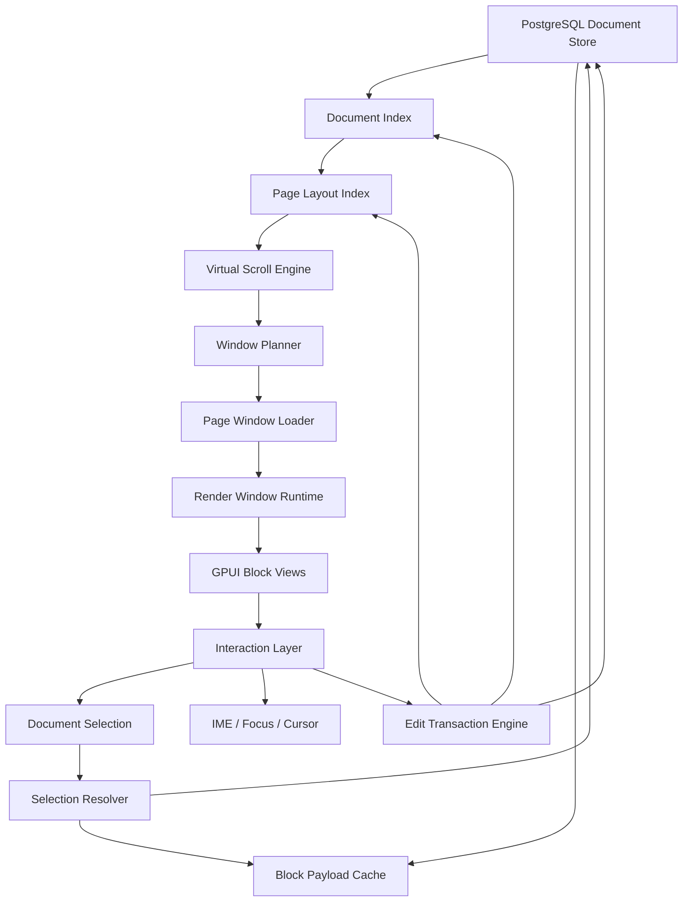

# 10w Block 富文本大文档架构设计

> 目标：支持 `10w block + 任意复杂富文本 + 任意跨页 selection + 无感滚动`。
>
> 核心原则：**UI 只是当前窗口的投影；真实文档状态、selection 状态、layout 高度状态、scroll 状态都必须独立存在于编辑器内核里。**

---

## 目录

1. [背景与问题定义](#背景与问题定义)
2. [设计目标](#设计目标)
3. [非目标](#非目标)
4. [核心结论](#核心结论)
5. [总体架构](#总体架构)
6. [核心原则](#核心原则)
7. [数据层设计](#数据层设计)
8. [轻量文档索引](#轻量文档索引)
9. [分页布局索引](#分页布局索引)
10. [页内布局索引](#页内布局索引)
11. [虚拟滚动系统](#虚拟滚动系统)
12. [渲染窗口系统](#渲染窗口系统)
13. [Entity 生命周期与 Pin 机制](#entity-生命周期与-pin-机制)
14. [Selection 模型](#selection-模型)
15. [装饰层与 Overlay](#装饰层与-overlay)
16. [跨页 Copy / Cut / Paste](#跨页-copy--cut--paste)
17. [Hit Test 与拖拽选择](#hit-test-与拖拽选择)
18. [IME / Composition](#ime--composition)
19. [编辑事务系统](#编辑事务系统)
20. [高度更新与锚点修正](#高度更新与锚点修正)
21. [异步加载与并发控制](#异步加载与并发控制)
22. [滚动体验设计](#滚动体验设计)
23. [缓存与持久化](#缓存与持久化)
24. [模块拆分建议](#模块拆分建议)
25. [落地路线图](#落地路线图)
26. [不变量与约束](#不变量与约束)
27. [测试计划](#测试计划)
28. [性能预算](#性能预算)
29. [补充设计：ms 级体验的关键约束](#补充设计ms-级体验的关键约束)
30. [风险清单](#风险清单)
31. [与当前 Cditor 状态的对应关系](#与当前-cditor-状态的对应关系)

---

## 背景与问题定义

富文本大文档难点不在“能不能画文字”，而在：

- block 高度不是固定值；
- 编辑会改变布局高度；
- 全局滚动条需要知道整篇文档高度；
- UI 不能同时持有 10w block 的 render entity；
- selection / IME / cursor 不能因为虚拟化而丢失；
- copy / cut 不能依赖当前窗口里是否存在 UI entity；
- 滚动需要连续，不能因为未测量高度导致大跳；
- 高度变化后视口锚点必须稳定。

传统小文档富文本架构通常是：

```text
全部内容在 UI tree 中
UI framework 负责真实 layout
scrollbar 绑定真实内容高度
selection 依赖 DOM/entity
```

这套方案用于 10w block 会出现：

- 启动慢；
- 文字 shaping 爆炸；
- 滚动跳跃；
- 编辑卡顿；
- 高度重算扩散；
- selection 跨页困难；
- entity 生命周期混乱。

大文档架构必须改成：

```text
数据全量存在 store/index
布局高度分页缓存
滚动坐标虚拟化
UI 只渲染当前窗口
selection 独立于 UI
编辑事务作用于文档内核
```

---

## 设计目标

### 必须支持

```text
10w block
任意复杂富文本 block
跨页 selection
无感滚动
大文档快速打开
局部编辑不卡顿
滚动条稳定
```

### 体验目标

- 打开 10w block 文档不需要 hydrate 全部 block。
- 滚轮滚动连续，不出现 `9991 -> 9811` 这种大跳。
- 拖动滚动条可以到任意位置。
- 编辑一行换行时视口不漂移。
- block 高度变化时滚动条总高度增量更新。
- 跨页 selection 不强制加载中间所有 pages。
- 复制跨页内容从 store/index 读取，而不是从 UI entity 读取。

### 性能目标

建议预算：

```text
初始打开 index/meta: < 300ms ideal, < 800ms acceptable
首屏渲染: < 100ms ideal
滚轮响应: < 16ms / frame
page load: < 50ms ideal, < 150ms acceptable
当前帧 text layout: < 5ms ideal
每次新增 entity: <= 50~100 ideal
```

性能验收不要只看平均值，必须以 p95 / p99 和 dropped frame 作为门禁：

```text
Typing latency:
  p50 < 4ms
  p95 < 8ms
  p99 < 16ms

Wheel / trackpad frame:
  p95 main-thread work < 8ms
  p99 main-thread work < 16ms
  dropped frame ratio < 1%

Scrollbar drag:
  pointer move -> thumb update < 8ms
  drag session 中 thumb 不反向、不跳变

Anchor stability:
  caret viewport_y drift <= 1 device px
  scroll anchor jitter p95 <= 1 device px
```

这些数字不是绝对物理极限，而是第一版可执行的回归门槛。后续机器性能、文档类型、渲染后端变化时可以调整，但必须保留 p95 / p99 语义。

### 体验优先级与精度边界

在未全量测量 10w blocks 高度前，滚动条不能天然承诺全局绝对精确。这个限制必须作为产品契约写清楚，否则“滚动条连续”和“全局比例精确”会在实现和验收时互相冲突。

架构上应明确：

```text
连续性 > 当前视口稳定 > 局部精确 > 全局比例精确 > 后台最终收敛
```

含义：

```text
滚动条拖动/滚轮滚动时，thumb 不能反跳、不能突然改变方向。
当前用户正在看的 viewport 和 caret 位置优先保持稳定。
当前 viewport / overscan 附近可以做到 exact 或 local exact。
远端未测量 page 只能使用 estimate，加载后再通过 anchor restore 收敛。
```

如果产品要求“拖到 73.2% 必须精确落到真实全文 73.2% 的视觉位置”，前提只能是：

```text
1. 打开后已经全量测量；或
2. 所有 block 高度都能由数据层确定；或
3. 接受先估算落点、目标 page 加载后再视觉收敛。
```

因此滚动条设计必须同时维护“连续稳定”和“逐步精确”两个目标，不能为了远端 total_height 的即时精确牺牲当前视口稳定。

硬性验收口径：

```text
滚动连续：thumb 不跳、不反向、不闪烁。
局部精确：当前 viewport / overscan 内的 block offset 精确。
全局比例精确：只有全局高度已知或估算误差收敛后才成立。
最终精确：远端 page 加载测量后通过 anchor restore 收敛。
```

如果用户拖到 73.2%，第一阶段只能承诺“使用当前 height model 的 73.2% 且交互过程连续稳定”；不能承诺“真实全文视觉高度的 73.2%”，除非对应路径上的高度都已是当前 `layout_version` 下的 `Exact`。

---

## 非目标

第一阶段不追求：

- 完整协同编辑 CRDT；
- PDF 级排版分页；
- 任意大小跨页 selection 一次性同步加载所有 payload；
- 后台真实 text shaping 10w block；
- 对 GPUI `ListState` 做全局 10w item 管理。

---

## 核心结论

一句话：

> **不要让 UI 框架管理 10w block 的真实滚动；编辑器内核自己维护全局虚拟滚动坐标，用 page 级高度索引做粗粒度映射，用 block 级高度索引做精确 prefix correction，只把当前 page/window 交给 GPUI 渲染。**

进一步说：

```text
DocumentStore 是数据真相
DocumentIndex 是顺序/结构真相
PageLayoutIndex / BlockHeightIndex 是高度真相
VirtualScrollState 是滚动真相
DocumentSelection 是选区真相
UI Entity 只是当前窗口投影
```

只要 UI entity 是真相来源，就做不大。  
只要 ListState 是全局滚动真相，也做不大。

---

## 总体架构



模块职责：

| 模块 | 职责 |
|---|---|
| `DocumentStore` | PostgreSQL 持久化，按窗口/范围读取 payload/meta，异步同步到 runtime |
| `DocumentIndex` | 维护全局 block 顺序、id、depth、kind、轻量高度 meta |
| `PageLayoutIndex` | 以 page 为单位维护全局高度与 offset 映射 |
| `VirtualScrollState` | 维护全局滚动坐标、viewport、anchor |
| `WindowPlanner` | 根据目标 page 计算需要渲染的 page/window 范围 |
| `RenderWindowRuntime` | 管理当前窗口 block entities 和 local ListState |
| `EntityCache` | 管理 entity 复用、pin、evict |
| `DocumentSelection` | 文档级 selection，独立于 UI |
| `EditTransactionEngine` | 统一执行编辑操作并同步 store/index/layout |

---

## 核心原则

### 1. UI 不是真相

错误做法：

```text
复制 selection -> 遍历当前 UI entity
滚动高度 -> 读 ListState 的全局高度
文档顺序 -> 当前渲染列表顺序
```

正确做法：

```text
复制 selection -> 从 DocumentStore / DocumentIndex 读取
滚动高度 -> PageLayoutIndex
文档顺序 -> DocumentIndex
UI entity -> 仅当前窗口投影
```

### 2. 全局滚动是虚拟坐标

```rust
type LayoutPx = f64;

struct VirtualScrollState {
    global_scroll_top: LayoutPx,
    viewport_height: LayoutPx,
    total_height: LayoutPx,
    anchor: ScrollAnchor,
}
```

`global_scroll_top` 不等于 GPUI `ListState` 的真实 scroll top。  
它是文档内核维护的全局逻辑滚动坐标。

### 3. Layout 高度必须持久化

没有高度缓存，大文档一定不稳定。

需要至少缓存：

```text
block_id -> measured_height
page_index -> page_height
layout_version
```

### 4. Selection 不依赖 UI

跨页 selection 不能要求所有中间 block 都有 entity。

```rust
struct DocumentSelection {
    anchor: TextPosition,
    focus: TextPosition,
}
```

### 5. 当前编辑 block 必须 pin

不能因为滚动、trim、page 切换卸载：

- focus block；
- IME composition block；
- dirty block；
- selection endpoints；
- drag source；
- slash menu block。

### 6. 当前编辑 block 是实时系统

10w block 虚拟化解决的是全局规模问题，不自动保证输入延迟。当前编辑 block、composition block、selection endpoint 所在 block 必须走实时优先级：

```text
keydown / composition update
  -> 更新内存模型
  -> 最小增量 layout
  -> 更新 caret / IME rect
  -> 本帧可绘制
  -> 持久化、FTS、syntax highlight、远端 refinement 后置
```

输入 hot path 禁止：

```text
同步等待 PostgreSQL 读写。
同步解析大 HTML / Markdown。
同步 syntax highlight 大 code block。
同步 image decode。
全局 page reflow。
全文 index rebuild。
等待 async task 返回。
```

当前编辑 block 的流畅性高于远端 page 高度收敛、prefetch、cache 写入和 FTS 更新。

---

## 数据层设计

### BlockRecord

内存中的 `BlockRecord` 只保存结构、类型、轻量属性和版本信息，不强制保存完整 payload。完整富文本 payload 可以按需从 `block_payloads` 批量加载。

```rust
struct BlockRecord {
    id: BlockId,
    document_id: DocumentId,
    parent_id: Option<BlockId>,
    prev_id: Option<BlockId>,
    next_id: Option<BlockId>,
    sort_key: SortKey,
    depth: u16,
    kind: BlockKind,
    attrs: BlockAttrs,
    content_version: u64,
    structure_version: u64,
}
```

### Block 类型与属性分层

不要把所有字段都塞进 `blocks`，也不要让每种 block 都拆出过度关系化的几十张表。建议分层：

```text
blocks：结构真相，保存顺序、父子、kind、版本。
block_attrs：块级样式和交互属性，例如颜色、背景、折叠、对齐。
block_payloads：正文 payload，例如 plain text、rich text runs、code text、table json。
block_layout：高度缓存，保存 measured_height / estimated_height，不属于正文真相。
block_kind_*：少量需要强查询或强约束的类型专属 metadata，例如 code language、asset_id。
```

核心原则：

```text
颜色属于 block attrs，不属于 layout cache。
块高度属于 block_layout，不属于 block payload。
语言属于 code block metadata 或 payload header。
正文内容属于 block_payloads。
搜索 plain_text 是派生索引，可重建。
```

#### BlockKind

```rust
enum BlockKind {
    Paragraph,
    Heading,
    Quote,
    Callout,
    Todo,
    BulletedList,
    NumberedList,
    Toggle,
    Code,
    Math,
    Mermaid,
    Html,
    Table,
    Image,
    File,
    Whiteboard,
    Embed,
    Divider,
}
```

#### BlockAttrs

`BlockAttrs` 保存通用块属性，应该尽量轻量、可序列化、可向前兼容：

```rust
struct BlockAttrs {
    color: Option<ColorToken>,
    background_color: Option<ColorToken>,
    text_align: Option<TextAlign>,
    indent: u16,
    folded: bool,
    locked: bool,
    custom: JsonMap,
}
```

区分属性是否影响布局：

```text
paint-only：color、background_color、comment marker、search highlight，不应触发 height invalidation。
layout-affecting：indent、folded、text_align、font_size、line_height、list marker、table column width，需要提升 layout_version 或标记 LayoutDirtyRange。
```

#### 常见 block 类型字段归属

| block 类型 | 内容 payload | 类型 metadata | 块属性 attrs | 高度 layout |
|---|---|---|---|---|
| Paragraph / Plain text | rich text runs / plain text | 无 | color、background、align、indent | `block_layout.height` |
| Heading | rich text runs | `level` | color、folded、indent | `block_layout.height` |
| Todo | rich text runs | `checked` | color、indent | `block_layout.height` |
| Quote / Callout | rich text runs | `quote_kind` / `callout_variant` | color、background、icon | `block_layout.height` |
| List item | rich text runs | `list_kind` / `ordinal` | color、indent | `block_layout.height` |
| Code block | code text | `language`、`wrap`、`show_line_numbers` | color、background | `block_layout.height` |
| Math / Mermaid / Html | raw text | render/safety options | color、background | `block_layout.height` |
| Table | table json 或 cell payload | row/column count | table style | block 高度 + 可选 row heights |
| Image / File | caption rich text | `asset_id`、metadata | align、caption position | stable box + measured height |
| Whiteboard / Embed | embed config | `asset_id` / url / provider | size policy | intrinsic/stable height |
| Database / Collection | schema、view、row refs | `collection_id`、view type | view style、density | stable height + 内部虚拟化 |
| Divider | 无 | style | color | 固定或 measured height |

#### 新增 BlockKind 的扩展机制

Block 类型一定会持续增加，不能每新增一个类型就重构核心表和渲染管线。新增 block 应遵循“核心协议稳定、类型能力插件化”的方式。

`BlockKind` 建议保留扩展入口：

```rust
enum BlockKind {
    Paragraph,
    Heading,
    Code,
    Table,
    Image,
    Whiteboard,
    Embed,
    Database,
    Custom(String),
}
```

每个类型需要声明自己的能力：

```rust
struct BlockKindDescriptor {
    kind: BlockKind,
    payload_format: &'static str,
    default_attrs: BlockAttrs,
    layout_behavior: LayoutBehavior,
    selection_behavior: SelectionBehavior,
    supports_children: bool,
    supports_rich_text_title: bool,
    can_contain_blocks: bool,
}

enum LayoutBehavior {
    TextLike,
    FixedHeight,
    StableBox,
    InternalVirtualized,
    CustomProvider,
}
```

新增 block 类型时必须回答：

```text
1. payload 存在哪里：block_payloads.body_json/body_blob，还是专属 metadata 表。
2. 高度怎么来：固定、估算、stable box、UI measured、内部虚拟化。
3. selection 怎么处理：普通文本 selection、子块 selection、内部 cell/row selection，还是不可编辑。
4. copy/paste 怎么序列化：plain text、html、native block format。
5. 是否影响 PagePolicy：layout_cost、text_bytes、inline_runs、complex_block_count。
6. 是否需要专属索引：例如 database row、relation、date、status、formula。
```

核心表设计必须允许未知类型降级打开：

```text
未知 kind：仍能读取 blocks + block_payloads。
未知 payload_format：显示 unsupported block placeholder。
未知 attrs 字段：保留在 attrs_json/custom，不丢弃。
未知类型高度：使用 StableBox 或默认估高，不能高度为 0。
```

#### Notion 数据库类型怎么建

Notion 式 database 本质不是普通 block，而是“collection 数据模型 + 一个或多个 view block”。建议分两层：

```text
Database block：文档中的一个可见 block，负责显示某个 collection 的某个 view。
Collection：跨文档可复用的数据表，存 schema、rows、properties、views。
```

Database block 的 payload 可以很轻：

```json
{
  "collection_id": "...",
  "view_id": "...",
  "view_type": "table",
  "title": "Tasks"
}
```

数据库块需要内部虚拟化：

```text
外层文档只把 Database 当成一个 block，提供 stable height。
Database 内部 rows/columns 自己做行列虚拟化。
Document scroll anchor 可以落在 Database block 内部 row/cell。
Database block 的高度不能依赖一次性渲染全部 rows。
```

建议增加 collection 相关表：

```sql
CREATE TABLE collections (
    id TEXT PRIMARY KEY,
    workspace_id TEXT NOT NULL,
    title TEXT NOT NULL DEFAULT '',
    schema_json TEXT NOT NULL,
    created_at INTEGER NOT NULL,
    updated_at INTEGER NOT NULL,
    deleted_at INTEGER
);

CREATE TABLE collection_views (
    id TEXT PRIMARY KEY,
    collection_id TEXT NOT NULL,
    view_type TEXT NOT NULL,
    name TEXT NOT NULL DEFAULT '',
    config_json TEXT NOT NULL,
    sort_key TEXT NOT NULL,
    created_at INTEGER NOT NULL,
    updated_at INTEGER NOT NULL,
    FOREIGN KEY(collection_id) REFERENCES collections(id) ON DELETE CASCADE
);

CREATE TABLE collection_rows (
    id TEXT PRIMARY KEY,
    collection_id TEXT NOT NULL,
    sort_key TEXT NOT NULL,
    properties_json TEXT NOT NULL,
    page_document_id TEXT,
    created_at INTEGER NOT NULL,
    updated_at INTEGER NOT NULL,
    deleted_at INTEGER,
    FOREIGN KEY(collection_id) REFERENCES collections(id) ON DELETE CASCADE,
    FOREIGN KEY(page_document_id) REFERENCES documents(id) ON DELETE SET NULL
);

CREATE INDEX idx_collection_rows_collection_sort
ON collection_rows(collection_id, deleted_at, sort_key);
```

说明：

```text
collection row 可以只是属性数据，也可以关联一个 page document。
Notion 的“数据库每行打开是页面”可以通过 page_document_id 实现。
Database block 只是 collection view 的一个引用，不复制 rows。
同一个 collection 可以被多个文档中的多个 Database block 引用。
```

### 多文档与 Workspace 存储

最终产品如果类似 Notion，数据库不能只围绕单篇 document 设计。需要从第一版就有 workspace / document tree / document reference 的概念。

推荐层级：

```text
Workspace
  Space / Teamspace 可选
    Document tree
      Document
        Blocks
Collections 可以属于 workspace，也可以被 document 引用。
Assets 属于 workspace，blocks/documents 只引用 asset_id。
```

建议增加：

```sql
CREATE TABLE workspaces (
    id TEXT PRIMARY KEY,
    name TEXT NOT NULL DEFAULT '',
    settings_json TEXT,
    created_at INTEGER NOT NULL,
    updated_at INTEGER NOT NULL
);

CREATE TABLE documents (
    id TEXT PRIMARY KEY,
    workspace_id TEXT NOT NULL,
    parent_document_id TEXT,
    title TEXT NOT NULL DEFAULT '',
    icon_json TEXT,
    cover_json TEXT,
    sort_key TEXT NOT NULL DEFAULT '',
    structure_version INTEGER NOT NULL DEFAULT 0,
    content_version INTEGER NOT NULL DEFAULT 0,
    layout_version INTEGER NOT NULL DEFAULT 0,
    schema_version INTEGER NOT NULL DEFAULT 1,
    attrs_json TEXT,
    created_at INTEGER NOT NULL,
    updated_at INTEGER NOT NULL,
    deleted_at INTEGER,
    FOREIGN KEY(workspace_id) REFERENCES workspaces(id) ON DELETE CASCADE,
    FOREIGN KEY(parent_document_id) REFERENCES documents(id) ON DELETE SET NULL
);

CREATE INDEX idx_documents_workspace_parent_sort
ON documents(workspace_id, parent_document_id, deleted_at, sort_key);
```

多文档原则：

```text
document_id 只在 workspace 内唯一也可以，但建议全局 UUID，方便同步和跨 workspace 移动。
blocks 必须带 document_id，不跨 document 共享 block。
assets / collections 可以 workspace 级共享。
全文搜索 block_fts 必须带 workspace_id + document_id。
打开一个 document 只加载该 document 的 index，不扫描全 workspace。
侧边栏 document tree 使用 documents 表，不依赖 blocks。
```

如果未来要支持 document link / backlink：

```sql
CREATE TABLE document_links (
    source_document_id TEXT NOT NULL,
    source_block_id TEXT,
    target_document_id TEXT NOT NULL,
    link_kind TEXT NOT NULL,
    created_at INTEGER NOT NULL,
    PRIMARY KEY(source_document_id, source_block_id, target_document_id, link_kind)
);

CREATE INDEX idx_document_links_target
ON document_links(target_document_id);
```

### 数据库选择

最终形态要支持云服务、多端同步、团队空间、权限、审计和服务端检索，因此主数据库选择 **PostgreSQL**，而不是 SQLite。

需要坚持的原则不是“用哪种本地库”，而是：

```text
不要让 UI hot path 等远程数据库。
不要逐 block / 逐 span N+1 查询。
不要把高度、搜索、page layout 当正文真相。
不要把富文本 payload 过度拆成编辑路径必须 join 的关系模型。
不要把客户端 UI entity 当作同步或持久化真相。
```

推荐模型：

```text
PostgreSQL：云端权威存储、事务、同步、权限、审计、全文检索、资产索引。
内存 DocumentIndex / HeightIndex：编辑和滚动 hot path 真相。
客户端本地缓存：可选，只作为离线 cache / outbox / layout cache，不作为云端主真相。
对象存储：大图片、视频、附件、whiteboard blob。
```

客户端编辑仍然是 local-first：

```text
DocumentRuntime 先应用编辑
-> 本地 pending/outbox 队列
-> 后台同步到 PostgreSQL
-> 服务端返回 revision / ack
```

第一版可以不实现实时多人 CRDT，但 schema 必须为后续云同步预留：

- 全局稳定 `uuid` id。
- transaction log / operation log。
- `client_id`、`device_id`、单调 sequence。
- soft delete / tombstone。
- server revision。
- 冲突恢复快照。

### PostgreSQL 表设计建议

#### documents

如果上一节已经采用 workspace 版 `documents` 表，这里不需要再建单文档版。单文档 demo 可以把 `workspace_id` 固定为默认 workspace。

最低要求：

```sql
CREATE TABLE documents (
    id UUID PRIMARY KEY,
    workspace_id UUID NOT NULL,
    title TEXT NOT NULL DEFAULT '',
    structure_version BIGINT NOT NULL DEFAULT 0,
    content_version BIGINT NOT NULL DEFAULT 0,
    layout_version BIGINT NOT NULL DEFAULT 0,
    schema_version BIGINT NOT NULL DEFAULT 1,
    attrs_json JSONB,
    created_at TIMESTAMPTZ NOT NULL DEFAULT now(),
    updated_at TIMESTAMPTZ NOT NULL DEFAULT now(),
    deleted_at TIMESTAMPTZ
);

CREATE TABLE document_tree (
    document_id UUID PRIMARY KEY REFERENCES documents(id) ON DELETE CASCADE,
    workspace_id UUID NOT NULL,
    parent_id UUID,
    prev_id UUID,
    next_id UUID,
    sort_key TEXT NOT NULL DEFAULT '',
    depth INTEGER NOT NULL DEFAULT 0,
    collapsed BOOLEAN NOT NULL DEFAULT FALSE,
    updated_at TIMESTAMPTZ NOT NULL DEFAULT now()
);

CREATE INDEX idx_document_tree_workspace_parent_sort
ON document_tree(workspace_id, parent_id, sort_key)
WHERE parent_id IS NOT NULL;
```

#### blocks

`blocks` 只保存结构和轻量类型信息。`sort_key` 建议使用可在中间插入的 fractional key / LexoRank 字符串，避免每次中间插入都更新大量 position。

```sql
CREATE TABLE blocks (
    id UUID PRIMARY KEY,
    document_id UUID NOT NULL REFERENCES documents(id) ON DELETE CASCADE,
    parent_id UUID,
    prev_id UUID,
    next_id UUID,
    sort_key TEXT NOT NULL,
    depth INTEGER NOT NULL DEFAULT 0,
    kind TEXT NOT NULL,
    flags INTEGER NOT NULL DEFAULT 0,
    content_version BIGINT NOT NULL DEFAULT 0,
    structure_version BIGINT NOT NULL DEFAULT 0,
    created_at TIMESTAMPTZ NOT NULL DEFAULT now(),
    updated_at TIMESTAMPTZ NOT NULL DEFAULT now(),
    deleted_at TIMESTAMPTZ
);

CREATE INDEX idx_blocks_document_sort
ON blocks(document_id, sort_key)
WHERE deleted_at IS NULL;

CREATE INDEX idx_blocks_parent_sort
ON blocks(document_id, parent_id, sort_key)
WHERE deleted_at IS NULL;

CREATE INDEX idx_blocks_document_structure_version
ON blocks(document_id, structure_version);
```

#### block_attrs

颜色、背景、对齐、折叠等块属性放这里。高度不要放这里。

```sql
CREATE TABLE block_attrs (
    block_id UUID PRIMARY KEY REFERENCES blocks(id) ON DELETE CASCADE,
    color TEXT,
    background_color TEXT,
    text_align TEXT,
    indent INTEGER NOT NULL DEFAULT 0,
    folded BOOLEAN NOT NULL DEFAULT FALSE,
    attrs_json JSONB,
    attrs_version BIGINT NOT NULL DEFAULT 0,
    updated_at TIMESTAMPTZ NOT NULL DEFAULT now()
);
```

#### block_payloads

普通富文本、plain text、code、math、mermaid、html、table 小 payload 都可以以 block 为单位整体存。`plain_text` 是派生字段，用于搜索、估高、复制 plain text 和 outline。

```sql
CREATE TABLE block_payloads (
    block_id UUID PRIMARY KEY REFERENCES blocks(id) ON DELETE CASCADE,
    document_id UUID NOT NULL REFERENCES documents(id) ON DELETE CASCADE,
    body_format TEXT NOT NULL,
    body_json JSONB,
    body_bytes BYTEA,
    plain_text TEXT NOT NULL DEFAULT '',
    text_len INTEGER NOT NULL DEFAULT 0,
    inline_run_count INTEGER NOT NULL DEFAULT 0,
    content_hash TEXT,
    content_version BIGINT NOT NULL DEFAULT 0,
    updated_at TIMESTAMPTZ NOT NULL DEFAULT now()
);

CREATE INDEX idx_block_payloads_document_id
ON block_payloads(document_id);

CREATE INDEX idx_block_payloads_text_len
ON block_payloads(text_len);
```

示例：

```text
Paragraph:
  body_format = richtext_v1
  body_json/blob = { text, inline_runs }
  attrs.color = red
  block_layout.height = 48

Code:
  body_format = code_v1
  body_json/blob = { text, language, wrap, show_line_numbers }
  attrs.background_color = gray
  block_layout.height = 320
```

#### block_code_meta

如果 code language、wrap、line number 等需要频繁查询或局部更新，可以拆成 metadata 表；否则也可以放在 `block_payloads.body_json`。第一版二选一，不要两边都作为真相。

```sql
CREATE TABLE block_code_meta (
    block_id UUID PRIMARY KEY REFERENCES blocks(id) ON DELETE CASCADE,
    language TEXT,
    wrap BOOLEAN NOT NULL DEFAULT FALSE,
    show_line_numbers BOOLEAN NOT NULL DEFAULT TRUE,
    theme TEXT,
    line_count INTEGER NOT NULL DEFAULT 0,
    syntax_version BIGINT NOT NULL DEFAULT 0,
    updated_at TIMESTAMPTZ NOT NULL DEFAULT now()
);
```

#### block_assets

大图片、附件、whiteboard、视频不要直接塞主表。PostgreSQL 存 metadata，资源本体放对象存储。

```sql
CREATE TABLE assets (
    id UUID PRIMARY KEY,
    workspace_id UUID NOT NULL,
    kind TEXT NOT NULL,
    object_key TEXT NOT NULL,
    public_url TEXT,
    media_type TEXT,
    hash TEXT,
    size_bytes BIGINT,
    width INTEGER,
    height INTEGER,
    duration_ms INTEGER,
    metadata_json JSONB,
    created_at TIMESTAMPTZ NOT NULL DEFAULT now(),
    updated_at TIMESTAMPTZ NOT NULL DEFAULT now(),
    deleted_at TIMESTAMPTZ
);

CREATE TABLE block_assets (
    block_id UUID PRIMARY KEY REFERENCES blocks(id) ON DELETE CASCADE,
    asset_id UUID NOT NULL REFERENCES assets(id) ON DELETE RESTRICT,
    role TEXT NOT NULL DEFAULT 'main',
    stable_width DOUBLE PRECISION,
    stable_estimated_height DOUBLE PRECISION,
    stable_min_height DOUBLE PRECISION,
    stable_max_height DOUBLE PRECISION,
    stable_confidence INTEGER,
    aspect_ratio DOUBLE PRECISION,
    caption_payload_json JSONB
);
```

#### block_layout

高度缓存必须版本化。plain text 的颜色变化不应该改高度；code language 变化可能影响 syntax highlight，但不一定影响高度；wrap、font、width 改变通常影响高度。

```sql
CREATE TABLE block_layout (
    block_id UUID NOT NULL REFERENCES blocks(id) ON DELETE CASCADE,
    document_id UUID NOT NULL REFERENCES documents(id) ON DELETE CASCADE,
    layout_key_hash TEXT NOT NULL,
    width_bucket INTEGER NOT NULL,
    exact_width DOUBLE PRECISION,
    content_version BIGINT NOT NULL,
    attrs_version BIGINT NOT NULL DEFAULT 0,
    style_version BIGINT NOT NULL DEFAULT 0,
    font_version BIGINT NOT NULL DEFAULT 0,
    theme_version BIGINT NOT NULL DEFAULT 0,
    scale_factor DOUBLE PRECISION NOT NULL DEFAULT 1.0,
    measured_height DOUBLE PRECISION,
    estimated_height DOUBLE PRECISION NOT NULL,
    confidence INTEGER NOT NULL DEFAULT 0,
    max_error_hint DOUBLE PRECISION NOT NULL DEFAULT 0,
    line_count INTEGER,
    layout_cost INTEGER NOT NULL DEFAULT 0,
    measured_at TIMESTAMPTZ,
    updated_at TIMESTAMPTZ NOT NULL DEFAULT now(),
    PRIMARY KEY (block_id, layout_key_hash)
);

CREATE INDEX idx_block_layout_block_width
ON block_layout(block_id, width_bucket);
```

`confidence` 建议：

```text
0 = Default
1 = Historical
2 = Predictive
3 = Exact
```

#### page_layout

```sql
CREATE TABLE page_layout (
    document_id UUID NOT NULL REFERENCES documents(id) ON DELETE CASCADE,
    visible_index_version BIGINT NOT NULL DEFAULT 0,
    structure_version BIGINT NOT NULL,
    layout_key_hash TEXT NOT NULL,
    page_policy_version BIGINT NOT NULL,
    page_index INTEGER NOT NULL,
    block_start_index INTEGER NOT NULL,
    block_count INTEGER NOT NULL,
    first_block_id UUID,
    last_block_id UUID,
    height DOUBLE PRECISION NOT NULL,
    measured_ratio DOUBLE PRECISION NOT NULL DEFAULT 0,
    confidence INTEGER NOT NULL DEFAULT 0,
    max_error_hint DOUBLE PRECISION NOT NULL DEFAULT 0,
    dirty BOOLEAN NOT NULL DEFAULT FALSE,
    updated_at TIMESTAMPTZ NOT NULL DEFAULT now(),
    PRIMARY KEY (
        document_id,
        visible_index_version,
        structure_version,
        layout_key_hash,
        page_policy_version,
        page_index
    )
);
```

#### document_index_snapshot 可选

用于快速启动：

```sql
CREATE TABLE document_index_snapshot (
    document_id UUID NOT NULL REFERENCES documents(id) ON DELETE CASCADE,
    visible_index_version BIGINT NOT NULL DEFAULT 0,
    structure_version BIGINT NOT NULL,
    snapshot_format TEXT NOT NULL,
    snapshot_bytes BYTEA NOT NULL,
    block_count INTEGER NOT NULL,
    created_at TIMESTAMPTZ NOT NULL DEFAULT now(),
    PRIMARY KEY(document_id, visible_index_version, structure_version)
);
```

#### block_search

全文搜索用派生 plain text，不依赖 UI entity，也不要求 hydrate 全文 payload。PostgreSQL 第一版使用 `tsvector`，后续中文搜索可接 `pg_jieba`、Meilisearch 或 OpenSearch。

```sql
CREATE TABLE block_search (
    block_id UUID PRIMARY KEY REFERENCES blocks(id) ON DELETE CASCADE,
    document_id UUID NOT NULL REFERENCES documents(id) ON DELETE CASCADE,
    kind TEXT NOT NULL,
    plain_text TEXT NOT NULL DEFAULT '',
    search_vector TSVECTOR,
    content_version BIGINT NOT NULL,
    indexed_at TIMESTAMPTZ NOT NULL DEFAULT now()
);

CREATE INDEX idx_block_search_document_id
ON block_search(document_id);

CREATE INDEX idx_block_search_vector
ON block_search USING GIN(search_vector);
```

更新 `block_search` 必须携带 `content_version`，过期任务不能覆盖新版本索引。

---

## 轻量文档索引

内存中维护全局轻量索引，不装完整 payload。

```rust
struct DocumentIndex {
    document_id: DocumentId,
    block_ids: Vec<BlockId>,
    parent_ids: Vec<Option<BlockId>>,
    depths: Vec<u16>,
    kind_tags: Vec<BlockKindTag>,
    flags: Vec<BlockFlags>,
    layout_meta: Vec<BlockLayoutMeta>,
    id_to_index: HashMap<BlockId, usize>,
}
```

### BlockLayoutMeta

```rust
struct BlockLayoutMeta {
    block_id: BlockId,
    estimated_height: f64,
    measured_height: Option<f64>,
    width_bucket: u16,
    layout_version: u64,
    dirty: bool,
}
```

### 能力

```rust
impl DocumentIndex {
    fn total_count(&self) -> usize;
    fn id_at(&self, index: usize) -> Option<BlockId>;
    fn index_of(&self, id: BlockId) -> Option<usize>;
    fn meta_at(&self, index: usize) -> Option<&BlockLayoutMeta>;
    fn update_height(&mut self, index: usize, height: f64);
    fn compare_position(&self, a: BlockId, b: BlockId) -> Ordering;
}
```

### 设计注意点

- `DocumentIndex` 可以全量加载，因为它是轻量结构。
- 不要在 index 中存完整 rich text payload。
- block 顺序比较必须 O(1) 或 O(log n)。
- selection 跨页判断依赖 `index_of`。


### 可见文档投影索引

`DocumentIndex` 表示文档结构真相，但滚动和渲染通常面对的是“当前视图下可见的 block 序列”。折叠 heading、toggle、搜索过滤、局部视图、隐藏 block、outliner 模式都会让可见顺序不同于原始结构顺序。

因此需要单独维护可见投影：

```rust
struct VisibleDocumentIndex {
    visible_block_ids: Vec<BlockId>,
    source_structure_version: u64,
    visibility_version: u64,
    id_to_visible_index: HashMap<BlockId, usize>,
}
```

规则：

```text
DocumentIndex 是结构真相。
VisibleDocumentIndex 是当前视图顺序真相。
PageLayoutIndex / BlockHeightIndex / RenderWindow 应基于 VisibleDocumentIndex。
scroll_to_block(block_id) 先解析 visible_index；如果 block 被折叠隐藏，需要定位到最近可见 ancestor 或展开后再定位。
selection 仍保存文档级 block_id + TextOffset，不保存 visible_index。
```

不要把“全文结构顺序”和“当前可见顺序”混为一谈，否则折叠 5000 个子 block 时，滚动条高度、page 边界、selection fragment 和 hit test 都会出现错位。

折叠 / toggle / subtree 隐藏必须是批量可见性变更，不能逐个 block 触发 page reflow：

```rust
struct SubtreeLayoutMeta {
    block_id: BlockId,
    visible_descendant_count: usize,
    collapsed_height: f64,
    expanded_height: f64,
    visibility_version: u64,
}
```

折叠流程：

```text
toggle collapse
  -> 批量更新 VisibleDocumentIndex
  -> 从 BlockHeightIndex 中扣除 hidden subtree height
  -> 标记 affected page range dirty
  -> PageLayoutIndex 批量 reflow
  -> 只做一次 anchor restore
```

规则：

```text
1. 折叠 1w block subtree 不能逐 block notify UI。
2. 被折叠 block 的 selection 仍保留文档级位置，但 visible fragment 不渲染。
3. scroll_to_block(hidden_child) 应定位到最近 visible ancestor，或按命令语义先展开再定位。
4. subtree height 可以保留 historical cache，展开时优先使用，再对 viewport 内 exact 收敛。
```

### 结构编辑复杂度

第一版使用 `Vec<BlockId> + HashMap<BlockId, usize>` 可以接受，但要明确限制：

```text
1. 中间插入/删除/move 会导致 Vec 移动和 id_to_index 大范围更新。
2. 10w block 单次 O(n) 批量更新通常可接受，但不能逐 block 触发 O(n)。
3. 大 paste / 大 delete / drag move 必须 batch 更新 DocumentIndex。
4. 批量操作中只在最后重建 affected range 的 id_to_index。
```

后续如果结构编辑频繁或文档规模继续扩大，可以替换为 chunked sequence：

```rust
struct BlockSequence {
    chunks: Vec<BlockChunk>,
    id_to_location: HashMap<BlockId, BlockLocation>,
}

struct BlockLocation {
    chunk_id: ChunkId,
    local_index: usize,
}
```

可选实现：

```text
Chunked Vec / Gap Buffer / BTree sequence / Rope-like block sequence
```

但接口层不应暴露底层是 `Vec` 还是 chunk tree。`DocumentIndex` 对外只承诺 `id_at`、`index_of`、`compare_position`、批量结构编辑和版本一致性。

---

## 分页布局索引

全局滚动不能依赖 UI item，也不应该让 GPUI `ListState` 管理 10w item。第一层使用 page height 做 coarse mapping，第二层使用 block height 做 prefix correction。

```rust
const MAX_PAGE_BLOCKS: usize = 1000;
```

10w block 在纯文本场景下大约是：

```text
<= 100 pages
```

但 `1000` 只能是 page 的 block 数上限，不应是固定 page size。复杂富文本需要按高度、布局成本和 payload 大小提前切页。

### PageLayout

```rust
struct PageLayout {
    page_index: usize,
    block_start: usize,
    block_count: usize,
    height: f64,
    measured_ratio: f32,
    dirty: bool,
}
```

### PageLayoutIndex

```rust
struct PageLayoutIndex {
    max_page_blocks: usize,
    pages: Vec<PageLayout>,
    height_index: FenwickTree<f64>,
}
```

### 核心能力

```rust
impl PageLayoutIndex {
    fn page_count(&self) -> usize;
    fn total_height(&self) -> f64;
    fn offset_of_page(&self, page: usize) -> f64;
    fn page_at_offset(&self, global_y: f64) -> (usize, f64);
    fn update_page_height(&mut self, page: usize, new_height: f64);
    fn page_for_block_index(&self, block_index: usize) -> usize;
}
```

### Page 高度来源

优先级：

```text
1. 持久化 measured page height
2. sum(block measured height)
3. sum(block estimated height)
4. block_count * default_height
```

### 高度置信度与误差模型

仅有 `measured_height / estimated_height` 不足以保证滚动条稳定。滚动系统需要知道当前高度有多可信，才能决定是否立即修正、延后修正、优先测量或冻结滚动条比例。

```rust
enum HeightConfidence {
    Exact,       // 当前 layout_version + width_bucket 下真实测量过
    Predictive,  // 根据文本长度、图片比例、表格行数等较可靠估算
    Historical,  // 旧 width/font/theme 下的历史高度换算
    Default,     // 默认高度兜底
}

struct HeightEstimate {
    height: f64,
    confidence: HeightConfidence,
    max_error_hint: f64,
}
```

Page 级别也应维护聚合置信度：

```rust
struct PageLayout {
    page_index: usize,
    block_start: usize,
    block_count: usize,
    height: f64,
    measured_ratio: f32,
    confidence: HeightConfidence,
    max_error_hint: f64,
    dirty: bool,
}
```

使用规则：

```text
当前 viewport / overscan 附近 page confidence 低：优先测量
远离 viewport 的低 confidence page：只影响 total_height，不阻塞滚动
Default 占比过高：scrollbar 可以稳定但不能承诺精确，需要后台 refinement
Exact page 的高度变化：必须走 anchor restore，不能直接让视口跳
```

### Page 划分策略

`MAX_PAGE_BLOCKS = 1000` 适合作为第一版上限，但对于任意复杂富文本，单纯按 block 数分页会产生异常重的 page。

page 边界应由 block 数量、估算高度、布局成本、文本体量和 inline run 数共同决定：

```rust
struct PagePolicy {
    max_blocks: usize,              // 例如 1000，只是上限
    target_height: f64,             // 例如 30000px
    max_estimated_cost: u32,        // table/code/embed/image 等复杂 block 权重
    max_text_bytes: usize,          // 防止大量长文本集中在同一 page
    max_inline_runs: usize,         // 防止富文本 span 过密导致 shaping/layout 爆炸
    max_complex_blocks: usize,      // 防止少数 table/code/embed 拖垮整页
}
```

原则：

```text
普通文本 page 可以接近 1000 blocks。
复杂 table/code/image/embed 密集 page 应提前切页。
达到 target_height / max_estimated_cost / max_text_bytes / max_inline_runs / max_complex_blocks 任一阈值都应切页。
单个超大 block 应单独成页或进入 block 内部虚拟化，不能依赖 page 虚拟化解决。
```

### 结构编辑后的 Page Reflow

插入、删除、移动 block 会改变 page 边界和 `block_start_index`。不能只更新当前 page 高度。

```text
InsertBlock/DeleteBlock:
  1. 更新 DocumentIndex
  2. 从 affected page 开始重新切 page
  3. 受影响 pages 标记 dirty
  4. 未加载 page 使用 estimated height 重建
  5. 当前 viewport 使用 anchor restore

MoveBlock:
  1. source page 到 target page 之间的 page range dirty
  2. 重建这段 PageLayout
  3. 保持 selection 和 scroll anchor 指向 block_id，而不是 page_index
```

`page_index` 不是稳定身份。持久化 page layout 时建议额外保存结构版本和边界信息：

```sql
-- 建议字段
structure_version INTEGER NOT NULL,
first_block_id TEXT,
last_block_id TEXT
```

打开或结构变化后：

```text
page_layout.structure_version == document.structure_version 才可直接复用
否则 page height 只能作为 historical hint，不能当作 exact height
```

### 为什么需要 page + block 双层索引

只用 page index：

- 实现简单，适合快速 coarse mapping；
- 但 page 内高度误差可能很大，远端 `scroll_to_block`、搜索跳转、outline 跳转不够精确；
- 复杂 page 可能让 1000-block scan 变成滚动路径上的隐性成本。

只用 block index：

- 精度最高；
- 10w block 的高度数组内存很小，`100000 * f64 ≈ 800KB`；
- 复杂点在于失效、版本、未测量状态和批量更新，而不是内存。

推荐第一版就采用 hybrid：

```text
PageLayoutIndex：负责 page-level coarse mapping、page dirty/reflow、total_height 聚合。
BlockHeightIndex：负责 block-level prefix sum、offset_of_block、block_at_offset。
LoadedPageLayout：负责当前已加载 page 内 exact offset 和 UI measure 回写。
```

这样既保留 page 级窗口管理的简单性，又能让滚动条、搜索跳转、selection 定位逐步具备 block 级精度。

### BlockHeightIndex 的结构同步

`BlockHeightIndex` 必须和 `DocumentIndex` 在同一个结构版本下同步变化，否则高度数组会和 block 顺序错位。

建议接口：

```rust
impl BlockHeightIndex {
    fn insert_range(&mut self, index: usize, estimated_heights: &[f64]);
    fn delete_range(&mut self, range: Range<usize>);
    fn move_range(&mut self, range: Range<usize>, target: usize);
    fn rebuild_range(&mut self, range: Range<usize>);
    fn update_height(&mut self, index: usize, new_height: f64);
}
```

强不变量：

```text
DocumentIndex、BlockHeightIndex、PageLayoutIndex 必须在同一个 EditTransaction 中原子更新到同一个 structure_version。
```

错误情况：

```text
DocumentIndex 顺序已改变
BlockHeightIndex 仍按旧顺序保存高度
PageLayoutIndex 又基于旧高度聚合
=> offset_of_block / block_at_offset 全部可能错位
```

因此结构编辑流程必须是：

```text
1. 批量修改 DocumentIndex。
2. 批量修改 BlockHeightIndex。
3. 标记 affected PageLayout dirty 并重建 page 边界。
4. 提升 structure_version。
5. 只做一次 anchor restore。
```

---

## 页内布局索引

当 page 被加载后，构建页内 block height index。

```rust
struct LoadedPageLayout {
    page_index: usize,
    block_start: usize,
    block_count: usize,
    block_heights: Vec<f64>,
    height_index: FenwickTree<f64>,
}
```

能力：

```rust
impl LoadedPageLayout {
    fn total_height(&self) -> f64;
    fn offset_of_block(&self, block_index: usize) -> f64;
    fn block_at_offset(&self, y: f64) -> (usize, f64);
    fn update_block_height(&mut self, block_index: usize, height: f64);
}
```

### Page 内 offset 映射

```text
global_y
  -> page_index + y_in_page
  -> loaded page layout
  -> block_index + offset_in_block
```

如果 page 未加载：

- 用 `DocumentIndex` 中的 estimated height 扫 page 内 1000 block；
- 1000 次循环可接受；
- 加载后替换为精确 height index。

---

## 虚拟滚动系统

### VirtualScrollState

```rust
// 全局布局坐标建议使用 f64 或 fixed-point。
// 局部提交给 GPUI 绘制时再转成 f32。
type LayoutPx = f64;

struct VirtualScrollState {
    global_scroll_top: LayoutPx,
    viewport_height: LayoutPx,
    total_height: LayoutPx,
    anchor: Option<ScrollAnchor>,
    pending_target: Option<VirtualScrollTarget>,
    origin: ScrollOrigin,
}
```

`f32` 在超大高度下会损失像素级精度。10w block 如果平均高度达到 100~200px，`total_height` 可能达到千万像素级，滚动条和 anchor 计算建议统一使用 `f64` 或 fixed-point。

### 模型高度与展示高度

为了避免非拖动状态下 `total_height` refinement 造成 scrollbar thumb 抖动，建议区分：

```rust
struct ScrollHeightState {
    model_total_height: f64,      // HeightIndex 当前真实模型值
    displayed_total_height: f64,  // scrollbar 当前展示值，可冻结或平滑收敛
    viewport_height: f64,
}
```

规则：

```text
model_total_height 用于 offset 映射、page/block 查找、最终定位。
displayed_total_height 用于 scrollbar thumb 的视觉大小和位置。
当前 viewport 稳定优先于 displayed_total_height 立即追上 model_total_height。
用户拖动 scrollbar 时 displayed_total_height 冻结。
非拖动状态下大幅 total_height 修正可以分帧或 idle 平滑收敛。
```

当两者不一致时，滚动系统应进入 `Converging`，并通过 anchor restore 保证当前视口不跳。

### ScrollAnchor

```rust
struct ScrollAnchor {
    block_id: BlockId,
    offset_in_block: f32,
    viewport_y: f32,
}
```

含义：

```text
某个 block 的某个 offset 应该固定在 viewport 的某个 y 位置。
```

通常锚点使用：

```text
视口顶部第一个 block + offset
```

### VirtualScrollTarget

```rust
struct VirtualScrollTarget {
    block_index: usize,
    offset_in_block: f64,
    global_scroll_top: f64,
}
```

### Scroll Origin 与同步边界

`VirtualScrollState` 是全局滚动真相，局部 `ListState` 只表达当前 render window 内部 offset。

```rust
enum ScrollOrigin {
    UserWheel,
    UserScrollbar,
    ProgrammaticVirtualScroll,
    LocalListSync,
}
```

单向流程：

```text
wheel / scrollbar / programmatic scroll
  -> update VirtualScrollState
  -> compute RenderWindow
  -> compute local offset
  -> apply to local ListState
```

禁止把 `ListState` 的 scroll event 当成全局滚动真相再反向驱动 `VirtualScrollState`，否则会形成回环并导致抖动。同步 local ListState 时应带上 `ScrollOrigin::LocalListSync` guard，忽略自己触发的本地滚动事件。

### 滚轮流程

```rust
fn on_wheel(delta_y: f64) {
    let next = clamp(
        state.global_scroll_top + normalize(delta_y),
        0.0,
        state.total_height - state.viewport_height,
    );

    scroll_to_global_offset(next, ScrollOrigin::UserWheel);
}
```

### scrollbar 流程

拖动滚动条时，不能让异步高度修正实时改变拖动比例。建议在 drag session 内冻结开始拖动时的 `total_height`。

```rust
struct ScrollbarDragSession {
    frozen_total_height: f64,
    start_global_scroll_top: f64,
    pending_layout_corrections: Vec<HeightChange>,
}

fn on_scrollbar_drag(global_y: f64) {
    // drag 期间使用 frozen_total_height 做比例映射
    state.global_scroll_top = clamp_with_frozen_total_height(global_y);
    scroll_to_global_offset(state.global_scroll_top, ScrollOrigin::UserScrollbar);
}
```

规则：

```text
mousedown: freeze total_height
mousemove: 更新 virtual_scroll_top，不对每个像素触发 PostgreSQL load
mousemove debounce 50~100ms: 可以预览加载目标 page
mouseup: 释放冻结，应用 pending height corrections，并恢复 anchor
```

这样可以避免拖动过程中 thumb 因为 page height refinement 而改变比例。

### global offset 映射

```rust
fn target_for_global_offset(global_y: f64) -> VirtualScrollTarget {
    let block_index = block_height_index.block_at_offset(global_y);
    let block_start_y = block_height_index.offset_of_block(block_index);
    let offset_in_block = global_y - block_start_y;

    // PageLayoutIndex 仍用于决定需要加载哪个 render window。
    let (page, _y_in_page) = page_layout.page_at_offset(global_y);
    ensure_window_for_page(page);

    VirtualScrollTarget {
        block_index,
        offset_in_block,
        global_scroll_top: global_y,
    }
}
```

### 应用 target

```rust
fn scroll_to_target(target: VirtualScrollTarget, origin: ScrollOrigin) {
    if render_window.contains(target.block_index) {
        with_scroll_origin(ScrollOrigin::LocalListSync, || {
            list_state.scroll_to(local_offset(target));
        });
    } else {
        load_window_for(target);
    }
}
```

### 速度感知 Prefetch

窗口规划不应只看当前位置，还要看滚动速度和方向。

```rust
struct ScrollVelocityState {
    velocity_px_per_ms: f64,
    direction: ScrollDirection,
    last_scroll_at: Instant,
}
```

策略：

```text
慢速滚动：prefetch current ± 1 page
快速向下：prefetch current + 2/+3 page，减少上方保留
快速向上：prefetch current - 2/-3 page，减少下方保留
拖动 scrollbar：不加载中间经过的所有 page，只加载 preview/final target
```

### Placeholder Window

目标 page 未加载时需要立即更新虚拟坐标和滚动条，同时显示稳定占位。

```rust
enum WindowContent {
    Loaded(RenderWindow),
    Placeholder {
        page_range: Range<usize>,
        height: f64,
        target_anchor: ScrollAnchor,
    },
}
```

规则：

```text
placeholder 高度必须等于 PageLayoutIndex 当前认为的 page height
真实 entity 加载完成后不能直接改变局部 scroll 位置
替换 placeholder 后必须通过 anchor restore 保持视觉位置
```

---

## 渲染窗口系统

### RenderWindow

```rust
struct RenderWindow {
    page_range: Range<usize>,
    block_range: Range<usize>,
    entities: HashMap<BlockId, Entity<CditorBlock>>,
    local_height_index: RuntimeHeightIndex,
}
```

### 第一版窗口策略

最简单：

```text
只加载目标 page：1000 blocks
```

更平滑：

```text
previous page + current page + next page
最多 3000 blocks
```

更高级：

```text
当前 viewport slice + overscan
例如 visible 80 blocks + overscan 200 blocks
最多 500 blocks
```

### 推荐落地顺序

1. 先做 `current page = 1000 blocks`；
2. 再做 `current page ± 1 page`；
3. 最后做 page 内 slice virtualization。

### WindowPlanner

```rust
struct WindowPlanner {
    before_pages: usize,
    after_pages: usize,
}
```

```rust
impl WindowPlanner {
    fn plan(&self, target_page: usize, page_count: usize) -> Range<usize> {
        let start = target_page.saturating_sub(self.before_pages);
        let end = (target_page + self.after_pages + 1).min(page_count);
        start..end
    }
}
```

### Window Hysteresis

窗口切换需要 hysteresis，不能在 page 边界附近因为几 px 的 offset 修正反复 mount/unmount。

典型风险：

```text
用户慢速滚到 page A / page B 边界
height correction 让 target_page 在 A/B 间反复变化
WindowPlanner 反复 commit
entity 频繁 mount/unmount
local ListState 与 VirtualScrollState 互相修正
=> 视觉闪烁或轻微抖动
```

建议策略：

```rust
struct WindowPlannerPolicy {
    enter_threshold_viewports: f64,
    exit_threshold_viewports: f64,
    min_stable_frames_before_trim: u32,
    min_ms_between_window_commits: u64,
}
```

规则：

```text
进入新 window 需要超过边界一定距离，例如 0.5 viewport。
trim 旧 page 不要立刻发生，至少等方向稳定或 idle。
focus / composition / selection endpoint 所在 page 永远不能因 planner 抖动被 trim。
快速滚动时允许显示 placeholder，但不要反复 commit 半成品 window。
WindowPlanner 输入应使用 frame pipeline 稳定后的 global_scroll_top，而不是 correction 中间态。
```

### 替代 append/prepend/trim

旧思路：

```text
接近底部 append
接近顶部 prepend
超过上限 trim
```

新思路：

```text
根据 global_scroll_top 计算 target_page
WindowPlanner 计算 page_range
ensure_window(page_range)
```

这样状态更清晰。

---

## Entity 生命周期与 Pin 机制

### 问题

虚拟化不能随便释放正在交互的 block。

需要 pin：

- focus block；
- IME composition block；
- dirty block；
- selection anchor/focus block；
- drag source block；
- slash menu block；
- upload / async task block。

### EntityCache

```rust
struct EntityCache {
    entities: HashMap<BlockId, Entity<CditorBlock>>,
    pins: HashMap<BlockId, SmallVec<[PinReason; 4]>>,
    lru: VecDeque<BlockId>,
}
```

```rust
enum PinReason {
    Focus,
    Composition,
    SelectionEndpoint,
    DragSource,
    SlashMenu,
    Dirty,
    AsyncTask,
    RecentEdit,
}
```

### Editing Lane

当前编辑 block 不能只是普通 pin，而应该进入独立的 editing lane。它的调度优先级高于普通 window virtualization。

```rust
struct EditingSession {
    block_id: BlockId,
    content_version: u64,
    caret_anchor: CaretAnchor,
    composition: Option<CompositionState>,
    layout_cache_pin: LayoutCachePin,
}
```

规则：

```text
当前编辑 block 不仅不能 evict，还要优先 layout / measure / persist。
当前编辑 block 的 text layout cache 和 caret geometry cache 不受普通 LRU 淘汰。
WindowPlanner 切换 window 时不能破坏 editing lane。
当前编辑 block 高度变化优先使用 caret/composition anchor，而不是 viewport top anchor。
即使用户滚远，编辑 session 的内存状态也必须先保存或显式结束，不能被隐式释放。
```

### Evict 规则

```rust
fn can_evict(block_id: BlockId) -> bool {
    outside_render_window(block_id)
        && !is_pinned(block_id)
        && !is_dirty(block_id)
        && lru_expired(block_id)
}
```

当前 PostgreSQL 文档的 payload entity cache 已按此规则落地：默认同时受
`2048` 个 resident payload 和约 `64 MiB`（包含 text/table runtime mirror 估算）
两道上限约束。active render window、editing/composition、selection endpoints、
AI target，以及 GUI 菜单和拖拽上下文通过 pin 集合保护；未持久化 payload 通过
精确 `content_version` 比对自动形成 dirty pin。保存成功只确认该次快照中的版本，
因此保存过程中产生的新版本仍保持 dirty。批量 LRU 淘汰只释放 payload、text model、
table runtime 等重实体，结构索引、高度索引和 stable layout box 继续常驻。

### Entity 状态保存

释放前需要保存：

- measured height；
- dirty content snapshot；
- focus/selection state if needed；
- async loading state。

Dirty pin 不只是 UI 保护，也表示内存状态尚未安全落盘。只要 block 存在未持久化内容，就不能被 evict。

```rust
enum PersistenceState {
    Clean,
    Dirty,
    Saving,
    SaveFailed,
}
```

---

## Selection 模型

### 文档级 selection

```rust
struct TextPosition {
    block_id: BlockId,
    offset: TextOffset,
}

type TextOffset = usize;

enum TextAffinity {
    Upstream,
    Downstream,
}

struct DocumentSelection {
    anchor: TextPosition,
    focus: TextPosition,
}
```

这个 selection 与 UI 是否加载无关。

实际实现中建议让 `TextPosition` 携带 affinity：

```rust
struct TextPosition {
    block_id: BlockId,
    offset: TextOffset,
    affinity: TextAffinity,
}
```

`affinity` 用于解决 soft wrap、bidi、行首/行尾、换行边界处同一个文本 offset 对应多个视觉 caret 位置的问题。

`TextOffset` 必须明确语义，不能在不同模块里混用 byte offset、UTF-16 offset 和 grapheme offset。建议：

```text
内部文本存储可以使用 UTF-8 / Rope / PieceTable。
编辑语义以 grapheme cluster 边界为准。
平台 IME / selection API 如果使用 UTF-16，需要提供 UTF-16 <-> internal offset 映射。
所有 EditOperation 的 range 必须落在合法 grapheme boundary 上。
```

否则中文 IME、emoji、组合字符、RTL/LTR 混排、Backspace/Delete 和 clipboard range 都容易出现位置错乱。

建议正式拆分三类 offset：

```rust
struct InternalTextOffset(usize);  // 内部 Rope / PieceTable / UTF-8 存储位置
struct PlatformUtf16Offset(usize); // 平台 IME / accessibility / clipboard 常用 UTF-16 位置
struct GraphemeIndex(usize);       // 用户可感知字符边界
```

并由块内文本模型提供转换层：

```rust
struct TextOffsetMap {
    internal_to_utf16: OffsetTable,
    utf16_to_internal: OffsetTable,
    grapheme_boundaries: Vec<InternalTextOffset>,
    bidi_runs: Vec<BidiRun>,
}
```

规则：

```text
1. EditOperation 内部可以使用 InternalTextOffset，但 range 必须落在合法 grapheme boundary。
2. IME marked range / replacement range 进入编辑器前必须从 UTF-16 转成 internal offset。
3. 对外 accessibility / platform selection 输出时再转回 UTF-16。
4. Backspace/Delete 以 grapheme cluster 为单位，不以 byte / UTF-16 code unit 为单位。
5. Bidi、soft wrap、行首/行尾使用 TextAffinity 消歧。
```

必须覆盖测试集：

```text
emoji ZWJ 序列；
组合音标；
CJK；
RTL/LTR 混排；
软换行边界；
IME composition range；
双击选词和三击选段。
```

### 标准化 selection

```rust
struct NormalizedSelection {
    start: TextPosition,
    end: TextPosition,
}
```

需要依赖 `DocumentIndex` 比较 block 顺序：

```rust
fn normalize(selection: DocumentSelection, index: &DocumentIndex) -> NormalizedSelection {
    if index.index_of(anchor.block_id) <= index.index_of(focus.block_id) {
        start = anchor;
        end = focus;
    } else {
        start = focus;
        end = anchor;
    }
}
```

### 可见 selection fragment

UI 当前只渲染一部分 block。

```rust
struct BlockSelectionFragment {
    block_id: BlockId,
    range: SelectionRange,
}

enum SelectionRange {
    Full,
    Partial(Range<usize>),
}
```

计算：

```rust
fn visible_selection_fragments(
    selection: NormalizedSelection,
    visible_blocks: Range<usize>,
    index: &DocumentIndex,
) -> Vec<BlockSelectionFragment>
```

规则：

| block 位置 | fragment |
|---|---|
| 在 selection 前 | none |
| 在 selection 后 | none |
| start block == end block | partial start.offset..end.offset |
| start block | partial start.offset..block_end |
| end block | partial 0..end.offset |
| 中间 block | full |


### Accessibility 投影

虚拟化后 Accessibility Tree 不能简单等于 UI entity tree。屏幕阅读器、平台文本服务和键盘导航需要的是文档语义投影，而不是当前窗口里偶然存在的 entity。

规则：

```text
当前 focused block / selection / viewport 附近提供完整 accessibility nodes。
远端内容按需通过 DocumentStore / DocumentIndex 查询，不强制 hydrate UI。
document-level selection 是 accessibility selection 的真相。
Phase 1 如果不支持完整 screen reader 访问 10w block，需要明确降级边界。
```

### 为什么 selection 不能依赖 UI

跨页 selection：

```text
anchor page 2
focus page 90
```

不应该加载 page 3..89 的 UI entity。  
只需要 index 能判断顺序。

---

## 装饰层与 Overlay

富文本编辑器会有大量不属于正文 payload 的视觉层，例如搜索高亮、拼写检查波浪线、评论锚点、诊断标记、AI ghost text、协作光标、当前行高亮、diff 标记、hover toolbar。它们不能直接成为 UI entity 真相，否则跨页 selection、copy、查询和虚拟化都会被当前窗口限制。

建议独立维护装饰索引：

```rust
struct DecorationIndex {
    by_block: HashMap<BlockId, Vec<Decoration>>,
    version: u64,
}

enum DecorationEffect {
    PaintOnly,
    LayoutAffecting,
}
```

规则：

```text
paint-only decoration：搜索高亮、拼写波浪线、评论标记、当前行高亮，不应触发 height invalidation。
layout-affecting decoration：inline widget、suggestion chip、fold placeholder、embed preview，必须进入 LayoutVersion / LayoutDirtyRange。
Decoration 更新只投影到当前可见 fragments，不能要求 hydrate 全文 UI entity。
Decoration 的数据来源可以是搜索、评论、诊断、AI 等后台索引，但渲染层只消费当前 RenderWindow 的切片。
```

装饰查询必须是 window-scoped，不能把全文搜索命中、评论、diagnostics 一次性转成 UI decoration：

```rust
trait DecorationProvider {
    fn decorations_for_blocks(
        &self,
        block_range: Range<BlockIndex>,
        version: DecorationVersion,
    ) -> Vec<BlockDecoration>;
}
```

规模化规则：

```text
1. 5000 个搜索命中只更新 DecorationIndex，不创建 5000 个 UI entity。
2. PaintOnly decoration 只触发 repaint，不触发 page height correction。
3. LayoutAffecting decoration 必须声明影响范围和 max height delta。
4. 当前窗口外 decoration 更新只能标记 dirty，不能抢占输入/滚动帧。
5. 协作光标、AI ghost text、inline suggestion 如果改变行高，必须走 LayoutDirtyRange。
```

---

## 跨页 Copy / Cut / Paste

### Copy

不能从 UI entity 读。

流程：

```rust
fn copy_selection(selection: DocumentSelection) -> Clipboard {
    let normalized = normalize(selection);
    let block_range = index.range_for_selection(normalized);

    for chunk in block_range.chunks(1000) {
        let records = store.load_block_range(chunk);
        append_to_clipboard(records, normalized);
    }
}
```

### Cut

Cut = Copy + Delete transaction。

```rust
fn cut_selection(selection: DocumentSelection) -> EditTransaction {
    let clipboard = copy_selection(selection);
    let tx = build_delete_selection_transaction(selection);
    apply_transaction(tx);
    clipboard
}
```

### 大 selection 限制

如果 selection 覆盖 5w blocks：

- 可以分批读取；
- UI 显示进度；
- 或提示“选区过大，是否继续”。


剪贴板格式应分层导出：

```text
text/plain
text/html
text/markdown
application/x-cditor-blocks
image/png / file urls
```

规则：

```text
内部复制优先写 application/x-cditor-blocks，跨文档 paste 必须重新分配 block_id。
外部 HTML paste 必须 sanitize，禁止 script、event handler 和危险 URL。
大 selection copy 不能一次性在 UI 线程 materialize 巨大 HTML 字符串，应分块导出或后台生成。
plain text / html / native block format 可以按 chunk streaming 生成，UI 显示进度或允许取消。
```

### Paste

Paste 产生 transaction：

```rust
enum PasteTarget {
    TextPosition(TextPosition),
    BlockAfter(BlockId),
}
```

```rust
EditTransaction {
    ops: vec![
        InsertText / InsertBlocks / SplitBlock / MergeBlocks
    ]
}
```

---

## Hit Test 与拖拽选择

### Hit Test 范围

只对当前 render window 做 hit test。

```text
mouse point -> visible block entity -> text offset
```

### Caret / HitTest Geometry Cache

ms 级编辑和稳定 IME 不能每次临时重新 layout 当前 block。当前编辑 block 和可见 selection endpoint 需要缓存 caret geometry 与 line boxes。

```rust
struct CaretGeometryCache {
    block_id: BlockId,
    content_version: u64,
    layout_version: LayoutVersion,
    line_boxes: Vec<LineBox>,
    offset_map: OffsetMap,
}
```

能力：

```text
text offset -> caret rect
caret rect -> viewport anchor
mouse x/y -> text offset
selection drag -> visual line hit test
IME candidate rect -> screen rect
```

规则：

```text
当前编辑 block 的 caret geometry 必须和 text layout cache 同版本。
不能用旧 geometry 定位 IME candidate rect。
如果 layout_version / content_version 不匹配，必须先走当前 block 的高优先级增量 layout。
```

Bidi、soft wrap 和 visual caret 需要独立的 visual line 模型，不能只用 logical offset 做 hit test：

```rust
struct VisualLineLayout {
    block_id: BlockId,
    line_index: usize,
    logical_range: Range<TextOffset>,
    visual_runs: Vec<VisualRun>,
    baseline: f64,
    height: f64,
}

struct VisualRun {
    logical_range: Range<TextOffset>,
    x_range: Range<f64>,
    direction: TextDirection,
}
```

规则：

```text
1. mouse x/y -> TextPosition 必须通过 VisualLineLayout 和 bidi visual run 解析。
2. 左右方向键在 bidi 文本中按 visual movement 处理，但 selection 仍保存 logical range。
3. 行首/行尾、soft wrap 边界必须保留 TextAffinity。
4. double click / word selection 先从 hit test 得到 logical offset，再按 locale word boundary 扩展。
5. IME candidate rect 必须来自当前 visual caret rect，不能从粗略 block offset 推导。
```

### 拖到边缘 auto-scroll

当 pointer 靠近顶部/底部：

```rust
if pointer_y < top_threshold {
    virtual_scroll.global_scroll_top -= speed(pointer_y);
}

if pointer_y > bottom_threshold {
    virtual_scroll.global_scroll_top += speed(pointer_y);
}
```

auto-scroll 后：

1. 更新 virtual scroll；
2. 加载新 page/window；
3. 对新可见 block 继续 hit test；
4. 更新 `DocumentSelection.focus`。

### Selection endpoint

拖拽过程中：

```rust
selection.anchor = drag_start_position;
selection.focus = current_hit_test_position;
```

不要求中间 blocks 加载。

---

## IME / Composition

### CompositionState

```rust
struct CompositionState {
    block_id: BlockId,
    range: Range<TextOffset>,
    preview_text: String,
}
```

### 规则

- composition block 必须 pin；
- composition 期间不能 evict；
- 如果用户滚远，entity 可以不在 window 中显示，但 cache 不能释放；
- commit 后生成 edit transaction；
- cancel 后恢复原 selection。

### Composition 与虚拟滚动

如果输入导致 block 高度变化：

1. block measured height 更新；
2. page height 更新；
3. 根据当前 scroll anchor 修正 `global_scroll_top`；
4. 不能让输入行跳走。

编辑和 IME 场景下，anchor 优先级不能只使用 viewport top。用户最敏感的是 caret 和候选框位置。

```rust
enum AnchorKind {
    ViewportTop,
    ExplicitScrollTarget,
    SelectionFocus,
    Caret,
    Composition,
}
```

优先级：

```text
Composition > Caret > SelectionFocus > ExplicitScrollTarget > ViewportTop
```

同一 frame 只能选择一个 primary anchor。低优先级 anchor 不能覆盖高优先级 anchor，否则输入、selection、程序跳转和 viewport-top 修正会互相打架并造成抖动。

编辑前应尽量捕获 caret/composition anchor：

```rust
struct CaretAnchor {
    block_id: BlockId,
    text_offset: TextOffset,
    caret_rect_y_in_block: f64,
    viewport_y: f64,
}
```

否则当前 block 在视口中部时，输入导致自身换行，虽然顶部 block 稳定了，但 caret 仍可能漂移。

IME range 进入编辑器时必须做 offset 转换和版本校验：

```text
platform marked range UTF-16
  -> TextOffsetMap 转 internal offset
  -> 校验 grapheme boundary
  -> 绑定 content_version
  -> composition preview layout
  -> 输出当前 visual caret rect 给平台候选框
```

规则：

```text
1. composition 期间不能合并外部格式化操作覆盖 marked range。
2. composition preview 导致高度变化时，以 Composition anchor 为最高优先级。
3. composition cancel 必须恢复 before_selection 和 before_text_range。
4. composition commit 是一个 undo group boundary。
```

---

## 编辑事务系统

### EditOperation

```rust
enum EditOperation {
    InsertText {
        block_id: BlockId,
        offset: usize,
        text: String,
    },
    DeleteText {
        block_id: BlockId,
        range: Range<usize>,
    },
    SplitBlock {
        block_id: BlockId,
        offset: usize,
        new_block_id: BlockId,
    },
    MergeBlocks {
        previous: BlockId,
        current: BlockId,
    },
    InsertBlock {
        index: usize,
        block: BlockRecord,
    },
    DeleteBlock {
        block_id: BlockId,
    },
    MoveBlock {
        block_id: BlockId,
        target_index: usize,
    },
    SetBlockKind {
        block_id: BlockId,
        kind: BlockKind,
    },
}
```

### Transaction

```rust
struct EditTransaction {
    id: TransactionId,
    ops: Vec<EditOperation>,
    inverse_ops: Vec<EditOperation>,
    affected_blocks: Vec<BlockId>,
    before_selection: Option<DocumentSelection>,
    after_selection: Option<DocumentSelection>,
    before_anchor: Option<ScrollAnchor>,
    after_anchor: Option<ScrollAnchor>,
    timestamp: u64,
}
```

Undo/Redo 不只恢复数据，还要恢复用户位置：

```text
undo/redo 后 selection 应恢复到合理位置。
viewport 不应跳到文档顶部或错误 page。
大范围 undo/redo 完成后只做一次 anchor restore。
```

### 执行流程

```text
1. capture scroll anchor
2. apply to loaded entities if present
3. apply to DocumentIndex
4. persist to DocumentStore
5. mark affected layout dirty
6. update page layout height estimate
7. restore / adjust scroll anchor
8. emit UI update
```

### 单字符输入 Hot Path

ms 级输入必须有最短链路，单字符输入不应该经过全局 reflow 或同步 IO。

理想路径：

```text
keydown/input
  -> update current block in memory
  -> update selection/caret
  -> incremental layout current block
  -> update current block height if changed
  -> caret/composition anchor restore once
  -> schedule async persist
  -> schedule async syntax/highlight/query-index update
```

禁止在单字符输入路径上发生：

```text
同步等待 PostgreSQL 写入
同步读取大 payload
重建整个 RenderWindow
重建全文 DocumentIndex
全局 PageLayout rebuild
重新 measure 非当前 block
等待 syntax highlight 或 FTS index 更新
```


建议预算：

```text
model update < 0.5ms
selection/caret update < 0.2ms
当前 block 增量 layout < 2~4ms
schedule repaint < 0.5ms
```

输入事务边界：

```text
连续普通字符输入应合并为一个 undo group。
IME composition 期间不产生普通 undo step。
composition commit 后再形成 transaction boundary。
大 undo snapshot / FTS 更新 / 持久化写入全部异步化，不能阻塞输入帧。
```

### 重要原则

编辑不能只改 UI entity。

必须同步：

```text
Entity
DocumentIndex
DocumentStore
PageLayoutIndex
SelectionState
UndoStack
```

---

## 高度更新与锚点修正

这是大文档富文本最关键的体验点。

### 高度变化

```rust
struct HeightChange {
    block_id: BlockId,
    old_height: f64,
    new_height: f64,
    delta: f64,
}
```

更新：

```rust
index.update_height(block_id, new_height);
loaded_page.update_block_height(block_id, new_height);
page_layout.update_page_height(page, old_page_height + delta);
```

### 锚点修正

如果 block 高度变化发生在当前 viewport anchor 前面：

```rust
virtual_scroll_top += delta;
```

更稳定的通用做法：

```rust
virtual_scroll_top = offset_of(anchor.block_id)
                   + anchor.offset_in_block
                   - anchor.viewport_y;
```

### Anchor 捕获

```rust
fn capture_viewport_anchor() -> ScrollAnchor {
    let top = render_window.first_visible_block();
    ScrollAnchor {
        block_id: top.block_id,
        offset_in_block: top.offset,
        viewport_y: 0.0,
    }
}
```

### 高度变化后恢复

```rust
fn restore_anchor(anchor: ScrollAnchor) {
    let global = layout.offset_of(anchor.block_id)
               + anchor.offset_in_block
               - anchor.viewport_y;

    virtual_scroll.scroll_to(global);
}
```

### 什么时候需要修正

- 输入文字导致换行；
- 删除文字导致行数减少；
- 改 block kind；
- 图片加载完成；
- 表格行列变化；
- code block 行数变化；
- width resize；
- 字体/主题变化。

---

### 那你复杂 Block 高度策略

复杂 block 应提供统一的布局估算接口，避免 PageLayoutIndex 了解所有 block 细节。

```rust
trait BlockLayoutProvider {
    fn estimate_height(&self, width: f64) -> HeightEstimate;
    fn intrinsic_size(&self) -> Option<Size>;
    fn layout_cost(&self) -> u32;
    fn can_measure_offscreen(&self) -> bool;
}
```

Offscreen measure 只有在与 onscreen render 完全一致时才能升级为 `Exact`：

```text
font metrics 一致
available width 一致
style/theme 一致
device scale factor 一致
text shaping engine 一致
padding/border 一致
```

如果无法保证一致，offscreen result 只能作为 `Predictive` 或 `Historical`，不能覆盖 onscreen exact height。否则后台测量 120px、真实渲染 124px，会造成 height cache 持续修正和 1~4px 抖动。

需要特别注意：10w block 虚拟化不能解决单个超大 block 的问题。以下 block 必须支持内部虚拟化或增量布局：

```text
超大 CodeBlock：行级虚拟化
超大 Table：行/列虚拟化
超长段落：增量 shaping / 分段 layout
Embed/Whiteboard：lazy mount，先提供 intrinsic size
```

复杂 block 不只是高度提供者，也有自己的内部编辑模型、hit test、selection 和滚动边界。建议抽象：

```rust
trait BlockEditorModel {
    fn apply_inner_op(&mut self, op: BlockInnerOperation) -> BlockInnerChange;
    fn estimate_height(&self, width: f64) -> HeightEstimate;
    fn visible_fragments(&self, viewport: BlockViewport) -> Vec<BlockFragment>;
    fn hit_test(&self, point: Point) -> BlockHitTestResult;
}
```

复杂 block 的内部滚动必须和外层文档滚动定义清楚：

```rust
enum WheelHandling {
    DocumentScroll,
    BlockInternalScroll,
    ConditionalTransferToDocument,
}
```

规则：

```text
1. 如果 code/table/embed 内部还能滚动，wheel 可以先由 block 消费。
2. block 内部滚到边界后，剩余 delta 必须转交 DocumentScroll。
3. whiteboard / iframe / embed 捕获 wheel 时，必须提供显式退出或边界转移策略。
4. selection drag / IME / caret 导航期间，复杂 block 不能意外吞掉外层 auto-scroll。
5. block 内部 viewport、document viewport 和 global scroll anchor 必须分离。
```

Table / Database / Whiteboard 等 block 的内部操作也必须批量化：

```text
插入 1000 行不能触发 1000 次外层 height correction。
列宽 resize 期间冻结 block inner anchor，resize idle 后回写最终高度。
排序 / filter 改变可见行时，先给 stable height，再在内部虚拟列表中收敛。
```

### 段落 / 标题

估算：

```rust
line_count = ceil(text_width / available_width)
height = line_count * line_height + padding
```

真实高度由 UI measure 回写。

### CodeBlock

高度相对确定：

```rust
height = line_count * line_height + padding + toolbar_height
```

### Table

估算：

```rust
height = header_height + row_count * row_height
```

复杂 cell wrap 后由 UI 回写。

### Image

必须尽量在数据层知道 aspect ratio：

```rust
height = available_width / aspect_ratio
```

不知道时用 placeholder height，加载后更新。

图片资源需要和 entity 生命周期分开管理：

```text
entity pin 不等于原图资源永久 pin。
先读取 metadata / aspect ratio，不在 UI 线程同步 decode 原图。
viewport 附近 decode 合适尺寸 thumbnail。
原图 decode 只在用户明确查看时触发。
MediaCache 需要内存上限和 LRU。
```

### Whiteboard / Embed

必须有 intrinsic size：

```rust
height = stored_canvas_height or default_embed_height
```

不要等 UI 加载后才知道高度。

---

## 异步加载与并发控制

除了 PostgreSQL payload load，还要调度 text shaping、soft wrap、syntax highlight、image decode、table layout、embed measure 等昂贵任务。滚动和输入路径都不能一次性触发大范围同步 layout。

### 主线程硬预算

为了保证输入和滚动帧稳定，主线程需要有硬性禁止项：

```text
禁止同步等待 PostgreSQL 读大 payload。
禁止同步解析大 HTML / Markdown。
禁止同步 syntax highlight 大 code block。
禁止一帧内创建超过 N 个 entity。
禁止一帧内提交超过 N 个 measurement result。
禁止一帧内 apply 超过 N 个 height corrections。
```

建议显式维护帧预算：

```rust
struct FrameBudget {
    max_entity_create: usize,
    max_measure_apply: usize,
    max_height_corrections: usize,
    max_sync_work_ms: f64,
    max_window_diff_items: usize,
}
```

主线程需要一个统一预算仲裁器。所有可能消耗 UI 线程的任务都必须经过它，而不是由各模块在回调里直接执行：

```rust
struct MainThreadBudget {
    input_reserved_ms: f64,
    paint_reserved_ms: f64,
    layout_budget_ms: f64,
    entity_create_budget: usize,
    measure_apply_budget: usize,
    window_diff_budget: usize,
}

enum MainThreadWorkKind {
    CompositionCaret,
    KeyInput,
    VisibleSelection,
    WheelScroll,
    CurrentWindowMeasure,
    WindowSwap,
    AsyncMeasureApply,
    Prefetch,
    PersistenceCallback,
    FtsUpdate,
    RemoteHeightRefinement,
}
```

优先级：

```text
Composition/Caret > KeyInput > VisibleSelection > WheelScroll > CurrentWindowMeasure > WindowSwap > AsyncMeasureApply > Prefetch > PersistenceCallback > FTS > RemoteHeightRefinement
```

规则：

```text
1. Typing / Composing 时，后台任务不能消耗 input_reserved_ms。
2. WheelScrolling 时，window swap、entity create、height correction 都有单帧上限。
3. Async result 即使已经返回，也必须进入预算队列，不能直接 apply。
4. 预算不足时，远端 refinement、FTS、prefetch 优先 defer 或 drop stale generation。
```

### LayoutScheduler

```rust
enum InteractionMode {
    Idle,
    Typing,
    Composing,
    WheelScrolling,
    ScrollbarDragging,
    Selecting,
    Pasting,
}

struct LayoutScheduler {
    high_priority: VecDeque<LayoutTask>,   // 当前编辑 block、当前 viewport
    normal_priority: VecDeque<LayoutTask>, // overscan
    idle_priority: VecDeque<LayoutTask>,   // 远端 page refinement
    frame_budget_ms: f32,
    interaction_mode: InteractionMode,
}
```

预算建议：

```text
输入帧：layout <= 3~5ms
滚动帧：window update + hit layout <= 4~6ms
idle 帧：可做远端 refinement，但不能阻塞输入
```

硬规则：

```text
滚动中禁止一次性 measure 整个 page 1000 blocks
滚动中最多创建 N 个 entity
滚动中最多 shape N 段文本
当前编辑 block / IME block 永远最高优先级
```

必须有 backpressure：

```text
当前帧超预算：停止创建更多 entity。
当前帧超预算：停止 offscreen measure。
当前帧超预算：降低 prefetch 范围。
当前帧超预算：远端 height refinement 延后到 idle。
Typing / Composing 时，远端异步测量结果不能抢占当前输入帧。
ScrollbarDragging 时，只加载 preview/final target，不加载经过的所有 page。
```

异步结果返回也需要限流和合并，避免“返回风暴”挤占主线程：

```rust
struct AsyncResultQueue {
    max_results_per_frame: usize,
    coalesce_by_block_id: HashMap<BlockId, LayoutResult>,
}
```

规则：

```text
同一个 block 只保留最新 pending result。
旧 generation 尽量主动 cancel，不能 cancel 的返回后 discard。
每帧最多消费 N 个 layout / measure / image / highlight result。
远端 result 即使版本有效，也不能在输入帧无限制 apply。
```


后台任务还需要避免优先级反转：低优先级远端 shaping / image decode 不能占满 worker pool，导致当前编辑 block 的 layout task 排队。

```rust
struct WorkerPoolPolicy {
    interactive_lanes: usize,   // 当前 viewport / editing block
    background_lanes: usize,    // 远端 refinement / prefetch
    max_background_queue: usize,
}
```

规则：

```text
Editing Lane 和当前 viewport 使用 interactive lane。
远端 page refinement、FTS、thumbnail decode 使用 background lane。
background queue 满时丢弃或合并旧任务，优先保留最新 generation。
不能 cancel 的任务返回后仍必须做版本校验并可能 discard。
```

### PageWindowRequest

```rust
struct PageWindowRequest {
    generation: u64,
    page_range: Range<usize>,
    target: VirtualScrollTarget,
}
```

### 请求规则

```rust
fn load_window(request) {
    if request.generation != current_generation {
        discard
    }
}
```

### 并发限制

```rust
max_concurrent_payload_loads = 2
max_concurrent_meta_loads = 4
```

### 旧请求丢弃

用户快速拖滚动条：

```text
page 10 request
page 40 request
page 80 request
```

page 10 / 40 返回时应该丢弃，只保留最新 generation。

---

## 滚动体验设计

### 滚轮

滚轮必须立即更新虚拟坐标，但输入 delta 需要先归一化。不同设备的 delta 语义不同，不能直接把平台事件值当作 logical px。

触控板滚动不是简单 wheel delta，而是一个带 phase 的连续输入流。尤其在 macOS 上需要区分主动滚动和惯性滚动。

```rust
enum ScrollDeltaMode {
    Pixel,
    Line,
    Page,
}

struct ScrollInput {
    delta_y: f64,
    mode: ScrollDeltaMode,
    phase: ScrollPhase,
    device: ScrollDevice,
    timestamp: Instant,
}

enum ScrollPhase {
    Began,
    Changed,
    Momentum,
    Ended,
    Cancelled,
}

struct ScrollAccumulator {
    pending_delta_y: f64,
    phase: ScrollPhase,
    last_input_at: Instant,
}
```

归一化后再更新：

```rust
virtual_scroll_top += normalize_scroll_delta(input);
```

建议规则：
规则：

```text
Pixel：直接使用 logical px。
Line：乘以默认 line height，例如 16~24px。
Page：乘以 viewport_height * 0.85。
触控板惯性滚动需要保留 phase，避免误判为主动滚动并触发过度修正。
同一 frame 内合并多个 wheel/trackpad delta，只提交一次 global_scroll_top。
惯性滚动中降低远端 height correction 优先级。
phase ended 后再更积极地做高度收敛和窗口 trim。
```

滚动期间应尽量采用 compositor-like 策略：先移动已有 window / placeholder，滚动停止或减速后再做昂贵 commit。

```rust
enum ScrollInteractionState {
    Idle,
    WheelActive,
    Momentum,
    ScrollbarDragging,
    ProgrammaticJump,
}
```

状态策略：

| 状态 | 策略 |
|---|---|
| `WheelActive` | 只更新 virtual scroll，使用已有高度，限制 window diff 和 height correction |
| `Momentum` | 降低远端 refinement、prefetch 和 trim 优先级 |
| `ScrollbarDragging` | freeze total height，只加载 preview / final target |
| `ProgrammaticJump` | 可先显示 placeholder，再 atomic swap |
| `Idle` | 执行 height convergence、cache write、FTS、远端 remeasure |

硬规则：

```text
1. wheel event 同一帧不允许 hydrate 大量 block。
2. 高速滚动中不允许同步 measure 整个 page。
3. 滚动帧最多执行一次 window commit，且 commit 必须满足两阶段协议。
4. 滚动中的远端 height correction 默认只更新 model，不直接打断当前视觉位置。
```

payload 占位必须按“冷跳转”和“增量滚动”区分，禁止一个 overscan block
缺失就替换整个可视窗口：

- 增量 wheel / momentum 滚动存在 resident overlap 时，继续绘制已加载 block，仅对
  缺失边缘绘制等高 block placeholder，并立即异步预取；正常情况下这些 placeholder
  位于 viewport 外的 overscan 区；
- 回访 resident payload cache 时直接复用，不经过 placeholder window；
- scrollbar drag、程序跳转或首次打开落到完全无 resident overlap 的区域时，才显示
  等高 placeholder window，再 atomic swap；
- load error 必须替换为明确错误态，不能永久伪装成仍在加载的骨架；
- 任意 placeholder 的高度继续来自 `HeightIndex / PageLayoutIndex`，不得因加载状态改变
  scroll extent。

### 滚动条拖动

拖动时不要每个像素都加载 PostgreSQL。

策略：

```text
mousedown: start drag
mousemove: update virtual_scroll_top + preview target page
mousemove debounce 50~100ms: maybe load page
mouseup: load final target page immediately
```

### 滚动条显示

滚动条高度基于：

```text
total_height = HeightIndex.total_height()
viewport_height = current viewport height
```

其中 `HeightIndex.total_height()` 可以由 PageLayoutIndex 聚合，也可以由 BlockHeightIndex 提供更精确的 prefix sum。

为了避免 total_height refinement 造成 thumb 抖动，滚动条显示建议使用 `displayed_total_height`，定位和 offset 映射使用 `model_total_height`：

```text
model_total_height：真实模型高度，允许随着 height correction 立即更新。
displayed_total_height：视觉展示高度，拖动中冻结，非拖动时可分帧收敛。
```

thumb 位置基于真实滚动比例：

```text
max_scroll_top = max(total_height - viewport_height, 0)
scroll_ratio = virtual_scroll_top / max_scroll_top
```

需要区分真实映射和视觉 thumb。视觉 thumb 可以有最小高度，但拖动映射必须仍然使用虚拟比例：

```text
visual_thumb_height = max(track_height * viewport_height / total_height, min_thumb_height)
visual_thumb_top = scroll_ratio * (track_height - visual_thumb_height)

drag_ratio = visual_thumb_top / (track_height - visual_thumb_height)
virtual_scroll_top = drag_ratio * max_scroll_top
```

边界规则：

```text
total_height <= viewport_height 时 scrollbar disabled。
thumb_top clamp 到 [0, track_height - visual_thumb_height]。
拖动中使用 frozen_total_height。
mouseup 后 total_height 变化通过 anchor restore 收敛。
```

---

## 缓存与持久化

### Block height cache

```text
block_id + width_bucket -> measured_height
```

### Page height cache

```text
document_id + page_policy_version + structure_version + page_index -> page_height
```

### LayoutVersion

```rust
struct LayoutVersion {
    content_version: u64,
    width_bucket: u16,
    theme_version: u32,
    font_version: u32,
}
```


需要区分 layout-affecting 和 paint-only 变更：

```text
Layout-affecting：font size、font family、line height、padding、block indent、list marker、checkbox、table column width、inline widget、image size。
Paint-only：color、background、selection highlight、underline、search highlight、comment marker。
```

规则：

```text
paint-only attrs 更新不能 invalid height。
layout-affecting attrs 更新才提升 layout_version 或标记 LayoutDirtyRange。
搜索高亮、评论状态、当前行高亮不能导致 page height correction。
```

`width_bucket` 只能用于复用估算或历史高度。要升级为 `Exact`，必须满足 exact available width 一致，或该 block 的高度可由确定性公式证明不变。

```text
短文本 / 单行 block 可以使用粗 bucket。
长段落、code wrap、table cell 应使用更细 bucket 或 exact_width。
嵌套、列表、quote、callout、gutter、block chrome 都会改变 available_width。
```

如果 width bucket 改变：

- 当前 window 重新测；
- 非当前 pages 标记 dirty；
- background 只更新估算，不做全量 UI measure。

### 写入策略

高度写 PostgreSQL 不应每次同步写。

```text
HeightMeasured -> memory cache
batch debounce 500ms -> PostgreSQL async write
on close -> flush
```

### PostgreSQL 与持久化 / 同步任务

为了保证 ms 级编辑，UI 线程不能等待 PostgreSQL 网络 IO 或重查询。

建议：

```text
PostgreSQL 使用连接池和短事务
读写请求走 async store / persistence task
UI 线程禁止同步大查询/大写入
编辑事务先更新内存 truth，再异步持久化 / 同步
持久化失败时 block/document 进入 SaveFailed 或 Dirty 状态
```


持久化数据需要分可靠等级：

| 数据 | 可靠性要求 | 崩溃后策略 |
|---|---:|---|
| block payload | 必须可靠 | PostgreSQL transaction / server revision 恢复 |
| document structure | 必须可靠 | structure_version 校验 |
| undo log | 尽量可靠 | 可截断，但不能破坏正文 |
| block_layout / page_layout | 可丢弃缓存 | version 不匹配则降级或重建 |
| search index | 可重建索引 | 后台 rebuild |
| media thumbnail cache | 可丢弃缓存 | 按需重新生成 |

还需要维护：

```text
schema_version
cache_version
migration plan
orphan blob cleanup
VACUUM / compaction 策略
```

建议索引：

```sql
CREATE INDEX idx_blocks_document_sort
ON blocks(document_id, sort_key);

CREATE INDEX idx_blocks_document_parent
ON blocks(document_id, parent_id);

CREATE INDEX idx_block_layout_block_width
ON block_layout(block_id, width_bucket);

CREATE INDEX idx_page_layout_document_page
ON page_layout(document_id, page_policy_version, structure_version, page_index);
```

批量读取原则：

```text
load_block_range 必须批量查询
禁止跨页 copy / window load 产生 N+1 query
```

### Cache Recovery Policy

缓存越多，越需要明确损坏、版本迁移和冷启动恢复策略。原则是：正文数据可靠，布局和索引缓存可丢弃。

```text
block payload / document structure 是真数据。
block_layout / page_layout / document_index_snapshot / FTS / thumbnail 都是可重建缓存。
```

恢复规则：

```text
1. schema_version 不匹配：先执行迁移；失败则只读打开或提示修复。
2. cache_version 不匹配：丢弃 layout cache / index snapshot，不能阻塞首屏。
3. page_layout.structure_version 不匹配：降级为 historical hint，不作为 exact。
4. block_layout.layout_version 不匹配：降级为 historical / predictive。
5. index snapshot 损坏：从 blocks 表批量重建 DocumentIndex。
6. FTS 损坏或缺失：后台 rebuild，搜索功能显示 indexing 状态。
7. thumbnail / media cache 缺失：按需重新生成，不影响正文打开。
8. 启动时禁止同步全量 text shaping 或全量 page measure。
```

冷启动策略：

```text
open document
  -> load document meta / structure version
  -> load lightweight DocumentIndex or rebuild index snapshot
  -> load visible first window payload
  -> load historical height cache as estimates
  -> first paint
  -> background convergence / cache repair
```

### Snapshot 与结构版本

`document_index_snapshot`、`page_layout`、`block_layout` 都需要版本一致性。

```rust
struct DocumentStructureVersion {
    version: u64,
}
```

规则：

```text
结构编辑成功提交 -> document.structure_version += 1
snapshot.version == document.structure_version 才能直接复用
page_layout.structure_version == document.structure_version 才能作为 exact/historical page cache
不匹配时从 blocks 重建 DocumentIndex，并把 page_layout 降级为 hint
```

### Resize / Zoom / Font 失效策略

这些事件会导致大量高度失效：

```text
窗口宽度变化
侧边栏展开/收起
用户缩放
字体加载完成
主题切换导致 font metrics 变化
系统 DPI scale 改变
```

策略：

```text
小幅 resize：只重测当前 window，远端 page 使用估算换算
width_bucket 跨越：当前 viewport anchor frozen，PageLayoutIndex 使用新 bucket 估算重建
font/theme/zoom 改变：提升 layout_version，当前窗口优先精确测量
大量 total_height 修正：idle 分批应用，并通过 anchor restore 保持视口稳定
```

resize 是大文档高度系统的大杀器，拖动窗口宽度时不能全量重算：

```text
resize drag 中冻结当前 anchor。
resize drag 中只重算 viewport + overscan。
非可见区域高度降级为 estimated/historical。
resize idle 后后台分批 convergence。
scrollbar 使用 displayed_total_height 平滑收敛。
当前编辑 block 优先 exact。
```

---

## 模块拆分建议

当前工程需要重构为“核心模型、存储、运行时、UI”分层。不要让 `editor2/runtime/indexed_document.rs` 继续承载数据模型、滚动、layout、entity cache、PostgreSQL 加载、selection 和编辑事务。

### 依赖边界

必须保持单向依赖：

```text
editor  -> runtime -> storage -> core
editor  -> runtime -> core
storage -> core
```

禁止：

```text
core 依赖 gpui / sqlx。
storage 依赖 gpui。
render view 直接查 PostgreSQL。
selection / scroll / layout truth 依赖 UI entity。
```

### 第一阶段目录结构

先在单 crate 内重构，不要一开始拆很多 workspace crate。

```text
src/
  lib.rs

  core/
    mod.rs
    ids.rs
    version.rs
    error.rs

    block/
      mod.rs
      kind.rs
      descriptor.rs
      record.rs
      attrs.rs
      payload.rs
      rich_text.rs
      code.rs
      table.rs
      asset.rs
      database.rs

    document/
      mod.rs
      document.rs
      index.rs
      visible_index.rs
      snapshot.rs
      links.rs
      workspace.rs

    collection/
      mod.rs
      collection.rs
      schema.rs
      view.rs
      row.rs
      property.rs

    selection/
      mod.rs
      position.rs
      selection.rs
      normalize.rs
      fragments.rs
      text_offset.rs

    layout/
      mod.rs
      layout_key.rs
      block_layout.rs
      page_layout.rs
      height_index.rs
      estimator.rs
      stable_box.rs

    edit/
      mod.rs
      operation.rs
      transaction.rs
      undo.rs
      composition.rs

  storage/
    mod.rs
    traits.rs

    postgres/
      mod.rs
      pool.rs
      schema.rs
      migrations.rs
      workspaces.rs
      documents.rs
      blocks.rs
      payloads.rs
      attrs.rs
      layouts.rs
      pages.rs
      snapshots.rs
      collections.rs
      search.rs
      assets.rs
      links.rs
      transactions.rs
      batch_loaders.rs

    assets/
      mod.rs
      file_store.rs
      media_cache.rs

  runtime/
    mod.rs
    document_runtime.rs
    workspace_runtime.rs
    editing_session.rs
    entity_cache.rs
    pin.rs
    scheduler.rs
    async_tasks.rs
    memory_pressure.rs

  editor/
    mod.rs
    view.rs
    state.rs
    commands.rs

    scroll/
      mod.rs
      virtual_scroll.rs
      scrollbar.rs
      anchor.rs
      velocity.rs

    window/
      mod.rs
      render_window.rs
      window_planner.rs
      placeholder.rs

    render/
      mod.rs
      block_view.rs
      paragraph_view.rs
      code_view.rs
      table_view.rs
      database_view.rs
      image_view.rs
      whiteboard_view.rs
      decorations.rs

    input/
      mod.rs
      keyboard.rs
      mouse.rs
      ime.rs
      clipboard.rs
      drag_select.rs
      hit_test.rs

    text/
      mod.rs
      shaping.rs
      wrap.rs
      caret_geometry.rs
      offset_map.rs

  markdown/
    mod.rs
    import.rs
    export.rs

  theme/
    mod.rs
    colors.rs
    typography.rs
```

### core

`core` 是纯模型层，不依赖 GPUI，不依赖 PostgreSQL / sqlx。

放这里：

```text
BlockKind / BlockKindDescriptor
BlockRecord / BlockAttrs / BlockPayload
DocumentIndex / VisibleDocumentIndex
Workspace / Document tree / DocumentLink
Collection / CollectionView / CollectionRow
DocumentSelection / TextOffset
EditOperation / EditTransaction
PageLayoutIndex / BlockHeightIndex / LayoutKey
```

### storage

`storage` 只负责持久化和批量加载，不负责 UI 状态。

`storage/traits.rs` 定义稳定接口：

```rust
trait DocumentStore {
    async fn load_workspace(&self, workspace_id: WorkspaceId) -> Result<WorkspaceMeta>;
    async fn load_document_tree(&self, workspace_id: WorkspaceId) -> Result<Vec<DocumentMeta>>;
    async fn load_document_index(&self, document_id: DocumentId) -> Result<DocumentIndex>;
    async fn load_block_payloads(&self, ids: &[BlockId]) -> Result<HashMap<BlockId, BlockPayload>>;
    async fn load_block_layouts(&self, ids: &[BlockId], key: &LayoutKey) -> Result<Vec<BlockLayoutMeta>>;
    async fn save_transaction(&self, tx: &EditTransaction) -> Result<()>;
    async fn save_block_layouts(&self, layouts: &[BlockLayoutMeta]) -> Result<()>;
}

trait CollectionStore {
    async fn load_collection_schema(&self, id: CollectionId) -> Result<CollectionSchema>;
    async fn load_collection_view(&self, id: CollectionViewId) -> Result<CollectionView>;
    async fn load_collection_rows_window(&self, request: RowWindowRequest) -> Result<RowWindow>;
}
```

`postgres/batch_loaders.rs` 专门消灭 N+1：

```text
load_blocks_batch
load_payloads_batch
load_attrs_batch
load_layouts_batch
load_assets_batch
load_decorations_batch
load_collection_rows_batch
```

### runtime

`runtime` 是活文档状态层，连接 `core`、`storage` 和 `editor`。

```rust
struct DocumentRuntime {
    document_id: DocumentId,
    index: DocumentIndex,
    visible_index: VisibleDocumentIndex,
    height_index: BlockHeightIndex,
    page_layout: PageLayoutIndex,
    selection: DocumentSelection,
}

struct WorkspaceRuntime {
    workspace_id: WorkspaceId,
    open_documents: HashMap<DocumentId, DocumentRuntime>,
    document_tree_version: u64,
}
```

放这里：

```text
EditingSession
EntityCache
PinReason
LayoutScheduler
AsyncResultQueue
MemoryPressure
```

### editor

`editor` 是 GPUI/UI 层，只消费 runtime 投影，不直接访问 PostgreSQL。

放这里：

```text
VirtualScrollState / Scrollbar / ScrollAnchor
RenderWindow / WindowPlanner / Placeholder
ParagraphView / CodeView / TableView / DatabaseView
IME / Clipboard / HitTest / DragSelect
CaretGeometry / Text shaping / Wrap cache
```

### 新增 BlockKind 的工程落点

新增普通 block，例如 `Callout2`：

```text
core/block/kind.rs：增加 BlockKind 或 Custom kind。
core/block/descriptor.rs：注册能力描述。
core/block/payload.rs：定义 payload 格式。
storage/postgres/payloads.rs：读写 payload。
core/layout/estimator.rs：估高规则。
editor/render/*_view.rs：渲染组件。
editor/input/hit_test.rs：如有特殊 hit test，增加 adapter。
```

新增 Notion database 类型：

```text
core/block/database.rs：DatabaseBlockPayload。
core/collection/*：collection schema/view/row/property 模型。
storage/postgres/collections.rs：collection 表读写和 row window load。
editor/render/database_view.rs：内部行列虚拟化渲染。
runtime/document_runtime.rs：Database block 外层 stable box。
```

### 第二阶段 workspace crate 拆分

当单 crate 内边界稳定后，再拆成：

```text
crates/
  cditor-core/
  cditor-storage/
  cditor-runtime/
  cditor-editor/
  cditor-app/
```

依赖：

```text
cditor-core：无 UI / 无 DB。
cditor-storage -> cditor-core。
cditor-runtime -> cditor-core + cditor-storage。
cditor-editor -> cditor-core + cditor-runtime + GPUI。
cditor-app -> cditor-editor。
```

拆 crate 的时机：

```text
core 已经不依赖 gpui/sqlx。
storage trait 稳定。
editor2 和 editor 收敛为一个主入口。
大文档滚动、selection、layout cache 流程已跑通。
```

---

## 落地路线图

### Phase 1：虚拟滚动闭环

目标：所有滚动由 `VirtualScrollState` 驱动。

任务：

- [ ] `VirtualScrollState` 独立模块；
- [ ] `VirtualScrollTarget` 独立模块；
- [ ] page height index 独立模块；
- [ ] wheel 接管；
- [ ] scrollbar 接管；
- [ ] global offset -> block offset；
- [ ] block offset -> local ListState offset；
- [ ] height change anchor correction。

当前 Cditor 已经部分完成。

### Phase 2：Page Window Planner

目标：替代 append/prepend/trim 状态机。

任务：

- [ ] `WindowPlanner`；
- [ ] `ensure_window_for_page(page)`；
- [ ] load current page；
- [ ] optional load prev/next page；
- [ ] generation discard；
- [ ] placeholder window。

### Phase 3：Entity Cache + Pin

目标：安全释放窗口外 entities。

任务：

- [ ] `EntityCache`；
- [ ] pin focus block；
- [ ] pin composition block；
- [ ] pin dirty block；
- [ ] pin selection endpoints；
- [ ] LRU evict。

### Phase 4：Document-level Selection

目标：selection 独立于 UI。

任务：

- [ ] `DocumentSelection`；
- [ ] normalize selection；
- [ ] visible selection fragments；
- [ ] cross-page selection model；
- [ ] drag selection auto-scroll。

### Phase 5：跨页 Copy/Cut

目标：从 store/index 读取选区内容。

任务：

- [ ] selection -> block range；
- [ ] chunked store load；
- [ ] partial start/end block slice；
- [ ] clipboard format；
- [ ] cut transaction。

### Phase 6：Layout Cache 持久化

目标：打开大文档无需重新测量。

任务：

- [ ] block_layout 表；
- [ ] page_layout 表；
- [ ] height write debounce；
- [ ] layout version；
- [ ] width bucket invalidation。

### Phase 7：Page 内二级虚拟化

目标：复杂页面也不卡。

任务：

- [ ] page 内 visible slice；
- [ ] overscan blocks；
- [ ] local height index；
- [ ] pinned block outside slice。

---

## 不变量与约束

### 必须保持

```text
DocumentIndex.block_count == store root block count
PageLayoutIndex 覆盖当前 DocumentProjection 的所有 visible blocks，page 边界由 PagePolicy 决定
BlockHeightIndex.block_count == DocumentProjection.visible_count
VirtualScrollState.total_height == HeightIndex.total_height
RenderWindow.block_range 是 DocumentIndex / DocumentProjection 的连续区间
UI entity 不决定文档顺序
Selection 不依赖 UI entity
```

### 禁止

```text
禁止 ListState count = 100000
禁止滚轮直接依赖 GPUI 未测量 item 高度
禁止跨页 copy 从 UI entity 读取
禁止释放 pinned entity
禁止高度变化后不修正 anchor
禁止 page load 旧请求覆盖新窗口
```

---

## 测试计划

### 单元测试

#### PageLayoutIndex

- total height 正确；
- offset -> page 映射正确；
- page height update 后 Fenwick 正确；
- 最后一页不足 1000 block 正确。

#### LoadedPageLayout

- offset -> block 映射正确；
- block height update 正确；
- page total height 正确。

#### VirtualScrollState

- wheel delta 正负方向正确；
- clamp 到顶部/底部；
- global offset -> target 正确；
- target -> local offset 正确。

#### SelectionResolver

- 单 block selection；
- 多 block selection；
- 跨 page selection；
- reversed anchor/focus；
- visible fragments；
- emoji / CJK / combining mark / bidi 文本 offset；
- UTF-16 platform offset 与内部 offset 映射。

#### Property-based tests

随机结构编辑验证核心不变量：

```text
随机 insert/delete/move blocks 后：
DocumentIndex 顺序正确。
id_to_index 正确。
BlockHeightIndex total_height 正确。
offset_of_block / block_at_offset 互逆。
PageLayoutIndex 覆盖范围无重叠无空洞。
selection normalize 正确。
```

### 集成测试

#### 端到端验收标准

围绕“ms 级编辑和滚动、不抖动、滚动条连续且尽可能精确”，第一版应有明确验收清单：

```text
10w block 文档：
- 打开后 300ms ideal / 800ms acceptable 内出现首屏 skeleton 或首屏内容。
- 首屏可编辑不等待全量 layout、全量 hydrate 或全量 FTS。
- 连续滚轮 5s，p99 frame main-thread work < 16ms。
- 滚动过程中 global_scroll_top 符合输入方向单调性，无反向跳变。
- 拖动 scrollbar 到 0%、25%、50%、75%、100%，drag session 中 thumb 不跳，mouseup 后内容收敛。
- 当前编辑 block 连续输入 1000 字，caret viewport_y 漂移 <= 1 device px。
- IME composition 候选框 rect 不使用旧 layout，候选框不跳。
- 图片密集区域滚动不发生主线程原图 decode。
- 大 paste 1w blocks 时 UI 不阻塞，有进度，可取消。
- 折叠 / 展开 1w block subtree 不逐 block reflow，只做批量可见性更新和一次 anchor restore。
```

这些验收标准应和 Trace Replay / Debug Overlay 指标绑定，不能只靠人工肉眼判断。

#### 大文档打开

```bash
cargo run --example cditor2_postgres -- --document perf_10w ...
```

验证：

- 首屏无全量 hydrate；
- shape_count 不持续无界增长；
- page load 正常。

#### 滚轮连续性

场景：

```text
从 block 0 滚到 10w 中间
再滚回顶部
```

检查：

- 不大跳；
- 无 panic；
- window range 合理。

#### 编辑锚点

场景：

```text
滚到 page 80
编辑当前第一行使其换行
```

检查：

- 视口不漂；
- scrollbar 不跳；
- page height 更新。

#### 跨页 selection

场景：

```text
anchor page 1
focus page 20
copy
```

检查：

- 不加载 page 2..19 UI；
- clipboard 内容正确。

#### Scroll jitter test

场景：

```text
连续 wheel down 1000 次
从顶部滚到中部再滚回顶部
期间随机触发 page height correction
```

检查：

```text
global_scroll_top 符合方向单调性
visible anchor 的 viewport_y 变化小于 1~2px
scrollbar thumb 不反向跳
无大于 50px 的意外视觉位移
```

#### Scrollbar drag precision test

场景：

```text
拖动到 0%, 25%, 50%, 75%, 100%
释放后加载 final target page
加载完成后应用高度修正
```

检查：

```text
目标 block 接近文档比例位置
拖动期间 thumb 比例稳定
mouseup 后无明显跳动
```

#### Caret anchor stability test

场景：

```text
当前编辑 block 位于视口中部
连续输入导致 block 高度增加
IME composition 期间候选框显示
```

检查：

```text
caret viewport_y 变化 < 1~2px
composition candidate 不跳
当前编辑 block 不被 evict
```

#### Window boundary hysteresis test

场景：

```text
在 page 边界附近慢速上下滚动
期间随机触发当前 page 与相邻 page 的 height correction
```

检查：

```text
WindowPlanner 不反复 commit A/B window
focus/composition/selection endpoint 所在 page 不被 trim
local ListState 不反向驱动 global scroll
```

#### Height correction chaos test

场景：

```text
模拟远端 page measured_height 随机修正
模拟图片/embed 异步改变高度
模拟 resize/font_version 改变
```

检查：

```text
当前 viewport anchor 不漂
virtual_scroll_top 修正正确
total_height 更新不造成滚动条明显抖动
```

#### Soak / adversarial documents

长时间稳定性测试：

```text
连续滚动 10 分钟。
边滚边输入。
边输入边 resize。
边拖 scrollbar 边后台 height correction。
大 paste 后立即 undo。
```

最坏文档集：

```text
10w 个 1 行 block。
10w 个高度极不均匀 block。
大量图片但 metadata 缺失。
单个 10MB code block。
单个 5w 行 table。
大量 emoji / CJK / bidi 文本。
所有 block 高度估算错误 50%。
```


#### Trace replay / 性能回归门禁

单元测试和集成测试之外，需要记录真实交互流并离线重放：

```text
wheel delta stream
scrollbar drag positions
keyboard input timestamps
IME phase
resize / zoom events
async height correction timings
window commit timings
```

重放检查：

```text
global_scroll_top 方向单调性符合输入
anchor jitter p95 / p99 不超过阈值
caret jitter p95 / p99 不超过阈值
window commit count 不爆炸
height correction per frame 不超过预算
thumb reverse-jump count == 0
```

建议 trace frame 结构：

```rust
struct ScrollTraceFrame {
    frame_id: u64,
    input: Option<ScrollInput>,
    global_scroll_top_before: f64,
    global_scroll_top_after: f64,
    anchor: Option<ScrollAnchor>,
    window_range: Range<PageIndex>,
    height_changes: Vec<HeightChange>,
    correction_applied: f64,
    model_total_height: f64,
    displayed_total_height: f64,
    frame_cost_ms: f64,
}
```

Trace 必须能回答：

```text
这一帧是否发生 window swap？
是否应用了 height correction？
anchor 是谁？为什么选择它？
local ListState 是否回写了 global scroll？
old measure result 是否被 discard？
model_total_height 和 displayed_total_height 为什么不同？
```

这些 trace 应作为性能回归门禁，防止后续功能引入 1px 抖动、输入延迟或滚动条反跳。

---

## 性能预算

### 内存

目标：

```text
DocumentIndex: O(block_count) lightweight
PageLayoutIndex: O(page_count)
BlockHeightIndex: O(block_count)
EntityCache: O(render_window + pins + LRU)
```

10w block：

```text
DocumentIndex: 10~30MB 可接受
PageLayoutIndex: < 1MB
BlockHeightIndex: 约 0.5~2MB，取决于 f32/f64、confidence 和 Fenwick/SegmentTree 实现
Entities: 控制在几百到几千以内
```

### CPU

避免：

```text
滚动一次 remeasure 1000+ blocks
编辑一次 shape 10000+ texts
meta merge 触发全窗口 notify
```

目标：

```text
每帧新增/更新 entities <= 50~100
每次 page 高度更新 O(log page_count)
每次 block 高度更新 O(log block_count) 或分块 O(log page_count + log page_block_count)
每次滚动映射 O(log page_count + log page_block_count) 或 O(log block_count)
```

### IO

目标：

```text
page payload load <= 50~150ms
meta prefetch batch 不阻塞 UI
height cache batch write debounce
```

### Telemetry / Debug Overlay

为了证明和调试 ms 级体验，需要内置性能指标和调试浮层。

建议展示：

```text
global_scroll_top / model_total_height / displayed_total_height
current page / window page range
loaded pages / placeholder pages
anchor kind / anchor block_id / anchor viewport_y
page measured_ratio / confidence
entity count / pinned count
shape count / text layout time
wheel handler time / edit transaction time
PostgreSQL query count / load time
height correction count / anchor restore count
scroll_jitter_px / caret_jitter_px
window commit count / frame
thumb reverse-jump count
```

建议量化指标：

```text
scroll_jitter_px = abs(actual_anchor_viewport_y - expected_anchor_viewport_y)
caret_jitter_px = abs(actual_caret_viewport_y - expected_caret_viewport_y)
```

目标：

```text
编辑时 caret jitter < 1 device px。
滚动时 anchor jitter p95 < 1 device px。
同一 frame anchor restore <= 1 次。
scrollbar thumb 不允许在用户拖动方向上反向跳动。
```

调试浮层还应支持可视化：

```text
page 边界；
placeholder window；
estimated / historical / exact height 区域；
当前 primary anchor block；
当前 editing lane block；
block measured height vs estimated height；
window local coordinate 与 viewport coordinate。
```

建议事件日志：

```text
PageHeightCorrected
AnchorRestored
WindowChanged
EntityEvicted
PinAdded / PinRemoved
OldRequestDiscarded
ScrollbarDragFrozenTotalHeight
LayoutTaskDeferred
```

---

## 补充设计：ms 级体验的关键约束

前面的架构解决了 10w block 的全局虚拟化、page 级高度索引、selection 独立于 UI、pin 与异步加载等核心问题。若目标进一步明确为：

```text
ms 级编辑
ms 级滚动响应
编辑器不抖动
滚动条连续且尽可能精确
```

还需要补充以下约束。它们不是独立功能，而是保证体验稳定的底层协议。

### 滚动精度模型

在没有全量测量 10w block 的前提下，滚动条可以做到连续、稳定，但不能天然承诺全局绝对精确。需要区分几个概念：

```text
连续性：滚轮/拖动过程中 thumb 不反跳、不突变、不抖动。
局部精确性：当前 viewport / overscan 附近的 block offset 精确。
全局比例精确性：依赖远端 page 高度逐步收敛。
最终精确性：目标 page 加载并测量后，通过 anchor restore 收敛。
```

建议在滚动状态中维护精度等级：

```rust
enum ScrollPrecision {
    Exact,       // 当前映射路径上的 page/block 都是当前 layout_version 下实测高度
    LocalExact,  // 当前 viewport 精确，远端 page/block 仍有估算
    Estimated,   // 目标区域未加载，使用估算高度
    Converging,  // 目标区域已加载，等待测量与 anchor restore 收敛
}
```

规则：

```text
1. 滚动条永远优先保证连续和稳定。
2. 当前 viewport 的视觉位置优先于远端 total_height 的即时精确。
3. 未测量区域只能声明 Estimated / Converging，不能把估算结果当成绝对精确。
4. page 加载完成后，滚动坐标通过 anchor restore 收敛，而不是直接跳到新比例。
```

### Hybrid Height Index

PageLayoutIndex 适合做全局 coarse mapping，但如果目标是滚动条连续且尽可能精确，block-level height index 不应只是未来扩展，而应作为第一版接口的一部分。

内存上，10w block 的高度数组并不大：

```text
100000 * f64 ≈ 800 KB
100000 * f32 ≈ 400 KB
```

真正复杂的是失效、未测量状态和批量更新，而不是内存。建议采用 hybrid 模型：

```text
PageLayoutIndex：全局 coarse mapping，负责 page dirty/reflow、page_at_offset 和 total_height 聚合。
BlockHeightIndex：block-level prefix sum，负责 offset_of_block、block_at_offset 和精确 correction。
LoadedPageLayout：已加载 page 内精确 block offset。
BlockLayoutMeta：保存每个 block 的 measured / estimated / confidence。
```

第一版可以先用简单数组 + 分页聚合实现 BlockHeightIndex，后续再替换为 FenwickTree / SegmentTree；但接口上不要假设 page 是唯一粒度。

```rust
struct BlockHeightIndex {
    heights: Vec<f64>,
    confidence: Vec<HeightConfidence>,
    prefix: FenwickTree<f64>,
}

impl BlockHeightIndex {
    fn total_height(&self) -> f64;
    fn offset_of_block(&self, index: usize) -> f64;
    fn block_at_offset(&self, global_y: f64) -> usize;
    fn update_height(&mut self, index: usize, new_height: f64);
}
```

### Frame Pipeline 与滚动修正队列

为了避免抖动，不能在一帧里反复发生：

```text
scroll -> layout -> height correction -> scroll -> layout -> height correction
```

建议一帧内采用固定 pipeline：

```text
Input Event
  -> 更新 VirtualScrollState
  -> 捕获 Anchor
  -> 计算 target/page/window
  -> 提交 window diff
  -> UI layout/measure
  -> 收集 height changes
  -> 合并 height corrections
  -> frame end 统一 restore anchor
  -> request repaint
```

建议引入帧上下文：

```rust
struct FrameScrollContext {
    frame_id: u64,
    primary_origin: ScrollOrigin,
    primary_anchor_kind: Option<AnchorKind>,
    captured_anchor: Option<ScrollAnchor>,
    pending_height_changes: Vec<HeightChange>,
    applied_scroll_correction: bool,
}
```

不变量：

```text
1. 同一 frame 内 global_scroll_top 最多由一个 primary_origin 主导。
2. 同一 frame 内只能选择一个 primary anchor，高优先级 anchor 不能被低优先级覆盖。
3. height correction 先进入队列，统一在 frame end 应用。
4. 同一 frame 内最多执行一次 anchor restore。
5. ProgrammaticVirtualScroll / LocalListSync 触发的 scroll event 不能反向改写全局滚动真相。
6. 小于 1 device px 的 correction 默认不应用，避免 subpixel 往返抖动。
```

### Height Correction Policy

不是所有高度变化都应该立即修正滚动坐标。建议把高度修正策略显式化：

```rust
enum HeightCorrectionMode {
    ApplyImmediately,
    BatchNextFrame,
    DeferUntilIdle,
    DeferUntilScrollbarRelease,
    IgnoreForViewportPosition,
}
```

建议策略：

| 高度变化位置 | 用户状态 | 策略 |
|---|---|---|
| viewport 内 | 正在编辑 / IME | 立即修正，优先锚定 composition/caret |
| viewport 内 | 正在滚动 | 合并到当前帧末尾，限制单帧多次修正 |
| viewport 上方较近 | 静止 | frame end anchor restore |
| viewport 上方较远 | 快速滚动中 | batch next frame 或 idle 合并 |
| viewport 下方 | 任意 | 更新 total_height，不改 scroll_top |
| scrollbar drag 中 | 拖动中 | pending，mouseup 后统一处理 |
| resize/font/zoom 大量失效 | 任意 | 冻结 anchor，分批重建高度 |

核心目标：

```text
当前用户正在看的东西不动。
滚动条比例变化可以延迟收敛。
远端 refinement 不能抢占当前交互。
低于阈值的修正不反复应用，避免 1px / subpixel 抖动。
```

高度修正还需要明确误差预算，避免 estimated/exact 在 1px 附近来回切换：

```rust
struct HeightErrorBudget {
    viewport_max_error_px: f64,
    page_max_error_px: f64,
    total_height_max_error_ratio: f64,
    correction_apply_threshold_px: f64,
    displayed_total_converge_px_per_frame: f64,
}
```

建议规则：

```text
1. 当前 viewport 内累计误差 > 1 device px：必须修正。
2. viewport 上方累计误差 < 1 device px：不触发 anchor restore。
3. viewport 下方误差只更新 total_height，不修改 scroll_top。
4. 远端 page 误差先更新 model_total_height，displayed_total_height 分帧或 idle 收敛。
5. 同一 block 的 rounded / unrounded height 不能交替写入 HeightIndex。
6. 小于 correction_apply_threshold_px 的修正应 coalesce，不能每帧往返应用。
```

### 准确连续滚动落地方案

这里把“准确”和“连续”拆开定义，否则 10w block 在未全量实测前会产生不可兑现的承诺。

```text
连续：任何滚轮 / 触控板 / 滚动条拖动过程中，viewport 不反跳、不闪烁、不因为窗口换页突然跳变。
准确：当前 viewport、overscan、当前编辑 block、selection endpoint 所在区域使用真实测量高度；远端未加载区域使用持久化/预测高度，并在加载测量后通过 anchor restore 收敛。
```

第一版必须保证：

```text
1. 当前 viewport 内：像素级准确，误差 <= 1 device px。
2. 当前 viewport 上方已加载区域：prefix sum 准确，height correction 统一 frame end 应用。
3. 远端未加载区域：允许 Estimated，但 scrollbar thumb 连续稳定，不随异步测量反跳。
4. 滚动条拖动中：使用 frozen_displayed_total_height 做比例映射，mouseup 后再收敛。
5. 切 window 时：placeholder 高度与 PageLayoutIndex 一致，替换真实 window 后 anchor restore，视觉位置不动。
```

#### 核心状态

```rust
struct AccurateScrollRuntime {
    virtual_scroll: VirtualScrollState,
    block_height_index: BlockHeightIndex,
    page_layout_index: PageLayoutIndex,
    loaded_page_layout: Option<LoadedPageLayout>,
    render_window: RenderWindow,
    frame_context: Option<FrameScrollContext>,
    height_change_queue: HeightChangeQueue,
    scrollbar_drag: Option<ScrollbarDragSession>,
}
```

其中滚动真相只能是 `virtual_scroll.global_scroll_top`。GPUI / ListState / 局部 scroll offset 都只能是投影，不能反向成为真相。

#### Wheel 精确连续流程

```text
wheel(delta)
  -> normalize delta，更新 global_scroll_top = clamp(old + delta)
  -> capture anchor：优先 Caret/Composition，其次 viewport top block
  -> block_height_index.block_at_offset(global_scroll_top) 得到 target block
  -> page_layout_index.page_at_offset(global_scroll_top) 得到 target page
  -> WindowPlanner 计算目标 window，带 hysteresis 防边界抖动
  -> 如果 window 已加载：计算 before_window_height / local offset，直接渲染
  -> 如果 window 未加载：提交等高 placeholder，异步 load payload/layout
  -> frame end 合并 height changes，必要时 restore anchor
```

关键不变量：

```text
1. 同一帧只允许一个 primary scroll origin。
2. 同一帧最多 restore anchor 一次。
3. local scroll sync 事件必须标记为 LocalListSync，并被全局滚动忽略。
4. height correction 不在 layout 中途直接改 global_scroll_top。
5. window commit 不能改变用户锚点的 viewport_y。
```

#### Scrollbar 精确连续流程

```text
mousedown thumb
  -> frozen_displayed_total_height = displayed_total_height
  -> freeze height correction 对 displayed_total_height 的影响

mousemove thumb(ratio)
  -> global_scroll_top = ratio * (frozen_displayed_total_height - viewport_height)
  -> 只更新 virtual target，不加载经过的所有 page
  -> debounce 50~100ms 预加载当前 target page

mouseup
  -> 释放冻结
  -> 应用 pending height corrections
  -> anchor restore
  -> displayed_total_height 分帧收敛到 model_total_height
```

这样滚动条拖动时 thumb 不会因为异步测量改变比例，拖动体验连续。

#### Window 与 Placeholder 规则

```text
placeholder_top = page_layout_index.offset_of_page(page_range.start)
placeholder_height = page_layout_index.height_of_range(page_range)
before_window_height = block_height_index.offset_of_block(block_range.start)
after_window_height = model_total_height - before_window_height - loaded_window_height
```

真实 window 替换 placeholder 时：

```text
old_anchor_global_y = old offset_of(anchor.block_id) + anchor.offset_in_block
new_anchor_global_y = new offset_of(anchor.block_id) + anchor.offset_in_block
new_global_scroll_top = new_anchor_global_y - anchor.viewport_y
```

只允许通过这个公式修正，不允许“按新 total_height 比例重算 scrollTop”。

#### 当前工程落地状态

当前代码已经有以下基础件：

```text
已具备：
- VirtualScrollState 使用 f64 global_scroll_top / model_total_height / displayed_total_height。
- BlockHeightIndex 使用 prefix / Fenwick 风格接口，支持 total_height、offset_of_block、block_at_offset、update_height。
- PageLayoutIndex、RenderWindow、HeightCorrectionQueue、FrameScrollContext、ScrollAcceptance trace 已有雏形。
- DocumentRuntime.scroll_by_delta 已接入 VirtualScrollState。

尚未完整闭环：
- GUI 还没有真正自绘 scrollbar / thumb drag session。
- DocumentSurface 目前是 overflow_hidden + before/after spacer，还没有 local ListState 同步协议。
- WindowPlanner hysteresis / placeholder window / async load target 还没有形成统一 runtime。
- measured text height -> HeightCorrectionPipeline -> anchor restore -> surface repaint 还未完全串起来。
```

因此当前不能宣称“滚动已经准确连续完成”，只能说：底层索引与状态模型已经具备，GUI 闭环还需要按下面任务补齐。

#### 可验收任务列表

##### Task S1：全局 offset 到 block/page 映射闭环

目标：任意 `global_scroll_top` 都能稳定映射到 target block/page/window。

子任务：

```text
1. DocumentRuntime 增加 target_for_global_offset(global_y)。
2. 使用 BlockHeightIndex.block_at_offset 定位 block。
3. 使用 PageLayoutIndex.page_at_offset 定位 page。
4. 返回 VirtualScrollTarget { block_index, block_id, offset_in_block, global_scroll_top, precision }。
5. 补 10w blocks 随机 offset property test。
```

验收：

```text
- 10w blocks、1w 次随机 global_y 映射耗时 < 10ms。
- offset_of_block(block_at_offset(y)) <= y。
- y < next block offset。
- f64 到 GPUI f32 只发生在局部窗口坐标转换时。
```

##### Task S2：WindowPlanner + hysteresis

目标：滚到 page 边界不闪、不反复 mount/unmount。

子任务：

```text
1. 增加 WindowPlannerPolicy。
2. 当前 target page 超过 enter_threshold 后才 commit 新 window。
3. old page trim 延迟到 idle 或稳定方向。
4. focus/composition/selection endpoint page 永不 trim。
```

验收：

```text
- 在 page 边界上下 20px 来回滚动 100 次，window commit <= 2 次。
- focus block 所在 page 始终在 render window 中。
- 不出现 placeholder/loaded 来回闪烁。
```

##### Task S3：Placeholder window

目标：目标 page 未加载时 scrollbar 和 viewport 立即响应，但视觉不跳。

子任务：

```text
1. 增加 WindowContent::Placeholder。
2. placeholder 高度使用 PageLayoutIndex 当前高度。
3. 异步 load payload/layout 完成后两阶段 swap。
4. swap 后必须 anchor restore。
```

验收：

```text
- 快速滚动到未加载远端 page，首帧 scrollTop 更新 < 16ms。
- placeholder 替换真实 window 后 anchor viewport_y 偏移 <= 1px。
- 不加载滚动条拖动经过的中间所有 page。
```

##### Task S4：测量高度到 anchor restore 闭环

目标：真实测量高度变化不会让当前视口跳动。

子任务：

```text
1. RichTextElement paint 后上报 measured_height。
2. DocumentRuntime.apply_measured_height 产生 HeightChange。
3. HeightChangeQueue coalesce。
4. frame end 进入 HeightCorrectionPipeline。
5. 如果变化在 anchor 上方，则 restore anchor；下方只更新 total_height。
```

验收：

```text
- viewport 上方 100 个 block 高度随机变化，当前锚点视觉位移 <= 1px。
- viewport 下方高度变化不改变 global_scroll_top。
- 同一 frame 多个 height changes 只 restore 一次。
```

##### Task S5：自绘 scrollbar + drag freeze

目标：滚动条拖动准确且连续。

子任务：

```text
1. 用 displayed_total_height 计算 thumb size/position。
2. drag start 冻结 displayed_total_height。
3. drag move 用 frozen total 计算 global_scroll_top。
4. drag 期间 height corrections pending。
5. drag release 后统一应用并分帧收敛 displayed_total_height。
```

验收：

```text
- 拖动 thumb 期间异步 height refinement 不改变 thumb 比例。
- 拖动到 50% 时 global_scroll_top 与 frozen_total_height 比例误差 <= 1px。
- release 后当前 viewport 不跳，displayed_total_height 平滑收敛。
```

##### Task S6：Trace replay / 体验门禁

目标：把“准确连续”变成可回归测试。

验收指标：

```text
- 连续滚动 10 分钟：p99 frame <= 16ms。
- anchor_jitter_p95 <= 1px。
- unexpected_visual_shift <= 1px（窗口 swap/height correction 场景）。
- local ListState reverse drive count == 0。
- scrollbar drag precision error <= 1px。
```

CI 测试：

```text
cargo test scroll_acceptance --lib
cargo test core::layout::height_index --lib
cargo test editor::scroll --lib
```

### Block 内部增量编辑与布局

10w block 虚拟化不能解决单个超大 block 的输入延迟。超长段落、超大 code block、超大 table 必须有内部增量模型。

建议策略：

```text
普通短文本 block：String / Vec<InlineSpan> 足够。
超长文本 block：Rope / PieceTable。
CodeBlock：line index + incremental syntax highlight。
Table：行/列虚拟化 + cell 局部 dirty。
RichText spans：run list / interval tree。
```

富文本 span 建议以 run 形式维护：

```rust
struct InlineRun {
    range: Range<TextOffset>,
    attrs: TextAttrs,
}
```

编辑时只更新受影响的 run：

```text
insert text -> split/shift affected runs -> merge adjacent same-style runs
delete range -> trim/remove affected runs -> merge
format range -> split boundaries -> apply attrs -> merge
```


单个超大 block 还需要内部 anchor，不应只用 `block_id + offset_in_block` 表达所有情况：

```rust
enum BlockInnerAnchor {
    TextOffset(TextOffset),
    CodeLine { line: usize, column: usize },
    TableCell { row: usize, col: usize, offset: TextOffset },
    CanvasPoint { x: f64, y: f64 },
}
```

对于 10MB code block、5w 行 table 或大型 whiteboard，Document scroll anchor 应能落在 block 内部子坐标。否则外层 page 虚拟化稳定了，block 内部滚动、selection、caret 和 hit test 仍会抖动。

### Text Layout / Shaping 增量缓存

ms 级编辑不能每次输入都重新 shape 整个 block。建议引入多级缓存：

```text
ShapedRunCache：文本 shaping 结果。
LineWrapCache：soft wrap 后的 visual lines。
SyntaxHighlightCache：code block token / style runs。
```

缓存 key 至少包含：

```text
content_version
style_version
font_version
width_bucket
theme_version
language_version
```


真实富文本还需要把字体 fallback 和 shaping 环境纳入 key：

```rust
struct TextLayoutKey {
    content_version: u64,
    style_version: u64,
    width_bucket: u16,
    exact_width_px: u32,
    theme_version: u64,
    font_collection_version: u64,
    font_fallback_version: u64,
    scale_factor: u64,
    locale: LocaleId,
    shaping_engine_version: u64,
}
```

字体异步加载、emoji/CJK fallback、variable font axis、ligature 开关、locale 或 shaping engine 改变时，旧测量结果只能降级为 `Historical`，不能覆盖当前 `Exact` 高度。

输入一个字符时，理想路径：

```text
更新文本数据
标记 LayoutDirtyRange
复用未受影响 shaped runs
只重新 wrap 当前段落/当前 visual line 附近
异步刷新 syntax highlight
回写当前 block 新高度
通过 caret anchor restore 保持输入行不跳
```

建议数据结构：

```rust
struct LayoutDirtyRange {
    block_id: BlockId,
    text_range: Range<usize>,
    reason: LayoutDirtyReason,
}
```

### 批量编辑 / Paste / Undo

大文档下必须避免逐条操作触发 O(n²)。建议把结构编辑操作扩展为批量形式：

```rust
enum EditOperation {
    InsertBlocks {
        index: usize,
        blocks: Vec<BlockRecord>,
    },
    DeleteBlockRange {
        range: Range<usize>,
    },
    MoveBlockRange {
        range: Range<usize>,
        target_index: usize,
    },
    // ...
}
```

批量操作规则：

```text
1. 批量更新 DocumentIndex，避免逐个 rebuild id_to_index。
2. 批量标记 affected page range dirty。
3. 批量重建 PageLayout，而不是每插入一个 block reflow 一次。
4. 批量操作完成后只做一次 anchor restore。
```

Undo/Redo 也不能无限保存完整 payload 到内存。建议：

```rust
enum UndoPayload {
    InlineSmall(EditTransaction),
    BlockRangeSnapshot {
        snapshot_id: SnapshotId,
        block_count: usize,
    },
    ExternalTempBlob {
        path: PathBuf,
        checksum: String,
    },
}
```

小编辑走内存 undo；大 cut/paste/delete 走临时快照或 PostgreSQL undo log。

Undo / Redo 还需要用户语义层面的 grouping，不能让每个字符、每次高度修正或后台任务都变成一个 undo step：

```rust
enum UndoGroupBoundary {
    TimeGap,
    SelectionChange,
    CompositionCommit,
    ExplicitCommand,
    BlockStructureChange,
    Paste,
    DragDrop,
}
```

规则：

```text
1. 连续普通输入按时间和 selection 连续性合并。
2. IME composition commit 是一个独立 undo step。
3. paste / drag move / format selection 是独立 undo step。
4. height correction、syntax highlight、FTS、cache write 不能进入 undo。
5. undo apply 后只做一次 selection restore 和 anchor restore。
```

### Paste / Import 流式管线

富文本 paste 可能包含 HTML、Markdown、图片、表格、附件和大量 blocks，不能在 UI 线程同步完成。

建议管线：

```text
Clipboard/Input
  -> parse / sanitize
  -> normalize blocks
  -> allocate block ids
  -> estimate layout height
  -> batch insert DocumentIndex
  -> visible blocks hydrate first
  -> async persist remaining payload
  -> async load image/embed metadata
```

规则：

```text
大 paste 可以显示进度和取消。
图片/附件先生成 stable placeholder block。
粘贴后首屏可交互优先于所有 payload 完全落盘。
```


安全边界：

```text
外部 HTML 必须 sanitize，禁止 script、on* event handler、危险 URL。
SVG、remote image、iframe/embed 需要单独策略。
远程资源加载可能泄露隐私，应有用户设置或延迟加载策略。
file:// 路径不能在未确认时自动上传或外传。
```

### 异步资源的 Stable Layout Box

图片、视频、附件、embed、whiteboard 等异步资源不能等加载完成后才决定高度。任何进入文档的异步资源 block 都必须先提供稳定布局盒。

```rust
trait StableBoxProvider {
    fn stable_box(&self, available_width: f64) -> StableBox;
}

struct StableBox {
    estimated_height: f64,
    min_height: f64,
    max_height: Option<f64>,
    confidence: HeightConfidence,
}
```

规则：

```text
image：尽量在插入时拿到 width/height/aspect_ratio。
video：使用 poster/intrinsic size 或默认稳定比例。
file card：固定 min height。
embed：使用 stored preferred height。
whiteboard：使用 canvas bounds。
```

禁止默认高度为 0 后再突然变成几百 px。

### Resource / Media Cache

异步资源缓存需要独立于 `EntityCache`。释放 UI entity 不一定释放资源，pin 住当前编辑 block 也不代表原图、视频帧或大型附件永远常驻内存。

```rust
struct MediaCachePolicy {
    max_decoded_bytes: usize,
    max_thumbnail_bytes: usize,
    prefer_viewport_distance: f64,
}
```

规则：

```text
图片先拿 metadata，不同步 decode 原图。
viewport 附近 decode 当前显示尺寸所需的 thumbnail。
远离 viewport 的大资源只保留 metadata 和 stable box。
大资源 decode 结果进入独立 LRU。
内存压力下可释放 decoded resource，但不能丢失 block payload 和 layout box。
```


建议增加全局内存压力策略：

```rust
enum MemoryPressure {
    Normal,
    Warning,
    Critical,
}
```

处理规则：

```text
Warning：降低 overscan，停止远端 prefetch，清理 decoded media，清理 offscreen shaped cache。
Critical：trim 非 pinned entities，丢弃 historical layout cache，暂停大型 paste/import，降级 preview quality。
任何级别都不能丢失 Dirty block、composition block、SaveFailed block 和当前 selection endpoint。
```

### 坐标系统、Subpixel 与 Rounding

超大文档下，抖动不只来自 `f32` 精度，也来自坐标空间不一致。

建议明确区分：

```rust
struct CoordinateSpace {
    logical_px: f64,
    device_px: f64,
    scale_factor: f64,
}
```

规则：

```text
1. 全局滚动、高度 prefix sum 使用 f64 或 fixed-point。
2. 绘制前再根据 device_pixel_ratio snap 到 device pixel。
3. 用于滚动映射的高度必须和实际绘制测量结果来自同一 measurement result。
4. 不要一处使用 rounded height，另一处使用 unrounded height 做 prefix sum。
5. zoom / DPI / font metrics 变化必须提升 layout_version。
```


同时必须做坐标原点重定位，不能把千万级全局 y 坐标直接提交给 UI/GPU/f32 transform：

```text
Global Layout Coordinate：全文全局坐标，f64 / fixed-point。
Window Local Coordinate：当前 RenderWindow 内坐标，以 window_start_y 作为局部原点。
Paint Coordinate：viewport 附近坐标，通常限制在 [-overscan, viewport + overscan]。
```

映射规则：

```text
window_local_y = global_y - window_start_global_y
viewport_y = window_local_y - local_scroll_offset
```

不变量：

```text
传给 UI 绘制、hit test、selection rect、IME rect 的坐标都必须是局部坐标。
全局坐标只用于索引、prefix sum、scroll target 和 anchor restore。
```

### 自绘 Scrollbar 策略

如果 GPUI / 平台滚动条内部使用局部 ListState、`f32` 或最小 thumb size，可能无法表达 10w block 的全局滚动语义。

建议原则：

```text
全局 scrollbar 由 VirtualScrollState 驱动。
local ListState scrollbar 隐藏或禁用。
local ListState 只表达当前 render window 内部 offset。
必要时自绘 scrollbar。
```


硬规则：

```text
不要依赖平台/native scroll container 表达全文高度。
native/local scroll container 的 content height 只等于当前 RenderWindow 高度。
全文 total_height 只存在于 VirtualScrollState / custom scrollbar / HeightIndex。
```

很多 UI 框架、平台滚动容器或 GPU transform 内部会使用 `f32/i32`，千万级高度下会损失像素精度或触发内部限制。

自绘 scrollbar 映射需要分离真实模型和视觉模型：

```text
max_scroll_top = max(total_height - viewport_height, 0)
scroll_ratio = global_scroll_top / max_scroll_top

visual_thumb_height = max(track_height * viewport_height / total_height, min_thumb_height)
visual_thumb_top = scroll_ratio * (track_height - visual_thumb_height)
```

拖动时不能用视觉 thumb 高度反推文档比例，而应使用：

```text
drag_ratio = visual_thumb_top / (track_height - visual_thumb_height)
global_scroll_top = drag_ratio * max_scroll_top
```

如果存在最小 thumb size，需要保持拖动映射仍使用虚拟比例。拖动中使用 frozen_total_height，mouseup 后再通过 anchor restore 处理 total_height 收敛。

### Window Commit 两阶段协议

Page/window 切换不能半加载半替换，否则会闪烁、空白或 selection/focus 丢失。

建议状态：

```rust
enum WindowLoadState {
    CurrentStable,
    PreparingNext,
    PlaceholderShown,
    ReadyToSwap,
}
```

协议：

```text
1. 当前 window 保持稳定。
2. 后台准备 next window 的 payload/entity/layout。
3. 如果目标 page 未加载，先显示高度稳定的 placeholder。
4. next window 达到最低可显示条件后 atomic swap。
5. swap 后通过 anchor restore 保持视觉位置。
```

### 异步测量版本控制

不仅 page load 需要 generation，layout measure / text shaping / image decode / syntax highlight 返回时也需要版本校验。

```rust
struct LayoutTaskRequest {
    generation: u64,
    block_id: BlockId,
    content_version: u64,
    layout_version: LayoutVersion,
    width_bucket: u16,
}
```

返回规则：

```text
request.generation != current_generation -> discard
content_version 不匹配 -> discard
layout_version 不匹配 -> discard
width_bucket 不匹配 -> discard
```

旧测量结果绝不能覆盖新高度，否则会导致滚动条回跳和 anchor 漂移。

### 乐观持久化与失败恢复

编辑路径为了 ms 级响应，需要先更新内存 truth，再异步持久化。但保存状态必须带版本，不能简单用 Clean/Dirty 表示。

```rust
struct BlockPersistenceState {
    persisted_version: u64,
    memory_version: u64,
    saving_version: Option<u64>,
    state: PersistenceState,
}
```

规则：

```text
保存 version 5 期间，用户继续编辑到 version 6。
version 5 保存成功时，不能把 block 标记为 Clean。
只有 persisted_version == memory_version 时才是 Clean。
SaveFailed block 必须 pin 或进入可恢复 dirty queue。
关闭文档前必须 flush 或提示用户仍有未保存内容。
```

### 全局查询能力不能依赖 UI

全文搜索、目录 outline、评论定位、反向链接等全局能力也不能从 UI entity 读取。建议独立查询层：

```text
DocumentQueryIndex
  -> PostgreSQL search / background index
  -> result block_id
  -> VirtualScrollState.scroll_to_block(block_id)
  -> page 未加载则 estimate，加载后 anchor restore
```

PostgreSQL 可维护派生纯文本搜索索引：

```sql
CREATE TABLE block_search (
    block_id UUID PRIMARY KEY,
    document_id UUID NOT NULL,
    plain_text TEXT NOT NULL,
    search_vector TSVECTOR,
    content_version BIGINT NOT NULL
);

CREATE INDEX idx_block_search_vector
ON block_search USING GIN(search_vector);
```

---

## 风险清单

### 1. 高度缓存不准

表现：

- scrollbar 位置漂；
- page jump 后 target 偏移。

解决：

- 加载 page 后修正 page height；
- 用 anchor restore；
- 提高 estimator 准确度。

### 2. GPUI ListState borrow panic

表现：

```text
RefCell already mutably borrowed
```

原因：

- 在 `ListState` scroll handler 内再次读取 `logical_scroll_top()`。

解决：

- scroll handler 内只用 `ListScrollEvent`；
- 精确读 ListState 放到非 handler 路径。

### 3. Shape count 爆炸

原因：

- 一次 hydrate 太多 rich blocks；
- remeasure range 太大；
- 当前 page 1000 block 太复杂。

解决：

- page 内二级虚拟化；
- 限制每帧 entity 创建；
- 避免大范围 `remeasure_items`。

### 4. Selection 依赖 UI

表现：

- 跨页 copy 错误；
- selection 滚出窗口丢失。

解决：

- document-level selection；
- visible fragments；
- store-based copy。

### 5. Dirty block 被 evict

表现：

- 编辑丢失；
- IME 崩；
- cursor 状态错乱。

解决：

- Pin system。

### 6. 滚动条 total_height 修正导致 thumb 抖动

表现：

- page 加载完成后 scrollbar thumb 大跳；
- 拖动滚动条时比例突然变化；
- target page 加载后视口偏移。

解决：

- drag session 冻结 `total_height`；
- 高度修正通过 anchor restore 应用；
- 非关键修正 idle 分批处理；
- page/block height 维护 confidence。

### 7. 单个复杂 block 拖垮整页

表现：

- 10w block 没问题，但一个超大 code/table 卡死；
- page 内 1000 block 中少数复杂 block 造成 shape/layout 爆炸。

解决：

- block 内部虚拟化；
- `layout_cost` 参与 page 切分；
- LayoutScheduler 限制每帧 measure/shaping 预算。

### 8. 局部 ListState 与全局 VirtualScroll 形成回环

表现：

- 滚轮一次触发多次 scroll 修正；
- global_scroll_top 和 local scroll 互相覆盖；
- 视口小幅来回抖动。

解决：

- VirtualScrollState 作为唯一全局滚动真相；
- 使用 `ScrollOrigin` guard；
- local ListState 只做当前 window 内 offset 投影。

### 9. Snapshot / page_layout 版本不一致

表现：

- 插入/删除 block 后 page height 对错 page；
- 打开文档后滚动条高度明显错误；
- selection/index 顺序和 store 不一致。

解决：

- 引入 `document.structure_version`；
- snapshot/page_layout 必须匹配结构版本；
- 不匹配时重建 index，旧 page height 降级为 historical hint。

### 10. 大 paste / large undo 导致主线程卡顿

表现：

- 粘贴大量 HTML/Markdown 时 UI 卡死；
- cut/delete 5w blocks 后 undo 占用大量内存；
- 批量插入逐个触发 page reflow，形成 O(n²)。

解决：

- 引入 `InsertBlocks` / `DeleteBlockRange` / `MoveBlockRange`；
- paste/import 走流式管线；
- 大 undo 使用快照或临时 blob；
- 批量编辑完成后只做一次 page reflow 和 anchor restore。

### 11. f32 / rounding / DPI 导致 1px 抖动

表现：

- 慢速滚动时文字上下轻微抖动；
- anchor restore 后仍有 1px 误差；
- zoom / DPI 改变后滚动位置漂移。

解决：

- 全局坐标和 prefix sum 使用 `f64` 或 fixed-point；
- 绘制阶段统一 snap 到 device pixel；
- 测量高度和滚动映射使用同一 measurement result；
- zoom / DPI / font metrics 改变时提升 `layout_version`。

### 12. 异步测量结果过期

表现：

- 旧 width/font/theme 下的 measure 结果晚到，覆盖新高度；
- 滚动条突然回跳；
- 当前编辑 block 高度被旧结果覆盖，caret 漂移。

解决：

- layout task 携带 `generation`、`content_version`、`layout_version`、`width_bucket`；
- 返回时版本不匹配直接丢弃；
- 旧测量结果只能作为 historical hint，不能覆盖 exact height。

### 13. 当前编辑 block 自身高度变化导致 caret 漂移

表现：

- 输入导致换行时，viewport top 稳定，但 caret 位置仍然跳动；
- IME 候选框跟随位置抖动；
- 删除多行后输入行突然上移或下移。

解决：

- 编辑/IME 时优先使用 `Composition` / `Caret` anchor；
- 输入前捕获 caret rect；
- 当前 block 高度变化后以 caret viewport_y 为目标 restore；
- composition block 必须 pin。

### 14. 自绘 scrollbar 与 local ListState scrollbar 双真相

表现：

- 出现两个滚动条；
- thumb 位置和实际文档位置不一致；
- local scroll event 反向驱动 global scroll，形成回环。

解决：

- 全局 scrollbar 只由 `VirtualScrollState` 驱动；
- 隐藏或禁用 local `ListState` scrollbar；
- local `ListState` 只表达当前 render window 内 offset；
- 使用 `ScrollOrigin` guard 阻断回写。

### 15. 全局查询能力误依赖 UI entity

表现：

- 搜索只能搜当前窗口；
- outline / comment 定位需要 hydrate 大量 blocks；
- 跳转到远端结果时滚动位置不稳定。

解决：

- 建立 `DocumentQueryIndex` / PostgreSQL search index；
- 查询结果返回 `block_id`，通过 `VirtualScrollState.scroll_to_block` 定位；
- 目标 page 未加载时先估算定位，加载后 anchor restore。

### 16. Window 边界反复切换导致闪烁

表现：

```text
慢速滚动到 page 边界时 window range 来回变化；
entity 频繁 mount/unmount；
selection/focus page 被 trim 后又马上恢复；
```

解决：

```text
WindowPlanner 增加 hysteresis；
trim 延后到 idle 或方向稳定后；
focus/composition/selection endpoint 所在 page 永不因 planner 抖动 trim；
同一 frame 内 window commit 有次数上限。
```

### 17. 输入 hot path 被后台任务抢占

表现：

```text
输入一个字触发 PostgreSQL 写、syntax highlight、search index 更新或远端 height refinement；
当前编辑 block layout 被排在普通 viewport task 后面；
IME 候选框抖动或输入延迟明显。
```

解决：

```text
当前编辑 block 进入 Editing Lane；
单字符输入路径禁止同步 IO 和全局 reflow；
后台结果按 frame budget 限流；
Typing / Composing 时远端 refinement 降级到 idle。
```

### 18. TextOffset 语义混乱

表现：

```text
emoji、组合字符、CJK、RTL/LTR 混排下删除错字符；
IME range 与内部 range 不一致；
copy/cut selection 边界错位；
```

解决：

```text
明确 internal offset、platform UTF-16 offset、grapheme boundary 的转换；
EditOperation range 必须落在合法 grapheme boundary；
TextPosition 携带 affinity 处理行首/行尾和 bidi caret。
```

### 19. Offscreen measure 与真实渲染不一致

表现：

```text
后台测得高度与真实 UI 高度差 1~4px；
height cache 反复修正；
慢速滚动时持续 1px 抖动。
```

解决：

```text
offscreen measure 必须和 onscreen 使用同一 font metrics、width、theme、scale factor、padding/border；
无法保证一致时只能作为 estimate，不能覆盖 exact；
用于 prefix sum 的高度必须来自最终绘制同一 measurement result。
```

### 20. 媒体资源 decode 拖垮滚动

表现：

```text
滚动到图片密集区域时主线程 decode 卡顿；
高分辨率图片占用内存过高；
entity pin 导致大资源无法释放。
```

解决：

```text
Resource / Media Cache 独立于 EntityCache；
先加载 metadata 和 stable box；
viewport 附近只 decode 合适尺寸 thumbnail；
原图 decode 延后到用户明确查看；
资源缓存有独立内存上限和 LRU。
```

---

## 与当前 Cditor 状态的对应关系

当前已经开始具备：

- PostgreSQL indexed runtime；
- lightweight index；
- page height index 雏形；
- virtual scroll top 雏形；
- current window rendering；
- GPUI scrollbar target 接管；
- height measured 回写；
- metadata 只在 block 0 页面展示。

仍需完善：

- `VirtualScrollState` 独立模块；
- `PageLayoutIndex` 独立模块；
- append/prepend/trim 改成 `WindowPlanner`；
- page 内二级虚拟化；
- entity pin/cache；
- document-level selection；
- 跨页 copy/cut；
- persistent block/page layout cache；
- 滚动条拖动 debounce；
- placeholder window。

建议下一步：

```text
先拆 virtual_scroll.rs 和 page_layout.rs，
再把 indexed_document.rs 中的 page height / global offset 映射迁走。
```

这样后续实现 selection、window planner、cache 时不会继续把 `indexed_document.rs` 变成巨大文件。

---

## 最终形态总结

最终架构应该是：

```text
Document Kernel
  - Store
  - Index
  - Transactions
  - Selection

Virtual Layout
  - Block height cache
  - Page height index
  - Anchor correction

Virtual Scroll
  - Global scroll top
  - Scrollbar target
  - Wheel handling
  - Page target mapping

Windowed Rendering
  - Page/window planner
  - Entity cache
  - Pin/evict
  - Local ListState
```

最重要的边界：

```text
UI entity 可以不存在，文档状态必须存在。
UI window 可以切换，selection 必须稳定。
局部 ListState 可以重建，全局 virtual_scroll_top 必须稳定。
block 高度可以逐步精确，page height index 必须可增量修正。
```

这就是支持 `10w block + 任意复杂富文本 + 任意跨页 selection + 无感滚动` 的核心设计。
